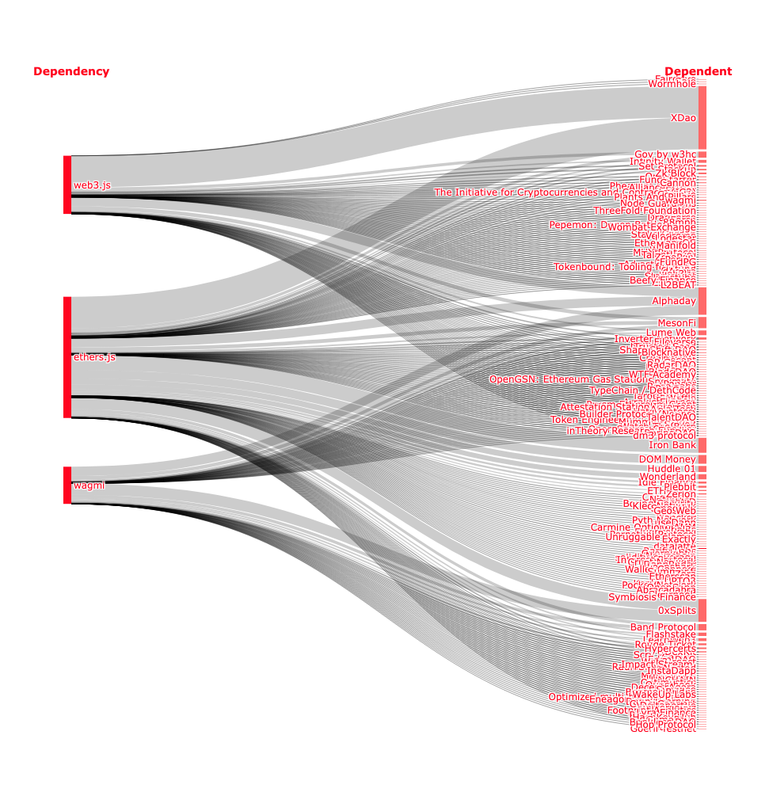

Messari just released their annual [Crypto Theses for 2024](https://messari.io/crypto-theses-for-2024). This year’s report included a chart from a16z’s [State of Crypto 2023](https://a16zcrypto.com/posts/article/spotlight-on-crypto-policy/) showing npm downloads for three of the leading packages used by decentralized apps going up and to the right, reaching all time highs in late 2023. The report includes the following quote: “If I could invest blindly into crypto based on a single chart, it’s this one.” 

There’s a lot to love about this take, but one big problem: downloads are a terrible metric for monitoring ecosystem growth.

<!-- truncate -->

It’s good that no one is directly incentivizing this metric. If they were, download counts would be easier to farm than a 2021 airdrop!

## In search of better metrics

At Open Source Observer we’re in search of better metrics for measuring the impact of open source contributions on the growth and health of crypto networks.

Here are a few metrics that we think are better than downloads and we came up with in just a [few simple queries](https://github.com/opensource-observer/insights/blob/main/analysis/dependencies/2023-12-21_EthereumDependencies.ipynb) using the OSO dataset.

### Active open source developers working on projects that have dependencies on these libraries

The first metric is the number of active open source developers working on projects that have dependencies on these libraries

In the case of web3.js, ethers, and wevm (wagmi + viem) – the same three libraries shown in the a16z chart – that number is at least 4000. And levels are the same as at the peak of the 2021 crypto bull run.

Of course, correlation &lt;> causation.

Many of the projects that now use these libraries started out before the three libraries arrived on the scene. Not all dependencies are created equally.

But 4000 devs using these libraries is an underestimate. Our query is only pulling data from ~1000 OSS projects - out of many many more in the Ethereum ecosystem.

### High value onchain users interacting with apps that depend on these libraries

The second metric is the number of high value onchain users interacting with apps that depend on these libraries.

Let’s consider OP Mainnet in the case of the chart below.

There are >80K unique addresses … interacting with at least 3 apps … that depend on one or more of these libraries … multiple times each month.

That’s a mouthful! But basically there are >80K legit users on OP Mainnet benefiting directly from these libraries on a regular basis.

### The volume of sequencer fees that depends on these libraries

Third third metric is the volume of sequencer fees – ie, economic value accrued by the network – that depends on these libraries working properly and being maintained.

Here’s a Sankey version of the data, showing all the apps and proportionally how much value flows on top of each library. In the case of OP Mainnet, these libraries are crucial to generating 100s of ETH (in sequencer fees) for the network every month. 

If we extended this type of analysis to other L1/L2s, the number would be an order of magnitude greater.

## Why it is important to fund dependencies

In December 2023, the [Ledger incident](https://www.ledger.com/blog/a-letter-from-ledger-chairman-ceo-pascal-gauthier-regarding-ledger-connect-kit-exploit) reminded us that crypto networks are only as secure as their weakest dependency

Most OSS libraries have small teams and no sustainable funding model. This is unbelievable given how much flows on top of them. And it's disappointing for an industry built on open source.

We believe this needs to change.

There should be orders of magnitude more funding for open source teams that don’t have a traditional value capture mechanism but are creating immense value for crypto networks and the users downstream of them.

There are amazing teams working on this right now. You can fund your dependencies with [Drips](https://www.drips.network/). 

[Tea](https://tea.xyz/) is reimagining dependency funding from the ground up. At Open Source Observer we’re building out the impact measurement side of the story and the data to back it up.

These are just several of numerous complementary efforts aimed at the trillion dollar opportunity of giving every high impact open source project a revenue model.

Moreover, we believe the chains that figure out how to recursively fund not only their developer libraries but also their R&D efforts, moonshots, and all sorts of other valuable digital public goods will be the long term winners.

Solving this problem will be crypto’s greatest gift. It will be a magnet for new builder talent. And it will vindicate the narratives that open > closed, decentralized > centralized, composable > monolithic.

We thank you, Messari, for the 193 page report. But next year please find a better chart.
