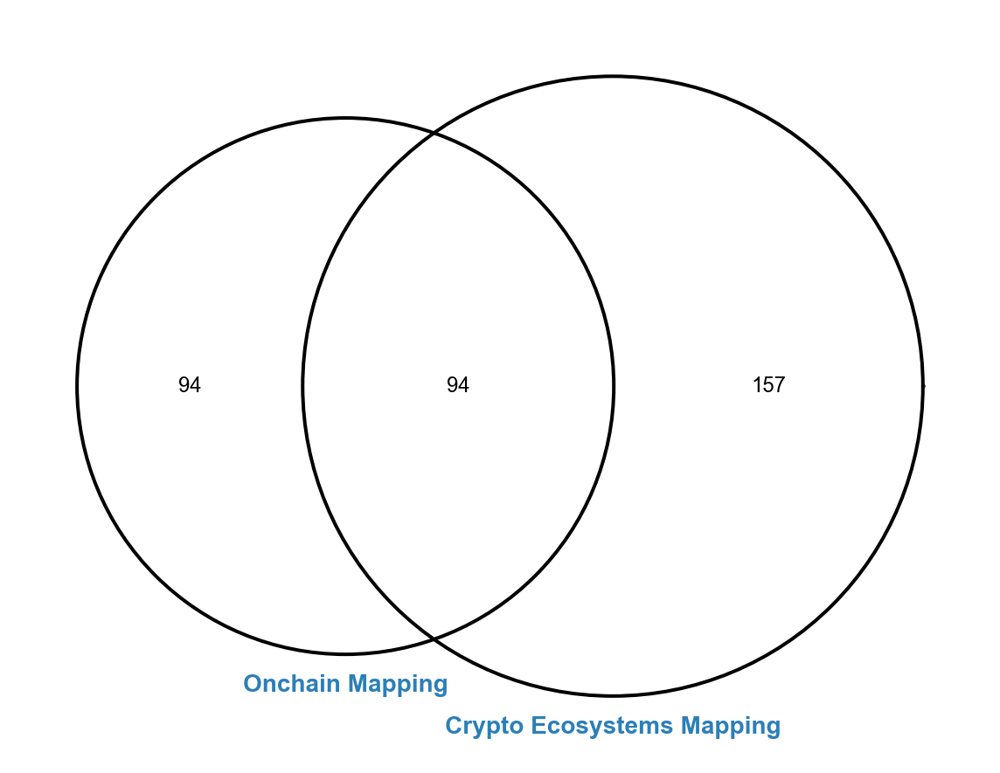
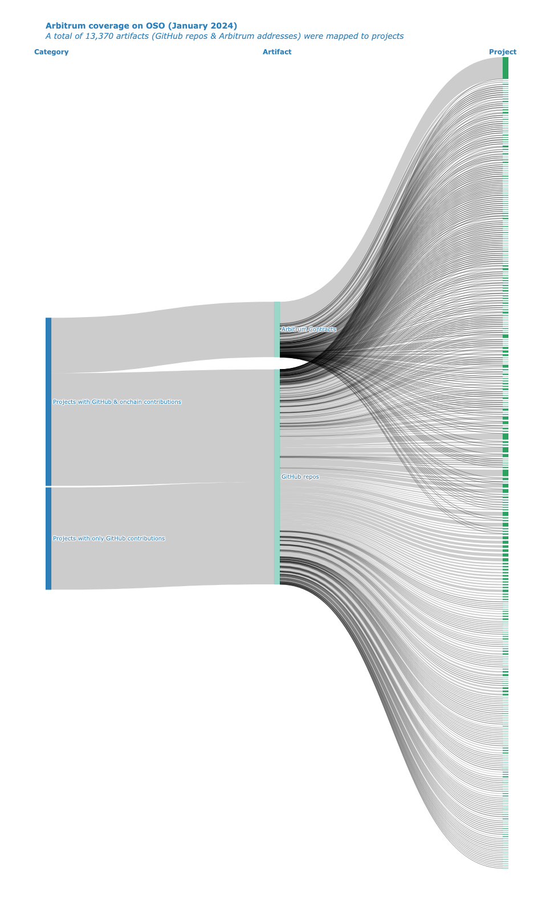
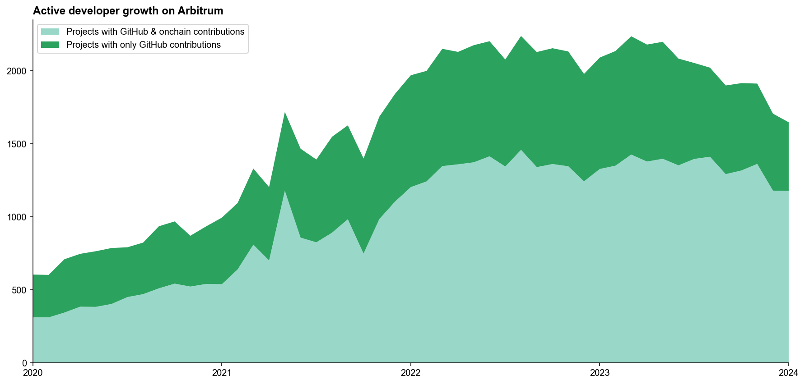
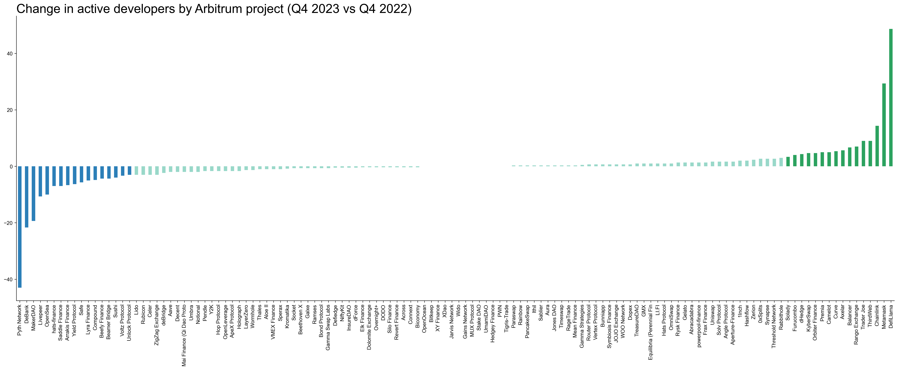

We are excited to present our inaugural report on the state of open source software (OSS) projects building on Arbitrum. This analysis is the first in a series aimed at providing the community with data and insights to assist with impact measurement and grantmaking.

Some highlights:

1. We are currently tracking over 300 OSS projects and over 13,000 code artifacts that are making an impact on the Arbitrum ecosystem. These artifacts include both GitHub repos (~10,000) and smart contracts deployed on Arbitrum One (~3,000).
2. Approximately 1,800 developers are actively engaged in these projects. This number aligns closely with the latest [Electric Capital Developer Report](https://www.developerreport.com/ecosystems/arbitrum). Our analysis, however, incorporates an additional 94 projects not currently captured in their registry.
3. The number of active developers is 18% lower than the peak of around 2,200 in March 2023. It's important to note, however, that this reduction is primarily concentrated in a few projects rather than a general decline across the ecosystem. In fact, the majority of projects have maintained a stable developer count over the past year.

<!-- truncate -->

This report has been made possible through a grant from Plurality Labs. Following this initial analysis, we plan to release a subsequent report detailing the onchain contributions of roughly 200 out of the 300+ projects we've studied. Additionally, we aim to utilize this data to suggest 4-5 potential “impact pools” for measuring projects' contributions. These pools are intended to help guide future grantmaking initiatives by Plurality Labs and the Arbitrum DAO.

For those interested in a deeper dive, the Python notebooks used for data processing and visualization in this report are available [here](https://github.com/opensource-observer/insights/). We welcome contributions to improve our data accuracy on specific projects; please visit [here](https://github.com/opensource-observer/oss-directory) to submit a PR to the relevant project entry. Additionally, if you're passionate about data and wish to contribute or learn more about our endeavors, consider joining our [data collective](https://www.opensource.observer/data-collective)!

## In-Depth Coverage of Arbitrum OSS Projects

In this report, we explore 345 OSS projects that are integral to the Arbitrum ecosystem. Their contributions range from open source code development to deploying smart contracts on Arbitrum One, thereby facilitating millions of transactions and generating significant sequencer fees.

As there is no centralized repository of all the projects and contributors in a decentralized network economy like Arbitrum, we developed a unique methodology to compile an initial directory of these entities. We invite your contributions to enhance this directory; please visit [here](https://github.com/opensource-observer/oss-directory) to submit a PR or [here](../../docs/projects/) to learn more about how to contribute data about projects and their code artifacts.

### Methodology for project identification

We first built out an initial collection of more othan 200 projects' GitHub organizations by leveraging [“Electric Capital Crypto Ecosystems Mapping”](https://github.com/electric-capital/crypto-ecosystems) list of Arbitrum sub-ecosystems. This list included both new entrants and existing projects previously cataloged in our OSS Directory.

Next, we identified decoded contracts for more than 180 projects on Dune. We then did the tedious but essential work of linking projects' GitHubs, deployer addresses, and smart contracts. There remains a long tail of contracts deployed by smaller projects that have not been matched to a GitHub org yet, although we believe we have excellent coverage of the larger and more active onchain projects. 

Finally, we reviewed the grants data and tracking performed by other Plurality Labs partners including [Karma GAP](https://gap.karmahq.xyz/arbitrum/) and [OpenBlock Labs](https://www.openblocklabs.com/app/arbitrum/grantees) to identify any remaining onchain projects that have an active grant from Arbitrum.

The following Venn diagram shows all 345 projects in our initial dataset, highlighting the intersections between different registries:

- 188 OSS projects with both contracts on Arbitrum One and a public GitHub organization (Onchain Mapping”)
- 251 OSS projects identified from the latest Crypto Ecosystems mapping, not all with contracts on Arbitrum (“Crypto Ecosystems Mapping”)
- 94 OSS projects featured in both categories.

We also performed our own desk research, project diligencing, and data audits for every project in this Venn diagram. This work makes us confident in two things:

1. This snapshot is a robust cross-section at the time of writing (January 31, 2024); and 
2. By the time you read this it will already be out of date.

### Cataloging onchain vs offchain artifacts

The massive corpus of work artifacts is depicted in the alluvial diagram below. We have intentionally excluded some contracts produced by Defi and NFT minting platforms, as well as Safe (multisigs), leading to an underestimation of the total number of contracts indexed by OSO.

## Developer Activity Trends

Developer activity on Arbitrum is still tracking close to all-time highs. 

We estimate that there are currently around 1,800 active developers (non-bot accounts who have committed code in a given month) working on Arbitrum projects. This figure excludes contributions from Offchain Labs as well as any contributions made to private or personal repos.

While our findings are closely correlated with Electric Capital's latest report, our project sets are different. We've identified a number of projects that have deployments on Arbitrum but are not yet reflected in their database. On the other hand, we omitted some contributions included in their database that were on personal repos or harder to trace to an ongoing project or organization. It is possible that through further reconciliation we may arrive at a larger estimate of active developers.

### Activity among onchain projects

The number of active developers is down 18%, from a peak of around 2,200 in March 2023. The decline is greatest among projects that are included in the Crypto Ecosystems mapping but that do not have onchain contracts that we are currently tracking. We see a more stable number of developers working on onchain projects.

The chart below filters on the 188 projects that have contracts on Arbitrum One and a public GitHub org. In addition, it splits them by "full-time" vs "part-time" developers. Full-time developers are ones who have made commits on at least 10 days in a given month. While the aggregate number of developers is stable, the ratio of part-time to full-time has increased. This could be noise or a sign that during the bear market developers are splitting their time across more than one project. We can also take a look at developer churn in a subsequent report.

### Recent changes in developer numbers

We can zoom in further on the question of net change in developer activity over the past four quarters among these projects to see how many projects are shrinking vs growing in size. 

The chart below shows the vast majority of projects have developer numbers that are comparable to where they were last year during Q4. There are a few outliers that have significantly fewer contributors (eg, [Pyth Network](https://github.com/orgs/pyth-network/repositories) and [MakerDAO](https://github.com/orgs/makerdao/repositories)) but are very much still active. These changes could be explained by a shift in priorities or work shifting to private repos.

There are also several projects in the ecosystem that have grown rapidly over the past year (eg, Chainlink and DefiLlama). Most projects, however, have remained within +/- 3 developers of their total last year. It's an encouraging sign that there has been remarkable consistency over the past year despite unfavorable market conditions.

### Full-time developers in the ecosystem

If all of the onchain projects in the Arbitrum ecosystem were committing to the same GitHub, here’s what it would look like. This heatmap shows "full-time developers" only. The darkest squares are ones that have 10 or more full-time developers. Well-known Ethereum projects like MakerDAO, Metamask, and Lido appear at the top of the list, with lots of dark squares. Most of the Arbitrum-focused defi and gaming projects are farther down the list, as they have smaller teams and fewer full-time developers.

### STIP-related developer activity

We can refine this type of analysis further and just look at the subset of onchain projects that are part of the recent Short Term Incentives Program (STIP) grants round. This heatmap shows all developers (including part-time ones). The darkest squares are ones that have 10 or more full-time developers. It should be noted that not all of these projects have large ongoing software components to their work, so developer activity is not necessarily correlated to liquidity provider activity. We recommend [the analysis from OpenBlock Labs](https://www.openblocklabs.com/app/arbitrum/grantees) for a deeper dive on this cohort of projects.

## What's Next?

Again, this was just a small taste of what's possible with the data we’re collecting. In early February, we will release a follow-up report that covers the onchain contributions of ~200 of the 300+ projects included here. At the end of February, we will leverage the data to propose an initial 4-5 “impact pools” that can inform future grantmaking efforts by Plurality Labs and the Arbitrum DAO.

You can explore the Python notebook and some static data dumps [here](https://github.com/opensource-observer/insights/). And if you want to contribute or learn more about what we're building, please sign up to join our [data collective](https://www.opensource.observer/data-collective).