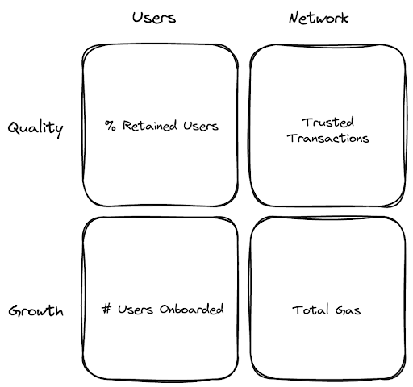

Open Source Observer is working with the Optimism Collective and its badgeholder community to develop a suite of **impact metrics** for assessing projects applying for Retro Funding 4.

## Introduction

Retro Funding 4 is the Optimism Collective’s first experiment with [Metrics-based Evaluation](https://gov.optimism.io/t/upcoming-retro-rounds-and-their-design/7861). The hypothesis is that by leveraging quantitative metrics, citizens are able to more accurately express their preferences for the types of impact they want to reward, as well as make more accurate judgements of the impact delivered by individual projects.

In contrast to other Retro Funding experiments, _badgeholders will not vote on individual projects but will rather vote via selecting and weighting a number of metrics which measure different types of impact._

The Optimism Foundation has published high level guidance on the types of impact that will be rewarded:

- Demand generated for Optimism blockspace
- Interactions from repeat Optimism users
- Interactions from Optimism users with high trust scores / onchain reputations
- Interactions of new Optimism users
- Open source license of contract code

The round is expected to receive applications from hundreds of projects building on **six** Superchain networks (OP Mainnet, Base, Frax, Metal, Mode, and Zora). Details for the round can be found [here](https://gov.optimism.io/t/retro-funding-4-onchain-builders-round-details/7988).

At Open Source Observer, our objective is to help the Optimism community arrive at up to 20 credible impact metrics that can be applied to projects with contracts on the Superchain.

This page explains where the metrics come from and includes a working list of all metrics under consideration for badgeholders. We will update it regularly, at least until the start of voting (June 23), to reflect the evolution of metrics.

<!-- truncate -->

## Data Model

This section explains where the underlying data comes from and how it gets transformed.

One thing to make crystal clear is that Open Source Observer relies 100% on public datasets, meaning anyone can verify the integrity of the source data. All of our code is open source, so anyone can audit our models and query logic. Finally, even our data pipelines and indexing infrastructure is open to the community, so you can run your own experiments, train your own models, even connect your own data sources! _You can read about OSO’s commitment to open source, open data, and open infrastructure [here](https://docs.opensource.observer/blog/open-source-open-data-open-infra)._

### Data Sources

The following raw data sources will be used:

- L2 Blockchain Transactions and Traces (OP Mainnet, Base, Frax, Metal, Mode, Zora), powered by [GoldSky](https://goldsky.com/)
- Web3 Social & Identity ([Farcaster](https://docs.farcaster.xyz/learn/architecture/hubs), [Passport](https://www.passport.xyz/), [EigenTrust by Karma3Labs](https://docs.karma3labs.com/eigentrust), and potentially other NFT or attestation-related credentials)
- Open Source Code Contributions (GitHub, [OSS Licenses](https://spdx.org/licenses/))
- Project Applications (submitted on [Agora](https://vote.optimism.io/))

There is additional data available on OSO, including software dependencies, grant funding histories, data on other chains, etc, which is open for exploration but will not be incorporated into impact metrics for RF4.

### Transformations

For each data source, we are working with partners to create filters that can be applied to the data.

For metrics that look at transactions, we are collaborating with the OP data team to define filters on “qualifying” transactions. For metrics that look at addresses, we are working on a definition of a “trusted” user, which considers reputation data from multiple platforms. For the projects themselves, there are filters to include only projects and contracts that are “approved” by the Foundation’s acceptance criteria and verified through the sign-up flow on Agora.


The query logic for applying these transformations is available [here](https://github.com/opensource-observer/oso/tree/main/warehouse/dbt/models/marts/superchain) and can be simulated in a data science environment by following the docs [here](https://docs.opensource.observer/docs/integrate/data-science).

### Metrics Framework

Together with the Optimism badgeholder community, we are organizing metrics into four categories: network growth, network quality, user growth, and user quality.

These categories are illustrated in the matrix below, including some examples.



These categories are intended to counterbalance each other. The optimal strategy for a project should be to excel on multiple dimensions, not just one.

A project should want to grow its total gas contribution but also keep the number of trusted transactions as high as possible. A project should want to onboard lots of users but also retain as many users as possible. It’s very hard to game multiple, opposing metrics.

As badgeholders will be voting on portfolios of metrics, not projects, the projects that perform the best in RF4 will find themselves somewhere on the [efficient frontier](https://en.wikipedia.org/wiki/Efficient_frontier) of quality vs growth metrics.

### Metric Logic

Each metric will be expressed as a SQL model running on top of the underlying data, with some intermediate models to improve readability. One of the core models is called `rf4_events_daily_to_project`, which is a daily snapshot of all events on the Superchain tagged by project up until the end of the RF4 window (2024-05-23).

Here’s an example of [gas fees](https://github.com/opensource-observer/oso/blob/main/warehouse/dbt/models/marts/superchain/metrics/rf4_gas_fees.sql):

```sql
select
  project_id,
  'gas_fees' as metric,
  SUM(amount / 1e18) as amount
from {{ ref('rf4_events_daily_to_project') }}
where
  event_type = 'CONTRACT_INVOCATION_DAILY_L2_GAS_USED'
group by
  project_id
```

The query above grabs all gas-generating events on the Superchain from RF4-approved projects and sums up their gas fees.

Onchain events are also tagged with a `trusted_user_id` if the address that triggered the event is considered a trusted user. As mentioned earlier, we are working with multiple partners to define what a trusted user is, and will finalize the logic after the RF4 window closes.

Here is an example of a model that looks only at [successful transactions from trusted users](https://github.com/opensource-observer/oso/blob/main/warehouse/dbt/models/marts/superchain/metrics/rf4_trusted_transactions.sql) since 2023-10-01:

```sql
select
  project_id,
  'trusted_transaction_count' as metric,
  SUM(amount) as amount
from {{ ref('rf4_events_daily_to_project') }}
where
  event_type = 'CONTRACT_INVOCATION_SUCCESS_DAILY_COUNT'
  and bucket_day >= '2023-10-01'
  and trusted_user_id is not null
group by
  project_id
```

Once again, all of the source code is available from our repo [here](https://github.com/opensource-observer/oso/tree/main/warehouse/dbt/models/marts/superchain). We also have an active [data challenge](https://docs.opensource.observer/docs/contribute/challenges/2024-04-05_data_challenge_01/) to get analysts’ input and proposals on impact metrics.

## Current Metrics

This section will be updated regularly to reflect the latest metrics under consideration for RF4. These metrics will be calculated for _all projects_ on the Superchain that verify at least one public GitHub repo and one deployer address (and that are approved in the application process).

### Gas Fees

_Sum of a project's total contribution to gas fees across the Superchain._

**Why this metric matters for the collective:** Gas fees are the primary recurring revenue source for the Superchain and a key indicator of aggregate blockspace demand. A project’s gas fee contribution is influenced by its total volume of contract interactions, the computational complexity of those interactions, and the state of the underlying gas market at the time of those transactions. In the long run, gas fees are what will power Retro Funding and enable it to continue in perpetuity. All members of the Superchain have committed at least 15% of their gross profit from gas fees to Retro Funding. Supporting projects that generate revenue in the form of gas fees helps power the economic engine of the Superchain.

### Total Transactions

_Count of a project’s transactions over the RF4 scope period October 2023 - June 2024._

**Why this metric matters for the collective:** Optimism is a Layer 2 roll-up designed to improve the transaction throughput and reduce the fees on Ethereum. Layer 2s are crucial for scaling Ethereum because they help address the network's congestion issues without compromising its security or decentralization. Transaction counts are an important indicator for assessing the adoption and usage of all the new blockspace made available by the Superchain. Projects that have a sustained, high transaction count provide a clear signal of network growth and blockspace demand.

### Interactions from Trusted Optimism Users

_Count of a project’s transactions performed by trusted users, over the RF4 scope period October 2023 - June 2024, on a logarithmic scale._

**Why this metric matters for the collective:** Bots, airdrop farming, and sybil attacks are longstanding problems in crypto. There are several teams in the Optimism ecosystem building reputation models for labeling “trusted users” in a privacy-preserving way. This metric aggregates reputation data from multiple platforms ([Farcaster](https://docs.farcaster.xyz/learn/architecture/hubs), [Passport](https://www.passport.xyz/), [EigenTrust by Karma3Labs](https://docs.karma3labs.com/eigentrust)) and only considers transactions that come from trusted users, a small subset of all active addresses on the Superchain. By tracking interactions specifically from trusted users, we gain a picture of blockspace demand that is less influenced by the effects of bots / farmers / sybils.

### Trusted Optimism Users' Share of Total Interactions

_Percentage of a project's total transactions that were made by trusted users over the RF4 scope period (October 2023 - June 2024). A project must have a minimum of 100 trusted users in order to be considered for this metric._

**Why this metric matters for the collective:** This metric expresses _Interactions from Trusted Optimism Users_ and _Total Transactions_ as a simple ratio. Using a ratio makes it easier to compare trusted user levels across big projects and small projects side-by-side. For example, a project with 10K trusted transactions out of 20K total transactions would score better than a project with 10K trusted transactions out of 50K total transactions. This indicator is nuanced because it recognizes that minimizing bot / farming / sybil activity might go against economic incentives in the short term but is important for network quality in the long term. Given that this indicator is calculated on a percentage basis, projects with fewer than 100 users are not evaluated.

### Users Onboarded

_Count of trusted users who interacted with a project within their first 7 days on the Superchain, on a logarithmic scale._

**Why this metric matters for the collective:** Getting 1 billion users onchain won’t be easy. It will require better onramps and onchain UX than crypto natives are accustomed to. This metric identifies projects that helped onboard new users to the Superchain, going all the way back to each chain’s genesis block. In order to qualify, a new user has to also be in the set of trusted users. Then, any project on any chain that a user interacted with in their first week on the Superchain is counted. This is often multiple projects per new user. Supporting projects that are the first port of call for new users is essential for expanding the size and reach of the Superchain user’s base.

### Average Trusted Monthly Active Users (MAUs)

_Average of a project’s monthly active users (trusted users only) over the RF4 scope period (October 2023 - June 2024)._

**Why this metric matters for the collective:** We all know that attention is fleeting, especially in crypto. MAUs is one of the most important metrics for any project looking to grow a large user base. A project’s average MAUs also provides insights into its ongoing popularity and relevance within the Optimism ecosystem. The metric is calculated by counting the number of distinct trusted users for each month included in the RF4 scope period and then averaging the monthly totals. Newer projects receive 0s for the months before they launched. A consistent or growing base of trusted MAUs is a sign that there is a healthy, thriving community around a project.

### Average Trusted Daily Active Users (DAUs)

_Average of a project’s daily active users (trusted users only) over the RF4 scope period (October 2023 - June 2024)._

**Why this metric matters for the collective:** Daily Active Users (DAUs) is a more granular view of a project's daily user activity and engagement levels than MAUs (Monthly Active Users). A high number of trusted DAUs would be a sign that Layer 2s have widespread adoption. The reality today is that there are very few apps that generate high levels of daily, revenue-generating activity from users. By averaging the number of active users on a daily basis over the RF4 period, this metric smooths out some of the blips and spikes in the data. New projects receive 0s for the days before they launched. Indeed, trusted DAUs is a hard metric to crack, but it truly hones in on projects that give their users a reason to come back frequently.

### Trusted Recurring Users

_Count of trusted users who have interacted with the project in at least 3 separate months over the RF4 scope period (October 2023 - June 2024) and at least 1 time between April - June 2024._

**Why this metric matters for the collective:** Many crypto natives are curious to try out new protocols. But churn and user retention are major issues. Recurring users represent the most loyal and committed segment of a project's user base. This metric considers users who have interacted with a project over the course of at least three distinct calendar months during the RF4 scope period – and at least once in recent months. Thus, it is intended to reflect sustained interest and ongoing engagement over time. A high count of recurring users signals strong project loyalty and a good user experience, and helps separate the fads from the future.
