This post is a brief exploration of the before-after impact of Optimism’s Retro Funding (RF) on open source software (OSS) projects. For context, see some of our previous work on the [Optimism ecosystem](https://docs.opensource.observer/blog/tags/optimism) and especially [this one](https://docs.opensource.observer/blog/retropgf3-ecosystem-analysis) from the start of RF3 in November 2023.

We explore:

1. **Cohort analysis.** Most RF3 projects were also in RF2. However, most projects in RF4 are new to the game.
2. **Trends in developer activity before/after RF3.** Builder numbers are up across the board since RF3, even when compared to a baseline cohort of other projects in the crypto ecosystem that have never received RF.
3. **Onchain activity before/after RF3.** Activity is increasing for most onchain projects, especially returning ones. However, RF impact is hard to isolate because L2 activity is rising everywhere.
4. **Open source incentives.** Over 50 projects turned their GitHubs public to apply for RF4. Will building in public become the norm or were they just trying to get into the round?

As always, we've included [source code](https://github.com/opensource-observer/insights/tree/main/analysis/optimism/longitudinal) for all our analysis (and even CSV dumps of the underlying data), so you can check our work and draw your own conclusions.

<!-- truncate -->

:::warning
Remember: _correlation is not causation_. While there are numerous signs of positive momentum in the wake of RF3, we can’t say for sure that RF caused these changes.
:::

## Cohort Analysis

At the time of writing, there are 23 [collections](../../docs/guides/oss-directory/collection) in the [OSS Directory](https://github.com/opensource-observer/oss-directory/tree/main/data/collections) we maintain, with a total of 1506 distinct projects with relevant activity in the last 6 months. Of these, 546 have applied for or received Retro Funding at some point.

The breakdown of RF projects by cohort is as follows:

- Never received RF: 852 (other OSS projects)
- Total RF projects in OSO: 546
  - Past RF projects: 315 (present in rounds RF1, RF2, or RF3, but not RF4)
  - First-time RF projects: 176 (new to RF in RF4)
  - Returning RF projects: 54 (present in RF4 as well as one or more previous rounds)

You can see a breakdown of the RF projects by cohort in the Venn diagram below.

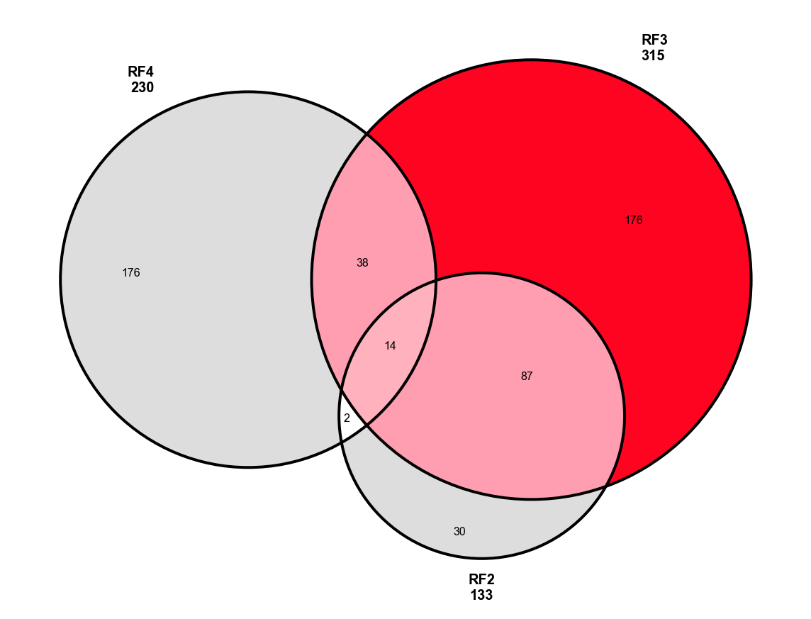

Most of the analysis in this post focuses on the 315 OSS projects that participated in RF3. However, we also draw comparisons with the 176 projects that are applying for the first time in RF4, and created a baseline group of 852 projects that have never received RF.

## Trends in Developer Activity Before/After RF3

Developer activity is a key metric for measuring the health and growth of OSS projects. Builder numbers are up across the board since RF3, especially for projects that have been in more than one round, and even when compared to a baseline group of projects that have never received RF.

### Methodology

We analyzed the change in developer activity 6 months before and after Retro Funding 3. The "before" period is from June 2023 to November 2023 (inclusive), and the "after" period is from December 2023 to May 2024 (inclusive). We don't make any adjustments for seasonality, holidays, or other factors that might affect developer activity.

We define "developer activity" as the number of full-time active developers based on commit activity. We use a simple heuristic to estimate the number of full-time active developers: if a GitHub user has more than one commit in a day, we count that day as a day of developer activity. If a user has more than 10 days of activity in a month, we count them as a full-time active developer for that month. For users with more than 1 but fewer than 10 days of activity in a month, we pro-rate their activity based on the number of days with commits. Thus, a user with 5 days of activity in a month would count as 0.5 full-time active developers for that month.

We sum up the number of full-time developers _per project_ and divide by 6 to get the average number of full-time developers per 6-month period. We also calculate the growth rate as the compound annual growth rate (CAGR) of the average number of full-time over a full year (May 2023 to May 2024).

### Results by Cohort

First, we looked in aggregate at the change in developer activity for projects that participated in RF3. The chart below shows the average number of full-time developers per project in the 6 months before and after RF3. Overall, these 315 projects increased active developers from around 225 in early 2022 to over 300 in mid 2024. Over the past year, the growth rate has been 13.9%.

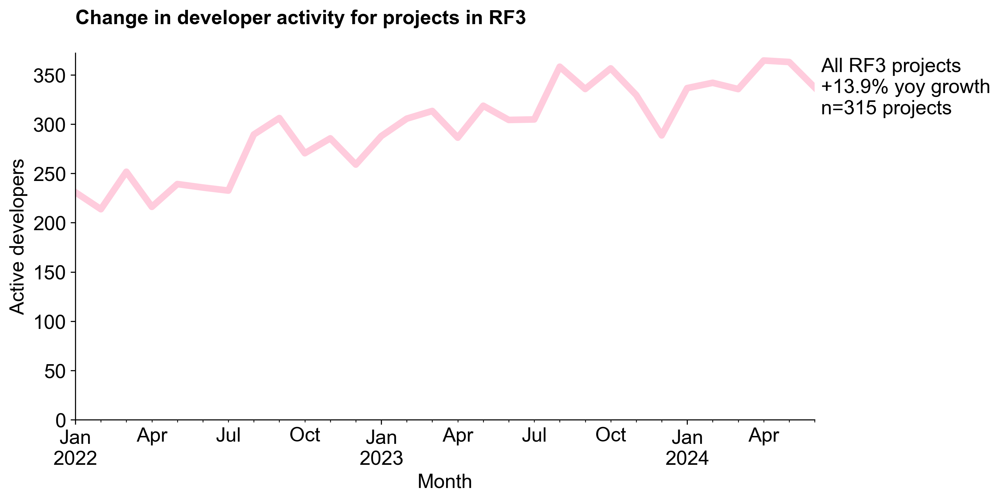

Next, we performed a breakdown by cohort. Both cohorts that were in RF2 and/or RF1 in addition to RF3 saw faster growth in developer activity compared to the cohort that was new to RF3. The cohort of projects that have been participating in RF since RF1 saw the fastest growth in developer activity, with a rate of 46.3%. However, this is a small cohort of only 28 projects so it is more sensitive to outliers. The 101 projects that participated in RF2 and RF3 saw a growth rate of 19.8%. Although they are not shown as a line in the chart, the 186 projects that participated in RF3 saw a growth rate of around 8%.

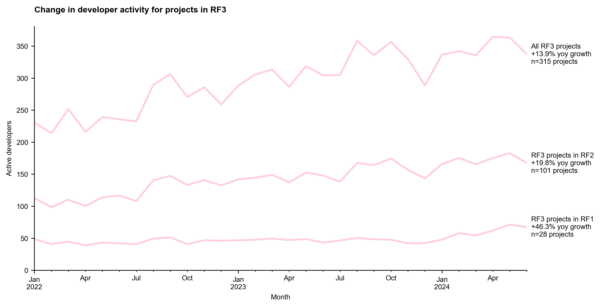

These observations suggest that the longer a project has been participating in RF, the more likely it is to see growth in developer activity. This could be due to the cumulative effects of RF funding, or it could be due to other factors that are correlated with early participation in RF (eg, only stable or growing projects were nominated in RF2).

### Comparison with Baseline

To get a sense for what the baseline might be, we looked to the 852 projects that have been tagged as being part of other open source ecosystems but that have never received RF. This group includes projects from the broader Ethereum community as well as some non-crypto open source projects that have received grants from crypto foundations. All of these projects were screened for developer activity in the last 6 months before being added to OSS Directory.

Although this group grew relatively fast in the first half of 2022, growth has slowed down and turned slightly negative over the past year. Overall, growth among projects in the "baseline" cohort was -0.4% over the past year, a net difference of 14.3% compared to the RF3 cohort. While these results are promising, we should once again be cautious about attributing causality to RF3. The RF3 cohort is not a random sample of OSS projects, and there are many other factors that could be driving the observed growth in developer activity.

Finally, we can also add the "new" projects that are applying for RF4 as a third comparison group. These projects have fewer full-time active developers overall (around 100), but an even faster growth rate of +18% over the past year. (Note: 4/176 "new" projects don't show up in the graph because they didn't have any public developer activity during the analysis window.)

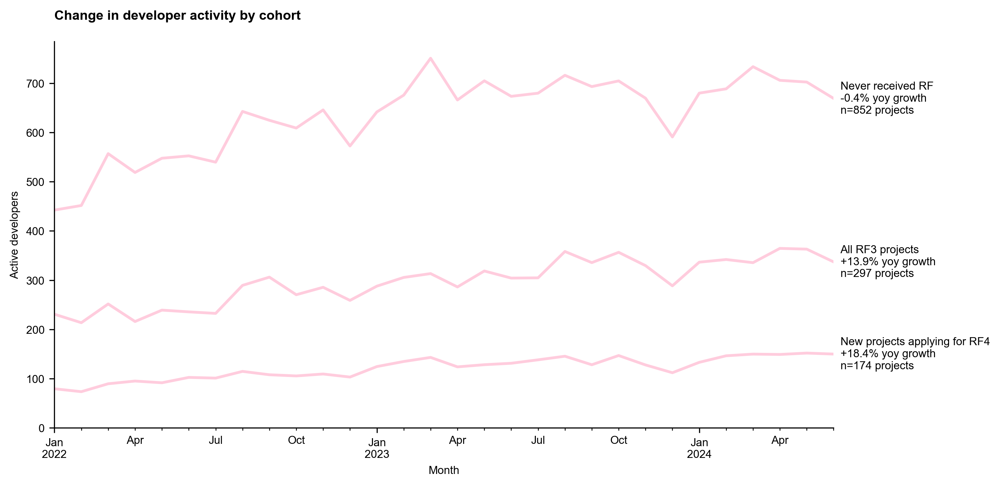

:::info
As an additional benchmark, the [Developer Report maintained by Electric Capital](https://www.developerreport.com/) shows ~11% yoy decline for "full-time developers" in the broader crypto ecosystem and a 10% decline for Ethereum. Note that this is a much larger group of projects than the 852 in our baseline.
:::

### Project Level Changes in Developer Activity

Up to this point, we have been looking at aggregate changes in developer activity across all projects in the RF3 cohort. However, the impact of RF3 on individual projects can vary widely. The chart below is a scatter plot of the change in full-time active developers for each project 6 months before and after RF3. The x-axis shows the average number of full-time active developers per project in the 6 months before RF3, and the y-axis shows the number of full-time active developers in the 6 months after RF3. The color of the circle represents the absolute increase (red) or decrease (blue) in full-time active developers over the year.

We see a high concentration of projects in the 1 to 10 full-time active developers range, and a slightly positive growth trend overall. There are a few positive outliers with large increases (eg, from 13 to 45 developers). There are also a few negative outliers with large decreases (eg, from 20 to 5 developers).

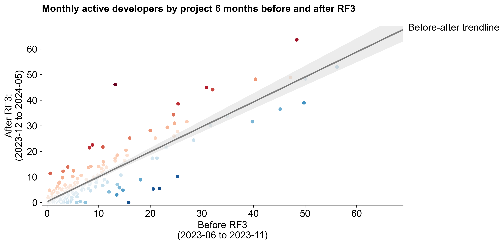

We can perform a similar analysis against a baseline group of projects that have never received RF. To reduce sensitivity to outliers for both groups, we only consider projects with fewer than 10 full-time active developers in the 6 months before RF3. There's a lot of variance, but overall we see the RF3 cohort growing faster than the baseline group.

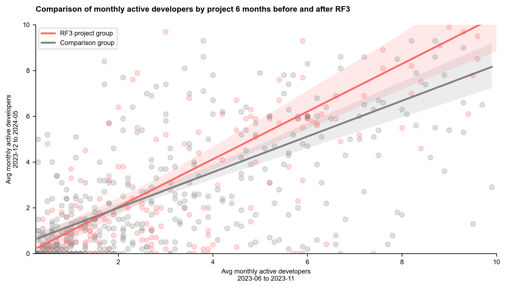

We can also plot the absolute differences in developer numbers before/after RF3 for each project in the cohort as a histogram. The distribution is a nice bell curve with a slight positive skew, indicating more projects saw a small increase (rather than decrease) in developer activity. Note that the x-axis has been truncated to focus on the majority of projects.

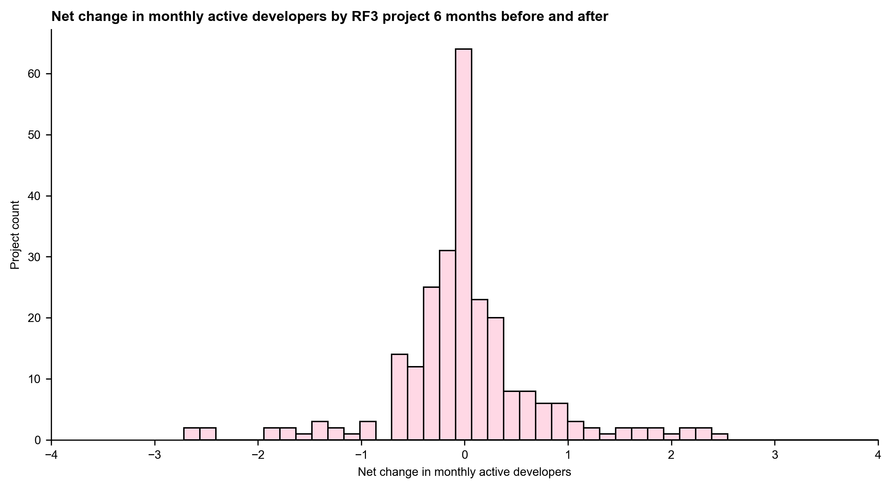

### Correlation with Funding

Finally, we explore the hypothesis that changes in developer activity are correlated with the amount of OP tokens received in RF3.

To do this, we take the total amount of tokens projects were granted in RF3 and divide it by the number of full-time active developers in the 6 months _before_ RF3. This gives us a rough estimate of the amount of funding per developer. We then use this to create four roughly comparable sub-cohorts of projects based on the amount of funding per developer received:

- Below 5K OP per developer (47 projects)
- 5-10K OP per developer (43 projects)
- 10-20K OP per developer (60 projects)
- Over 20K OP per developer (51 projects)

We then calculate the net change in developer activity for each sub-cohort and the mean across each distribution. These results are shown in the chart below.

As one might expect, there is a positive correlation between the amount of funding received per developer and the net change in developer activity. However, the correlation is not very strong, and there are still projects that received a relatively high amount of funding per developer but still saw a decrease in developer activity. The strongest correlation is between the 10-20K OP per developer sub-cohort. Projects that received less than 5K OP per developer saw a slight decrease in developer activity.

## Changes in Onchain Activity

Retro Funding 3 was not designed to reward onchain activity. In fact, projects that had onchain deployments [underperformed](https://docs.opensource.observer/blog/what-builders-can-learn-from-retropgf3#in-the-arena-view-signals-that-live-players-and-builders-should-pick-up-on) in the round overall. RF4, on the other hand, was designed explicitly to reward onchain activity.

This next section includes comparison of onchain activity before and after RF3, but also includes the projects that were eligible for RF4. As mentioned previously, 176 projects in RF4 will be first-time recipients. In addition, there were 54 projects that were eligible for RF4 and had participated in one or more previous RF rounds.

### Superchain Transactions by Cohort

First, we look at the number of transactions on the Superchain for all projects in RF4, grouped by network. In recent months, RF4 projects have generated between 1-2M transactions per day, up from 0.5-1M transactions per day earlier in the year and in late 2023. This is largely the result of increased activity on Base following EIP 4844.

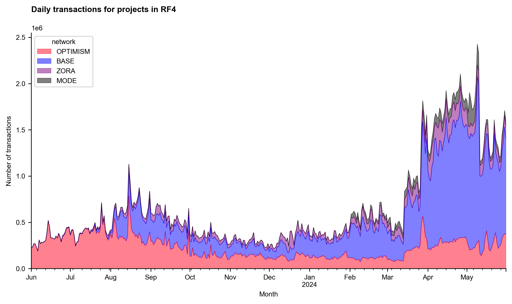

Next, we can compare the new versus returning projects in RF4. Although the new projects represent a larger number of transactions, the returning projects had a faster growth rate during the RF4 period, especially in the two months after the round was announced (April and May 2024). This is likely a coincidence, but worth monitoring in future rounds.

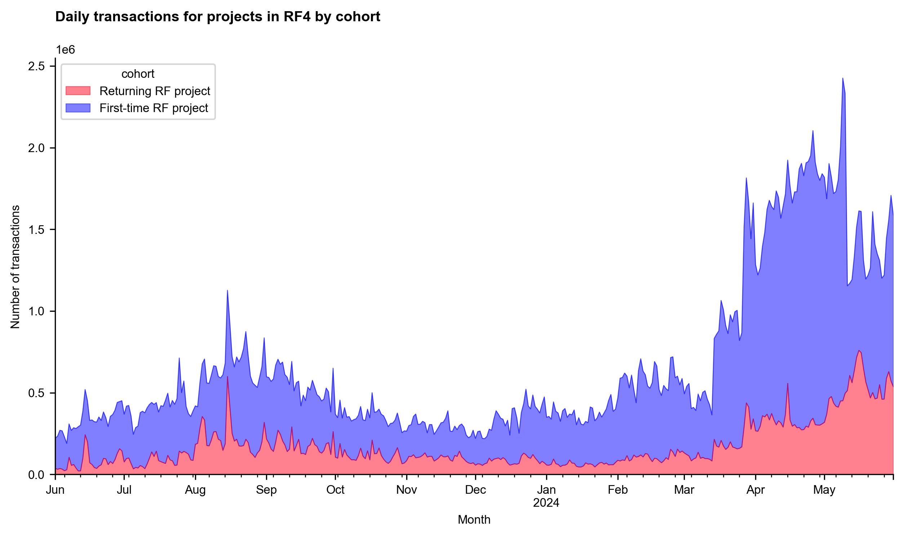

For comparison, we can also look at the transaction volume for onchain projects that were in previous RF rounds but did not apply (or were not eligible) for RF4. Although these projects represented a very high number of transaction in the past (eg, up through September 2023), they have been relatively flat since then.

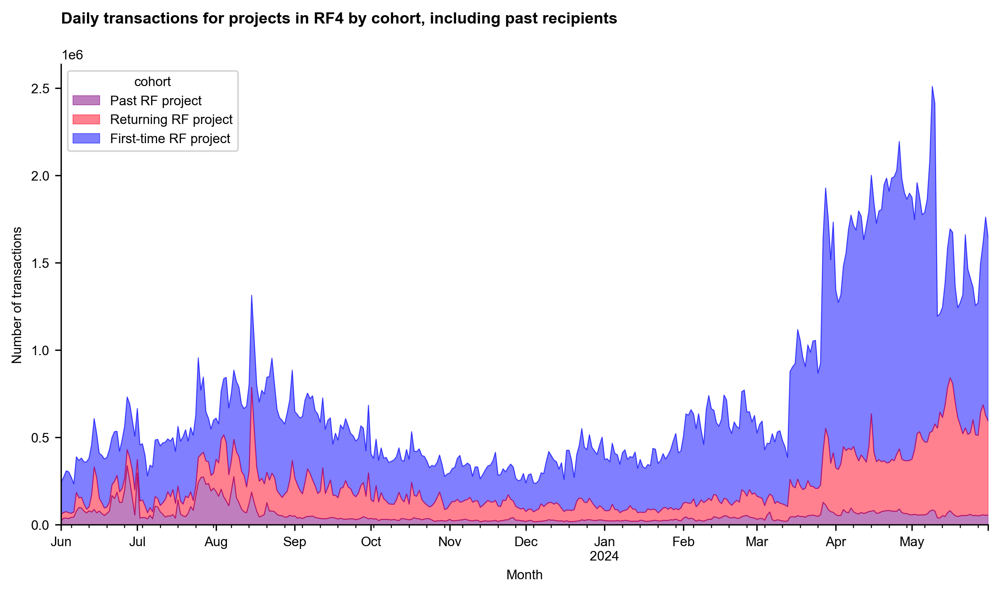

### RF4 Transaction Activity vs Overall Network Activity

We didn't construct a control group for this analysis, but we can compare the transaction volume for RF4 projects to the overall network activity on the Superchain and to other networks on OSO like Ethereum Mainnet and Arbitrum One.

The chart below shows the number of transactions per day for RF4 projects compared to the overall network activity on the Superchain.

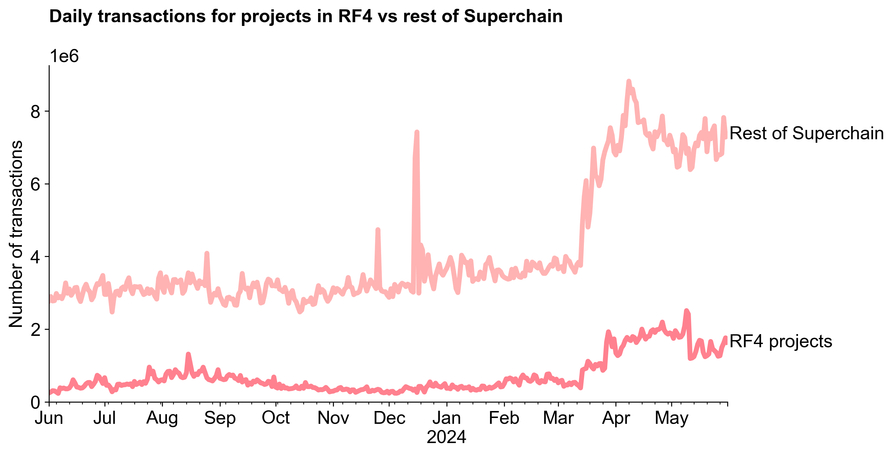

We can take the same data and express it as a ratio.

The chart below shows RF4 projects contributing between 10-30% of overall network activity during the past two years. Perhaps coincidentally, the ratio is lowest during the "off-season" between rounds RF3 and RF4 (ie, November 2023 to February 2024).

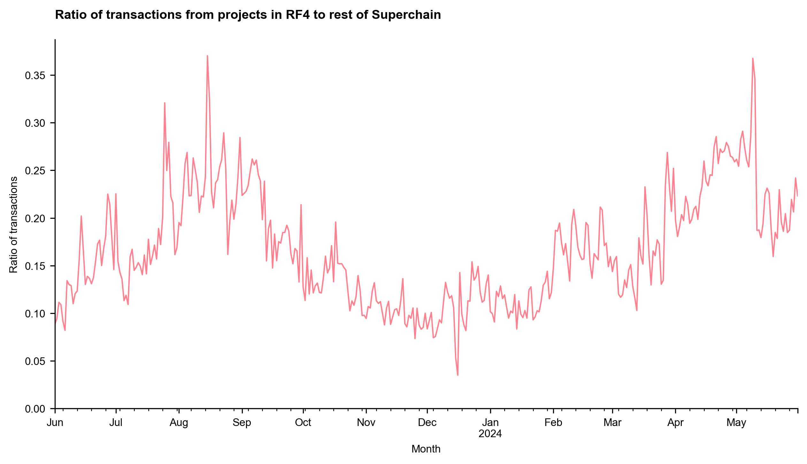

Last, we can build on our comparison of transactions from projects in RF4 to the rest of the Superchain by adding in transaction volume on other networks like Ethereum Mainnet and Arbitrum One.

In general, we see that L2 activity is highly correlated and rising across the board, especially after 4844. It is also worth noting that, recently, the RF4 cohort has been generating more transaction volume than Ethereum mainnet on most days and comes close to Arbitrum One on some days.

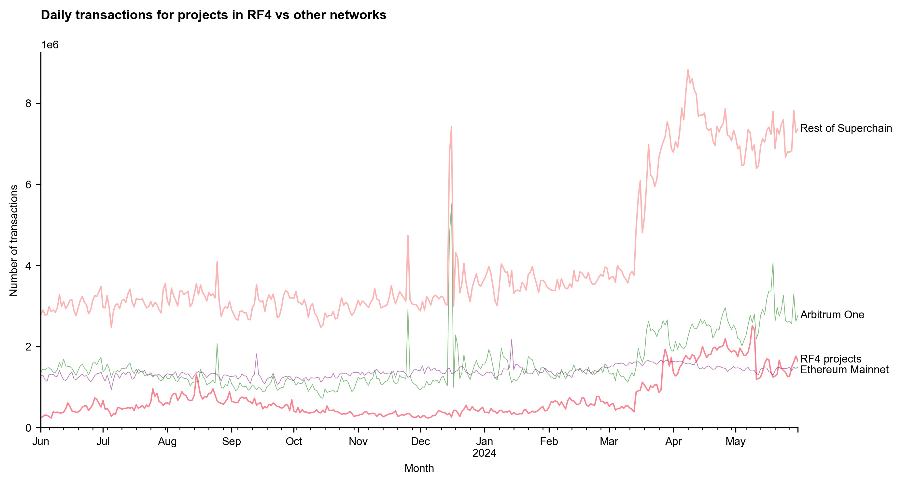

## Open Source Incentives

One of the requirements for applying to RF4 was that projects had to make their GitHub repositories public (at least ones containing contract code). This was a change from previous rounds, which was not limited to OSS and where projects could apply with private repositories.

The chart below shows when projects in the RF4 cohort made their first public commit. There is a spike in May and June 2024, when the round application period was live. In many cases, it appears that made contributions in private repos and made their code public in order to apply for RF4. In other cases, projects appeared to upload their contract code to GitHub for the first time in order to apply. As result, the historic developer activity for these projects is hard to assess.

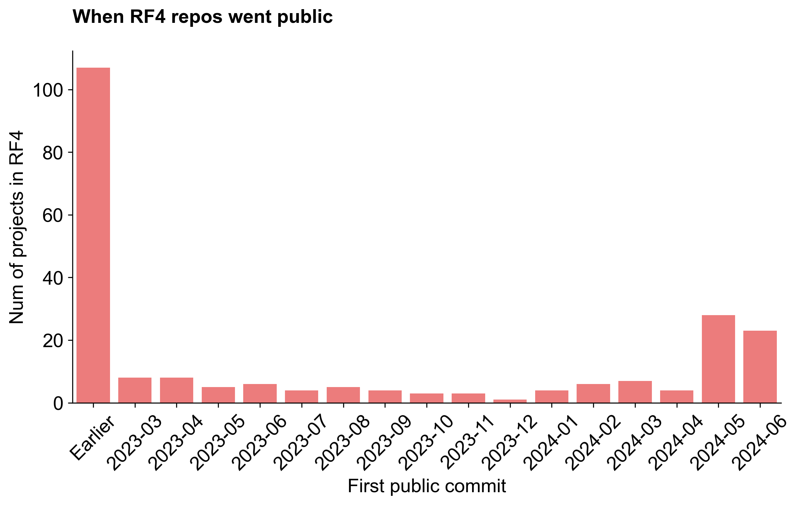

One somewhat concerning sign is that many of these projects had deployments months and in some cases _years_ before their first public commit.

The chart below is a bit complex, but shows the days between the first public commit and the first onchain transaction for each project in the RF4 cohort. The x-axis is the date of the first commit and the y-axis is the timedelta between the first onchain transaction and first commit. A large, positive number like 200 means that the first transaction was 200 days before the first commit. The colors also correspond to the timedelta: red circles are ones that had their first transaction many months before their code was on GitHub; blue circles are ones that had their first transaction many months after their code was on GitHub. The size of the circle represents that number of transactions the project had across all its contracts over the period.

Without getting into the details, we can see that there are many projects that had onchain deployments months or even years before they made their code public. This is a concerning sign for the health of the ecosystem, as it suggests that many projects are not following good practices for open source development, regardless of whether they decide to apply a permissive license to their code or not. It will be interesting to monitor these repos over time to see if they continue to be active and/or they were only made public for a brief period so as to qualify for retro funding.

We can also analyze the same data to see how many RF4 projects had their first public commit and their first onchain transaction _before_ the start of RF3 voting (in November 2023), but that did not apply for RF3. In total, there were 75 projects that met these criteria, including many well-known protocols like Layer Zero, 0x, LI.FI, Odos, and Superfluid.

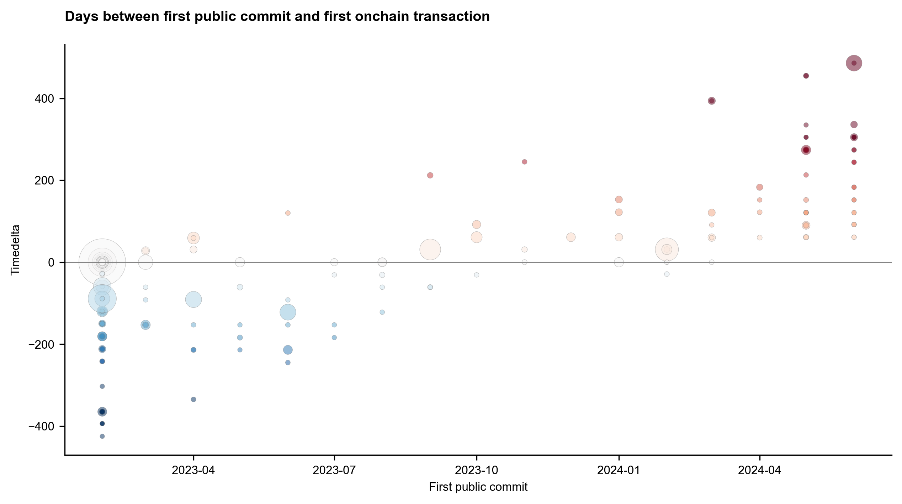

## Bonus: Project Activity Heatmap

You've made it this far, so here's some bonus dataviz for you! It's a heatmap of developer activity for every project that's received Retro Funding since 2022. You can see the full-time active developers for the top 200 projects in each month (based on mean activity over the period), with the color of the cell representing the number of developers (max of 10). If you notice anything off with your project, send us a pull request [here](https://github.com/opensource-observer/oss-directory)!

