The voting results for Optimism's Retro Funding Round 4 (RF4) were tallied last week and [shared with the community](https://community.optimism.io/docs/citizen-house/retropgf-4/).

This is the last in a [series of posts](https://docs.oso.xyz/blog/impact-metrics-rf4-deep-dive) on RF4, analyzing the ballot data from different angles. First, we cover high-level trends among voters. Then, we compare voters’ expressed preferences (from a pre-round survey) against their revealed preferences (from the voting data). Finally, we perform some clustering analysis on the votes and identify three distinct “blocs” of voters.

Retro Funding aims for iteration and improvement. We hope these insights can inform both the evolution of impact metrics and governance discussions around impact, badgeholder composition, and round design.

You can find links to our work [here](https://github.com/opensource-observer/insights/blob/main/analysis/optimism/retrofunding4/20240722_RF4_BallotBox.ipynb).

<!-- truncate -->

## High-level observations

Here’s a quick overview of the results and round mechanics. A total of 10M OP tokens were distributed across 230 projects. Each project was pre-scored against 16 different impact metrics, ranging from onboarding new users to generating gas fees. A group of 108 (out of ~130 eligible) badgeholders voted on the metrics they believed best assessed impact on the Superchain. Each ballot was scored and included in the overall distribution of tokens.

**The average badgeholder voted on five metrics.**

While a few voters included all 16 metrics, most selected between 3 to 6 metrics, with a median of 5 metrics per ballot. Some metrics were closely related, such as `gas_fees` and `log_gas_fees`, which were the same metric on different scales (linear vs logarithmic). Half of the metrics relied on a “[trusted user model](https://docs.oso.xyz/blog/impact-metrics-rf4-deep-dive#trusted-user-model)”, considering different aspects of user and network activity.

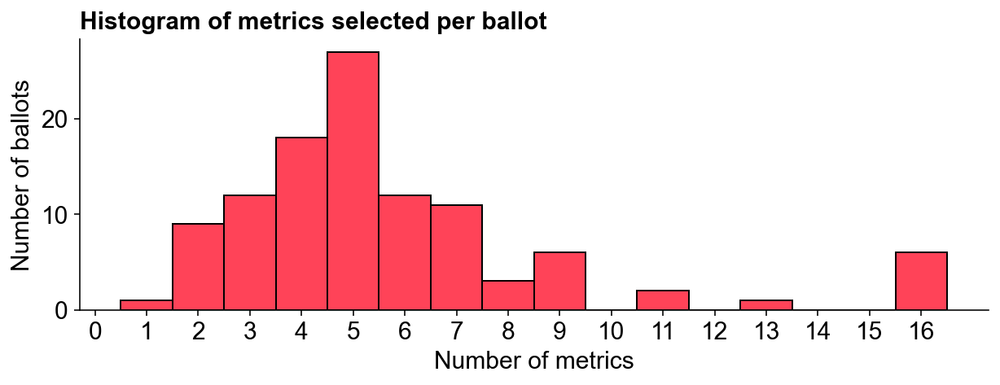

**Badgeholders felt gas fees were the most impactful metric.**

The chart below ranks each metric based on its overall weighting and shows its distribution of individual votes. `gas_fees` topped the list, receiving votes from 60 badgeholders and accounting for 19% of the total allocation. The `trusted_users_onboarded` metric was the most popular individual indicator, attracting 75 votes but weighing less than `gas_fees` in the final allocation. The least popular was `daily_active_addresses`, which received just 21 votes and 2% of the overall allocation.

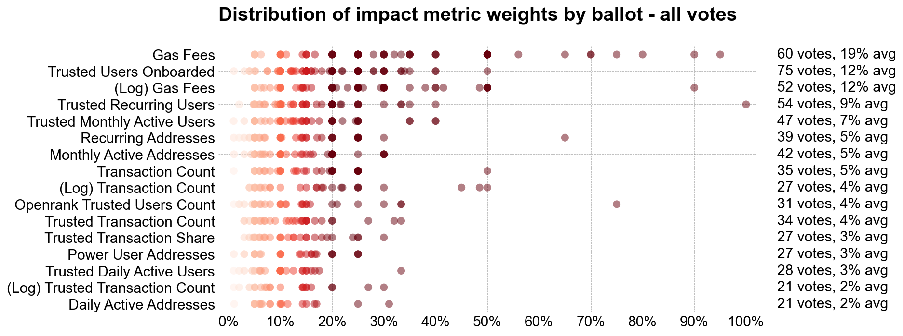

Combining related metrics, `gas_fees` and `log_gas_fees` appeared in 94 out of 108 ballots and commanded 31% of the total weighting. The log and linear `transaction_count` varients appeared in 51 ballots with a 10% overall weighting. Metrics derived from the trusted user model were included in 92 ballots, representing 44% of the weighting. Log metrics featured in 60 ballots with a 19% total weighting.

**The final distribution was a power law distribution.**

Previous rounds, including [Optimism’s RF3](https://docs.oso.xyz/blog/what-builders-can-learn-from-retropgf3) and [Filecoin’s RetroPGF 1](https://docs.oso.xyz/blog/fil-retropgf-1), had relatively flat distributions. In RF3, the median project received 45K OP, while a top 10% project received 100K OP. In RF4, the median project received just 13K, while a top 10% project received 117K OP. Despite RF4’s smaller overall funding (10M vs 30M tokens), top projects did significantly better, up to a cap of 500K tokens.

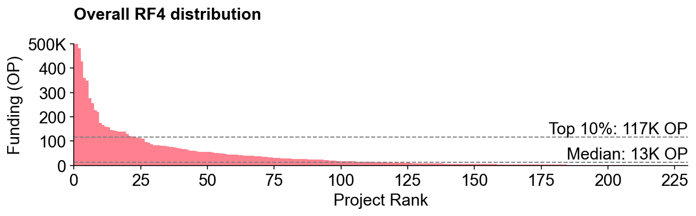

**The metric that correlated most with overall allocation was... `trusted_monthly_active_users`.**

The chart below shows the correlation between each metric and the overall allocation. `trusted_monthly_active_users` had the highest correlation coefficient, followed by `power_user_addresses` and `trusted_recurring_users`. The good news for Goodhart’s Law enthusiasts is that `trusted_monthly_active_users` is probably one of the hardest metrics to game. Meanwhile, transaction count metrics had some of the lowest correlations with overall token allocation.

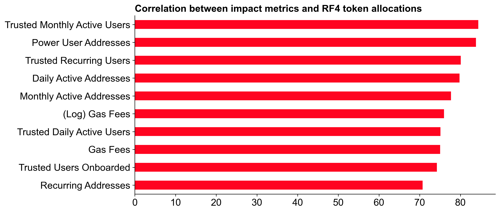

## Expressed vs revealed preferences

We have some insight into voters' preferences from a survey that was conducted before the voting phase. We can compare these expressed preferences against the revealed preferences from the voting data to see how well they align.

**User quality was rewarded over growth.**

In the survey, voters preferred rewarding user quality over growth (47% vs 24%). This preference was also reflected in the voting data, with user quality metrics appearing on 89 out of 108 ballots and receiving 35% of the overall allocation. User growth metrics appeared on 69 ballots, accounting for 15% of the allocation.

**Network growth metrics performed better than network quality metrics, despite voters saying they cared more about quality.**

In contrast to the user metrics, voters showed a stronger preference for network growth metrics (e.g., `gas_fees` and `transaction_counts`). While survey respondents preferred quality over growth (39% vs 16%), network growth metrics appeared on 98 ballots, capturing 41% of the allocation. Network quality metrics appeared on 47 ballots, receiving just 9% of the overall allocation.

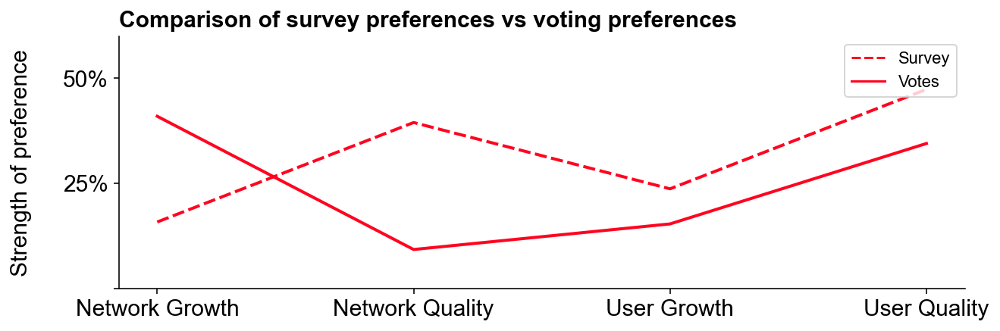

**Possible reasons for the discrepancy between expressed and revealed preferences:**

1. Non-representative survey sample: Only 38 badgeholders completed the survey, versus 108 who voted. Badgeholders caring more about social and quality metrics might have been overrepresented in the survey.

2. Change of mind: Voters may have adjusted preferences after reviewing specific metrics, reading [others’ strategies](https://gov.optimism.io/t/retro-funding-4-voting-rationale-thread/8396), or seeing the actual project mix in the voting UI. There was over a month between the survey and voting phases.

3. Weak metrics: Network quality metrics might have been perceived as less impactful. Metrics like gas efficiency and novel implementations, discussed earlier, did not make the final cut. This likely contributed to the discrepancy, suggesting a need for better quality metrics in future rounds.

**Voters’ preferences remained consistent around specific metrics and the open source multiplier.**

Survey responses were good predictors of final results for specific metrics like onboarding and retaining users. Although [controversial](https://gov.optimism.io/t/retro-funding-4-voting-experience/8138/2) and [difficult to assess](https://twitter.com/wagmiAlexander/status/1807053833891148231), the open source multiplier was popular both before and during the round: 87% of survey respondents valued rewarding open source projects; 80% of voters used the open source multiplier in their ballots.

## Correlations and badgeholder “blocs”

As votes were public, we can analyze the data to identify patterns and groupings among voters. This can help us understand how different groups of badgeholders approached the voting process and what impact this had on the final distribution.

**Some metrics had correlated performance among voters.**

The correlation matrix below shows the degree to which any two metrics were positively or negatively correlated. `gas_fees`, for instance, correlated most strongly with `transaction_count` but little else. Most trusted user metrics had moderate to high correlation coefficients. The most pronounced negative correlation was between `log_trusted_transaction_count` and `daily_active_addresses`, both among the least popular metrics.

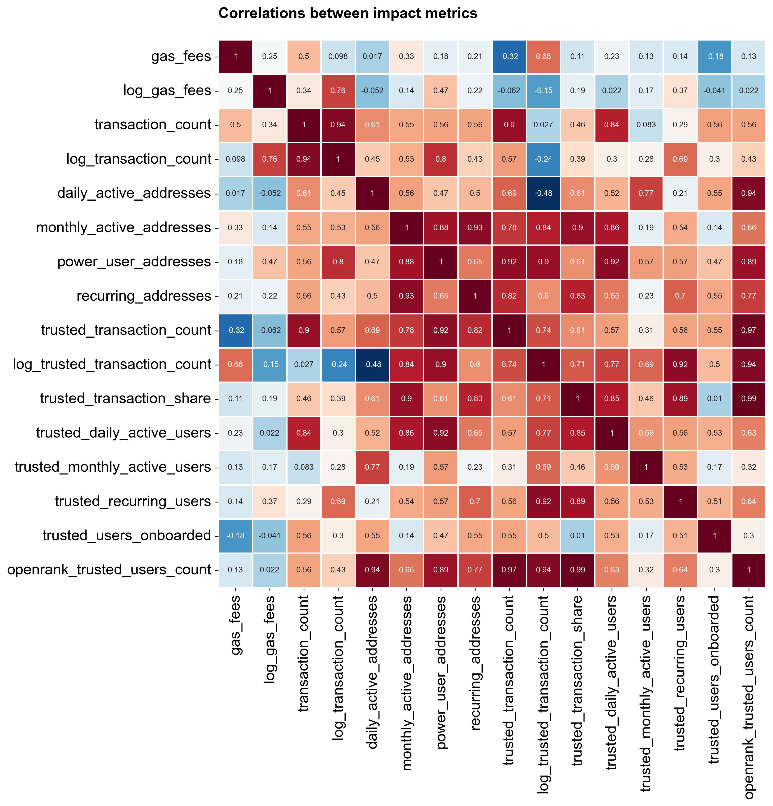

**We identified three distinct “blocs” of voters using a clustering algorithm.**

A [voting bloc](https://en.wikipedia.org/wiki/Voting_bloc) is a group of voters strongly motivated by specific concerns, leading them to vote together. In RF4, there were at three blocs with distinct preferences in the voting data. These blocs were identified using a clustering algorithm that grouped voters based on their ballot allocations.

**The “gas bloc” emphased gas fees.**

Gas fees, a simple impact metric, formed the basis of many ballots. All voters in this bloc allocated over 20% of their ballot to `gas_fees`, averaging 47%. Including `log_gas_fees`, the weighting rose to 54%. This bloc showed little interest in other metrics.

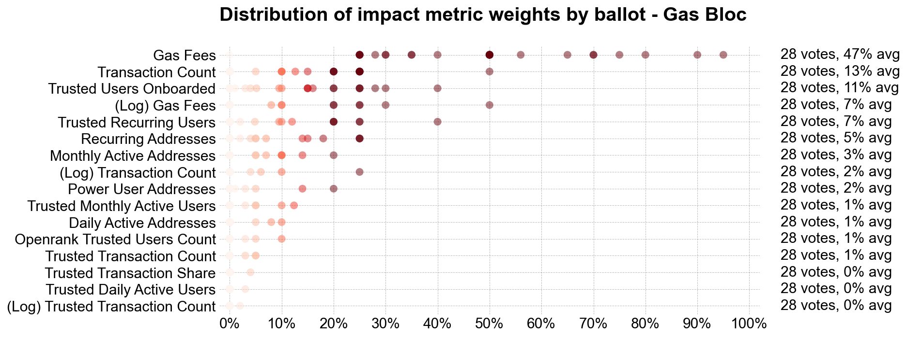

Had everyone voted like the “gas bloc,” the results distribution would have been more exponential. This bloc comprised about 25% of voters.

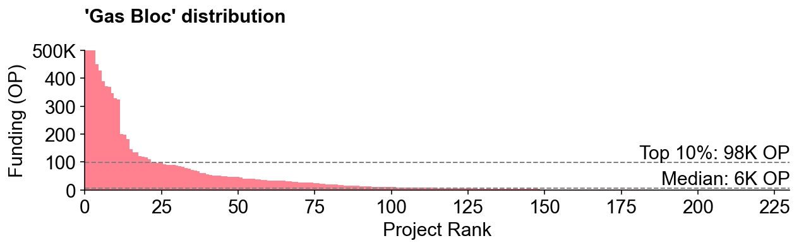

**The “balanced bloc” liked log metrics and a flatter overall distribution.**

Representing just over 20% of badgeholders, this bloc seemed to want to achieve a more balanced distribution of tokens among projects. They favored network growth indicators on a log scale, allocating over 40% to `log_gas_fees` and `log_transaction_count`. They also used address-based metrics more than trusted user metrics.

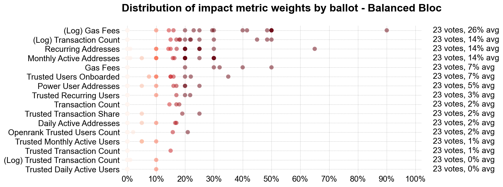

The simulated token distribution for this bloc had a 6-to-1 ratio between a top 10% project and a median project, compared to 16-to-1 for the gas bloc (and 9-to-1 for the actual distribution).

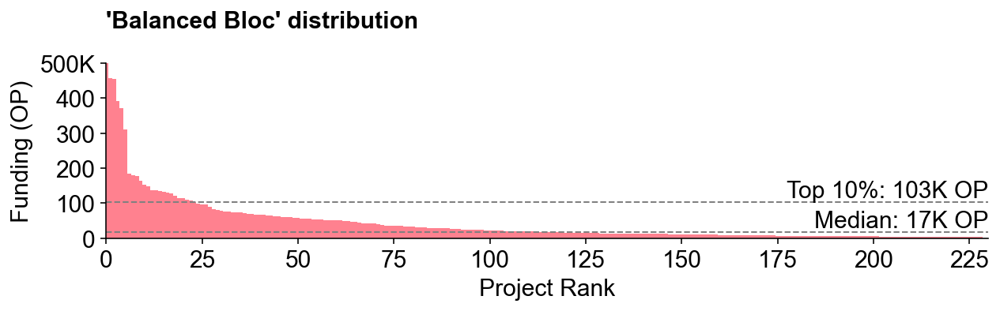

**The “trust bloc” experimented with trusted user metrics and had more diverse ballots overall.**

This largest bloc, effectively a catchall for nuanced views on rewarding impact or a preference for consumer-oriented apps, gave greater allocation to user metrics over network activity. These voters generally kept allocations below 40% per metric, resulting in a more balanced weight across all 16 metrics. Just over half of badgeholders belonged to this bloc.

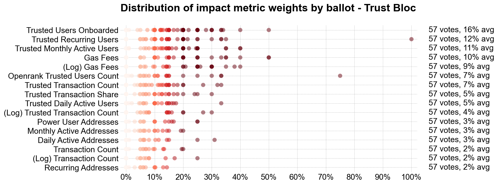

This bloc’s results most closely approximated the overall RF4 distribution, though the top 10% project mix differed slightly.

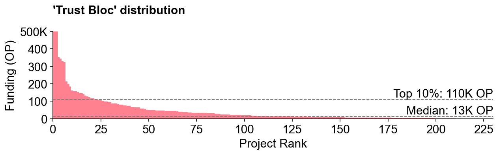

## Final thoughts

This analysis prompts some important governance questions, such as how well citizens’ preferences align with token house preferences and how representative are different ideologies and experiences in the voter mix. There are also open questions about how the badgeholder community should evolve alongside the wider community of Superchain users and contributors.

Personally, I’m excited to see how these preferences and “blocs” evolve over future rounds and how projects [react](https://gov.gitcoin.co/t/public-goods-funding-must-be-evolutionary/18728) to these signals. I look forward to tracking the performance of different voting strategies over time. My hypothesis is that the most successful projects will perform well across multiple metrics rather than optimizing for a single metric. Sound.xyz is a good example: it received one of the highest allocations overall despite not topping any single category (and being middle of the pack in terms of gas fees).

There is much more to explore in this data. As always, the code used for this analysis is available for collaboration on the [OSO GitHub](https://github.com/opensource-observer/insights/blob/main/analysis/optimism/retrofunding4/20240722_RF4_BallotBox.ipynb).
