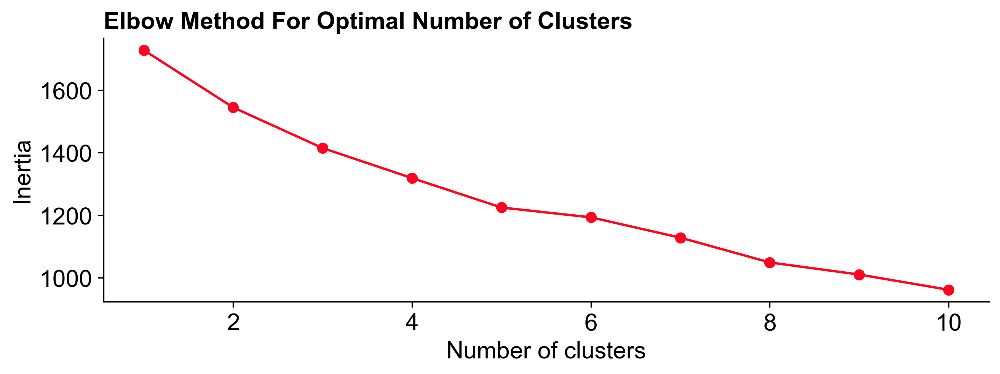

The voting results for Optimism's Retro Funding Round 4 (RF4) were tallied last week and [shared with the community](https://community.optimism.io/docs/citizen-house/retropgf-4/).

This is our last in a [series of posts](https://docs.opensource.observer/blog/impact-metrics-rf4-deep-dive) on RF4 and analyzes the ballot data from a couple different angles. First, we look at some of the high-level trends among voters. Then, we compare voters’ expressed preferences (from a pre-round survey) against their revealed preferences (from the voting data). Finally, we perform some clustering analysis on the votes and identify three distinct “blocs” of voters.

As Retro Funding is all about iteration and improvement, we hope these insights can shape not only the metrics themselves but also the higher-level governance discussions around impact, badgeholder composition, and round design.

You can find links to our work [here](https://github.com/opensource-observer/insights/blob/main/analysis/optimism/retrofunding4/20240722_RF4_BallotBox.ipynb).

<!-- truncate -->

Before getting into the data, here’s a quick overview of the results and round mechanics. A total of 10M OP tokens were distributed across 230 projects. Each project was scored ahead of time against 16 different impact metrics. These metrics ranged from onboarding new users to generating gas fees. A group of 108 (out of ~130 eligible) badgeholders showed up to vote on the metrics that they believed were most useful at assessing impact on the Superchain. Each ballot was scored and included in the overall distribution of tokens.

## High-level observations

**The average badgeholder voted on five metrics.**

There were a few voters who included all 16 metrics in their ballots but most selected between 3 to 6 metrics. The median was 5 metrics per ballot. Some of the metrics were closely related. For instance, “gas fees” and “log gas fees” were the same metric, just applied on a different scale (linear vs logarithmic). Three of the 16 metrics fit this pattern. Half of the metrics relied on a “[trusted user model](https://docs.opensource.observer/blog/impact-metrics-rf4-deep-dive#trusted-user-model)”, but considered different aspects of user and network activity.

**Badgeholders felt gas fees were the most impactful metric.**

The chart below ranks each metric based on its overall weighting and shows its distribution of individual votes. Gas fees is at the top of the list, receiving votes from 60 badgeholders and accounting for 19% of the total allocation. "Trusted users onboarded" was the most popular individual metric, attracting 75 votes in total, although it was weighed significantly lower than gas fees in the final allocation. At the other end of the spectrum, "daily active addresses'' garnered just 21 votes and 2% of the overall allocation.

We can also combine related metrics. Gas fees including "log gas fees" appeared in 94 out of 108 ballots and commanded a 31% total weighting. Transaction counts, on the other hand, appeared in 51 ballots and only had a 10% overall weighting. Trusted user metrics were included in 92 ballots and represented 44% of the weighting. Log metrics were also popular, featuring in 60 ballots with a 19% total weighting.

**The final distribution was very much a power law distribution.**

The other rounds of Retro Funding that we’ve covered, including [Optimism’s RF3](https://docs.opensource.observer/blog/what-builders-can-learn-from-retropgf3) as well as [Filecoin’s RetroPGF 1](https://docs.opensource.observer/blog/fil-retropgf-1), have tended to have relatively flat distributions. In RF3, for instance, the median project – ie, number 250 out of 501 – received 45K OP, whereas a project in the top 10% received 100K OP. In RF4, the median project received just 13K and a project in the top 10% received 117K OP. Although the overall amount of funding in RF4 was smaller (10M vs 30M tokens), top projects did significantly better in RF4. The most a project could receive was capped at 500K tokens.

## Expressed vs revealed preferences

**User quality was rewarded over growth.**

A badgeholder survey conducted before the voting phase offers some insights into badgeholders’ impact preferences. In the survey, voters expressed a two-to-one preference for rewarding user quality over user growth (47% vs 24%). This was also reflected in the voting data. User quality related metrics appeared on 89 out of 108 ballots and received 35% of the overall allocation, whereas user growth metrics only appeared on 69 ballots and accounted for 15% of the allocation.

**Network growth metrics performed better than network quality metrics, despite voters saying they cared more about quality.**

In contrast to the user metrics, voters ended up showing a much stronger preference for network growth metrics (eg, gas fees and transaction counts). In the survey, voters preferred quality over growth by 39% to 16%. However, when voting, network growth metrics appeared on 98 ballots and captured 41% of the allocation. Network quality metrics appeared on 47 ballots and received just 9% of the overall allocation.

**There could be several reasons for the discrepancy between expressed and revealed preferences around network activity.**

1. Non-representative survey sample: The survey respondents may not accurately represent the overall voting population. Only 38 badgeholders completed the survey, versus the 108 who voted. It’s possible badgeholders who care more about social and quality metrics were better represented in the initial survey.

2. Change of mind: Voters may have changed their preferences after reviewing the specific metrics, hearing other voters discuss their strategies, or seeing the actual mix of projects participating in the round. More than a month passed between when the survey was taken and when the round opened for voting. There was also lots of conversation about metrics once the round began, including many voters sharing their [voting rationales](https://gov.optimism.io/t/retro-funding-4-voting-rationale-thread/8396) on the governance forum. Finally, it’s one thing to discuss metrics in the abstract and another seeing them applied to actual projects. The voting UI made it possible to see the performance of all projects against a given metric, which may have influenced voters’ perceptions of the metrics themselves.

3. Metrics didn’t capture what voters cared about: The network quality metrics may have been perceived as weak or less impactful, leading to lower weighting. Several network quality metrics that had been discussed earlier in the round design – including gas efficiency and novel implementations – did not make the final cut. My hunch is that this is the most important reason for the discrepancy and therefore network quality metrics should be improved upon for future rounds.

**Voters preferences stayed consistent around specific metrics and the open source multiplier.**

The survey also looked at a number of specific metrics, such as onboarding new users and maintaining high levels of daily activity. Survey responses ended up being good predictors of eventual results. For instance, both onboarding and retaining users were rated highly in the survey and performed well in the round. 87% of survey respondents said they cared about rewarding projects that were open source and used permissive licenses; 80% of voters ended up using the open source multiplier in their ballots.

## Correlations and badgeholder “blocs”

**Some metrics had correlated performance among voters.**

The correlation matrix below shows the degree to which any two metrics were positively or negatively correlated. Gas fees, for instance, correlated most strongly with transaction count related metric but little else. Most of the metrics related to trusted users had moderate to high correlation coefficients. The most pronounced negative correlation was between `log_trusted_transaction_count` and `daily_active_addresses`, however, these were among the least popular metrics overall.

**We used a clustering algorithm to identify three distinct “blocs” of voters in the data.**

A [voting bloc](https://en.wikipedia.org/wiki/Voting_bloc) is a group of voters that are strongly motivated by a specific concern or viewpoint, causing them to vote together in elections. These concerns might be economic, social, or demographic, eg, most young people voting a certain way. In the RF4 data, there appear to be several blocs that seem to express views on the forms of impact that matter most. I fiddled with a few other cluster sizes, but three did a reasonable job given the relatively small sample size of voters we have to work with and the lack of a clear “elbow” inflection in the data (see below).

**The “gas bloc” put significant weight on gas fees.**

I don’t want to read too much into people’s motivations, but gas fees are a clean and simple impact metric and formed the foundation of many voters’ ballots. All voters in this bloc allocated over 20% of their ballot to `gas_fees` and 47% on average. The weighting goes up to 54% if you include `log_gas_fees` too. These voters put little stock in most of the other metrics.

If everyone had voted like the “gas bloc”, then the results distribution would have been even more exponential. This group comprised about 25% of the total badgeholders who voted.

**The “balanced bloc” liked log metrics and a flatter overall distribution.**

A smaller bloc, representing just over 20% of badgeholders, also favored network growth indicators but with a gentler, more equal distribution. They put more than 40% of their weight towards `log_gas_fees` and `log_transaction_count`. They also made relatively high use of metrics that relied on addresses as opposed to trusted users, in contrast to other groups.

The simulated token distribution from this bloc _only_ had a 6-to-1 ratio between a project in the top 10% and a median project, whereas the ratio was 16-to-1 for the gas bloc (and 9-to-1 for the actual distribution).

**The “trust bloc” included voters who experimented with trusted users and had a more diverse mix of metrics in their ballot.**

This is the largest of the three blocs and effectively a catchall for badgeholders who had more nuanced views on how to reward impact, or had a preference for more consumer-oriented applications. In general, these voters gave greater allocation to metrics that looked at users vs network activity. For the most part, these voters also kept their allocations below 40% per metric, resulting in decent showing across all 16 metrics. Just over half of badgeholders were represented by this bloc.

Given its size, the results for this bloc most closely approximate the overall RF4 distribution, although the project mix in the top 10% is a bit different.

## Final thoughts

There’s a lot to learn here from a governance perspective, eg, how well do citizens’ preferences map to token house preferences, how do different badgeholder ideologies and experiences influence preferences, etc. There remain open questions about how representative the badgeholder community is to the wider community of Superchain users and contributors.

Personally, I’m excited to see how these preferences and “blocs” evolve over future rounds and how projects [react](https://gov.gitcoin.co/t/public-goods-funding-must-be-evolutionary/18728) to these signals. I am also looking forward to tracking how different voting strategies perform over time. My hypothesis is that the most successful projects will be ones that perform well across a suite of metrics rather than optimizing for a single metric. Sound.xyz is a good example of this: it received one of the highest allocations overall despite not being at the top of any one category (and being middle of the pack in terms of gas fees).

There is a lot more that can be mined from this data. As always, the code used for this analysis is available for collaboration on the [OSO GitHub](https://github.com/opensource-observer/insights/blob/main/analysis/optimism/retrofunding4/20240722_RF4_BallotBox.ipynb).
