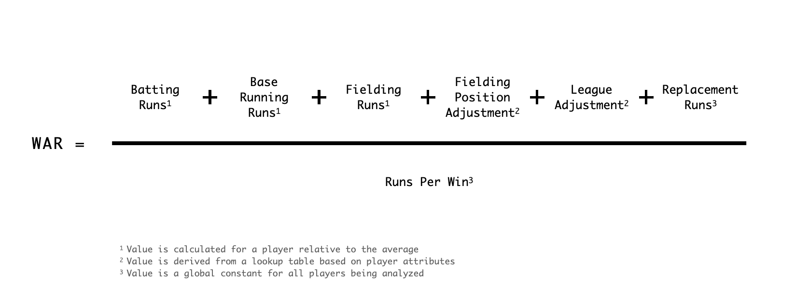
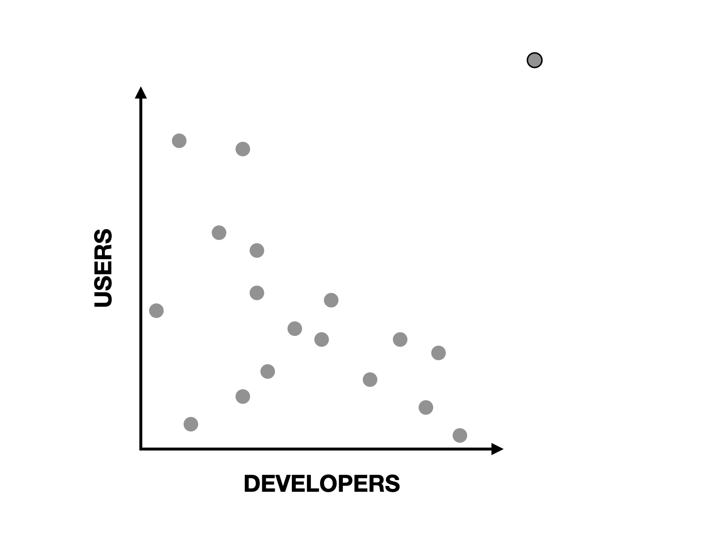
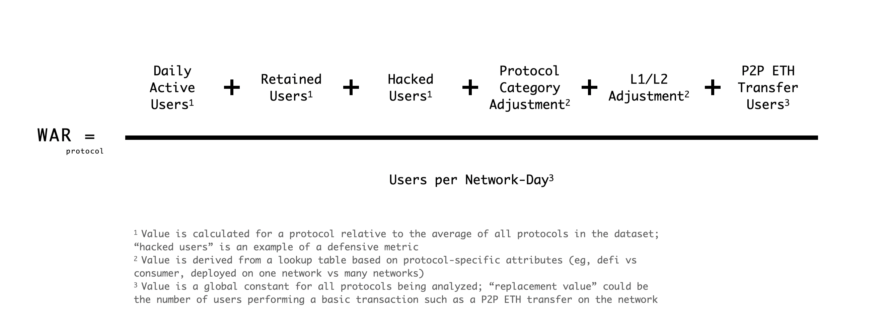
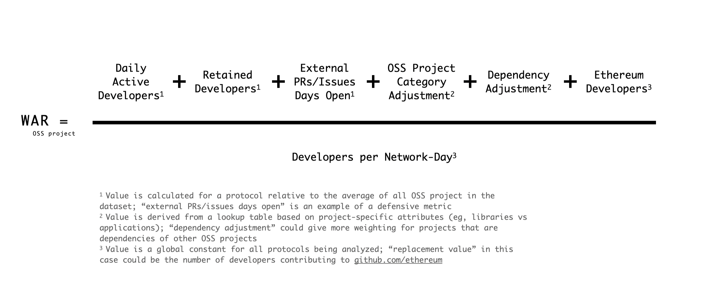

In baseball, there’s an advanced statistic called [WAR](https://en.wikipedia.org/wiki/Wins_Above_Replacement), short for Wins Above Replacement. It measures a player’s overall contribution to their team by comparing them to a “replacement-level” player—a hypothetical average player who could easily be brought in from the bench or minor leagues. The higher a player’s WAR, the more valuable they are to their team.

Now, let’s apply this concept to decentralized networks like Ethereum or its Layer 2s, which steward ecosystems of public goods including infrastructure, libraries, and permissionless protocols.

Just as baseball teams aim to build the best roster, ecosystem funds and crypto foundations strive to create the strongest community of developers and users within their networks. They attract these participants through incentive programs like grants and airdrops.

_But how can the success of these initiatives be effectively measured?_ One approach is to evaluate how well these programs retain community members and generate compounding network effects compared to the average across the broader crypto landscape. The best networks are the ones that achieve the highest WAR outright or per unit of capital allocated.

This post explores how an empirically-derived metric similar to WAR might be applied to ecosystem grants programs as a way of measuring ROI. It includes some use case ideas (like a WAR oracle) and strawman WAR formulas for protocols and open source software (OSS) projects. It concludes with some ideas for getting started.

While this is currently a thought experiment, it’s something we at OSO are seriously considering as we develop more advanced metrics for measuring impact.

<!-- truncate -->

## How WAR works

The goal of WAR is to create a comprehensive metric of player value that allows for comparisons across teams, leagues, years, and eras. It therefore provides a robust, hard-to-manipulate framework for evaluating players and determining how much they're worth to a team.

There isn’t a single, standard formula for WAR. Different sources use various calculations, but they all rely on the same public datasets, publish their methodologies, and follow similar principles.

The most intuitive and commonly cited version is the formula published by [FanGraphs in 2010](https://library.fangraphs.com/misc/war/). For position players, you take their Batting Runs, Base Running Runs, and Fielding Runs **above average**. Then, you adjust for the difficulty of their fielding position and the strength of their league using constants. Finally, you account for the fact that a replacement player generates fewer runs than an average player by applying a constant offset, and then divide everything by another constant that reflects how many “runs per win” are required.

If you aren’t familiar with baseball, these metrics might seem confusing. But here are the key points to consider:

- WAR includes a mix of offensive and defensive metrics, making it a more holistic measure than ones that focus on a single aspect.
- It adjusts for different player positions, recognizing that not all positions are equally important defensively.
- The averages and constants are derived empirically by looking at performance over a specific period, such as a single season or multiple seasons (an "era").

The resulting WAR values serve as a general indicator of a player’s value rather than an exact measure. For example:

- 0-1 WAR: Replacement-level, minimal value.
- 2-3 WAR: Solid player to have on your team.
- 4-5 WAR: All-Star player.
- 6+ WAR: MVP-caliber player.

Overall, players who excel in multiple offensive and defensive areas tend to achieve higher WAR values.

WAR is also responsive to changes that may affect the overall level of play across the league. For instance, in a year when all players are generating a lot of Batting Runs, the baseline for Batting Runs will be higher for everyone.

Finally, as the WAR of a team can be expressed as the sum of its players' WARs, there have been [studies showing positive correlations](https://blogs.fangraphs.com/war-it-works/) between WAR and team performance over time.

## Finding the MVP (most valuable protocol)

Now let’s turn our attention back to decentralized software ecosystems. The foundations and ecosystem funds investing in these ecosystems typically care about two things over the long run: retaining developers and retaining onchain users. The better an ecosystem performs along these two dimensions, the more valuable it becomes.

Unlike baseball teams, crypto networks aren’t engaged in a zero-sum game where they’re directly competing for every developer and user. However, they still face the challenge of assessing how their capital allocation decisions compare to some industry baseline. Understanding whether their grants, incentives, or other programs are effectively driving growth and retention is critical for long-term success.

Consider a very simple example where points, a theoretical measure of ecosystem value creation, are assigned based on a proof-of-work metric like “active days.” For open source projects, let’s say they earn 100 points for every active developer day. For protocols, they might earn 5 points for every active user day. By calculating these points across every project and protocol, you could establish an average for the ecosystem. Projects and protocols could then be evaluated based on how much they exceed or fall short of these averages.

But doesn’t activity vary significantly across different categories? Absolutely. You would need to create category-specific adjustments to account for these differences. For example, consumer apps often generate higher volumes of low-value activity compared to financial applications. This is similar to the fielding position (and league) adjustments made in baseball WAR calculations, which account for the varying demands and contributions of different positions.

Here's a strawman proposal for "protocol WAR", which extends the daily active user metric across a few more dimensions. It sets a replacement value based on the number of vanilla P2P ETH transfers made by users on an average day.

We can do the same for OSS projects, adding a few more dimensions to active developer days, and factoring in things like whether the project is a dependency for other projects on the network. Here, we set a replacement value based on the developer activity to github.com/ethereum on an average day.

Once again, these are just starting points to prompt discussion, and would need some adjustments / normalization to work in an actual formula. The real challenge lies in identifying metrics that not only capture current activity but also predict future growth and network effects.

In baseball, the team with more runs always wins the game. Over the long run, a team that produces more runs than it allows is highly likely to win more games than it loses. That's why WAR uses runs instead of some lesser, upstream indicator like "swings" or "at bats".

Applying a WAR-like metric to crypto ecosystems involves identifying the right indicators of sustainable growth. “Active days” is probably not the best indicator of success, but it's simple and widely applicable, so it could be a decent starting point. The key is to keep iterating and refining the metric over time, just as baseball analysts have done with WAR.

## Skin in the game

The other key is putting money on the line. Retrospective analysis should inform future actions.

In baseball, teams use WAR to determine which players to pursue and how much to offer them. They also use it to identify gaps in their rosters, replacing players with low WAR with those on the market who can deliver higher value. A coach or player who significantly underperforms their expected WAR is likely to be let go. Millions of dollars and dozens of jobs are at stake, making these decisions critical.

Crypto ecosystems could benefit from adopting a similar level of rigor. Once we've established a metric similar to WAR, we can retrospectively analyze specific projects, protocols, and grant programs to assess their true impact. By evaluating past performance through this lens, we can identify which projects and protocols have genuinely driven the most significant incremental growth.

But WAR isn’t just about looking back. It’s also a tool for shaping the future. Just as baseball teams refine their recruiting goals based on WAR, crypto ecosystems should update their capital allocation strategies. WAR could help identify not only successful projects but also weak points within an ecosystem — whether in developer tooling, user engagement, or protocol innovation — that need more investment. It could be used to determine eligibility for grant rounds or power oracles that allocate ongoing funding streams to high-performing projects.

Putting funding on the line in this way would encourage greater accountability. Ecosystem funds would need to justify their investments with data, ensuring that resources are being used effectively to promote growth and sustainability. It would also push projects and protocols to focus on consistently delivering real value, knowing that their future funding might be linked to their “ecosystem WAR.”

## Preparing for WAR

Practically speaking, how do we move from an industry that is light on good metrics to one that uses advanced metrics like WAR at various levels?

Once again, there are valuable lessons from baseball that we can apply:

- **Start Simple**: The first version of WAR was fairly basic. Over time, more sophisticated versions emerged. Similarly, the initial metrics for decentralized ecosystems don’t need to be perfect. Starting with something simple allows for gradual refinement and improvement (see: [Gall’s Law](http://principles-wiki.net/principles:gall_s_law)).
- **Embrace Competing Implementations**: As mentioned earlier, there is no single standard calculation for WAR. Even though the data and methodologies are public, there’s vibrant debate about which method is best. In an industry as dynamic as crypto, this diversity of approaches is a strength, encouraging innovation and continuous improvement.
- **Engage the Research Community**: WAR models are like catnip for data enthusiasts. They offer endless opportunities for simulation, experimentation, and visualization. By providing well-documented, easy-to-use datasets and stoking interest in the results from protocol leaders and governance teams, we can create a garden of catnip for researchers and data nerds.

At Open Source Observer, we want to build the equivalent of a sabermetrics for open source impact. If you have ideas for a WAR model, check out our existing library of [data](../../docs/integrate/datasets) and [metrics](../../docs/references/impact-metrics/), and come say hi on our [Discord](https://www.opensource.observer/discord).
