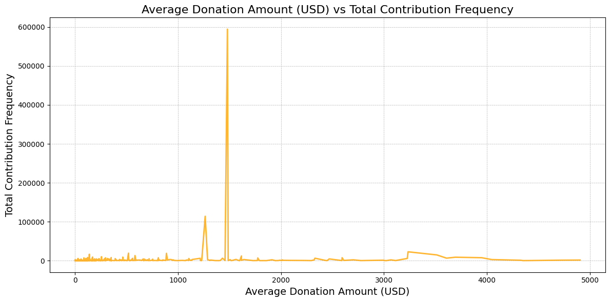
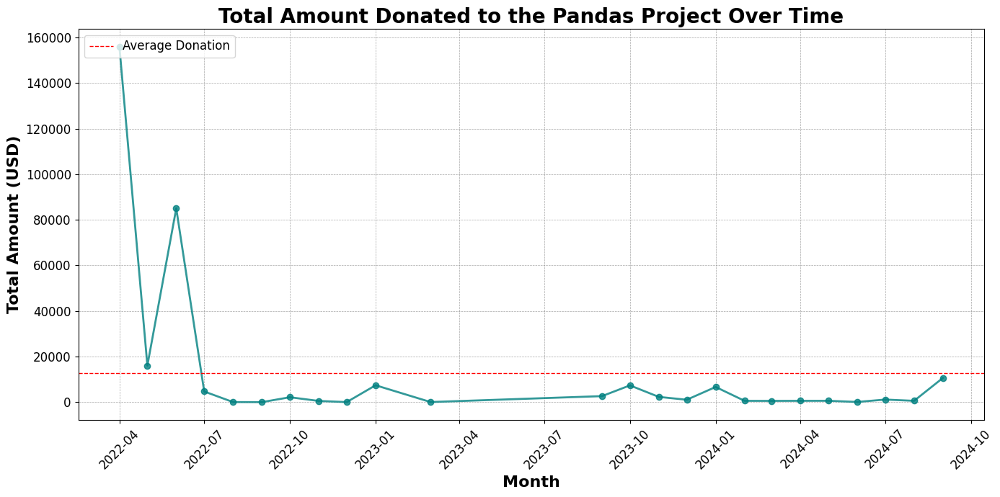
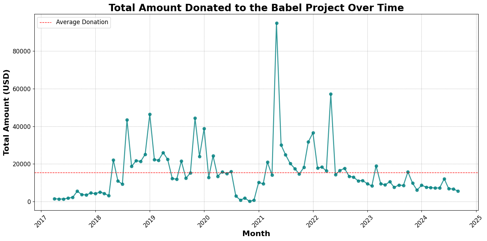
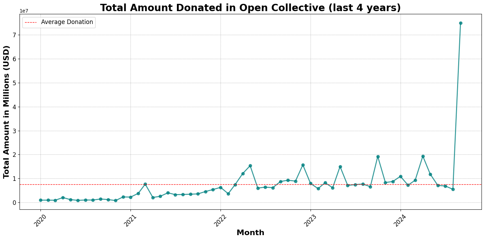

import Button from "../../src/components/plasmic/Button";

[Open Collective](https://opencollective.com) is a platform that enables groups
to collect and disburse funds transparently. It is used by many open-source
projects, communities, and other groups to fund their activities. Notable
projects include [`Open Web Docs`](https://openwebdocs.org) (maintainers of
[MDN Web Docs](https://developer.mozilla.org/en-US/)),
[`Babel`](https://babel.dev), and [`Webpack`](https://webpack.js.org).

At Open Source Observer, we have been working on collecting and processing Open
Collective data to make it available for analysis. This includes **all
transactions** made on the platform, such as donations, expenses, and transfers.
Datasets are updated weekly.

<!-- truncate -->

## Datasets

Transactions are the core of Open Collective data. They represent the flow of
funds between entities on the platform. We currently provide two datasets for
Open Collective transactions: `expenses` and `deposits`. These datasets contain
all transactions of the respective type.

Both datasets follow the same schema. This schema contains important fields such
the transaction's id, group, type and amount. For the full reference, see the
BigQuery schema.

## Use cases

The Open Collective transactions datasets can be used for a variety of
applications. Here are some examples:

### Donor contribution patterns

One use case is to analyze overall donor contribution patterns. This involves
examining the frequency of donations, the amounts donated, and the growth of
donations over time.

For example, the plot below illustrates the frequency of different donation
amounts. We can see that the most common donation is around **$1,500**, with
approximately **600,000** donations at this level. This indicates that people
tend to donate around $1,500 more frequently than other amounts, suggesting that
establishing a donation tier at this level would be a good idea.



### Analyzing Donation Trends and Retention

Another use case is to analyze donation trends and retention. This involves
examining how donations have changed over time and how many donors have
continued to donate over time.

This plot illustrates the total donations made to the
[`Pandas`](https://pandas.pydata.org) project over time. Notably, donations
reached an all-time high in April 2022 but have since declined. As of September
2024, there has been a slight rebound in donations; however, they remain at less
than one-eighth of their peak average.



On the other hand, the plot below shows the total amount donated to the
[`Babel`](https://babeljs.io) project over time. One interesting observation is
that donations spiked in the beginning of 2021. This spike was likely due to the
project's widespread usage during the global pandemic, as many developers turned
to open-source tools to build applications.



## Getting started

To get started with the Open Collective transactions datasets, 
subscribe to the dataset on BigQuery here:

<Button
  size={"compact"}
  color={"blue"}
  target={"_blank"}
  link={
    "https://console.cloud.google.com/bigquery/analytics-hub/exchanges/projects/87806073973/locations/us/dataExchanges/open_source_observer_190181416ae/listings/open_collective_1926d37f24d" 
  }
  children={"Subscribe on BigQuery"}
/>{" "}

*Note: If you have not yet set up BigQuery on your Google account, check out our [Getting Started guide](../../docs/get-started/).*

For instance, getting the total amount of
donations per month in USD can be done with the following query:

```sql
SELECT
  DATE_TRUNC(DATE(created_at), MONTH) AS donation_month,
  SUM(CAST(JSON_VALUE(amount, "$.value") AS FLOAT64)) AS total_amount
FROM
  `YOUR_PROJECT.open_collective.deposits`
WHERE
  JSON_VALUE(amount, "$.currency") = "USD"
  AND DATE(created_at) >= DATE("2020-01-01")
GROUP BY
  donation_month
ORDER BY
  donation_month;
```

This data can then be visualized to gain insights into donation patterns and
trends. We can see that donations in Open Collective have massively increased in
the last year, with almost **8M USD** donated in the last months.



These are just some examples of the insights that can be gained from the Open
Collective transactions datasets. We hope that these datasets will be useful for
researchers, data scientists, and anyone interested in understanding the flow of
funds in the open-source ecosystem.
