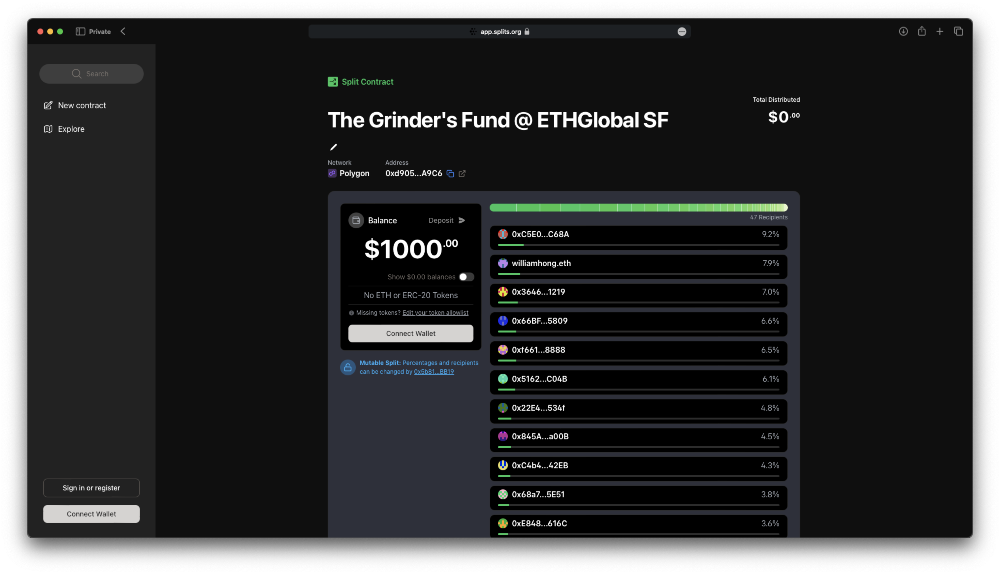
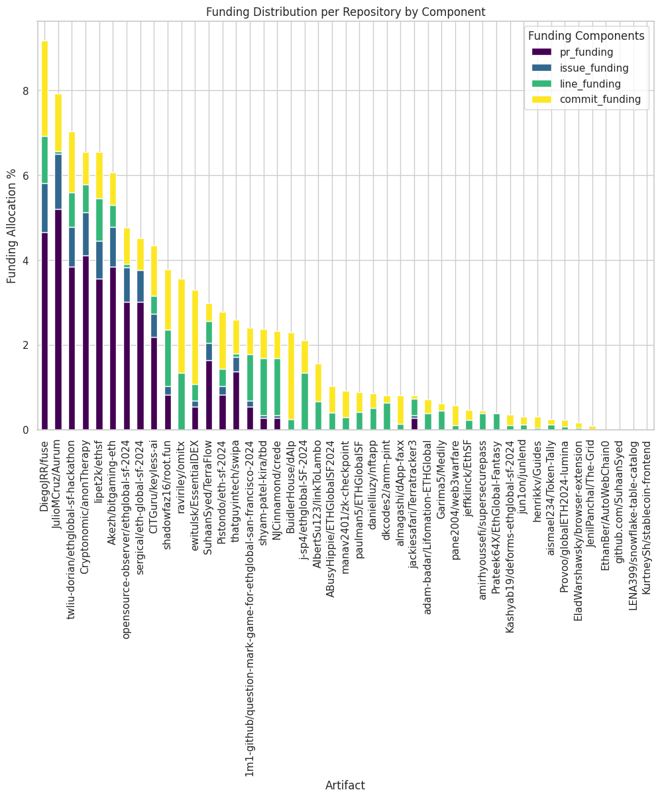

# Auto Retro Funding: Continuous, Simple, Automatic

Open-source projects power innovation across industries, yet they often face a
significant challenge: securing sustainable funding. Retroactive funding offers
a promising solution by rewarding impactful contributions based on past results,
but today’s retro funding rounds are **complex, time-consuming, and
infrequent**, making them unreliable sources of support for public goods.

This inspired us to build
[**AutoRF**](https://ethglobal.com/showcase/autoretrofunding-bxy5k) during
[ETHGlobal San Francisco 2024](http://ethglobal.com/events/sanfrancisco2024).
AutoRF makes retroactive funding **continuous, simple, and scalable** by
removing the barriers that hold current models back.

<!-- truncate -->

## The Problem: Retro Funding Rounds Today

Retroactive funding is a fairer way to reward contributors since it evaluates
impact after the fact. But running these rounds today is **labor-intensive and
hard to scale**, limiting their potential.

Take [Optimism’s Retro Funding](https://retrofunding.optimism.io) as an example.
Each round involves hundreds of hours of scoring and deliberation by voters, and
even then, **fair fund allocation isn’t guaranteed**
([source](https://docs.opensource.observer/blog/rf5-ballot-box)). Human scoring
is not only tedious but can also create perverse incentives, like prioritizing
popularity over true merit.

This overhead discourages broader adoption, leaving many impactful public goods
underfunded while making retro funding mechanisms unreliable and difficult to
sustain.

## Introducing AutoRF

AutoRF is designed to **automate retroactive funding**, combining the
**transparency of on-chain systems** with the **flexibility of off-chain
calculations** to deliver a scalable, fair solution. It empowers funders to
create data-driven funding pools with minimal effort while ensuring contributors
are rewarded accurately.

### How AutoRF Works

1. **Define Funding Pools**: Funders set up pools and define measurable metrics,
   like GitHub activity.
2. **Track Contributions**: AutoRF tracks contributions automatically, gathering
   data on metrics like commit timing, frequency, and repository engagement.
3. **Reward Contributors**: Rewards are distributed transparently using smart
   contracts, with metrics recalculated continuously.

Unlike fully on-chain solutions, AutoRF keeps **calculation logic off-chain**.
This approach allows flexibility to refine metrics over time and helps mitigate
gaming while maintaining trust and transparency through on-chain reward
distribution.

### The Grinder's Fund x Polygon

At ETHGlobal SF 2024, we showcased AutoRF with **The Grinder’s Fund**, a live
retro funding pool for hackathon participants. Sponsored by
[**Polygon**](https://polygon.technology) and
[**Dabl Club**](https://www.dabl.club), this fund distributed **$1,000 USD** to
reward the hardest-working teams.

The Grinder’s Fund evaluated GitHub activity to calculate impact, analyzing
metrics like commit size, timing, and frequency. Over **60 projects**, with
roughly **300 participants**, signed up by Sunday morning. This real-world test
demonstrated AutoRF’s scalability and efficiency. The final distribution is
available on the
[Splits website](https://app.splits.org/accounts/0xd90561e9c1d4B58b0aFfB39B5eb39494C4D8A9C6/?chainId=137).

## Why AutoRF Matters

AutoRF lowers the barriers to retroactive funding by reducing overhead and
complexity. By making these processes automatic, funders can create sustainable,
**merit-based funding systems** without the logistical challenges of traditional
retro rounds.

This system not only benefits funders but also gives contributors consistent
incentives for impactful work, fostering collaboration and innovation across
ecosystems.

## A Vision for the Future

AutoRF is a step toward a future where **public goods funding is seamless and
reliable**. Inspired by Karl’s concept in
["Ether’s Phoenix"](https://medium.com/ethereum-optimism/ethers-phoenix-18fb7d7304bb),
which equates impact with profit, AutoRF creates a system where funding is
predictable, scalable, and fair.

As AutoRF evolves, we aim to scale its impact across different domains, from
open-source software to education and climate initiatives, making funding
continuous, automatic, and accessible.

Public goods should not just survive; they should thrive.
