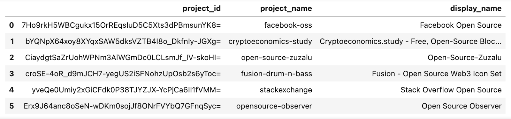
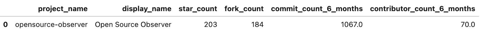
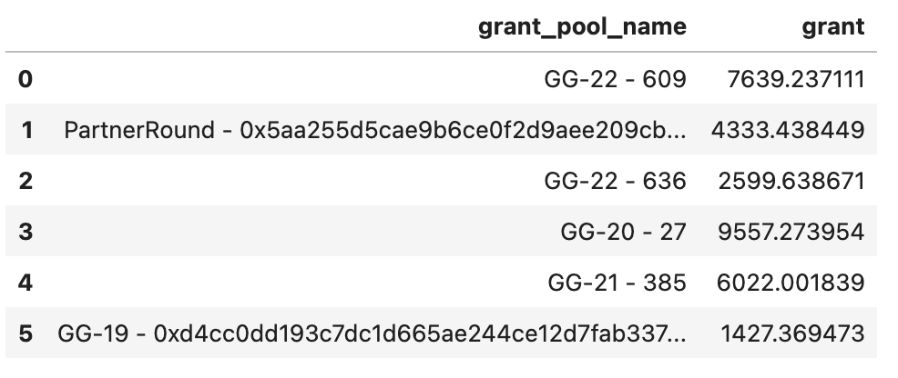
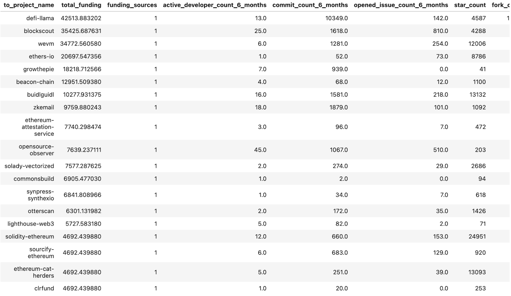
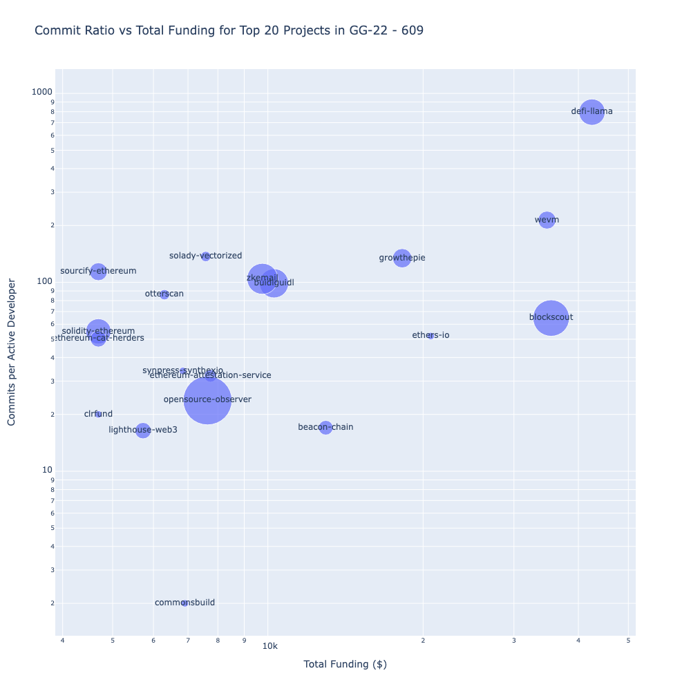
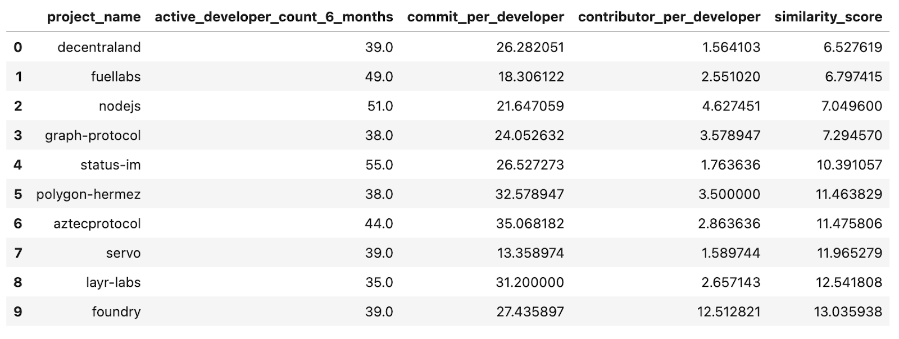
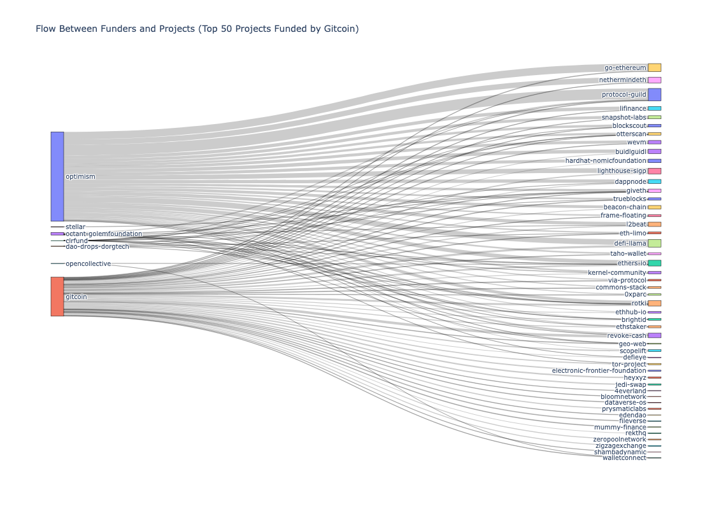

OSO is [partnering with Gitcoin](https://gov.gitcoin.co/t/gcp-xxx-oso-gitcoin-collaboration-for-advancing-data-infrastructure-and-gtm-analytics/19578) to enhance data infrastructure and analytics capabilities on top of Grants Stack.

The goal is to make it easy for developers, researchers, and community members to connect Gitcoin Grants' data with any of OSO's public datasets. In doing so, we hope to streamline data engineering, improve donor transparency, and enable more data-driven decision-making for the Gitcoin ecosystem.

This post shows how you can use OSO to:

- Find and explore Gitcoin grantee information in OSO's repository
- Evaluate coding activity, contributions, and productivity to assess project momentum and engagement
- Track funding patterns across rounds, review top-funded projects, and correlate funding with developer activity
- Identify similar grantees with comparable development profiles and discover additional funders supporting Gitcoin grantees

<!-- truncate -->

:::info
You can execute these queries on the OSO Data Lake in BigQuery by following the instructions [here](https://docs.opensource.observer/docs/integrate/query-data) or setting up a local [Jupyter Notebook environment](https://docs.opensource.observer/docs/guides/notebooks/jupyter/) and using the tutorial Notebook available [here](https://github.com/opensource-observer/insights/blob/main/community/notebooks/oso_gitcoin_tutorial.ipynb).
:::

### How to find a Gitcoin Grantee in OSO

You can search if an OSS Gitcoin Grantee's data is available in OSO by using their name as follows:

```python
query = """
    select project_id, project_name, display_name
    from `oso_production.projects_v1`
    where lower(display_name) like lower('%open%source%')
"""
results = client.query(query)
results.to_dataframe()
```

The matching records are displayed as follows. You can utilize the field project_name, say “opensource-observer”, for additional information on the grantee, as shown in the following queries.



OSO manages a repository of open source projects, including OSS grantees in Gitcoin, called the [oss-directory](https://github.com/opensource-observer/oss-directory). This repository serves as the foundation of the OSO data pipeline. By running indexers on every artifact linked to projects in the directory, OSO generates metrics that power its API and dashboards, providing valuable insights into project performance and impact.

### How to lookup basic developer activity metrics for a project

After identifying the project in OSO, you can quickly evaluate its recent performance by reviewing its coding metrics for the past six months with the following query:

```python
query = """
    select
      project_name,
      display_name,
      star_count,
      fork_count,
      commit_count_6_months,
      contributor_count_6_months
    from `oso_production.code_metrics_by_project_v1`
    where project_name = 'opensource-observer'
"""
results = client.query(query)
results.to_dataframe()
```



Besides the above metrics, the dataset also allows for analyzing trends in code contributions, issue resolution, community engagement, and project releases. These insights collectively offer a comprehensive view of a project's health and momentum, enabling data-driven evaluations for funding decisions. It’s important to note that developer activity is an input metric rather than the desired impact outcome; however, it offers valuable context for understanding engagement and sustainability.

### How to track project funding across Gitcoin Grant Rounds

Tracking project funding across Gitcoin Grant rounds offers a view of a project's growth trajectory, funding patterns, and its appeal to the community over time.

:::info
OSO maintains the [oss-funding repository](https://github.com/opensource-observer/oss-funding) with friends at [DAOstar](https://github.com/metagov/daostar), and integrates funding data alongside a curated registry of grants and other funding sources for open source software projects. This directory is free to use and distribute as a public good, aiming to support researchers, developers, foundations, and others in gaining deeper insights into the OSS ecosystem.
:::

This query aggregates the total funding received by the project in each Gitcoin Grant round.

```python
query = """
    SELECT
      grant_pool_name,
      sum(amount) grant
    FROM `oso_production.oss_funding_v0`
    WHERE to_project_name = 'opensource-observer'
    and from_project_name = 'gitcoin'
    group by grant_pool_name
"""
results = client.query(query)
results.to_dataframe()
```



### How to explore the latest coding metrics for top-funded projects in a round

In this example, you can discover the top 20 funded projects from the GG22 Developer Tooling and Libraries round and gain insights into their development activity. View key metrics such as active developers, commits, issues opened, stars, and forks over the past six months, alongside their total funding in the round.

```python
query = """
    WITH project_funding AS (
      SELECT
        to_project_name,
        SUM(amount) AS total_funding,
        COUNT(DISTINCT event_source) AS funding_sources
      FROM `oso_production.oss_funding_v0`
      WHERE grant_pool_name = 'GG-22 - 609'
      GROUP BY to_project_name
      ORDER BY total_funding DESC
      LIMIT 20
    )
    SELECT
      f.to_project_name,
      f.total_funding,
      f.funding_sources,
      m.active_developer_count_6_months,
      m.commit_count_6_months,
      m.opened_issue_count_6_months,
      m.star_count,
      m.fork_count
    FROM project_funding f
    JOIN `oso_production.code_metrics_by_project_v1` m
      ON f.to_project_name = m.project_name
    ORDER BY f.total_funding DESC;
"""
results = client.query(query)
results.to_dataframe()
```



### How to correlate developer activity with funding

Continuing the analysis from the prior example, the following example inspects how funding translates into developer activity for the top 20 projects. It could be a first step in analyzing a productivity metric (e.g. commits per developer) alongside a funding metric (e.g. total funding) over time.

```python
import plotly.express as px

# Assuming `results_df` is the dataframe containing the query results
results_df = results.to_dataframe()

# Calculate the ratio of commit_count_6_months to active_developer_count_6_months
results_df['commit_ratio'] = results_df['commit_count_6_months'] / results_df['active_developer_count_6_months']

# Create the scatter plot using Plotly with bubble size
fig = px.scatter(
    results_df,
    x='total_funding',
    y='commit_ratio',
    size='active_developer_count_6_months',  # Bubble size
    size_max=50,
    text='to_project_name',
    hover_data=['to_project_name'],
    labels={
        'total_funding': 'Total Funding ($)',
        'commit_ratio': 'Commits per Active Developer',
        'active_developer_count_6_months': 'Active Developers'
    },
    title='Commit Ratio vs Total Funding for Top 20 Projects in GG-22 - 609',
    log_x=True,  # Logarithmic X-axis
    log_y=True   # Logarithmic Y-axis
)

# Update layout for better visualization
fig.update_layout(
    xaxis_title='Total Funding ($)',
    yaxis_title='Commits per Active Developer',
    height=1000,
    width=1000
)

# Show the scatter plot
fig.show()
```

This scatter plot visualizes total funding against the normalized ratio of commits per active developer, with bubble sizes representing the number of active developers. It offers insights into how efficiently teams utilize funding relative to their developer engagement.



### How to discover grantees with similar coding metrics

There is all sorts of exploration you can do with this data. For example, you can find projects with similar coding metrics to another project to establish benchmarks or construct cohorts.

This query compares metrics such as active developers, commits per developer, and contributors per developer to find the top 10 projects most similar to Open Source Observer.

```python
query = """
    WITH reference_metrics AS (
        SELECT
            active_developer_count_6_months AS reference_active_developers,
            commit_count_6_months / active_developer_count_6_months AS reference_commit_per_developer,
            contributor_count_6_months / active_developer_count_6_months AS reference_contributor_per_developer
        FROM `oso_production.code_metrics_by_project_v1`
        WHERE project_name = 'opensource-observer'
    )
    SELECT
        project_name,
        active_developer_count_6_months,
        commit_count_6_months / active_developer_count_6_months AS commit_per_developer,
        contributor_count_6_months / active_developer_count_6_months AS contributor_per_developer,
        SQRT(
            POWER((commit_count_6_months / active_developer_count_6_months - reference_commit_per_developer), 2) +
            POWER((contributor_count_6_months / active_developer_count_6_months - reference_contributor_per_developer), 2) +
            POWER((active_developer_count_6_months - reference_active_developers), 2)
        ) AS similarity_score
    FROM `oso_production.code_metrics_by_project_v1`, reference_metrics
    WHERE project_name != 'opensource-observer'
      and active_developer_count_6_months > 0
    ORDER BY similarity_score ASC
    LIMIT 10;
"""
results = client.query(query)
results.to_dataframe()
```



### Find other funders of the top Gitcoin Grants recipients

One of the most common questions we get is: "What other funders support this project?"

This query identifies the top 50 Gitcoin-funded projects and aggregates their funding amounts, breaking down contributions by funders to showcase the most influential backers and their impact.

```python
query = """
    WITH top_projects AS (
        -- Select the top 50 projects funded by Gitcoin
        SELECT
            to_project_name,
            SUM(amount) AS total_funding
        FROM
            `oso_production.oss_funding_v0`
        WHERE
            from_project_name = 'gitcoin'
        GROUP BY
            to_project_name
        ORDER BY
            total_funding DESC
        LIMIT 50
    )
    SELECT
        o.to_project_name AS project,
        o.from_project_name AS funder,
        SUM(o.amount) AS funding_amount
    FROM
        `oso_production.oss_funding_v0` o
    JOIN
        top_projects t
    ON
        o.to_project_name = t.to_project_name
    GROUP BY
        o.from_project_name, o.to_project_name
    ORDER BY
        project, funding_amount DESC;
"""
results = client.query(query)
results.to_dataframe()
```

Here’s a Sankey diagram created using the outputs of the above query showing the flow of funds for top Gitcoin grantees from other ecosystems, using linked nodes and proportional flow widths to highlight relationships and the magnitude of transfers.



## Next steps

The collaboration between OSO and Gitcoin paves the way for more community data science and experimentation. By leveraging public datasets and a common ETL pipeline, analysts can spend less time worrying about infrastructure and data quality and more time analyzing and visualizing data.

As the partnership progresses into the next phase, we will share more use cases and examples of how data is improving Gitcoin’s grant management and go-to-market.

If you have any questions or feedback, please say hi on [Discord](https://www.opensource.observer/discord).
