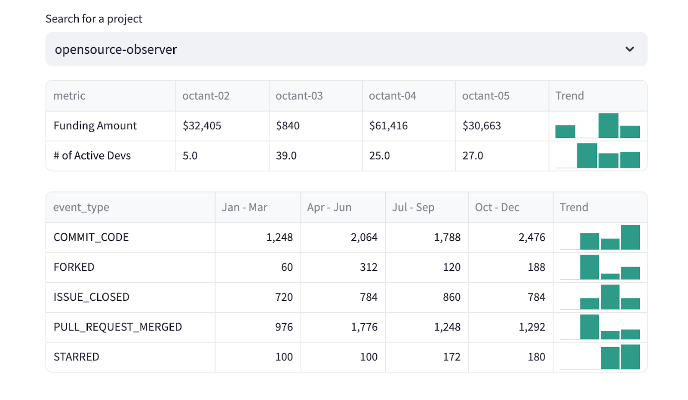
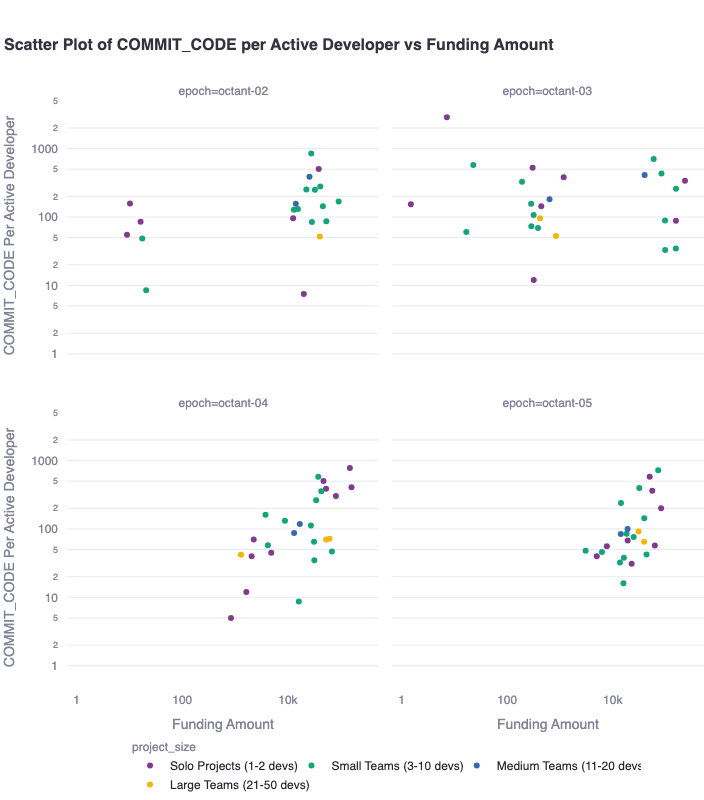
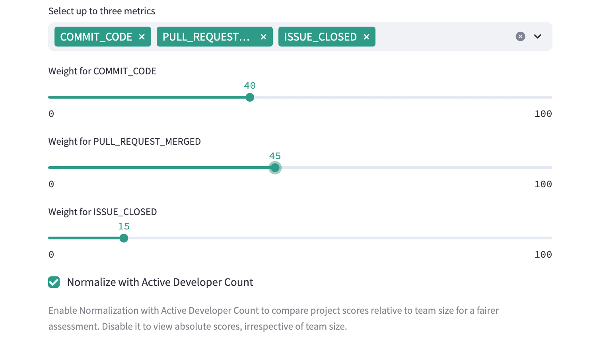
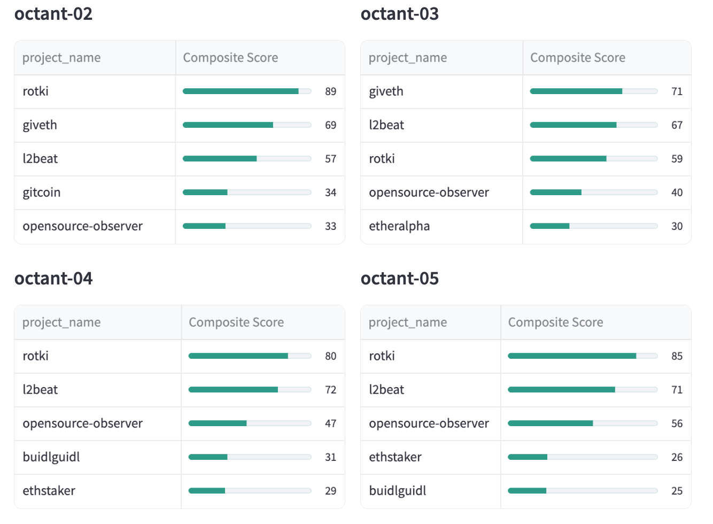
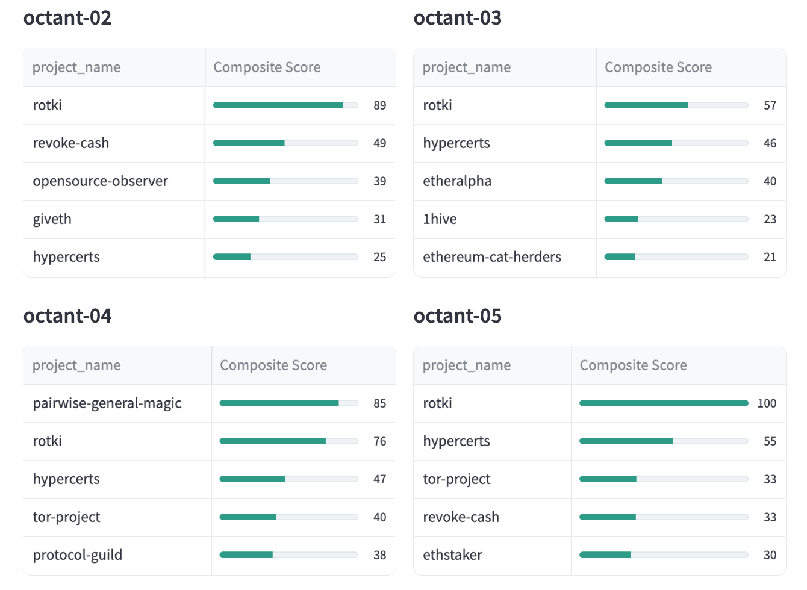
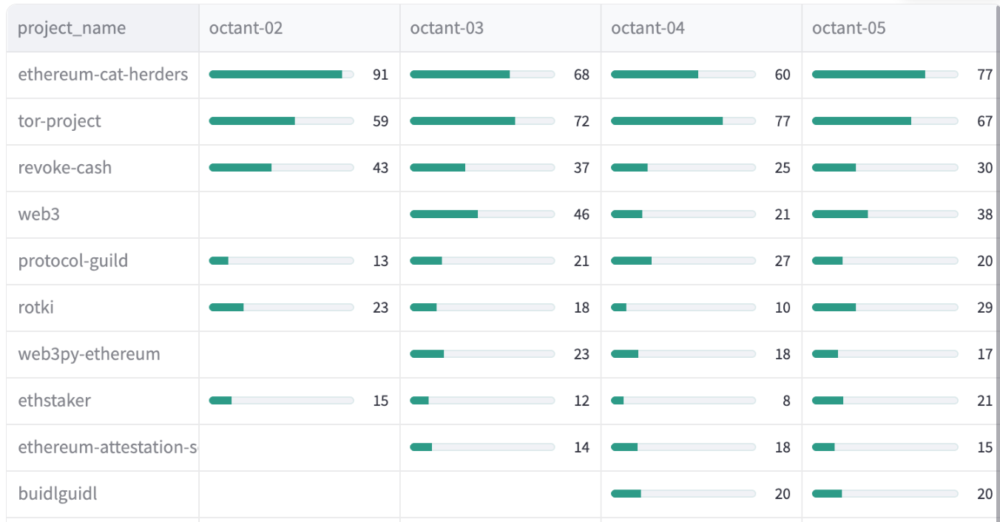
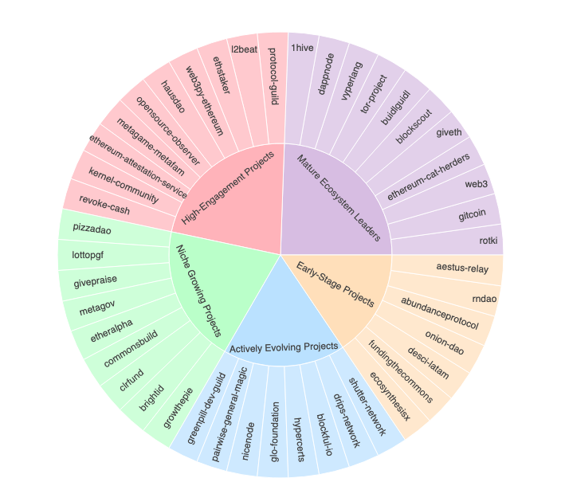
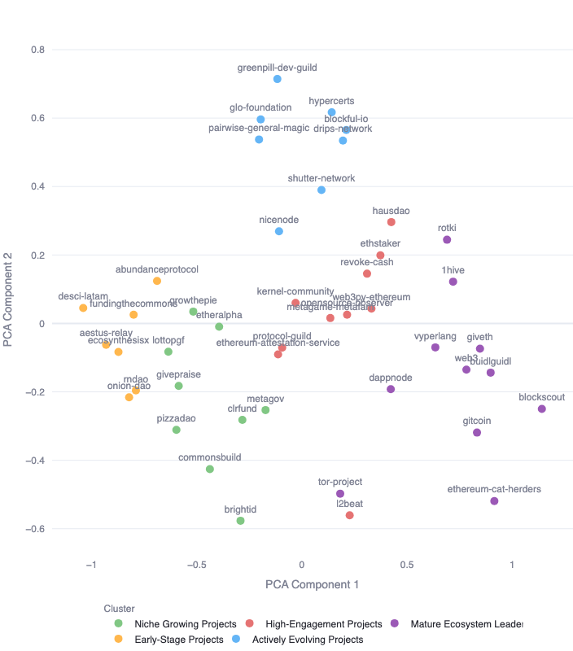

[Octant](https://octant.app/) is an important funding partner for OSO and dozens of other open source projects in the Ethereum ecosystem. Since 2023, Octant has contributed approximately $5 million (in ETH) to over 60 projects.

Octant has a [novel way](https://docs.octant.app) of funding open source. Users of the Octant platform lock GLM tokens into a staking contract. In exchange, they gain voting rights and earn ETH rewards. Every quarter, Octant runs an "epoch" where users get to allocate a portion of their staking rewards to projects they care about. This allocation determines how a larger staking pool from the Golem Foundation is allocated across a set of projects.

In 2024, Octant supported 47 open source software teams across four epochs. The funded projects have been diverse in scope, ranging from privacy-focused tools like Tor to ecosystem analytics platforms like L2Beat to up-and-coming organizations like the GreenPill Developer Guild.

This post explores some high-level trends in developer activity over the past year. As these projects have different missions and objectives (and not all are open source software projects), one should not attempt to directly compare their impact or productivity. Nonetheless, we hope these insights can highlight ongoing contributions, identify growth areas, and provide additional context on what each project has been up to.

<!-- truncate -->

The analysis spans four key areas:

- **Project Trends Across Epochs**
- **Developer Productivity and Funding Efficiency**
- **Customized Rankings for Top Projects**
- **Strategic Insights Through Clustering**

The analytics in this report are accessible for everyone to explore interactively [**through a data app**](https://octant-epoch-analysis.streamlit.app/). The app allows users to dive into the data and create their own visualizations. We'll use screenshots from the app to highlight some of our insights.

### Project Trends: Insights Over Time

We begin the analysis at the most granular level, examining funding and developer activity for individual projects. We uncover valuable trends in contributions and funding patterns by analyzing project activity across multiple epochs. This section highlights how projects evolve and adapt by tracking key metrics such as commits, merged PRs, and funding allocations over time, offering a comprehensive view of their growth and sustainability.

:::tip  
Click [**here**](https://octant-epoch-analysis.streamlit.app/#project-trends-insights-over-time) to analyze trends for a project you are interested in.
:::

### Developer Productivity and Funding Efficiency

This section explores the question, "Does funding correlate with developer productivity?" The analysis reveals that funding correlates only slightly with developer productivity, and this relationship is most evident in smaller teams. While higher funding can enhance contributions for small teams, the effect diminishes for medium and larger teams, where scaling often introduces complexities.

This dynamic highlights that small, underfunded teams consistently deliver higher per-developer contributions, even with modest resources, presenting opportunities for funders to target efficient projects delivering outsized impact.

:::tip
Explore the data interactively - [**click here**](https://octant-epoch-analysis.streamlit.app/#analyzing-developer-productivity-and-funding-distribution-across-epochs) to access the dashboard correlating project productivity with funding across Epochs.
:::

A key takeaway from analyzing the team sizes of high-performing projects is that higher funding does not always translate to greater productivity.

- While some well-funded projects maintain strong contributions per developer, others exhibit diminishing returns, especially among medium and large-size teams.

- These teams often face complexities in scaling productivity, whereas smaller teams (1--2 developers) consistently demonstrate higher per-developer contributions, even with modest funding.

Notably, several underfunded but efficient small teams present opportunities to allocate resources toward projects delivering outsized throughput.

The analysis also reveals the following Epoch-specific findings:

- Epoch 2 and Epoch 3 saw significant funding directed toward emerging projects with smaller teams, showcasing innovation and agility.

- Epoch 4 and Epoch 5 reflected sustained investment in established projects, underlining confidence in mature ecosystems.

These insights underscore the importance of tailoring funding strategies to project size and stage, ensuring support aligns with productivity and potential impact.

### Beyond Single Metrics: Exploring Composite Metrics

Single metrics like commits or issues closed provide a snapshot of developer activity but often fail to capture the broader picture of productivity. Developer contributions are multifaceted, encompassing code quality, issue resolution, community engagement, and innovation, and relying on a single metric risks overlooking important dimensions of a project's impact.

By building composite metrics that combine multiple factors, weighted based on what matters most, you can create a more holistic and accurate evaluation of developer productivity. This approach ensures rankings reflect a balanced view of performance, paving the way for meaningful comparisons and strategic insights into top projects.

We encourage you to try the app and experiment with different weightings to uncover unique insights. Whether highlighting projects excelling in popularity, collaboration, developer activity, or issue resolution — using a combination of stars, forks, commits, pull requests, and issues closed on GitHub — your exploration can reveal unique trends and perspectives.

:::tip
Click [**here**](https://octant-epoch-analysis.streamlit.app/#customized-project-rankings-and-epoch-wise-performance) to customize weights for your selected metrics, create your own composite metric, and uncover top-performing projects across funding epochs. Explore trends, gain insights, and share your findings.
:::

As an illustration, the rankings below highlight the distinctions between normalized and non-normalized scores for team size, based on the selected metrics and custom weights used to create a composite score.

#### Top Projects by Epoch Irrespective of Team Size

#### Top Projects by Epoch Normalizing for # of Active Developers

Raw metrics like commits or PRs merged can be insightful but often skew comparisons due to team size differences. Normalizing these metrics to reflect per-developer contributions enables a fair evaluation, highlighting which teams maximize their resources. This approach uncovers high-performing projects, irrespective of their size, offering funders a clearer picture of where their capital can drive the most impact.

You can conduct a similar analysis to identify projects with consistent performance across epochs. For example, the following analysis demonstrates how a composite score---weighted equally between GitHub Stars and Forks---can be used to rank projects, normalized by the number of active developers.

### Diverse Cohorts, Tailored Strategies: The Case for Clustered Allocations

The following analysis clusters projects based on their overall popularity (stars and forks), community size (developers and contributors), and how actively the community engages with the project. For each active developer, we look at their typical contribution patterns like how many commits they make, pull requests they submit, and issues they close, along with how long the project has been around.

The analysis highlights the diversity of Octant's cohort of projects, underscoring the need for funding strategies tailored to the unique characteristics of each cluster. As the ecosystem scales, a one-size-fits-all approach may fail to optimize impact. Instead, designing allocation mechanisms based on clusters can better meet the distinct needs of these groups.

**Early-Stage Projects**

- _Key Characteristics:_ Recent origins, small teams, limited visibility (low star and fork counts), but relatively active given their scale.

- _Actionable Insights:_
  - Targeted micro-grants or seed funding to encourage initial development and growth
  - Programs to enhance visibility, such as mentorship and partnerships with established projects
  - Tools for streamlined onboarding

**High-Engagement Projects**

- _Key Characteristics:_ High star and fork counts, large contributor base, consistent activity, and mature development processes.

- _Actionable Insights:_
  - Provide strategic funding focused on maintenance, scalability, and innovation
  - Encourage participation in collaborative initiatives to strengthen ecosystem-wide integration
  - Offer resources for managing high community demand

**Niche Growing Projects**

- _Key Characteristics:_ Steady, mid-sized developer and contributor base with moderate visibility (stars, forks). Focused but consistent development cycles.

- _Actionable Insights:_
  - Sustained funding to support iterative development and stability
  - Encourage outreach programs to increase awareness and attract a broader user base
  - Facilitate networking opportunities to connect with complementary initiatives

**Actively Evolving Projects**

- _Key Characteristics:_ Relatively recent projects with smaller but highly active teams. High activity per developer, particularly in issues and pull requests.

- _Actionable Insights:_
  - Flexible funding structures to support dynamic growth and rapid iteration
  - Resources for enhancing contributor onboarding and documentation
  - Highlight success stories to inspire similar projects

**Mature Ecosystem Leaders**

- _Key Characteristics:_ Long-standing projects with very high visibility and broad contributor engagement. High levels of activity across all metrics, reflecting their critical role in the ecosystem.

- _Actionable Insights:_
  - Focus funding on maintaining stability, addressing technical debt, and ensuring security
  - Invest in scalability to handle increasing community demand
  - Leverage these projects as flagship examples for the ecosystem

> _Octant's highly diverse project ecosystem requires tailored funding and support strategies to maximize impact. By aligning allocation mechanisms with the unique characteristics of these clusters, Octant can foster growth, sustainability, and scalability across its ecosystem, ensuring resources are directed where they are most needed._

#### Methodology Behind Clustering

The clustering methodology employs K-means (k=5) on MinMax-scaled features, with log transformation applied to handle highly skewed distributions in metrics like stars, forks, and per-developer activity rates. The high-dimensional feature space is visualized through PCA (Principal Component Analysis) reduction to 2D, while the original clustering is performed on the full feature set including project scale metrics (stars, forks, developer counts), normalized activity metrics (commits/PRs/issues per developer), and project maturity indicators (first commit date).

:::tip
To explore the clusters in detail, [**click here**](https://octant-epoch-analysis.streamlit.app/#clustering-insights-for-tailored-capital-allocation-in-octant-v2) for a deeper dive.
:::

### Next steps

By making the data both accessible and interactive, we hope that funders, project teams, and the broader community can utilize this data to tailor strategies, drive meaningful impact, and optimize funding decisions. With these tools, we can collectively amplify open source innovation and shape the future of thriving digital ecosystems.

If you're interested in forking this, running your own grant analytics, or an aspiring [impact data scientist](https://docs.opensource.observer/blog/impact-data-scientists/), please reach out on [Discord](https://www.opensource.observer/discord). We'd love to collaborate.
