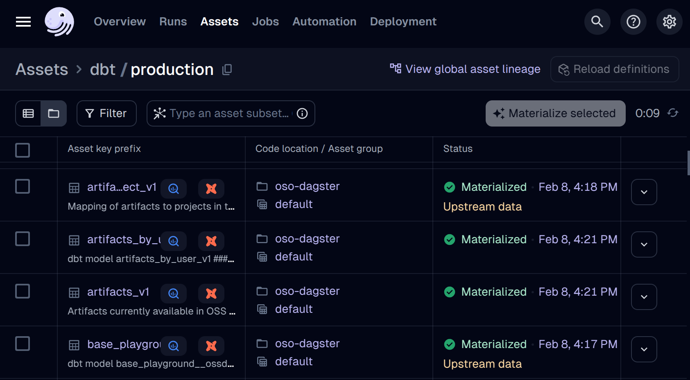

Over 2024, OSO's technical architecture went through several major
iterations to get to where it is now.
There are so many different ways to architect data infrastructure,
that the choices can be overwhelming.
Every platform will say they provide what you think you need,
and none of them will do everything you actually need.
In this post, we'll share the choices that OSO made along the way
and the pros and cons of each decision.

<!-- truncate -->

## Phase 1: A simple indexer

When we first started in late 2023, we had a short period of time to
get data together in time for our first big partnership,
[Optimism retro funding 3](../../blog/retropgf3-ecosystem-analysis/).
OSO's goal is to measure the impact of software in digital economies.
The first 2 datasets we would need to do that were
GitHub data (to see developer activity)
and blockchain data (to monitor end-user activity).

[](https://mermaid.live/edit#pako:eNqdU9uO2jAQ_RXLT6ASWmADNA-VtqyqrtSybNndSm364CQDuE3s1BcuRfz7juPAcmlf6jwkmTmeM3NmZktTmQGNaBAEsTDc5BCRmOIjKkssZrlcpQumDHl4HwuCR9tkrli5IKVNcp5-j-l1aqTSpDGWIoD1gllt-BKaMf3hb7hjNSiN2Ef3PvFksHSOG1hCLstzLxMs32hTIZhhZJpywETRcoCByPxHxUGCACt44rAir8m9BbWJKdreEanlChKPdJweOJLCKJ5YA8RJ8R_YVLFVDsqD9-n6C1-sIL8xBQ76JTAruceeyYkuLPKuBEGm0qoUyF2CBS0x9LEgPoKPf1xehuokTINr2h57iD1TmDrqhAQf6k_iYvMUTuWuGbB4hH6FhLCyxCYzw6UgjSfAtPJXY1ib9k_d_NtNzM1NxOSW-NxJ4yPTVrHmP2guCzmW6KS9L5q5U8uOZCOcN1mQW5HB2hGOsTcX6dVwT3edZcRN04V0h5msLa4hnx4mFdj9k8ZEajNXcBb9MIi0RQtQBeMZLtXWmWNqFlDgsLjFypj65ZZrhzhmjZxuREojoyy0qJJ2vqDRjOUa_2yJOcANZ9jA4mAtmfgmZbG_AhnHzfvsV7ja5BadK8ddh8SMQI2kFYZG3X5YBaDRlq5pNOi0w1541Q3D4WBw1e13WnRDo7DXDt8Oh_0eOjr9zqCza9E_FeOb9nAQ7p4B59RJfQ)

We took inspiration from how many indexers are built,
from [The Graph](https://thegraph.com/)
and [DefiLlama](https://defillama.com/) on the
blockchain data side,
to [Augur](https://github.com/chaoss/augur)
and [Grimoire](https://github.com/chaoss/grimoirelab)
on the GitHub data side.

In this architecture, we ran a simple
Node.js web server backed by a Postgres database.
We tried to use as much free infrastructure as we could,
including the [Vercel](https://vercel.com/) and
[Supabase](https://supabase.com/) free tiers.
We also wrapped the data fetching logic in a Node.js CLI,
so that we could run jobs from [GitHub actions](https://github.com/features/actions)
to take advantage of the free compute minutes available to open source projects.

**_Pros_**

- Simple and fast to build
- Low operational costs (free)
- Leverage the rich web development ecosystem

**_Cons_**

- Inflexible and difficult to do data science
- Lots of custom code to scrape APIs
- Difficult to trace data quality issues

One of the cool technologies that we discovered at this time
was [Hasura](https://hasura.io/),
which automatically turned any Postgres database into a GraphQL API.
Eventually, we replaced Postgres with
[Timescale](https://www.timescale.com/)
in order to more efficiently store and query time series events.

The problem with the initial architecture was that we
both aggregated too much, and too little to be effective.
We quickly outgrew simple aggregations
and wanted to run more sophisticated queries, which would not
perform well at request time.
Any time we wanted to introduce a new metric, it required
a large amount of engineering work and reindexing all of the data.

For example, we wanted to count the number of distinct active developers
across all repos in a project.
When we first started, we stored data bucketing events by day to be
storage efficient, which lost the data fidelity needed to compute something like this.
We learned the hard way, as countless others before us,
that [ETL](https://en.wikipedia.org/wiki/Extract%2C_transform%2C_load)
processes are not great for data science.
It was time to transition to an
[ELT](https://aws.amazon.com/compare/the-difference-between-etl-and-elt/) process.

## Phase 2: Adding dbt and BigQuery

Enter data warehouses, like Snowflake, Databricks, and BigQuery.
By storing all of the raw source data in a data warehouse,
it makes it trivial to dynamically run any arbitrary queries on top.
We can define a sequences of transformations in our data pipeline.
We chose to use [dbt](https://www.getdbt.com/),
which is still considered best-in-class for this workload.
If we changed any data model, the pipeline should be smart enough
to only recompute models downstream from it.
It was also smart enough to incrementally run models on fresh data.

We also decided to build on top of Google BigQuery,
which already had the 2 main public datasets we needed at the time for free,
GitHub and Optimism blockchain data.
It was also the only major data warehouse that supported retail users.
Anyone with a Google account could query the raw data or our data models,
up to 1TB for free every month.
As a first-stage filter, we would filter down the raw data sources
to just the relevant events for a small subset of projects.
Then, we'd normalize everything in our own semantic model
of [artifacts, projects, collections, and events](../../docs/references/).
Metrics were then computed against a universal event table,
each represented by its own data model.

[](https://mermaid.live/edit#pako:eNp9VNty2jAQ_RWNnmAKtE5ioH7oTBPaaTu5kJKmM437INsbW62RXF1CSIZ_z8oyJgFS8YC8Oquze3a1jzSVGdCI9vv9WBhuSohITPEnakssbku5SAumDLk6jgXBpW2SK1YVpLJJydObmH5MjVSadM6l6MN9waw2_A66Mf3tPdyyGpRG7A_3_-Ikgzt3MGGGkU8i5wK2EUywcqlNi5qlHDBYtLQwEJnf1Dyk38csrjksyFtyaUEtY4q2D0RquYDEIx2vB24hWMU9Ys3rUSdSGMUTa4DMLk8beCrnFVoSZtJin9N3K8g_vJ6DbjwWTEEhMUwP39IU6THLiwoEmUmrUiAXCWZ0B6pOdaPJpgq8ghJFC9bqTBvDCwndkiotQBvFDJfCwb_J5KWRdCYs1wZUd8e5Dfum0_C0FtI55nmtIbp1t_yeC3TTSE0qJVPQum6aLDG7bM-9vJBnDMPirOQPsF_InUC939RTvVqutnk2n74Fdlsjw6wT9pxvi2s3xo3LnsrdKuwo5EZZPjdb4mrNU9C7xas7F6E_ISGsqvDlNSW7BmyT8s053JvBH93d54npuGc6_Up8L5HOF6atYt1XaP7_LNqH2yTnOuLi9GpKJo2BdKZSm1yB3mqI9pVuOn-zw0Pao3NQc8YzHEmPzhxTU8Ac5XRjKWPqrxtNK8Qxa-RsKVIaGWWhR5W0eUGjW1Zq_LIVBgcTzlDpeWutmPgl5XztAhnHuXXmB2A9B3s0V467uRIjAnUirTA0Cg6C-gIaPdJ7Go2CQXgYHh2E4Xg0OjoY4uGSRuHhIHw_Hg8P8SAYBqNg1aMPNeO7wXgUrp4A-sasPA)

**_Pros_**

- Simple and low setup costs
- Leverage the rich public data ecosystem of BigQuery
- Easily share data with any Google user
- Integrates easily with Kaggle

**_Cons_**

- Very high computation costs
- Proprietary technical stack
- Jinja macros

We'll address the cons
[later](#phase-6-replacing-dbtbigquery-with-sqlmeshtrinoiceberg).
For now, this was a huge step up in our ability
to experiment with different data models.
At the end of the pipeline, we materialize our
mart models into the same Postgres database for serving the API.

## Phase 3: Replacing GitHub actions with Dagster

At this point, we were still using GitHub actions
to orchestrate all of our data jobs.
The problem here was when things went wrong (which happened a lot),
it was very difficult to find the exact failure in the logs.
It was also difficult to tell how fresh any particular data model was,
and we had no capacity to materialize a single model.
Instead, we only had 1 job that would run the entire pipeline.

By this time, we were racing to get metrics ready for Optimism retro funding 4,
the first time our metrics would directly impact the flow of funding.
Debugging a stable pipeline was the top priority.
We were also partnering with [Goldsky](https://goldsky.com/)
to ingest our own blockchain traces from 7 networks in the Superchain,
releasing them as a public dataset.

In order to facilitate better debugging,
we moved all of our data orchestration to
[Dagster](https://dagster.io/),
which allowed us to visualize the entire data pipeline,
monitor data jobs, data freshness, and debug individual failing models.

## Phase 4: Replacing Postgres with Clickhouse

By this point, our metrics were derived from over 50TB+ of raw data.
Even the mart models being served from the API were over 100GB+ in size.
The Postgres database we used for serving was struggling to keep up with queries,
even with basic lookups.
The breaking point came when the job to create indices kept failing
for our larger tables (e.g. `artifacts_by_project_v1`).

We originally chose Postgres as the safe, most common option,
but it was increasingly clear its limitations as a
[OLTP](https://en.wikipedia.org/wiki/Online_transaction_processing)
database. We wanted to switch to an
[OLAP](https://en.wikipedia.org/wiki/Online_analytical_processing)
database, optimized for analytics queries.
After evaluating some options,
we ended up choosing [Clickhouse](https://clickhouse.com/),
which has built a reputation for low-latency snappy
analytics queries, suitable for frontends.

## Phase 5: Replacing custom indexing with dlt

We quickly outgrew what we could do with just the available public datasets.
Beyond establishing our own ELT ingest for Superchain data,
we also needed to ingest
[Farcaster](https://www.farcaster.xyz/),
[Gitcoin](https://www.gitcoin.co/),
[OpenRank](https://openrank.com/), and
[EAS](https://attest.org/) data.

We evaluate a number of different data movement tools,
with very limited success,
including:
[Airbyte](https://airbyte.com/),
[CloudQuery](https://www.cloudquery.io/),
[Meltano](https://meltano.com/),
[BigQuery Data Transfer Service](https://cloud.google.com/bigquery/docs/dts-introduction).
Sometimes, we wanted to replicate an existing dataset
from S3 or Postgres.
Sometimes, we wanted to crawl an API, which could be REST or GraphQL.
Often times these different solutions would fail for
a [variety](https://github.com/opensource-observer/oso/issues?q=is%3Aissue%20state%3Aclosed%20cloudquery%20)
of [reasons](https://github.com/opensource-observer/oso/issues?q=is%3Aissue%20state%3Aclosed%20airbyte%20).

[](https://mermaid.live/edit#pako:eNp9VNty2jAQ_RWNnmACtCRxoH7oTBLaaTu5kNKmM8V9kO0NVmMkV5cAyfDvXdnGTmwS84C8Ose7e3S0TzSSMVCf9vv9QBhuUvBJQPEn8kgg7lK5ihKmDPlxFgiCj7bhQrEsIZkNUx7NA3oaGak06VxJ0Yd1wqw2_AG6Af1TMNxjNSiN2J_u_8VODA9uY8IMI5_EggtoIphg6UabCjWLOGCxGKlgIOJikech_T52ccthRd6RGwtqE1CMfSRSyxWEBdLlLYANBMt4E3EuhVE8tAaIE6zEchHDGlQB3hXZIsxuLkp8JJcZRkJmomQf6bsV5B_WwkGXjBVTkEjsqYA3DgBrRUmuMxBkJq2KgFyH2P4DluR0qQWsj4xnkKLCw52U0zLwQm_3SBUloI1ihkvh4N9k-DJIOhO20AZUt0UuhdkliWSaQumRODVtfNXmvFNSqgjpnPFFfkBI6zZ4zwWdl-dIMiUj0LrIFppXq2sdVIyJ9-u-L19Bv2QoAGcpf4S3qXVDOW9aFPmqMSpP16-FM9uOdWWH7Hm-Rq52jTVlj0fuFEqCuVHQz-WSOFfxCHTbJvmFQugvCAnLMhwIpTluAQ2ZHlzB2gz-6u4-Jrbjpsf0KylcSzpfmLaKHZxm6BjZfSXb25e2Gitlj85S1xenUzIpA6RzjlXe5wI1PFVNkfqy1SvcpD26BLVkPMaR-eTCATUJLFFXNzZjpu7d6NwijlkjZxsRUd8oCz2qpF0k1L9jqcY3m2F5MOEMJV9W0YyJ31IudxSIOd6Zy2JA53O6RxfK5S4_iRWBOpdWGOp7o5xP_Se6pv5oOPCOvONDzxuPRseHJ8Me3SDmaOB9GI9PjnBjeDIcDbc9-pgnfD8Yj7ztfxhf3UI)

With the new Dagster setup,
we decided to just stick with Dagster
[embedded-elt](https://docs.dagster.io/integrations/libraries/embedded-elt),
which has built-in support for
[dlt](https://dlthub.com/).
It has satisfied every use case we've had so far,
and we've never looked back.
