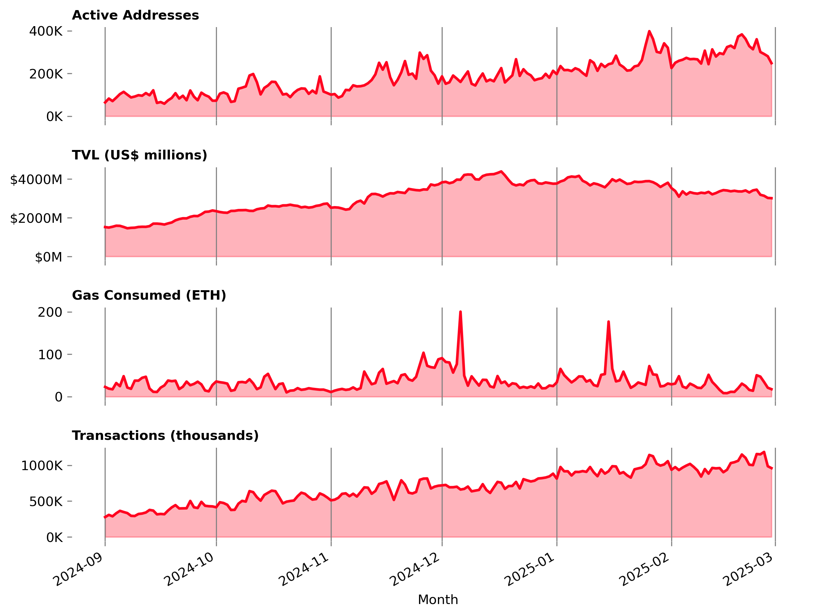
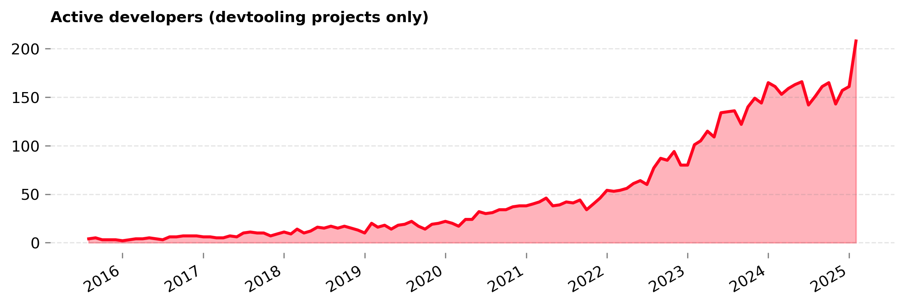

The first (of six) periods of rewards for Season 7 Retro Funding were just announced. Here's the [official post](https://x.com/Optimism/status/1907849098084102425); you can view the results on [OP Atlas](https://atlas.optimism.io/round/results?rounds=7%2C8). This marks a significant milestone in Optimism’s journey toward scalable, transparent, and data-driven token allocations.

At OSO, we’ve been fortunate to support this journey since RetroPGF 3—building open data infrastructure, surfacing impact metrics, and helping the community make sense of complex funding decisions. With Season 7, we’ve taken a more active role: implementing the evaluation algorithms that determine how funding is allocated.

<!-- truncate -->

## How this season works

Season 7 introduces a new mechanism for Retro Funding. Rather than voting directly on individual projects or specific metrics, badgeholders vote on **evaluation algorithms**—each representing a different philosophy for measuring impact. These algorithms are applied to two distinct Missions: **Dev Tooling** and **Onchain Builders**.

Each Mission has its own pool of funds and its own set of algorithms. The algorithms are open source, auditable, and designed to evolve over time. The goal is to create a competitive market for impact evaluation—where the best ideas for measuring impact rise to the top, and where the community can iterate on those ideas in public.

This first round of rewards covers impact from February 2025. There will be five more rounds, one for each subsequent month through July 2025. This structure allows for continuous improvement: algorithms can be refined, new models can be proposed, and feedback can be incorporated throughout the season.

## Evaluation algorithms

In March, badgeholders voted on a set of proposed evaluation algorithms for each Mission. These algorithms were developed in collaboration with the Optimism Foundation and the broader community, and then implemented on OSO's data pipeline. You can view our more technical write-ups [here](../../docs/contribute-models/retrofunding/s7-devtooling) and [here](../../docs/contribute-models/retrofunding/s7-onchain-builders).

For the **Dev Tooling** Mission, the evaluation process constructs a trust graph linking onchain projects, developers, and devtooling projects. Trust is propagated through this graph using the EigenTrust algorithm, with different models emphasizing different types of relationships:

:::note[Winning Algorithm]

- **Arcturus** rewards widely adopted tools with many downstream dependents. It emphasizes package dependencies and economic weight.
  :::
  :::note[Other Options]
- **Bellatrix** favors fast-growing tools and recent developer engagement. It applies a steep time decay and prioritizes Rust over npm packages.
- **Canopus** emphasizes developer collaboration and GitHub activity. It results in a more balanced distribution across projects with active contributor communities.
  :::

For the **Onchain Builders** Mission, the evaluation process aggregates onchain metrics such as transaction counts, gas fees, TVL, and user activity. These metrics are analyzed across time to produce three variants:

- **Adoption**: current period values
- **Growth**: net increase from the previous period
- **Retention**: minimum of current and previous period values

Each algorithm applies different weights to these variants:

:::note[Winning Algorithm]

- **Goldilocks** emphasizes retention and supports projects with consistent engagement.
  :::
  :::note[Other Options]
- **Superscale** emphasizes adoption and rewards projects with high current usage.
- **Acceleratooor** emphasizes growth and highlights projects gaining traction.
  :::

The evaluation algorithms are designed to be modular and extensible. Each algorithm is defined in a YAML configuration file, which specifies the data sources, processing steps, and scoring criteria. This allows for easy experimentation and iteration on the algorithms.

The actual configs and weights are all in the [Optimism Retro Funding repo](https://github.com/ethereum-optimism/Retro-Funding). You are can modify and propose new algorithms via pull request.

_The algorithms will be refined and improved via community feedback between now and July._

## New data and metrics

The evaluation pipelines are powered by open data and open infrastructure. All metrics are computed using OSO’s public data models and are available for inspection and reuse

Under the hood, we connected various [public datasets](../../docs/integrate/datasets/) from OP Atlas, raw Superchain data, decoded 4337 transactions, GitHub archive, DefiLlama, Farcaster, deps.dev, and more. The data engineering work to process all of this was non-trivial, and required us to migrate from dbt to SQLMesh to support the scale of the data.

For the **Onchain Builders** Mission, there were 187 distinct projects evaluated. In February 2025, these projects contributed:

- **$3.3 billion** in TVL
- **28 million+** transactions
- **726 ETH** in gas fees
- **295K** daily active addresses (aggregated across all chains)

These metrics were computed using trace-level data from the Superchain and TVL data from DefiLlama. Each metric was normalized and aggregated across chains, with logic to handle multi-project attribution.

For the **Dev Tooling** Mission, there were 151 applicants. The scope of these projects includes:

- **345** open source repositories
- **3305** packages on npm, crates.io, and other package registries
- **208** active developers (as of February 2025)

The links between onchain builders and devtools were derived from software bill of materials (SBOMs), GitHub activity, and verified project metadata. We'll be sharing some more data vizualizations in the coming weeks to help you explore these relationships!

You can explore the underlying models in our [SQLMesh repo](https://github.com/opensource-observer/oso/tree/main/warehouse/oso_sqlmesh/models/intermediate/superchain) or view the exported results in the [Retro Funding repo](https://github.com/ethereum-optimism/Retro-Funding/).

## Improving the algorithms

This is just the beginning. The evaluation algorithms are not fixed—they are designed to evolve. Community members are encouraged to propose improvements, test new ideas, and help shape the future of Retro Funding.

There are two primary ways to get involved:

1. **Open a GitHub issue:** Visit the [Retro-Funding repo](https://github.com/ethereum-optimism/Retro-Funding/issues) and open a new issue or comment on existing ones. We review these weekly and prioritize actionable feedback.

2. **Contribute to the codebase:** We are collaborating with the Optimism data science communtiy to tackle many of the technical issues, but there are opportunities for contributors of all backgrounds. You can share your work in an issue thread or submit a pull request to the [Retro-Funding repo](https://github.com/ethereum-optimism/Retro-Funding).

There is still ample time to have your feedback incorporated!

Ultimately, we believe that a competitive market for evaluation algorithms—built on public, verifiable datasets—is the key to scaling Retro Funding. Everything you need to get started is available through the OSO docs and in the [Retro-Funding repo](https://github.com/ethereum-optimism/Retro-Funding).

If you have questions about the process or want to get involved, don’t hesitate to reach out.
