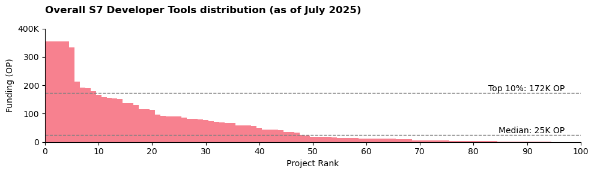
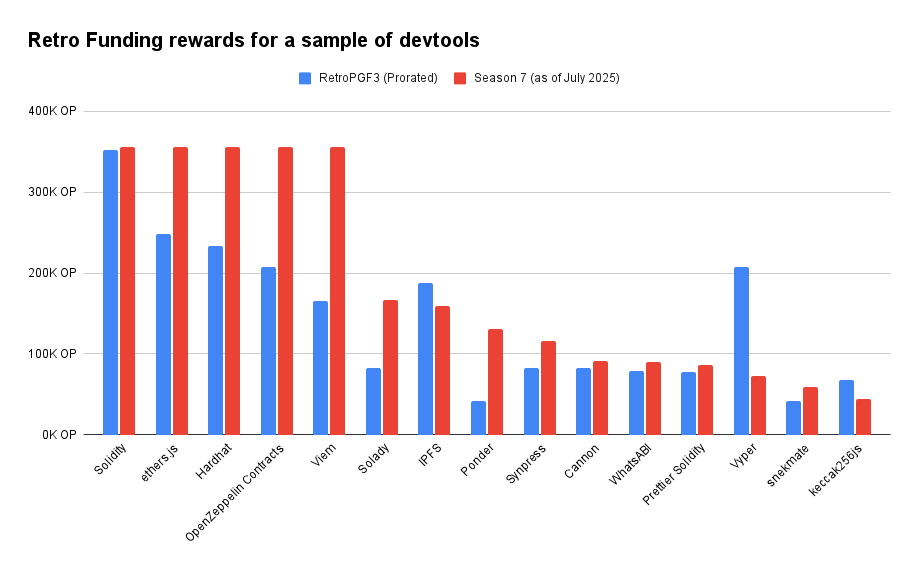
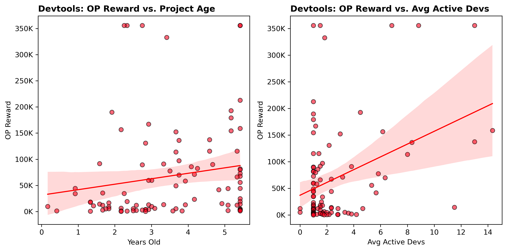
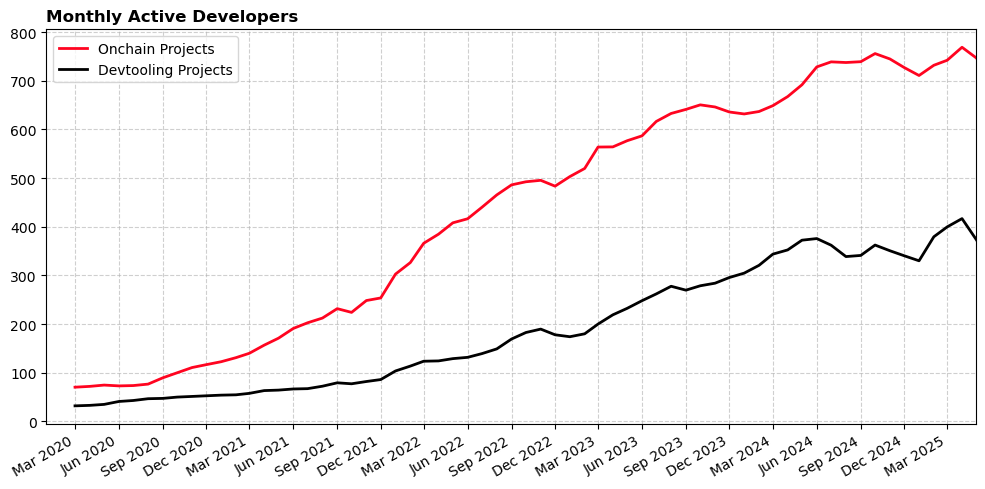
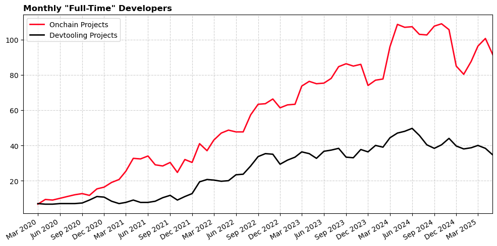
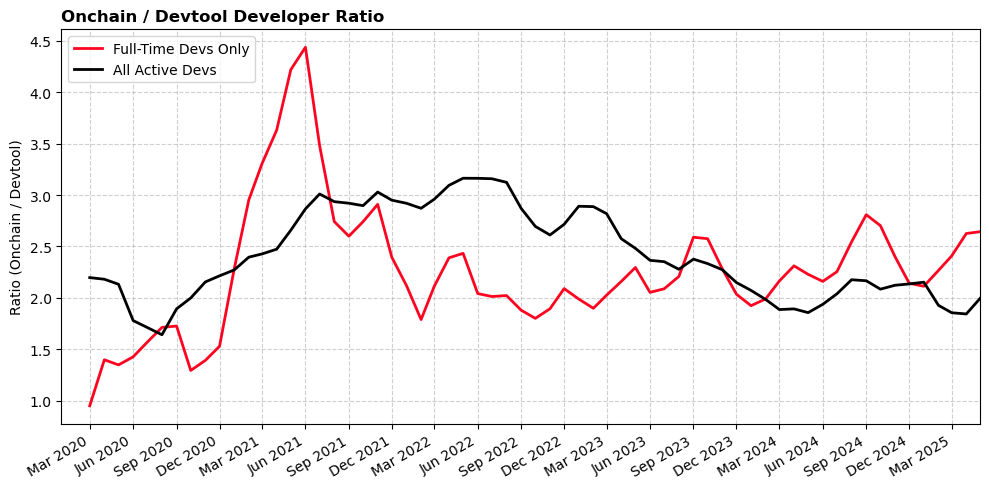
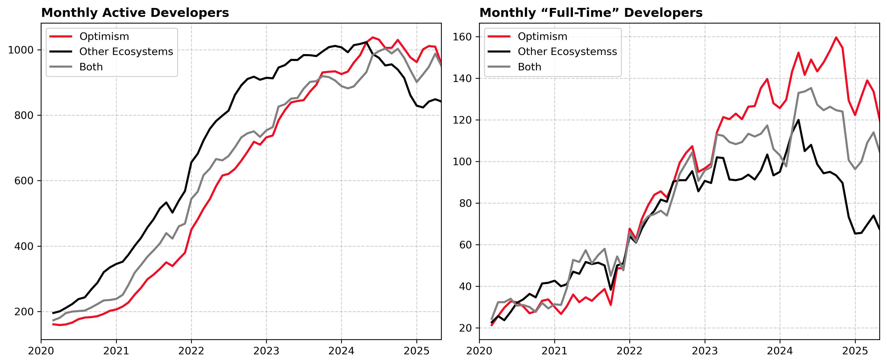
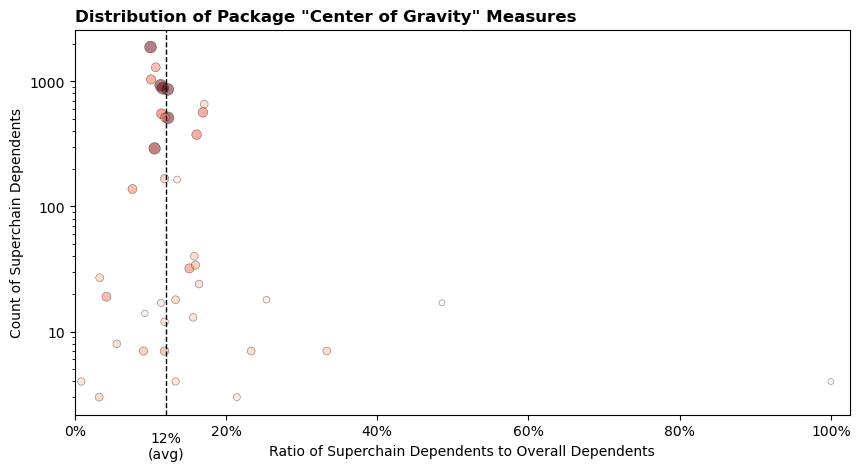
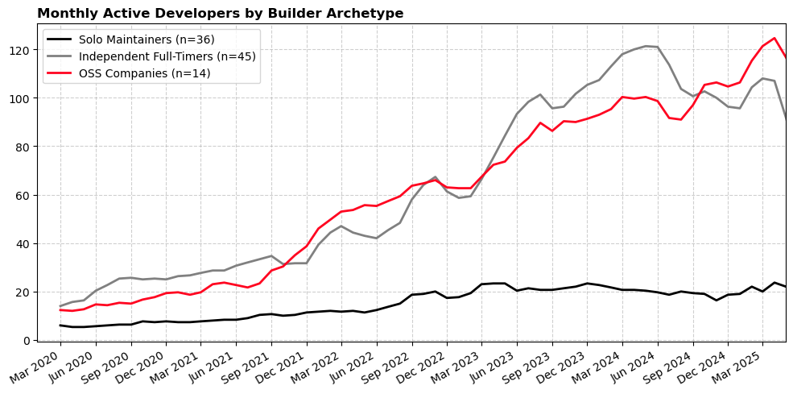

import Head from '@docusaurus/Head';

<Head>
  <link rel="canonical" href="https://gov.optimism.io/t/season-7-retro-funding-early-evidence-on-developer-tooling-impact/10162" />
</Head>

_This is a copy of a two-part post on the Optimism Governance Forum. You can find the original post [here](https://gov.optimism.io/t/season-7-retro-funding-early-evidence-on-developer-tooling-impact/10162)._

Season 7 budgeted 8 million OP to open source developer tooling.

This analysis looks in detail at three questions:

1. Which tools got funded?
2. What measurable impact have those tools had on the Superchain?
3. Has the mission been an effective use of funds?

<!-- truncate -->

### Key takeaways

1. **Out of 242 applicants, 97 received rewards.** Top recipients include Ethers, Hardhat, OpenZeppelin Contracts, Solidity, Viem.
2. **Higher grants vs RetroPGF3.** Many of the devtools that participated in RetroPGF3 now receive materially larger OP amounts.
3. **Small, seasoned teams.** Retro Funding directly supports ~36 full-time maintainers; most projects are solo or two-person shops. Median tool age is 3.5 years. Projects with 3+ years of history and 2+ active devs earned the highest median reward (125K OP).
4. **Broad downstream footprint.** At least 89 full-time developers on 177 onchain projects depend on these tools. Those onchain projects have burned 1,567 ETH in direct gas (~9% of network total) and their contracts touch ~45 % of all Superchain transactions since January 2025.
5. **Developer momentum.** Full-time onchain devs have increased 33% since 2023, while devtool maintainers grew 8.5%. The two curves track closely, signalling healthy scaling of the tooling layer. Evidence suggests that Optimism has outpaced peer ecosystems in developer growth since 2023.
6. **Center-of-gravity.** Most funded libraries remain multi-ecosystem (e.g., only 10% of repos that use Ethers are Superchain builders), but a few tools (e.g., Cannon at 33%) are disproportionately Superchain-centric. We calculate an average "center-of-gravity" ratio of 12% for all funded projects.
7. **Cost-of-substitution.** Rebuilding all of the funded tools once would cost a minimum of US $26M. If every app on the Superchain had to rebuild its own stack, the cost would be US $862M. Assuming Optimism's 12% "fair share", the implied cost savings for onchain builders is $103M.
8. **Maintainer sentiment.** Multiple devs report that Retro rewards are a meaningful incentive: "Without the OP, I wouldn't have touched my tool this year".

### Background

Per the original [mission scope](https://gov.optimism.io/t/retro-funding-dev-tooling-mission-details/9598), impact has been rewarded based on the following criteria:

1. Adoption of Dev Tool by onchain builders
2. Importance of the tool in onchain application development

Rewards are determined using public metrics and an open source algorithm maintained in [this GitHub repo](https://github.com/ethereum-optimism/Retro-Funding). The strategy for the algorithm was [voted on](https://snapshot.box/#/s:retrofunding.eth/proposal/0x52d4bc671fb09118ec727f411b5d0740ce539c06a2b742adf1bc90cbb67cc4f8) by citizens at the start of the mission and shaped over the course of the mission by community feedback.

As of July 2025, five (out of six) monthly measurement periods have been completed. A total of 6.6M OP has been awarded to Dev Tools. The final reward allocation will be determined on 1 August 2025.

### Measurement objectives

Over the long run, Optimism seeks to measure whether Retro Funding is shifting developer attention and incentives, and ultimately leading to faster innovation cycles, more winning apps going to market on the Superchain, and increasing revenue for the Collective.

This impact should be evidenced by the following success metrics:

1. Improvement in the developer experience of onchain applications over time across the lifecycle of initial development, deployment and maintenance.
2. Reduction in the resources spent on developer tooling & services by developers, and growth in the diversity of high quality tools leading to increased choice

Ideally, this analysis would make use of longitudinal DevX surveys and more granular estimates of builder expenditure and cost-savings. Unfortunately, we do not have such data. For the current review, we rely primarily on maintainer output or "full-time" developer months as a leading indicator of impact.

Please note: our definition of "full-time" follows the Electric Capital methodology (≥ 10 commit days per month). We only consider open source activity, not developer activity on private repos.

### Caveats

- **Correlation ≠ causation.** We have not attempted a causal study. We do provide recommendations for longitudinal measurement of program impact at the end.
- **Lagged impact.** Changes in DevX or app success may take 6-12 months to surface. This review mostly focuses on leading indicators (usage \+ dev activity).
- **Blind spots.** Private-repo work, DevX sentiment, and real cost savings are outside current data. Figures quoted here rest on a handful of key assumptions and should be treated as directional.
- **Conservative methodology.** We measure only what we can see: explicit package imports, public-repo activity, etc. Implicit dependencies (e.g., every smart contract depends on Solidity), private-repo activity, and local usage (e.g., of IDEs) are not captured currently. Our usage and downstream impact estimates are more of a floor than a ceiling.
- **Continuous improvement.** The reward algorithm was refined throughout the round. Weights, dependency-matching logic, and metrics are frequently updated in response to community feedback. All data pipelines and scoring code are open source, and further contributions are welcome!

## Which tools got funded?

### Distribution

The following are some of the key distribution stats for the mission as of 1 Jul 2025:

- **Total awarded:** 6.6 M OP across 97 projects, out of 242 applicants
- **Max single reward (per project):** 356K OP
- **Median reward:** 24.7K OP

The final reward distribution will be after 31 Jul 2025.

### Category Breakdown

A total of 5.44M OP (82%) went to 38 OSS library projects. To qualify, a library had to be imported by at least three onchain builders. The top five OSS libraries are:

- Ethers
- Hardhat
- OpenZeppelin Contracts
- Solidity
- Viem: TypeScript Interface for Ethereum

The remaining 1.16M OP (18%) went to other types of OSS tools, such as development frameworks, developer experience tools, data indexing & analytics, etc. The current type five are:

- DefiLlama
- 🏗️ Scaffold-ETH 2
- Ape Framework
- Foundry
- Titanoboa

There has been strong participation across most categories. Going one level deeper, we can see that **core protocol interfaces** (a subset of libraries) has received the most funding overall.

| Category                           | Applicants | Funded Projects | Median OP | Total OP | Share of Total |
| :--------------------------------- | :--------: | :-------------: | :-------: | :------: | :------------: |
| Core Protocol Interfaces           |     39     |       23        |    60K    |  2384K   |     36.1%      |
| Development Frameworks             |     12     |        7        |    70K    |   688K   |     10.4%      |
| Cryptography & Primitives          |     7      |        6        |    98K    |   574K   |      8.7%      |
| Developer Experience Tools         |     36     |       14        |    12K    |   548K   |      8.3%      |
| Language & Compilation Tools       |     7      |        6        |    42K    |   528K   |      8.0%      |
| Infrastructure & Node Operations   |     16     |        9        |    34K    |   469K   |      7.1%      |
| Testing & Verification Tools       |     16     |       12        |    9K     |   455K   |      6.9%      |
| Data Indexing & Analytics          |     19     |        7        |    44K    |   431K   |      6.5%      |
| Deployment & Lifecycle Management  |     10     |        6        |    42K    |   377K   |      5.7%      |
| Interoperability & Cross-chain     |     7      |        1        |    78K    |   78K    |      1.2%      |
| Application-Specific & Niche Tools |     33     |        5        |    4K     |   66K    |      1.0%      |
| Others (incl. spam)                |     37     |        0        |    \-     |    \-    |       \-       |

### Comparison to RetroPGF3

Many Season 7 awardees were also funded in RetroPGF3 (Q4 2023). On a like-for-like basis, prorating RetroPGF3 rewards by 5/6 to match Season 7’s progress, core libraries such as Ethers and OpenZeppelin Contracts earned significantly larger allocations this season, reflecting their outsized importance to TypeScript/Solidity developers. In contrast, other OSS tooling (e.g., IPFS, Vyper) saw stronger relative performance in RetroPGF3.  

### Team Size & Maturity

Funding clearly rewarded small, seasoned teams.

- **Portfolio median:** 3.5 years old, 1-2 active developers over the past six months.
- **Top-earning cohort:** Projects 3+ years old _and_ with 2+ full-time devs (≥ 10 commit-days/month).
  - **Count:** 12 tools
  - **Median grant:** 125K OP
- **Solo-maintainer veterans:** Older codebases run by a single part-time dev also did well.
  - **Count:** 19 tools
  - **Median grant:** 49K OP

The scatter plots below show that awards climb gradually with age and contributor count, but the spread widens for younger or one-person projects. This should be encouraging for small upstarts that experience fast adoption.

## What measurable impact have those tools had on the Superchain?

### Usage footprint

The developer tools funded by this mission were used by 177 onchain projects whose users directly spent 1,567 ETH in gas since January (9% of all transaction fees) and whose contracts were invoked either directly or via internal calls in approximately 45% of transactions across the Superchain.

**Caveats:**

- The gas-fee figure ignores internal calls, so it is conservative.
- The 45% transaction share treats comes from a sample of dates; it doesn’t weight by gas consumed or value transferred.
- Private-repo dependencies and unlabeled contracts are invisible to our graph.

### Developer footprint

This section looks at public repo developer activity across the Superchain since 2020\. To be included, a developer must be working on a devtooling project applying for Retro Funding or an onchain builder that contributed at least 0.1 ETH in gas to the Superchain since January. Thus, it is only a subset of the wider developer ecosystem and excludes contributors from OP Labs.

- Full-time developers that maintain devtooling projects: 36 (+8.5% since April 2023)
- Additional full-time devs building on those tools: 89 (+32% since April 2023)
- Average active devs in the dependency graph: 1071 (+47% since April 2023)

_Our definition of “full-time” developer follows the Electric Capital methodology (≥ 10 commit days per month)._

### Developer leverage

The ratio of onchain devs to tooling maintainers hovers near 2 : 1. As the ratio has been falling slightly, this suggests there is more stability at the tooling layer and less at the application layer. Another interpretation could be that onchain builders need less code to build their application and are now spending more on other functions (e.g., design, marketing) than software development.

### Peer ecosystem comparison

Next, we can try to contrast this with developer growth across peer ecosystems. We do this by comparing _collection_\-level metrics in [oss-directory](https://github.com/opensource-observer/oss-directory).

The analysis assigns projects into three categories based on set membership:

1. Optimism (builders on all OP Stack chains plus Retro Funded projects)
2. Other Ecosystems (a combination of peer networks, including Arbitrum, Polygon, and zkSync)
3. Both (projects that appear in both sets)

We also remove any project is part of the [Ethereum org space](https://github.com/orgs/ethereum/repositories) or [Protocol Guild](https://www.protocolguild.org/about) (even if they have been Retro Funded).

The chart shows consistent growth across all three cohorts until 2023\. Then, the “Optimism” cohort pull ahead both in terms of full-time and active developers. This is not a perfect apples-to-apple comparison and does not imply causation. However, it does show a directional trend consistent with similar analysis from the [Electric Capital’s Developer Report](https://www.developerreport.com/).

### Center of gravity

Think of “center of gravity” as a quick way to ask, “How Optimism-centric is this library?”

For every package we look at two numbers: (1) how many GitHub repos maintained by Superchain builders import it and (2) how many repos in the OSO entire dataset import it. The ratio of Superchain imports gives a “center of gravity” score between 0 and 1\. A score near 1 means the library is used almost exclusively by Optimism builders; a score near 0 means it is largely used elsewhere.

Because the denominator can be very large (OSO currently covers \~125K public repos), even a seemingly small center of gravity could still represent thousands of dependent projects. Ethers.js is good example: only \~10% of its users have deployments on the Superchain, yet that still translates into 1,876 dependent repos \- enough to justify a top-tier grant. At the same time, a package like Cannon turns up in just 21 repos overall but 7 of those belong to Superchain teams, giving it a center of gravity of 0.33.

| Sample Project | \# Superchain Builder Dependencies | \# Overall Dependencies in OSO Dataset | Ratio |
| :------------- | :--------------------------------- | :------------------------------------- | :---- |
| Cannon         | 7                                  | 21                                     | 0.333 |
| Ethers.js      | 1876                               | 18,724                                 | 0.100 |
| go-libp2p      | 4                                  | 463                                    | 0.009 |

The scatterplot below captures this distribution. Large dark circles clustered on the left show low center of gravity workhorses such as Ethers.js. Smaller circles to the right represent more niche but high center of gravity tools like Cannon. Packages hugging the bottom left have relatively low usage and generally see minimal funding unless they deliver something irreplaceable like libp2p.

**Caveats:**

- **Conservative scope**. This ignores private-repo usage and off-chain dependency graphs (e.g., a closed-source exchange backend in Rust that still imports Ethers).
- **No value weighting.** Every dependent repo counts the same: Aerodrome and a weekend hackathon project each add “one,” regardless of their economic impact. (Note: the Retro Funding rewards algorithm does capture economic impact on the Superchain, but we don’t extend the same analysis to the rest of the dependency analysis.)
- **Sanity check.** The Superchain currently captures roughly half of all L2 transactions and TVL and roughly 5% for all of crypto. The average center of gravity of 12% looks reasonable.

## Has the mission been an effective use of funds?

We assess effectiveness from three angles:

1. **Cost-per-developer.** How much OP reaches each full-time maintainer? The mean value is 183K OP (6.6M / 36).
2. **Cost-of-substitution.** What would it cost builders to recreate this tooling themselves? We estimate a one-time rebuild of US $27M, a per dependent project rebuild of $862M, and a “fair share” cost to rebuilt of $103M.
3. **Maintainer incentives.** Are Retro rewards changing behavior? Anecdotes say “yes”.

### Cost-per-developer

On a back-of-the-envelope basis, the 6.6M OP disbursed so far is supporting about 36 full-time maintainers. Simple division gives \~183K OP per full-timer or \~15K OP per month over 12 months. That ratio is useful as a benchmark \- it shows Retro Funding has potential to offer near market rate funding for stewarding valuable devtooling \- but it should not be mistaken for an actual cost curve or value measure:

- Maintenance ≠ innovation. Meaningful advances often require large, lumpy investments that a pure "maintenance budget" would never cover. For every project that succeeds, there are many that never make it.
- A project is more than its primary maintainer. Each "full-time maintainer" coordinates a broader community - part-time contributors, testers, documentation writers - much of whose effort never shows up as code commits. Periods of low code activity on GitHub do not mean a maintainer is sitting idle.
- Ecosystem leverage. A single developer can unblock hundreds of downstream builders; dividing OP by head-count ignores that multiplier. As discussed in the previous section, there is at least a 2x multiplier just within the Optimism ecosystem.

### Cost-of-substitution

Although we lack actual estimates of builders’ expenditure and productivity, we can make crude estimates. The 2024 Harvard paper, [_The Value of Open Source Software_](https://papers.ssrn.com/sol3/papers.cfm?abstract_id=4693148), offers a relatively simple method for calculating replacement costs. We’ve adapted their approach to estimate a lower and upper bound of the value of OSS devtools to Optimism.

| Component                                       | Figure                          |
| :---------------------------------------------- | :------------------------------ |
| Full-time dev-months funded (2020-2025)         | 1,491                           |
| Part-time dev-months funded                     | 7,804                           |
| Global cost per dev-month                       | US $7,800 (FT) / US $1,950 (PT) |
| One-time rebuild cost                           | US $26.8M                       |
| If every app rebuilt its own stack              | US $862M                        |
| Optimism’s “fair-share” (12% center of gravity) | US $103M                        |

**Caveats:**

- **Global cost per dev-month**. The analysis is particularly sensitive to this assumption. For consistency, we’ve used the same global weighted average as the Harvard study and prorated the part-time portion to 25%. Security-critical crypto work costs significantly more than the $7,800 global average.
- **More than just code.** As discussed previously, OSS production involves more than code, e.g., issue triage, product direction, community moderation. A project is worth more than just the commit-days put into it.
- **Commit-days underestimate effort**. Months of R\&D or optimization can show up in one commit. On the other hand, mature projects accrue devops commits (version bumps, CI fixes) that may overstate active engineering needs.
- **Other cost savings.** Not having to rewrite code is only one (of many) forms of cost savings. Smart contract libraries like OpenZeppelin Contracts save teams six-figure audit bills and mitigate catastrophic exploit risk.
- **Usage ≠ value.** Not all package imports are equally valuable. Teams sometimes import tiny helper libs they could easily rewrite.

### Maintainer motivations

As established earlier, the devtools targeted for Retro Funding are mostly maintained by small teams as opposed to large organizations. There is anecdotal evidence that Retro Funding is shifting the incentives and planning for various maintainer archetypes.

Based on interviews with dozens of dev tool maintainers, we observe a consistent pattern in how Retro Funding changes the incentives and planning for different types of maintainers. These impacts are clearest when we distinguish three broad archetypes:

| Archetype                  | What Retro Funding changed                                                                                                                                                                     | Ceiling                                                                                                                                                     |
| :------------------------- | :--------------------------------------------------------------------------------------------------------------------------------------------------------------------------------------------- | :---------------------------------------------------------------------------------------------------------------------------------------------------------- |
| Part-time, Solo maintainer | Retro Funding often acts as the catalyst that lets maintainers prioritize their open-source work over other competing projects. Examples: PRBMath, LoopDecoder                                 | Many of these builders don't want to scale beyond a single full time contributor. They are unlikely to transform the structure or ambitions of the project. |
| Independent full‑timer     | These are solo or duo maintainers who are already working full-time on their dev tools. For them, Retro Funding acts less as an active runway and more as an endowment. Examples: Ethers, WEVM | These teams are stable but not necessarily sustainable. Retro Funding provides a buffer, but doesn't typically lead to aggressive growth.                   |
| OSS company                | In contrast, OSS companies treat Retro Funding as part of their growth calculus, and say that the rewards help de-risk operational scaling. Examples: OpenZeppelin, BuidlGuidl, Solidity.      | These orgs can grow, but month-to-month volatility limits their ability to plan beyond the next cycle.                                                      |

#### A common thread: intrinsic motivation amplified

Across all three types, the most powerful effect has been Retro Funding's amplification of intrinsic motivation. Maintain­ers repeatedly tell us that their contributions are motivated by building something useful, rather than maximizing profit. Retro Funding taps into that existing motivation, providing maintainers with predictable rewards, which allows them to dedicate their full focus to their work.

Overall, predictable Retro Funding appears to incentivize more output at the margin. There are also encouraging trends in the data if we attempt to categorize each project based on its recent activity:

Longer term, there is a question of whether Retro Funding is a sufficient attractor to draw net new tooling but doesn't crowd out other forms of builder activity.

## Recommendations

We believe this preliminary analysis from Season 7 shows that Retro Funding can move the needle. However, evaluating the effectiveness of the program still relies on proxy metrics and anecdotal feedback. To tighten the feedback loop, we need to close a few data blindspots, establish more precise outcome metrics, and design experiments that validate some of the key hypotheses about why the program exists in the first place.

### Blind spots to close

This table details what we can't yet see and how to fix it. Most gaps involve data that builders may be willing to share if the process were low-friction, privacy-respecting, and obviously useful to them.

| Gap                       | Why it matters                                                                                        | Potential solution                                                                                                                                    |
| :------------------------ | :---------------------------------------------------------------------------------------------------- | :---------------------------------------------------------------------------------------------------------------------------------------------------- |
| **Private‑repo work**     | Current metrics miss commercial teams that rely on open tools but build in closed repos.              | Opt‑in read-only access to determine software bill of materials for private repos                                                                     |
| **DevX panel data**       | Usage ≠ satisfaction; we lack ground truth on pain points and improvements in the DevX.               | Collect opt-in qualitative DevX survey data from onchain builders                                                                                     |
| **Spend baseline**        | Cannot link OSS funding to robust estimates of dollars saved on infra/tooling.                        | Collect opt-in spend data from onchain builders.                                                                                                      |
| **Counterfactual output** | No counterfactual group to compare against; correlation ≠ causation.                                  | Implement synthetic‑control or diff‑in‑diff using comparable ecosystems (e.g., Solana, Starknet).                                                     |
| **Usage telemetry**       | Current metrics miss actual usage patterns of tools like IDEs and testing frameworks.                 | Ship opt-in telemetry plugins or create open standards (and incentives) for voluntary reporting.                                                      |
| **Time to deploy**        | First commit and test‑net activity are often private and hard to link to eventual mainnet deployment. | Opt-in read-only repo access to high-level development history; linking testnet deployments to Superchain deployments (eg, via small builder grants). |

### Research questions to track over time

Optimism also needs to monitor a concise set of _outcome metrics_ over the next year. This table sketches three high-leverage research tracks.

| Focus                  | Hypothesis                                                                          | Core metric(s)                                                                                                    | Methodology                                                                                                                                                |
| :--------------------- | :---------------------------------------------------------------------------------- | :---------------------------------------------------------------------------------------------------------------- | :--------------------------------------------------------------------------------------------------------------------------------------------------------- |
| **Center of gravity**  | Retro incentives pull marginal dev hours toward Superchain-facing tooling.          | % of dependent repos whose primary deployment is the Superchain.                                                  | Expand dependency graph coverage for peer ecosystems; track the CoG index quarterly.                                                                       |
| **Rate of innovation** | Better tooling shortens the idea-to-mainnet cycle and boosts project velocity.      | Median days: first commit → first mainnet tx → first 1 ETH in gas; monthly first-time deployments.                | Combine private-repo opt-ins, testnet data, and early-stage builder programs to capture pre-mainnet work.                                                  |
| **Long-term value**    | A robust tooling layer spawns more “blue-chip” apps (TVL \> $100M or \>1M txns/mo). | Count of apps crossing threshold per cohort year; aggregate dev-hours or $ saved; incremental Collective revenue. | Gather qualitative data on DevX and spend; assign marginal credit to devtools; back-test if funded packages are over-represented in future blue-chip apps. |

### Next steps

Season 7 establishes a baseline mechanism for rewarding developer tools and tracking their usage across the Superchain. Going forward, the only question that matters is:

> **Did this OP spent today bring tomorrow's builders to Optimism faster than any alternative?**

With the right instrumentation in place, we can move from promising anecdotes to defensible ROI, and give every future Retro Funding cycle a firmer foundation.

---

The notebook and queries to the underlying source data are available [here](https://github.com/opensource-observer/insights/blob/main/analysis/optimism/s7/S7_DevTools_PreliminaryImpactAnalysis.ipynb).
