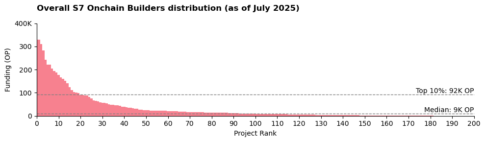
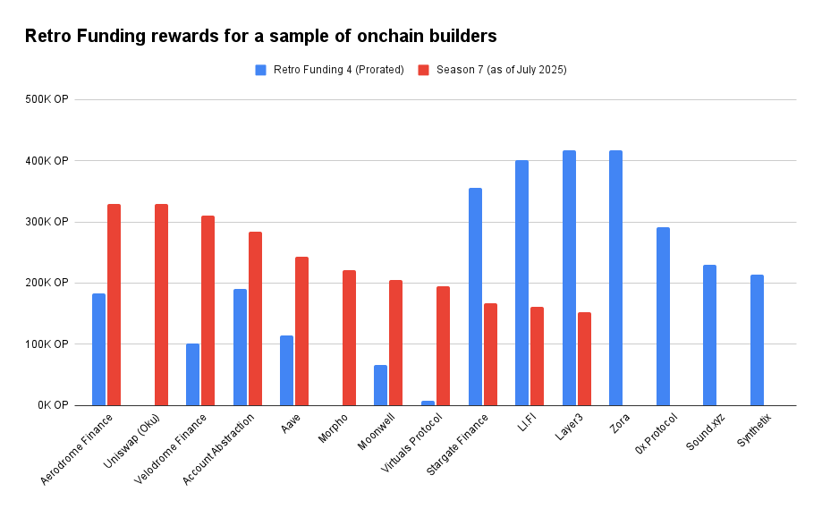
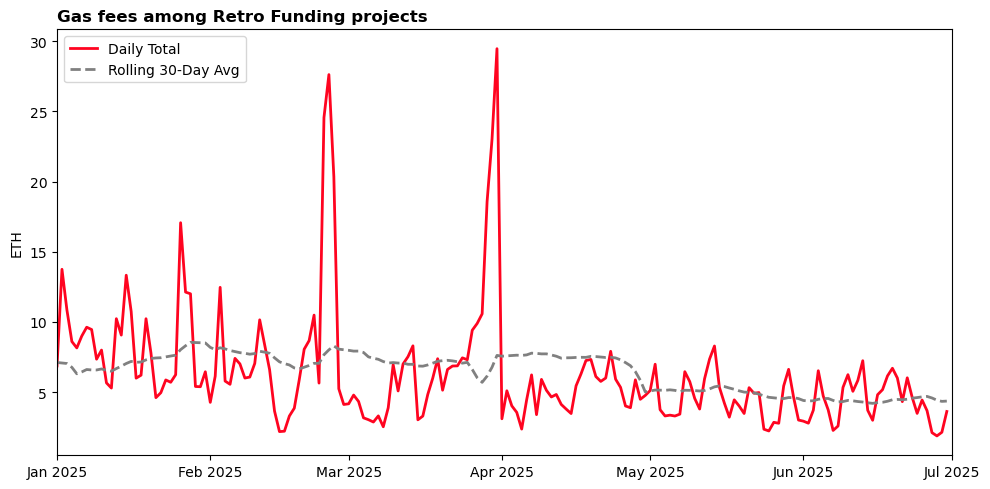
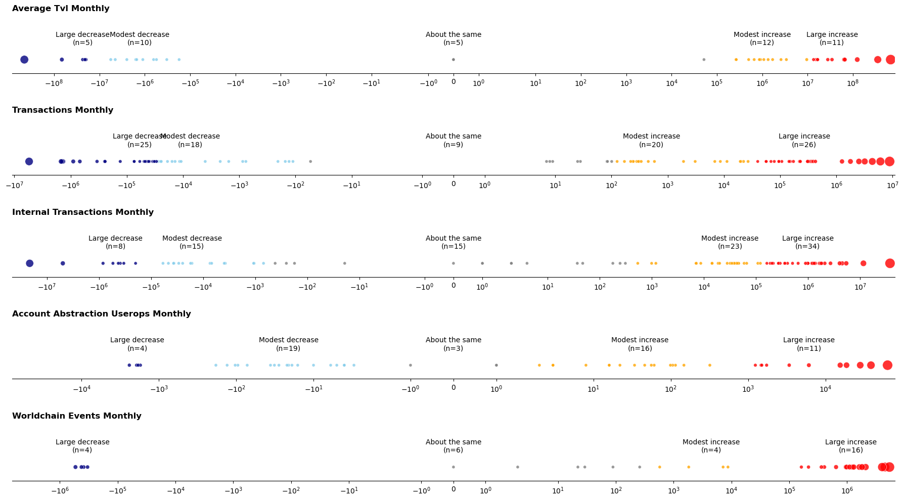
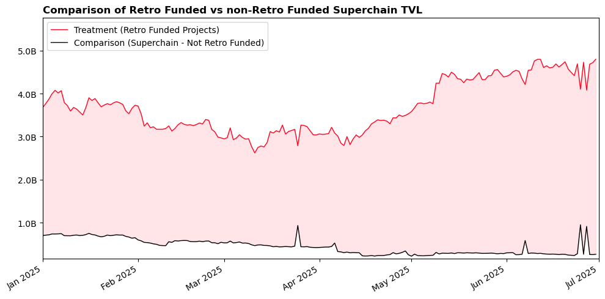
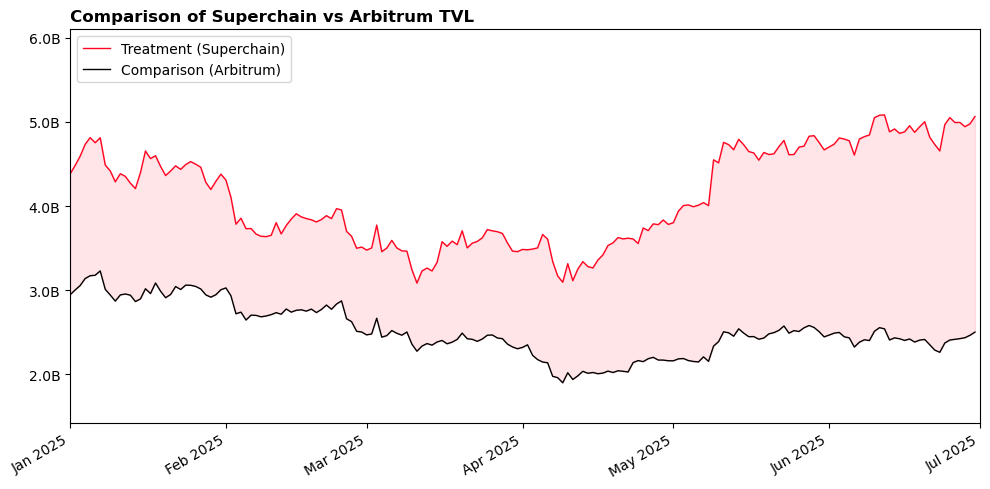
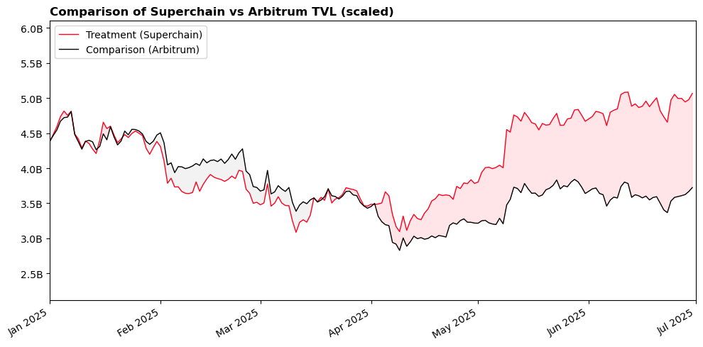
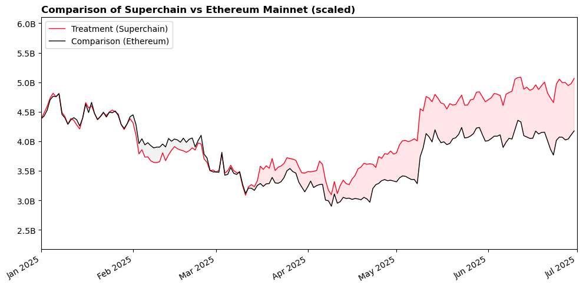

import Head from '@docusaurus/Head';

<Head>
  <link rel="canonical" href="https://gov.optimism.io/" />
</Head>

Season 7 budgeted 8 million OP to Onchain Builders across the Superchain.

This analysis looks in detail at three questions:

1. Which onchain builders got funded?
2. What measurable impact have they had on the Superchain?
3. Has the mission been an effective use of funds?

<!-- truncate -->

### Key takeaways

1. **200 of 325 applicants funded.** Top projects include Aerodrome, Uniswap, Velodrome, ERC-4337 Account Abstraction, and Aave.
2. **High turnover since Retro Funding 4\.** Only one-third of Season 7 grantees appeared in the previous Onchain Builders round; the entire top-five list is new.
3. **Multi-chain \> single-chain.** Projects active on more than one OP Stack chain received 54% of rewards. Among single-chain recipients, Base-only apps received 20% and World Chain apps 15% of the pool.
4. **Blue-chips led the way.** The average funded project had \>1 year of Superchain history. DeFi dominates (52% of rewards). World Mini Apps are the fastest-growing segment, already serving hundreds of thousands of DAUs.
5. **Large economic footprint.** Contracts from Retro Funded projects appear in \~42 % of all Superchain transactions.
6. **Transaction fees down.** Network-wide gas spent fell from 4,240 ETH (Jan) to 2,206 ETH (Jun). Funded projects generated 262 ETH → 131 ETH over the same span (direct calls only).
7. **Other metrics are up.** From January to June, TVL increased $800 M (+21%), top-level transactions increased 13M (+29%), World Chain events increased 26M (+200%), AA userops increased 134K (+49%).
8. **Outperforming the counterfactual.** Overall Superchain TVL rose $417M while Arbitrum’s fell $580M. Retro Funded projects accounted for \>85 % of Superchain TVL during this period and grew TVL while non-Retro Funded projects lost TVL.
9. **Improving ROI.** In H1 2025 the Collective earned 3,177 ETH in revenue and disbursed the equivalent of 2,713 ETH to onchain builders. During the comparable RF4 window, revenue was 3,258 ETH against 5,820 ETH in grants.

### Background

Per the original [mission scope](https://gov.optimism.io/t/retro-funding-onchain-builders-mission-details/9611), impact has been rewarded based on the following criteria:

1. Growth in Superchain adoption
2. High-quality onchain value (e.g., TVL)

Rewards are determined using public metrics and an open source algorithm maintained by OSO. The strategy for the algorithm was [voted on](https://snapshot.box/#/s:retrofunding.eth/proposal/0x23f8cc1791835acaf60c49208a6cb3502f789380b1ad0a60cef878be03a98d0d) by citizens at the start of the mission and shaped over the course of the mission by community feedback.

In order to be eligible for rewards, projects had to verify their contracts and apply to the round on OP Atlas. In total,15,645 direct deployments and 3.9M downstream deployments were verified. (A downstream deployment is a contract deployed by a factory contract.)

As of July 2025, five (out of six) monthly measurement periods have been completed. A total of 6.6M OP has been awarded to builders. The final reward allocation will be determined on 1 August 2025\.

### Measurement objectives

Over the long run, Optimism seeks to measure whether Retro Funding is shifting developer attention and incentives, and ultimately leading to faster innovation cycles, more winning apps going to market on the Superchain, and increasing revenue for the Collective.

This impact should be evidenced by the following success metrics:

1. Increased Superchain TVL
2. Increased demand for Superchain blockspace

Ideally, this analysis would make use of a longer time period (e.g., 3 to 6 months post-funding) and be supplemented with qualitative data about builder motivations. For the current review, we rely primarily on uplift differences between the start (Jan 2025\) and current status of the program (as of Jun 2025). We use monthly averages or sums unless otherwise noted.

### Caveats

- **Correlation ≠ causation.** We have not attempted a causal study. We outline longitudinal-measurement ideas at the end, but for now we work with the data we have \- not with an ideal experimental design.
- **Selection bias.** The algorithm and eligibility rules are public, so teams that knew they scored well were more likely to apply. The sample therefore skews toward higher-quality projects.
- **Lagged impact.** It will take at least 3-6 months to see which metrics are sustained or continuing growing. It will take longer to see the degree to which Retro Funding “pulls” more projects to deploy first or shift focus to the Superchain.
- **Coincentives.** Many builders also earned other grants or liquidity incentives during the period. Isolating Retro Funding’s slice of the pie is therefore impossible with current data.
- **Continuous improvement.** The reward algorithm evolved throughout the round. Weights, event definitions, and metrics are frequently updated in response to community feedback. All data pipelines and scoring code are open source, and further contributions are welcome\!

## Which projects got funded?

### Distribution

The following are some of the key distribution stats for the mission as of 1 Jul 2025:

- **Total awarded:** 6.6 M OP across 200 projects, out of 325 applicants
- **Max single reward (per project):** 330K OP
- **Median reward:** 9K OP

The final reward distribution will be after 31 Jul 2025\.

### Chain Breakdown

A total of 3.6M OP (54% of the total) went to 77 projects that had significant activity on more than one chain. (By “significant”, we mean no more than 95% of their transaction activity over the last 6 months came from a single chain.)

Of the remaining projects with a single-chain focus, we see the following distribution:

- Base: 60 projects, 1.3M OP (19.8%)
- Worldchain: 35 projects, 1.0M OP (15.1%)
- Soneium: 12 projects, 0.4M OP (6.7%)
- Others: 13 projects, 0.2M (3.6%)

### Maturity

The average project that received funding had activity on the Superchain for just over a year. The most funding went to well-established multi-chain projects such as ERC-4337 Account Abstraction, Uniswap and Velodrome. The second strongest category was younger, single chain projects such Kyo Finance (Soneium) and ORO (World Chain). There were only 13 multi-chain projects less than 1 year old.

|                  |      \< 1 year      |      \> 1 year      |
| :--------------- | :-----------------: | :-----------------: |
| **Single Chain** | 26.9% (74 projects) | 18.2% (46 projects) |
| **Multi-Chain**  | 5.2% (13 projects)  | 48.9% (64 projects) |

### DeFi vs Other Categories

We can also retroactively assign categories to projects based on the importance of different metrics to the overall rewards. DeFi projects – labeled as any project with at least $1M in TVL – performed strongest. World Mini Apps and projects with a large amount of Account Abstraction users also had outsized rewards.

| Category            | Applicants | Funded Projects | Median OP | Total OP | Share of Total |
| :------------------ | :--------: | :-------------: | :-------: | :------: | :------------: |
| Defi                |     48     |       48        |    23K    |  3400K   |     51.7%      |
| World Mini Apps     |     28     |       28        |    17K    |   983K   |     14.9%      |
| Account Abstraction |     12     |       11        |    13K    |   829K   |     12.6%      |
| Other               |    237     |       113       |    5K     |  1367K   |     20.8%      |

### Comparison to Retro Funding 4

There was high turnover in the project composition since Retro Funding 4\. Only about a third of the Season 7 awardees were also funded in Retro Funding 4 (Q2 2024).

Most projects that are under one year old did not receive any funding in Retro Funding 4\. Several top projects (e.g., Zora, 0x, [Sound.xyz](http://Sound.xyz), Synthetix) did not apply again. Some of this season’s projects, such as Uniswap and Morpho, did not participate in Retro Funding 4\.  

## What measurable impact have these projects had on the Superchain?

### Aggregate Uplift Metrics

Looking at pre/post impact, we see the following change in January (the month before the round start) and June (the most recent full-month of data) among the projects that applied for the Retro Funding mission.

_All figures are in millions_

| Metric                      | January 2025 | June 2025 |     Delta      |
| :-------------------------- | :----------: | :-------: | :------------: |
| Average TVL (USD)           |    $3763     |   $4564   | \+$800 (+21%)  |
| Transactions (Top Level)    |      45      |    58     |  \+13 (+29%)   |
| Internal Transactions       |     164      |    227    |  \+63 (+38%)   |
| World Chain Events          |      13      |    39     |  \+26 (+200%)  |
| Account Abstraction Userops |    0.275     |   0.409   | \+0.134 (+49%) |

Network-wide gas fees fell from 4,240 ETH (Jan) to 2,206 ETH (Jun). The contribution from Retro Funded projects (just looking at the top level of the transaction) also declined from 262 to 131 ETH. The chart below shows the overall decline in gas fees generated by Retro Funded over the last six months.

### Project Level Metrics

An issue with aggregate-level metrics is that results could be driven by a few outliers. For instance, one project could syphon TVL from 10-15 other projects, bringing its metrics up at the expense of others. In this section, we go one level deeper and look at project-level changes. This analysis focuses just on the top 100 projects in terms of cumulative funding.

For all indicators, we observe more projects with higher numbers in June than January. The difference is most pronounced for World events (20 increases and only 4 decreases) and least pronounced for top-level transactions (46 increases and 43 decreases).

### Peer Comparisons

The final question we explore is the degree to which Retro Funding projects and the Superchain as a whole outperformed other benchmarks over the same period.

We’ll start by doing a simple comparison of the performance of Retro Funding vs non-Retro Funded projects in terms of Superchain TVL on the Superchain.

Overall, Superchain TVL increased from $4.5B to $4.9B. The Retro Funded projects’ share of Superchain TVL increased from 84% in January to 93% in June. It is therefore likely that at least some of the growth achieved by Retro Funded projects came from TVL that was already on the Superchain.

Now we can do a similar analysis that compares the Superchain to Arbitrum. The Superchain gained $417M in TVL while Arbitrum lost $580M over the same period.

To make the relative difference between ecosystems easier to see, we scale Arbitrum to the same starting point as the Superchain in early January. From this chart, it is clear that the divergence only began in April.

We can also compare the Superchain to Ethereum Mainnet over the same period. TVL on Ethereum declined by $6 billion over this period (from $68 to $62B). If we scale the amount of TVL on Ethereum, then we see a spike in mid-March and further growth in May/June.

## Has the mission been an effective use of funds?

We assess effectiveness from three complementary angles:

1. **Unit economics** – how much measurable output each OP token appears to buy.
2. **Collective revenue** – whether the gas fees generated by funded apps come close to covering the grants they receive.
3. **Builder motivations** – qualitative evidence that Retro incentives are changing behavior in ways the data doesn’t capture.

### Unit Economics

Retro Funding is rewarding impact that has already happened, so we can’t claim the same impact was _caused_ by the program. However, we can treat the observed deltas per unit OP as benchmarks for future rounds.

_All figures are in millions_

| Metric                      | January 2025 | June 2025 |   Delta (Δ)    | OP Rewards | Δ per OP |
| :-------------------------- | :----------: | :-------: | :------------: | :--------: | :------: |
| Transactions (Top Level)    |      45      |    58     |  \+13 (+29%)   |    6.58    | **2.0**  |
| Internal Transactions       |     164      |    227    |  \+63 (+38%)   |    6.58    | **9.5**  |
| Average TVL (USD)           |    $3763     |   $4564   | \+$800 (+21%)  |    3.40    | **$235** |
| World Chain Events          |      13      |    39     |  \+26 (+200%)  |    0.98    | **26.5** |
| Account Abstraction Userops |    0.275     |   0.409   | \+0.134 (+49%) |    0.83    | **0.16** |

Once again, it’s important to remember that other incentive programs, especially ones targeting TVL, were running at the same time as Season 7\.

### Collective Revenue

On a six-month lookback, the program is just above breakeven in terms of revenue in and funding out.

| Window                     | Collective Revenue |    Retro Funding     | ETH Equiv. | Revenue / Grant |
| :------------------------- | :----------------: | :------------------: | :--------: | :-------------: |
| Retro Funding 4 (H2 2024\) |     3,258 ETH      |        10M OP        | 5,820 ETH  |     0.56 ×      |
| Retro Funding 7 (H1 2025\) |     3,177 ETH      | 6.6M OP (as of July) | 2,713 ETH  |     1.17 ×      |

As mentioned previously, Retro Funded projects were involved in two-fifths of network transactions over the preceding period.

### Project motivations

\[TODO: Jonas to add more detail\]

| Archetype                  | What Retro Funding changed                                                                                                                                                                                                                                                                                                                                                                                                                                                                                                                                                                                                                                                                                                                                                                                                          | Where the OP goes  |
| :------------------------- | :---------------------------------------------------------------------------------------------------------------------------------------------------------------------------------------------------------------------------------------------------------------------------------------------------------------------------------------------------------------------------------------------------------------------------------------------------------------------------------------------------------------------------------------------------------------------------------------------------------------------------------------------------------------------------------------------------------------------------------------------------------------------------------------------------------------------------------- | :----------------- |
| **Up-and-coming builders** | These early-stage teams—often 1–3 person squads working on emerging apps (e.g. World Mini Apps, Uniswap Hook projects)—are highly responsive to Retro Funding. OP rewards allow them to hire part-time or full-time help, cover infrastructure costs, and reinvest into their core product. \[Insert quote: “Paying my employee just to continue to work full-time.” – StokeFire\] \[Insert quote: “The funding will definitely support further development.” – Golden Otter\] Retro often plays a motivational role, validating their efforts and energizing the team. These builders are also more likely to engage with the Retro Funding metrics, adjusting product strategy to optimize visibility and impact. \[Insert quote: “The metrics-based model is more motivating — it creates a real feedback loop.” – ORO\]         | Hire devs          |
| **Growth-Stage builders**  | These teams have achieved initial traction and are now focused on scaling. In this segment, we observe **MiniApp developers as a key emerging group**. These projects often report that Retro Funding plays a decisive role in doubling down on their most promising efforts, hiring contributors, paying down infrastructure costs, or continuing product iteration cycles. *\[Insert quote: “It improves our balance sheet so we can keep going.” – ORO\]* _\[Insert quote: “We use 80–90% of funds to improve the product.” – PUF\]_ At this stage, builders are also more likely to **engage with Retro’s incentive model directly**, incorporating metrics into decision-making and roadmap prioritization. While the OP rewards are not always the largest share of their budget, they are often the most responsive to them. | Extend runway      |
| **Blue chips**             | For mature protocols with significant user bases, Retro Funding is generally **not a primary driver of behavior**. These teams tend to have diversified revenue streams and do not alter their roadmap based on OP rewards. Instead, they treat Retro Funding as a **complementary mechanism**, using OP to fund incentive programs, bootstrap liquidity, or support broader Superchain alignment efforts                                                                                                                                                                                                                                                                                                                                                                                                                           | Incentive programs |

## Recommendations

Going forward, we have several recommendations for longitudinal monitoring of Retro Funding impact and better isolating its impact. A longer time series will show whether early gains compound or mean-revert once the funding period ends.

- **Track these indicators over a longer horizon.** Refresh metrics such as TVL, transactions, AA user-ops, and World on a regular basis over the next 6-12 months.

- **Add retention metrics.** Pair existing uplift numbers with three- and six-month retention cohorts for TVL and network activity.

- **Collect structured qualitative feedback.** Run short, opt-in surveys after each round to capture what builders did with their OP and how important Retro Funding is as a motivating factor.

- **Sharpen targeting by builder segment.** Create standalone pools for high-priority verticals (e.g., World Mini Apps, certain DeFi segments, or AA users), creating a more level playing field and leaderboard for each type of Onchain Builder.

- **Build robust app-level peer groups.** Benchmark each project against a robust set of functional peers that are active on other ecosystems. Relative performance within app-level peer groups is a better gauge than ecosystem-wide averages that have different app-level compositions.

- **Introduce formal control groups.** For instance, among borderline-qualifying projects, one could fund only half at random while tracking both cohorts with the same metrics. The delta between treated and untreated groups could give the Collective its first clean causal estimate of Retro’s lift.

- **Experiment with randomized “bonus” incentives.** Layer surprise performance bonuses on top of baseline grants to test whether additional OP bumps result in incremental growth. This type of incentive could be a better fit for blue-chip projects that may be less motivated by the baseline grant amount.

—

You can find the notebook and queries to the underlying source data [here](https://github.com/opensource-observer/insights/blob/main/analysis/optimism/s7/S7_OnchainBuilders_PreliminaryImpactAnalysis.ipynb).
