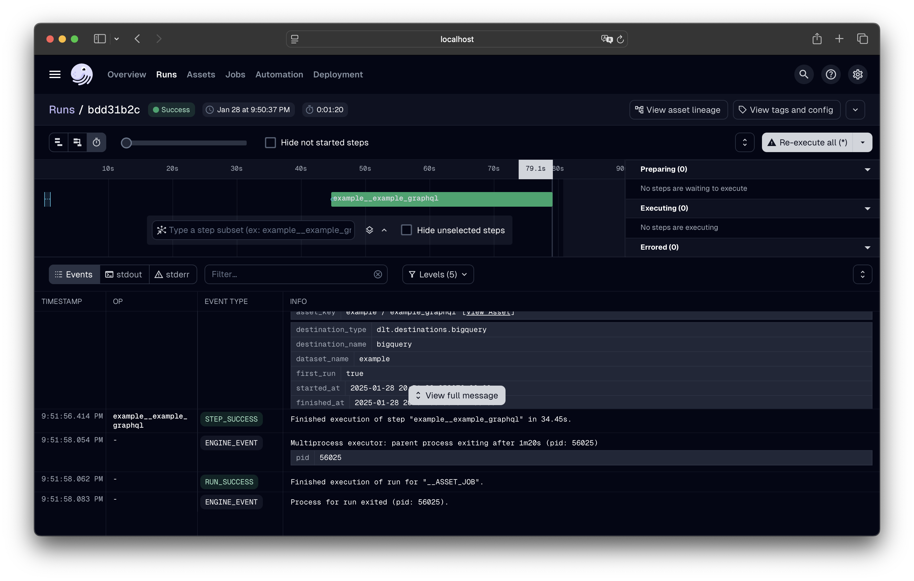

## GraphQL Resource Factory

Many of our data ingestion workflows rely on GraphQL, but constructing queries
and introspecting types can involve repetitive steps. This **GraphQL Resource
Factory** eliminates boilerplate by handling introspection, query building, and
parameter management for you.

This guide will explain how to use the factory to bootstrap a
[`graphql_factory`](https://github.com/opensource-observer/oso/blob/main/warehouse/oso_dagster/factories/graphql.py)
asset in Dagster. We'll walk through the process of defining a configuration,
building the factory, and customizing the asset to suit your needs.

---

## Step by Step: Defining Your GraphQL Resource

This example will demonstrate how to create a GraphQL asset that fetches
transactions from the Open
[Collective API](https://docs.opencollective.com/help/contributing/development/api).
The API has a `transactions` query that returns a list of transactions.

Currently, it has hundreds of nested fields, making it **cumbersome** to write
queries manually (which we have done in the past and it's not fun). The GraphQL
Resource Factory will generate the query for us, extract the relevant data, and
return a clean, usable asset, all with minimal effort.

### 1. Create the Configuration

The first step is to define a configuration object that describes your GraphQL
resource. For the Open Collective transactions example, we set the endpoint URL,
define query parameters, and specify a transformation function to extract the
data we need.

We also set a `max_depth` parameter to limit the depth of the introspection
query. This means the generated query will only explore fields up to a certain
depth, preventing it from becoming too large, but capturing all the necessary
data for our asset.

```python
from ..factories.graphql import GraphQLResourceConfig

config = GraphQLResourceConfig(
    name="transactions",
    endpoint="https://api.opencollective.com/graphql/v2",
    max_depth=3, # Limit the introspection depth
    parameters={
        "limit": {
            "type": "Int!",
            "value": 10,
        },
        "type": {
            "type": "TransactionType!",
            "value": "CREDIT",
        },
        "dateFrom": {
            "type": "DateTime!",
            "value": "2024-01-01T00:00:00Z",
        },
        "dateTo": {
            "type": "DateTime!",
            "value": "2024-12-31T23:59:59Z",
        },
    },
    transform_fn=lambda result: result["transactions"]["nodes"], # Optional transformation function
    target_query="transactions", # The query to execute
    target_type="TransactionCollection", # The type containing the data
)
```

:::tip
For the full `GraphQLResourceConfig` spec, see the [`source`](https://github.com/opensource-observer/oso/blob/05fe8b9192a08f6446225a89f4455c6b3723c5de/warehouse/oso_dagster/factories/graphql.py#L99)
:::

In this configuration, we define the following fields:

- **name**: A unique identifier for the dagster asset.
- **endpoint**: The URL of the GraphQL API.
- **max_depth**: The maximum depth of the introspection query. This will
  generate a query that explores all fields recursively up to this depth.
- **parameters**: A dictionary of query parameters. The keys are the parameter
  names, and the values are dictionaries with the parameter type and value.
- **transform_fn**: A function that processes the raw GraphQL response and
  returns the desired data.
- **target_query**: The name of the query to execute.
- **target_type**: The name of the GraphQL type that contains the data of
  interest.

The factory will create the following query automatically, recursively
introspecting all the fields up to the specified depth:

```graphql
query (
  $limit: Int!
  $type: TransactionType!
  $dateFrom: DateTime!
  $dateTo: DateTime!
) {
  transactions(
    limit: $limit
    type: $type
    dateFrom: $dateFrom
    dateTo: $dateTo
  ) {
    offset
    limit
    totalCount
    nodes {
      id
      legacyId
      uuid
      group
      type
      kind
      amount {
        value
        currency
        valueInCents
      }
      oppositeTransaction {
        id
        legacyId
        uuid
        # ... other generated fields ...
        merchantId
        invoiceTemplate
      }
      merchantId
      balanceInHostCurrency {
        value
        currency
        valueInCents
      }
      invoiceTemplate
    }
    kinds
  }
}
```

### 2. Build the Factory

:::tip
The GraphQL factory function takes a mandatory `config`
argument. The other arguments are directly passed to the underlying
`dlt_factory` function, allowing you to customize the behavior of the asset.

For the full reference of the allowed arguments, check out the Dagster
[`asset`](https://docs.dagster.io/api/python-api/assets) documentation.
:::

The `graphql_factory` function is the used to convert your configuration into a
callable Dagster asset. It takes the configuration object and returns a factory
function that our infrastructure will use to automatically create the asset.

```python
from ..factories.graphql import graphql_factory

# ... config definition ...

open_collective_transactions = graphql_factory(
    config,
    key_prefix="open_collective",
)
```

---

## How to Run and View Results

:::tip
If you have not setup your local Dagster environment yet, please follow
our [quickstart guide](../../guides/dagster/index.md).
:::

After having your Dagster instance running, follow the
[Dagster Asset Guide](../../guides/dagster/index.md) to materialize the assets.
Our example assets are located under `assets/open_collective/transactions`.



Running the pipeline will fetch the `10` transactions from the Open Collective
API and store them in BigQuery:


---

## Conclusion

The GraphQL Resource Factory is a powerful tool for creating reusable assets
that fetch data from GraphQL APIs. By defining a configuration object and
building a factory function, you can quickly create assets that crawl complex
APIs effortlessly.

This allows you to focus on the data you need and the transformations you want
to apply, rather than the mechanics of constructing queries and managing API
interactions.
