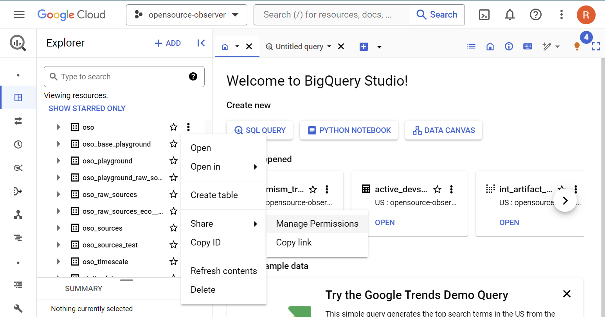
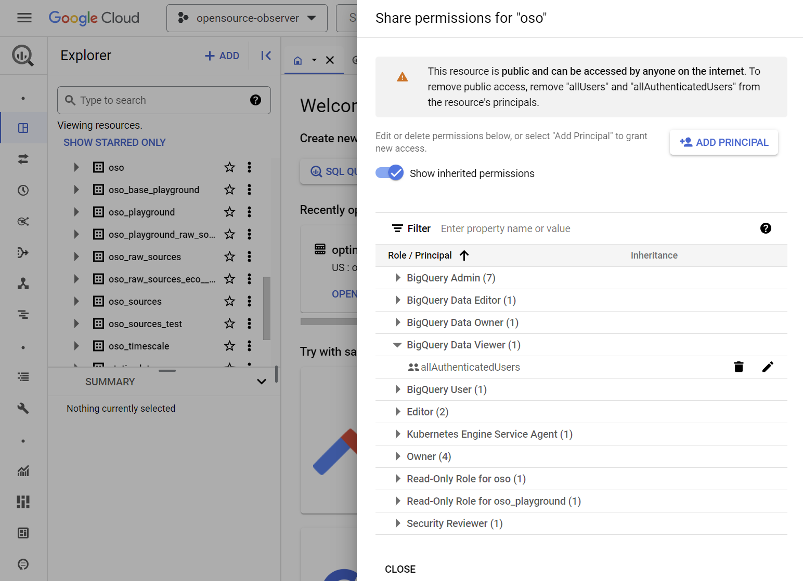

BigQuery's built-in data-sharing capabilities make it
trivially easy to integrate any public dataset into
the OSO data pipeline, provided the dataset exists in
the US multi-region.

If you want OSO to host a copy of
the dataset in the US multi-region,
see our guide on
[BigQuery Data Transfer Service](./bq-data-transfer.md).

## Make the data available in the US region

In order for our data pipeline to operate on the data,
it must be in the
[US multi-region](https://cloud.google.com/bigquery/docs/locations#multi-regions).

If you have reason to keep the dataset in a different region,
you can use the
[BigQuery Data Transfer Service](https://cloud.google.com/bigquery/docs/dts-introduction)
to easily copy the dataset to the US region.
To manually define this as a transfer job in your own Google project,
you can do this directly from the
[BigQuery Studio](https://console.cloud.google.com/bigquery/transfers?project=opensource-observer).

OSO will also copy certain valuable datasets into the
`opensource-observer` project via the BigQuery Data Transfer Service
See the guide on [BigQuery Data Transfer Service](./bq-data-transfer.md)
add dataset replication as a Dagster asset to OSO.

## Make the data accessible to our Google service account

The easiest way to do this is to make the BigQuery dataset publicly accessible.

Add the `allAuthenticatedUsers` as the "BigQuery Data Viewer"

If you have reasons to keep your dataset private,
you can reach out to us directly on our
[Discord](https://www.opensource.observer/discord).
