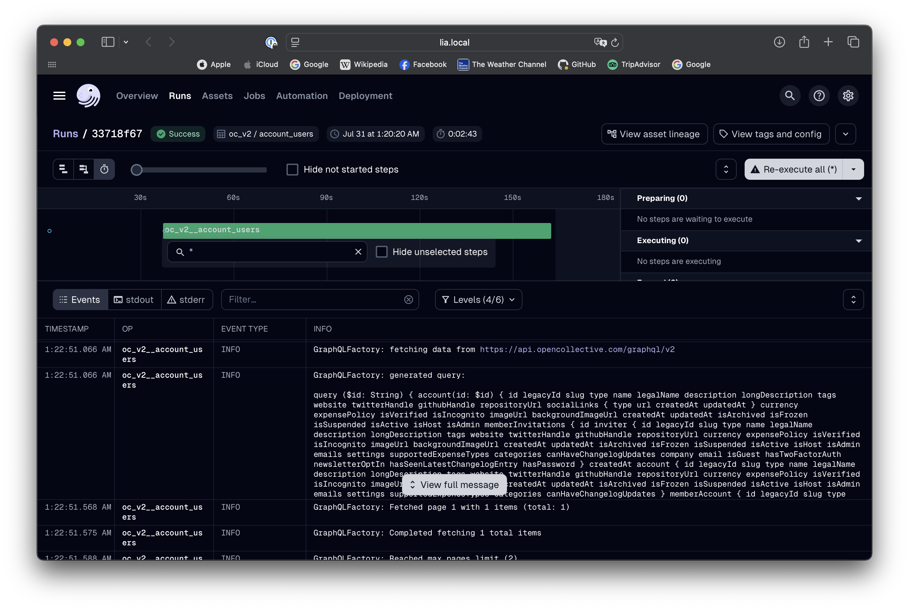
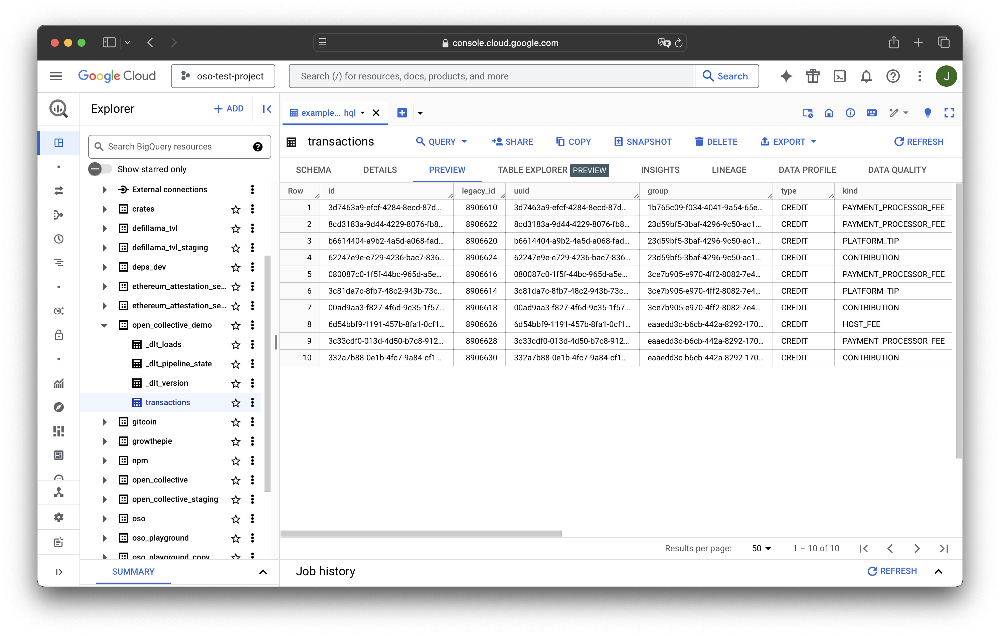
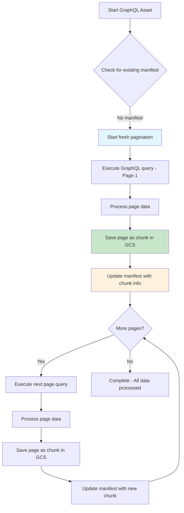
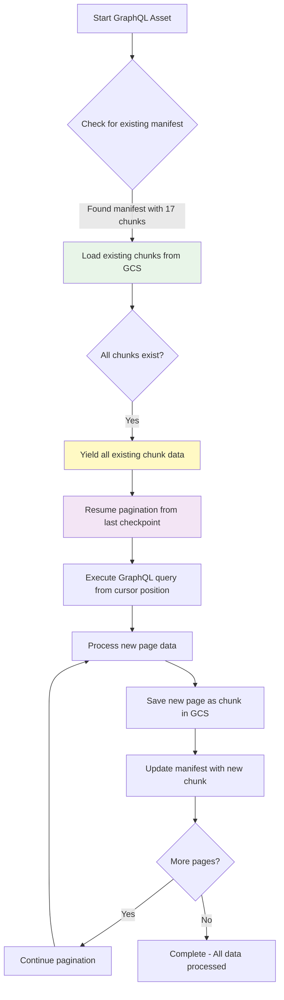
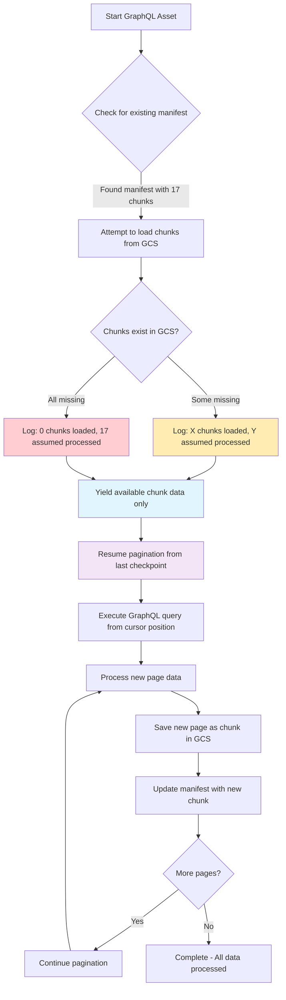

This guide will explain how to use the
[`graphql_factory`](https://github.com/opensource-observer/oso/blob/main/warehouse/oso_dagster/factories/graphql.py)
factory function to automatically introspect, build queries, and scrape GraphQL
APIs, including support for pagination and dependencies.

## Defining Your GraphQL Resource

In this example, we will create a GraphQL asset that fetches transactions from
the
[Open Collective API](https://docs.opencollective.com/help/contributing/development/api).
The API has a `transactions` query that returns a list of transactions.

The GraphQL factory will introspect the schema, generate queries, extract the
relevant data, and return clean assets with minimal configuration.

### 1. Create the Configuration

The first step is to define a configuration object that describes your GraphQL
resource. For the Open Collective transactions example, we set the endpoint URL,
define query parameters, and specify a transformation function to extract the
data we need.

```python
from dagster import AssetExecutionContext
from ..factories.graphql import (
    GraphQLResourceConfig,
    PaginationConfig,
    PaginationType,
    RetryConfig,
    graphql_factory,
)
from ..factories.dlt import dlt_factory
from ..config import DagsterConfig

# Configuration for the main transactions query
config = GraphQLResourceConfig(
    name="transactions",
    endpoint="https://api.opencollective.com/graphql/v2",
    masked_endpoint="***",
    target_type="Query",
    target_query="transactions",
    max_depth=2,  # Limit the introspection depth
    parameters={
        "type": {
            "type": "TransactionType!",
            "value": "CREDIT",
        },
        "dateFrom": {
            "type": "DateTime!",
            "value": "2024-01-01T00:00:00Z",
        },
        "dateTo": {
            "type": "DateTime!",
            "value": "2024-12-31T23:59:59Z",
        },
    },
    pagination=PaginationConfig(
        type=PaginationType.OFFSET,
        page_size=100,
        max_pages=5,
        rate_limit_seconds=0.5,
        offset_field="offset",
        limit_field="limit",
        total_count_path="totalCount",
    ),
    exclude=["loggedInAccount", "me"],  # Exclude unnecessary fields
    transform_fn=lambda result: result["transactions"]["nodes"],
    retry=RetryConfig(
        max_retries=3,
        initial_delay=2.0,
        max_delay=30.0,
        backoff_multiplier=2.0,
        jitter=True,
        reduce_page_size=True,
        min_page_size=10,
        page_size_reduction_factor=0.5,
        continue_on_failure=False,  # Whether to log failures and continue instead of raising
    ),
    enable_chunked_resume=True,  # Enable chunked resumability for long-running processes
    chunk_gcs_prefix="dlt_chunked_state",  # GCS prefix for storing chunked data
    checkpoint_field="id",  # Field name to use for tracking pagination progress
)
```

:::tip
For the full `GraphQLResourceConfig` spec, see the
[`source`](https://github.com/opensource-observer/oso/blob/main/warehouse/oso_dagster/factories/graphql.py#L231)
:::

In this configuration, we define the following fields:

- **name**: A unique identifier for the dagster asset.
- **endpoint**: The URL of the GraphQL API.
- **masked_endpoint**: The masked URL of the GraphQL API. If exists, it will be
  used for logging instead of the real endpoint.
- **target_type**: The GraphQL type containing the target query (usually
  "Query").
- **target_query**: The name of the query to execute.
- **max_depth**: The maximum depth of the introspection query. This will
  generate a query that explores all fields recursively up to this depth.
- **parameters**: A dictionary of query parameters. The keys are the parameter
  names, and the values are dictionaries with the parameter type and value.
- **pagination**: A configuration object that defines how to handle pagination.
  It includes the pagination type, page size, maximum number of pages to fetch,
  rate limit in seconds, and the fields used for offset and limit.
- **exclude**: A list of field names to exclude from the GraphQL schema
  expansion.
- **transform_fn**: A function that processes the raw GraphQL response and
  returns the desired data.
- **retry**: Configuration for retry mechanism with exponential backoff and page
  size reduction.
- **enable_chunked_resume**: Whether to enable chunked resumability for
  long-running processes. When enabled, each successful page is stored as a
  chunk in GCS, allowing the process to resume from where it left off after
  pre-emption without data loss.
- **chunk_gcs_prefix**: GCS prefix for storing chunked data and pagination
  state.
- **checkpoint_field**: Field name to use for tracking pagination progress. This
  field's value from the last processed item will be used to resume pagination.

### 2. Build the Asset with Dependencies

The GraphQL factory now returns a `dlt.resource` directly and supports
dependency chaining. You can create assets that depend on the results of other
GraphQL queries:

```python
def fetch_account_details(context: AssetExecutionContext, global_config: DagsterConfig, transaction_data):
    """
    Dependency function that fetches account details for each transaction.
    This function receives individual transaction items and yields account data.
    """
    account_config = GraphQLResourceConfig(
        name=f"account_{transaction_data['fromAccount']['id']}",
        endpoint="https://api.opencollective.com/graphql/v2",
        masked_endpoint="***",
        target_type="Query",
        target_query="account",
        parameters={
            "id": {
                "type": "String",
                "value": transaction_data["fromAccount"]["id"],
            },
        },
        transform_fn=lambda result: result["account"],
        max_depth=2,
        exclude=["parentAccount", "stats"],
    )

    # The dependency yields data from the nested GraphQL query
    yield from graphql_factory(account_config, global_config, context, max_table_nesting=0)

@dlt_factory(
    key_prefix="open_collective",
)
def transactions_with_accounts(context: AssetExecutionContext, global_config: DagsterConfig):
    """
    Main asset that fetches transactions and their associated account details.
    """
    config = GraphQLResourceConfig(
        name="transactions_with_accounts",
        endpoint="https://api.opencollective.com/graphql/v2",
        masked_endpoint="***",
        target_type="Query",
        target_query="transactions",
        parameters={
            "type": {"type": "TransactionType!", "value": "CREDIT"},
            "dateFrom": {"type": "DateTime!", "value": "2024-01-01T00:00:00Z"},
            "dateTo": {"type": "DateTime!", "value": "2024-12-31T23:59:59Z"},
        },
        pagination=PaginationConfig(
            type=PaginationType.OFFSET,
            page_size=50,
            max_pages=2,
            rate_limit_seconds=1.0,
        ),
        transform_fn=lambda result: result["transactions"]["nodes"],
        max_depth=2,
        exclude=["loggedInAccount", "me"],
        deps=[fetch_account_details],  # Dependencies to execute for each item
        deps_rate_limit_seconds=1.0,  # Rate limit between dependency calls
        retry=RetryConfig(
            max_retries=2,
            initial_delay=1.0,
            reduce_page_size=True,
            min_page_size=5,
        ),
    )

    # Return the configured resource
    yield graphql_factory(config, global_config, context, max_table_nesting=0)
```

:::tip
The GraphQL factory function now takes a mandatory `config` argument,
`global_config` (DagsterConfig), and `AssetExecutionContext`. The
`global_config` is required for Redis caching functionality that stores GraphQL
introspection results for 24 hours, preventing overwhelming of external
services. Additional arguments are passed to the underlying `dlt.resource`
function, allowing you to customize the behavior of the asset.

For the full reference of the allowed arguments, check out the DLT
[`resource`](https://dlthub.com/docs/general-usage/resource) documentation.
:::

### 3. Dependency System

The new dependency system allows you to:

- **Chain GraphQL queries**: Use results from one query to feed parameters into
  another
- **Transform data flow**: The main query results become intermediate data that
  feeds dependencies
- **Return consistent shape**: Only the dependency results are yielded to the
  final dataset
- **Rate limit dependencies**: Control the rate of dependent API calls

#### Tree-like Dependency Structure

Dependencies can be viewed as a **tree structure** where:

- The **root** is your main GraphQL query
- **Branches** are dependency functions that process each item from the parent
- **Leaves** are the final data shapes that get yielded to your dataset

```
Main Query (transactions)
├── Item 1 → fetch_account_details() → Account Data (leaf)
├── Item 2 → fetch_account_details() → Account Data (leaf)
└── Item 3 → fetch_account_details() → Account Data (leaf)
```

#### Data Shape Merging

When `deps` is provided, **DLT automatically handles different data shapes**:

1. The main query executes and fetches data
2. Each item from the main query is passed to dependency functions
3. Dependency functions can execute additional GraphQL queries with different
   schemas
4. **DLT merges different data shapes** from dependencies automatically
5. **Only leaf nodes** (final dependency results) are included in the final
   output
6. The main query data serves as intermediate processing data and is discarded

This means you can have dependencies that return completely different data
structures (e.g., transactions → accounts → users), and DLT will intelligently
combine them into a coherent dataset, only preserving the final leaf data from
your dependency tree.

---

## How to Run and View Results

:::tip
If you have not setup your local Dagster environment yet, please follow
our [quickstart guide](./setup/index.md).
:::

After having your Dagster instance running, follow the
[Dagster setup guide](./setup/index.md) to materialize the assets. Our example
assets are located under `assets/open_collective/transactions`.



Running the pipeline will fetch the transactions from the Open Collective API
following the configuration we defined. The factory will handle pagination
automatically, fetching the data in chunks and combining them into a single
result.



---

## Advanced Features

### Field Exclusion

Use the `exclude` parameter to skip unnecessary fields and reduce query
complexity:

```python
config = GraphQLResourceConfig(
    # ... other config
    exclude=["loggedInAccount", "me", "stats.totalDonations"],
)
```

### URL Masking for Security

The GraphQL factory supports URL masking to prevent exposing sensitive endpoints
in logs:

```python
config = GraphQLResourceConfig(
    name="secure_api",
    endpoint="https://api.private-company.com/graphql?secret=abc123",
    masked_endpoint="https://api.private-company.com/graphql?secret=***",
    # ... other configuration
)
```

When `masked_endpoint` is provided, it will be used in all log messages instead
of the real endpoint, helping to prevent accidental exposure of sensitive URLs
containing API keys or tokens.

### Custom Stop Conditions

Define custom conditions to stop pagination:

```python
def stop_when_old_data(result, page_count):
    # Stop if we encounter transactions older than 1 year
    if result.get("transactions", {}).get("nodes"):
        last_transaction = result["transactions"]["nodes"][-1]
        transaction_date = last_transaction.get("createdAt")
        # Add your date comparison logic here
        return False  # Continue pagination
    return True  # Stop pagination

pagination_config = PaginationConfig(
    type=PaginationType.OFFSET,
    stop_condition=stop_when_old_data,
    # ... other pagination settings
)
```

### Cursor-Based Pagination

For APIs that use cursor-based pagination:

```python
pagination_config = PaginationConfig(
    type=PaginationType.CURSOR,
    page_size=50,
    cursor_field="after",
    page_size_field="first",
    next_cursor_path="pageInfo.endCursor",
    has_next_path="pageInfo.hasNextPage",
)
```

### Keyset-Based Pagination

For APIs that use keyset-based pagination (also known as seek-based pagination):

```python
pagination_config = PaginationConfig(
    type=PaginationType.KEYSET,
    page_size=100,
    order_by_field="id",
    order_direction="asc",
    last_value_field="id_gt",
    cursor_key="id",
    page_size_field="first",
)
```

### Chunked Resume Functionality

For long-running GraphQL crawlers that may be pre-empted, the GraphQL factory
supports chunked resumability:

```python
config = GraphQLResourceConfig(
    # ... other configuration
    enable_chunked_resume=True,
    chunk_gcs_prefix="my_graphql_chunks",
    checkpoint_field="id",  # Field to track progress
)
```

**How it works:**

1. **Chunk Storage**: Each successful page is immediately stored as a JSON chunk
   in GCS
2. **State Tracking**: A manifest file tracks pagination state and completed
   chunks
3. **Automatic Resume**: If the process is interrupted, it resumes from the last
   checkpoint
4. **Data Recovery**: Previously processed chunks are loaded and yielded before
   continuing

**Benefits:**

- **No Data Loss**: Completed pages are preserved even if the process is killed
- **Efficient Resume**: Only new data is fetched when resuming
- **Progress Tracking**: Clear visibility into how much work has been completed
- **Cleanup Friendly**: Assumes missing chunks were cleaned up by external
  processes

**Configuration:**

- `enable_chunked_resume`: Enable/disable the chunked resume feature
- `chunk_gcs_prefix`: GCS path prefix for storing chunks and state
- `checkpoint_field`: Field name used to track pagination progress (e.g., "id",
  "createdAt")

#### Flow Diagrams: Three Resume Scenarios

The chunked resume system handles three distinct scenarios:

<details>
<summary><strong>1. First Run Flow (Fresh Start)</strong></summary>



</details>

<details>
<summary><strong>2. Pre-empted Flow (Resume with Chunks)</strong></summary>



</details>

<details>
<summary><strong>3. Post-Cleanup Flow (Resume without Chunks)</strong></summary>



</details>

**Summary of the Three Cases:**

- **Case 1: First Run**: No existing manifest or chunks. Start fresh pagination
  from beginning, creating initial state and beginning chunking process.

- **Case 2: Pre-empted Resume**: Manifest exists with chunk references, chunks
  still in GCS. Load all existing chunks, yield data, resume pagination from
  checkpoint with zero data loss.

- **Case 3: Post-Cleanup Resume**: Manifest exists but chunks were cleaned up
  by external processes. Assume missing chunks were successfully processed,
  resume pagination only, preventing reprocessing of data.

### Error Handling and Retry Mechanism

The GraphQL factory includes a sophisticated retry mechanism with configurable
debounce that helps handle transient failures and rate limiting:

```python
from ..factories.graphql import RetryConfig

retry_config = RetryConfig(
    max_retries=3,                    # Maximum number of retry attempts
    initial_delay=2.0,                # Initial delay in seconds before first retry
    max_delay=30.0,                   # Maximum delay between retries
    backoff_multiplier=2.0,           # Multiplier for exponential backoff
    jitter=True,                      # Add random jitter to delays
    reduce_page_size=True,            # Enable adaptive page size reduction
    min_page_size=10,                 # Minimum page size when reducing
    page_size_reduction_factor=0.5,   # Factor to reduce page size by (50%)
    continue_on_failure=True,         # Log failures and continue instead of raising
)

config = GraphQLResourceConfig(
    # ... other configuration
    retry=retry_config,
)
```

#### Adaptive Page Size Reduction

When `reduce_page_size=True`, the retry mechanism implements intelligent
debounce behavior:

1. **Initial Query**: Starts with configured page size (e.g., 50 items)
2. **First Failure**: Waits 2 seconds, reduces to 25 items, retries
3. **Second Failure**: Waits 4 seconds, reduces to 12 items, retries
4. **Third Failure**: Waits 8 seconds, uses minimum 10 items, final retry

**Key Benefits:**

- **Temporary Reduction**: Page size reductions only apply to the current page's
  retry attempts
- **Automatic Reset**: After success, the next page returns to the original page
  size
- **Progressive Backoff**: More time waiting + fewer items = less aggressive on
  failures
- **Rate Limit Friendly**: Helps avoid overwhelming APIs during issues

#### Example Behavior

```
Page 1: Start with 50 items
  [FAIL] Fails → retry with 25 items
  [FAIL] Fails → retry with 12 items
  [SUCCESS] Succeeds with 12 items

Page 2: RESETS to 50 items (not stuck at 12!)
  [SUCCESS] Succeeds immediately with 50 items

Page 3: Start with 50 items again
  [SUCCESS] Succeeds immediately with 50 items
```

#### Retry Configuration Options

- **max_retries**: Number of attempts before giving up
- **initial_delay**: Base delay before first retry (seconds)
- **max_delay**: Cap on delay duration to prevent excessive waits
- **backoff_multiplier**: How aggressively delays increase (2.0 = double each
  time)
- **jitter**: Adds randomness to prevent thundering herd effects
- **reduce_page_size**: Enable smart page size reduction on failures
- **min_page_size**: Prevent page sizes from getting too small
- **page_size_reduction_factor**: How much to reduce page size (0.5 = 50%
  reduction)
- **continue_on_failure**: Log failures and continue execution instead of
  raising exceptions when all retries are exhausted. When enabled, failed pages
  are logged as asset observations with detailed failure metadata and the
  process continues with the next page. Useful for APIs with broken entries or
  when certain queries consistently timeout due to heavy backend operations,
  allowing the run to complete by skipping problematic sections

---

## Conclusion

The GraphQL factory provides a powerful way to create reusable assets that fetch
data from GraphQL APIs with minimal configuration. The current version offers
comprehensive capabilities:

- **Direct DLT integration**: Returns `dlt.resource` objects directly
- **Dependency chaining**: Chain multiple GraphQL queries together
- **Field exclusion**: Skip unnecessary fields to optimize queries
- **Smart retry mechanism**: Configurable retry with adaptive page size
  reduction and continue-on-failure options
- **Chunked resumability**: Long-running processes can resume from interruption
  without data loss using GCS-backed checkpointing
- **Enhanced error handling**: Better logging, error sanitization, and detailed
  failure tracking with asset observations
- **URL masking**: Secure logging that prevents exposure of sensitive endpoints
- **Flexible pagination**: Support for offset, cursor, relay, and keyset-style
  pagination with sophisticated state management

This allows you to focus on the data you need and the transformations you want
to apply, rather than the mechanics of constructing queries and managing API
interactions.
