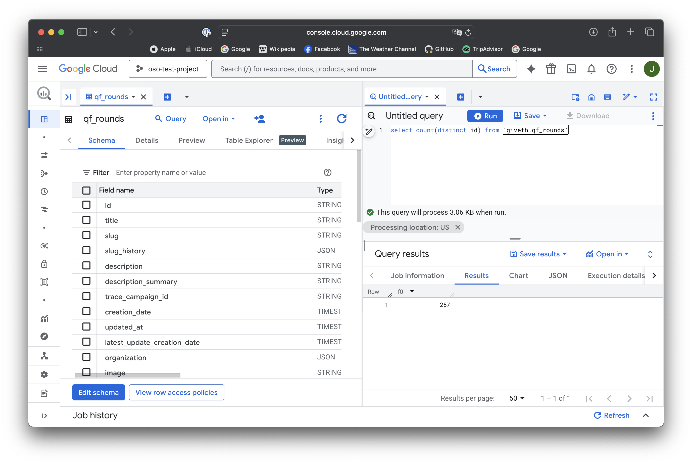

This guide will explain how to use the
[`graphql_factory`](https://github.com/opensource-observer/oso/blob/main/warehouse/oso_dagster/factories/graphql.py)
factory function to automatically introspect, build queries, and scrape GraphQL
APIs, including support for pagination and dependencies.

## Defining Your GraphQL Resource

In this example, we will create a GraphQL asset that fetches transactions from
the
[Open Collective API](https://docs.opencollective.com/help/contributing/development/api).
The API has a `transactions` query that returns a list of transactions.

The GraphQL factory will introspect the schema, generate queries, extract the
relevant data, and return clean assets with minimal configuration.

### 1. Create the Configuration

The first step is to define a configuration object that describes your GraphQL
resource. For the Open Collective transactions example, we set the endpoint URL,
define query parameters, and specify a transformation function to extract the
data we need.

```python
from dagster import AssetExecutionContext
from ..factories.graphql import (
    GraphQLResourceConfig,
    PaginationConfig,
    PaginationType,
    graphql_factory,
)
from ..factories.dlt import dlt_factory
from ..config import DagsterConfig

# Configuration for the main transactions query
config = GraphQLResourceConfig(
    name="transactions",
    endpoint="https://api.opencollective.com/graphql/v2",
    target_type="Query",
    target_query="transactions",
    max_depth=2,  # Limit the introspection depth
    parameters={
        "type": {
            "type": "TransactionType!",
            "value": "CREDIT",
        },
        "dateFrom": {
            "type": "DateTime!",
            "value": "2024-01-01T00:00:00Z",
        },
        "dateTo": {
            "type": "DateTime!",
            "value": "2024-12-31T23:59:59Z",
        },
    },
    pagination=PaginationConfig(
        type=PaginationType.OFFSET,
        page_size=100,
        max_pages=5,
        rate_limit_seconds=0.5,
        offset_field="offset",
        limit_field="limit",
        total_count_path="totalCount",
    ),
    exclude=["loggedInAccount", "me"],  # Exclude unnecessary fields
    transform_fn=lambda result: result["transactions"]["nodes"],
)
```

:::tip
For the full `GraphQLResourceConfig` spec, see the [`source`](https://github.com/opensource-observer/oso/blob/main/warehouse/oso_dagster/factories/graphql.py#L151)
:::

In this configuration, we define the following fields:

- **name**: A unique identifier for the dagster asset.
- **endpoint**: The URL of the GraphQL API.
- **target_type**: The GraphQL type containing the target query (usually
  "Query").
- **target_query**: The name of the query to execute.
- **max_depth**: The maximum depth of the introspection query. This will
  generate a query that explores all fields recursively up to this depth.
- **parameters**: A dictionary of query parameters. The keys are the parameter
  names, and the values are dictionaries with the parameter type and value.
- **pagination**: A configuration object that defines how to handle pagination.
  It includes the pagination type, page size, maximum number of pages to fetch,
  rate limit in seconds, and the fields used for offset and limit.
- **exclude**: A list of field names to exclude from the GraphQL schema
  expansion.
- **transform_fn**: A function that processes the raw GraphQL response and
  returns the desired data.

### 2. Build the Asset with Dependencies

The GraphQL factory now returns a `dlt.resource` directly and supports
dependency chaining. You can create assets that depend on the results of other
GraphQL queries:

```python
def fetch_account_details(context: AssetExecutionContext, global_config: DagsterConfig, transaction_data):
    """
    Dependency function that fetches account details for each transaction.
    This function receives individual transaction items and yields account data.
    """
    account_config = GraphQLResourceConfig(
        name=f"account_{transaction_data['fromAccount']['id']}",
        endpoint="https://api.opencollective.com/graphql/v2",
        target_type="Query",
        target_query="account",
        parameters={
            "id": {
                "type": "String",
                "value": transaction_data["fromAccount"]["id"],
            },
        },
        transform_fn=lambda result: result["account"],
        max_depth=2,
        exclude=["parentAccount", "stats"],
    )

    # The dependency yields data from the nested GraphQL query
    yield from graphql_factory(account_config, global_config, context, max_table_nesting=0)

@dlt_factory(
    key_prefix="open_collective",
)
def transactions_with_accounts(context: AssetExecutionContext, global_config: DagsterConfig):
    """
    Main asset that fetches transactions and their associated account details.
    """
    config = GraphQLResourceConfig(
        name="transactions_with_accounts",
        endpoint="https://api.opencollective.com/graphql/v2",
        target_type="Query",
        target_query="transactions",
        parameters={
            "type": {"type": "TransactionType!", "value": "CREDIT"},
            "dateFrom": {"type": "DateTime!", "value": "2024-01-01T00:00:00Z"},
            "dateTo": {"type": "DateTime!", "value": "2024-12-31T23:59:59Z"},
        },
        pagination=PaginationConfig(
            type=PaginationType.OFFSET,
            page_size=50,
            max_pages=2,
            rate_limit_seconds=1.0,
        ),
        transform_fn=lambda result: result["transactions"]["nodes"],
        max_depth=2,
        exclude=["loggedInAccount", "me"],
        deps=[fetch_account_details],  # Dependencies to execute for each item
        deps_rate_limit_seconds=1.0,  # Rate limit between dependency calls
    )

    # Return the configured resource
    yield graphql_factory(config, global_config, context, max_table_nesting=0)
```

:::tip
The GraphQL factory function now takes a mandatory `config` argument,
`global_config` (DagsterConfig), and `AssetExecutionContext`. The `global_config`
is required for Redis caching functionality that stores GraphQL introspection
results for 24 hours, preventing overwhelming of external services. Additional
arguments are passed to the underlying `dlt.resource` function, allowing you to
customize the behavior of the asset.

For the full reference of the allowed arguments, check out the DLT
[`resource`](https://dlthub.com/docs/general-usage/resource) documentation.
:::

### 3. Dependency System

The new dependency system allows you to:

- **Chain GraphQL queries**: Use results from one query to feed parameters into
  another
- **Transform data flow**: The main query results become intermediate data that
  feeds dependencies
- **Return consistent shape**: Only the dependency results are yielded to the
  final dataset
- **Rate limit dependencies**: Control the rate of dependent API calls

#### Tree-like Dependency Structure

Dependencies can be viewed as a **tree structure** where:

- The **root** is your main GraphQL query
- **Branches** are dependency functions that process each item from the parent
- **Leaves** are the final data shapes that get yielded to your dataset

```
Main Query (transactions)
├── Item 1 → fetch_account_details() → Account Data (leaf)
├── Item 2 → fetch_account_details() → Account Data (leaf)
└── Item 3 → fetch_account_details() → Account Data (leaf)
```

#### Data Shape Merging

When `deps` is provided, **DLT automatically handles different data shapes**:

1. The main query executes and fetches data
2. Each item from the main query is passed to dependency functions
3. Dependency functions can execute additional GraphQL queries with different schemas
4. **DLT merges different data shapes** from dependencies automatically
5. **Only leaf nodes** (final dependency results) are included in the final output
6. The main query data serves as intermediate processing data and is discarded

This means you can have dependencies that return completely different data structures (e.g., transactions → accounts → users), and DLT will intelligently combine them into a coherent dataset, only preserving the final leaf data from your dependency tree.

---

## How to Run and View Results

:::tip
If you have not setup your local Dagster environment yet, please follow
our [quickstart guide](./setup/index.md).
:::

After having your Dagster instance running, follow the
[Dagster setup guide](./setup/index.md) to materialize the assets. Our example
assets are located under `assets/open_collective/transactions`.


Running the pipeline will fetch the transactions from the Open Collective API
following the configuration we defined. The factory will handle pagination
automatically, fetching the data in chunks and combining them into a single
result.



---

## Advanced Features

### Field Exclusion

Use the `exclude` parameter to skip unnecessary fields and reduce query
complexity:

```python
config = GraphQLResourceConfig(
    # ... other config
    exclude=["loggedInAccount", "me", "stats.totalDonations"],
)
```

### Custom Stop Conditions

Define custom conditions to stop pagination:

```python
def stop_when_old_data(result, page_count):
    # Stop if we encounter transactions older than 1 year
    if result.get("transactions", {}).get("nodes"):
        last_transaction = result["transactions"]["nodes"][-1]
        transaction_date = last_transaction.get("createdAt")
        # Add your date comparison logic here
        return False  # Continue pagination
    return True  # Stop pagination

pagination_config = PaginationConfig(
    type=PaginationType.OFFSET,
    stop_condition=stop_when_old_data,
    # ... other pagination settings
)
```

### Cursor-Based Pagination

For APIs that use cursor-based pagination:

```python
pagination_config = PaginationConfig(
    type=PaginationType.CURSOR,
    page_size=50,
    cursor_field="after",
    page_size_field="first",
    next_cursor_path="pageInfo.endCursor",
    has_next_path="pageInfo.hasNextPage",
)
```

---

## Conclusion

The GraphQL factory provides a powerful way to create reusable assets that fetch
data from GraphQL APIs with minimal configuration. The new version offers
enhanced capabilities:

- **Direct DLT integration**: Returns `dlt.resource` objects directly
- **Dependency chaining**: Chain multiple GraphQL queries together
- **Field exclusion**: Skip unnecessary fields to optimize queries
- **Enhanced error handling**: Better logging and error reporting
- **Flexible pagination**: Support for offset, cursor, and relay-style
  pagination

This allows you to focus on the data you need and the transformations you want
to apply, rather than the mechanics of constructing queries and managing API
interactions.
