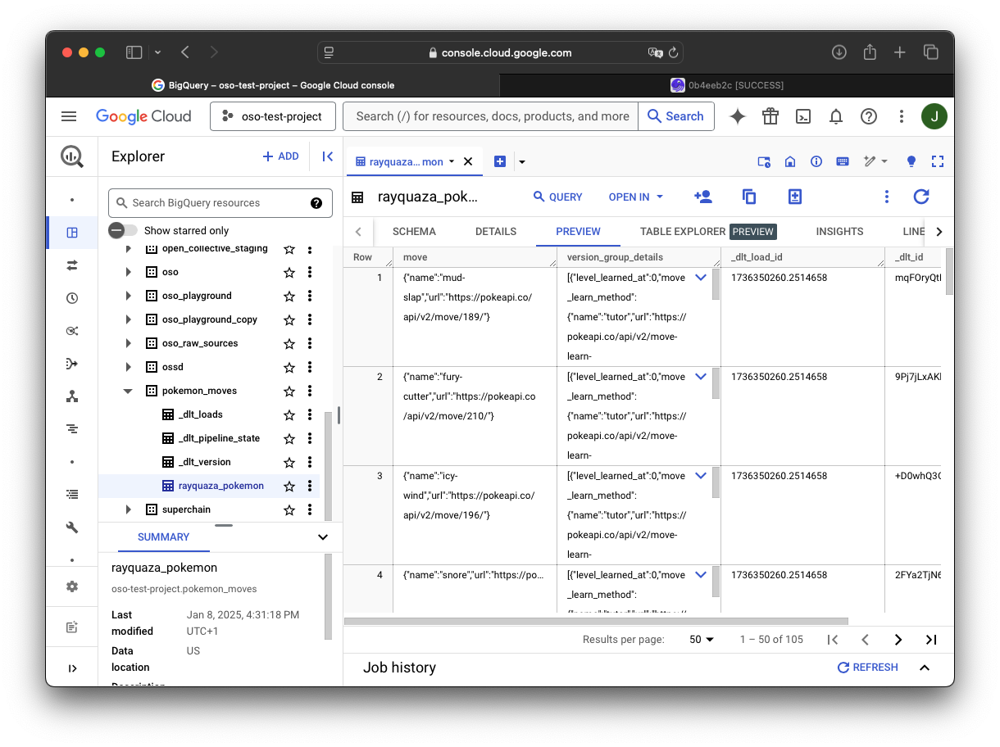

This guide will explain how to use the
[`create_rest_factory_asset`](https://github.com/opensource-observer/oso/blob/main/warehouse/oso_dagster/factories/rest.py) factory function to automatically
build queries and scrape REST APIs.

When you are working with APIs, you often need to write a lot of **boilerplate**
code to fetch data, parse it, and load it into out data warehouse. This can be
**time-consuming** and **error-prone**.

To make this process easier, we have created a set of tools that allow you to
ingest data from APIs with minimal effort, enabling:

- **Minimal boilerplate**: All you do is list which endpoints you are pulling
  data from.
- **Automatic asset creation**: Each endpoint becomes its own asset, ready to be
  materialized in Dagster.
- **Easy integration with the OSO environment**: Everything is built to fit into
  our approach to data ingestion.

## Defining Your API Crawler

Below is a sample showing how you can ingest data from the
[DefiLlama](https://defillama.com/) API. It retrieves data on various DeFi
protocols such as Uniswap, Aave, etc.

### 1. List the Protocols

Pick the protocols you want. Each entry in this list represents one endpoint you
will fetch.

```python
DEFILLAMA_PROTOCOLS = [
    "aave-v1",
    "aave-v2",
    "aave-v3",
    "uniswap",
    "velodrome",
    "origin-protocol",
    # ...others...
]
```

### 2. Create a Configuration Object

:::tip
For the full `config` spec, see
[`dlt`](https://dlthub.com/docs/dlt-ecosystem/verified-sources/rest_api/basic)
documentation. Not all fields are covered here, but you can add more as needed.
:::

Our configuration object has three main parts:

- A `client` object, which contains the base URL and any other client-level
  settings.
- A `resource_defaults` object, which contains default settings for all
  resources.
- A list of `resources`, each describing a single endpoint, with a name and
  endpoint details.

```python
from dlt.sources.rest_api.typing import RESTAPIConfig

config: RESTAPIConfig = {
    "client": {
        "base_url": "https://api.llama.fi/",
    },
    "resource_defaults": {
        "primary_key": "id", # The field to use as the primary key
        "write_disposition": "merge", # How to handle existing data
    },
    "resources": list(
        map(
            lambda protocol: {
                "name": f"{protocol.replace('-', '_').replace('.', '__dot__')}_protocol",
                "endpoint": {
                    "path": f"protocol/{protocol}",
                    "data_selector": "$", # Selects the whole response
                },
            },
            DEFILLAMA_PROTOCOLS,
        )
    ),
}
```

### 3. Use the Factory Function

We have a handy factory function called
[`create_rest_factory_asset`](https://github.com/opensource-observer/oso/blob/main/warehouse/oso_dagster/factories/rest.py)
that takes your configuration and returns a callable **factory** that wires all
assets up with the specified configuration.

For a minimal configuration, we just need to supply a `key_prefix` to the
factory function. This will be used to create the asset keys in the Dagster
environment. It accepts a list of strings as input. Each element will be
represented as a level in the key hierarchy.

:::tip
Under the hood, this will create a set of Dagster assets, managing all of
our infrastructure-specific details for you. Therefore, you can easily configure
all of them in one go. For the full reference, check
[`dagster`](https://docs.dagster.io/_apidocs/assets#dagster.asset)
documentation.
:::

```python
from ..factories.rest import create_rest_factory_asset

# ... config definition ...

dlt_assets = create_rest_factory_asset(config=config)
defillama_tvl_assets = dlt_assets(key_prefix=["defillama", "tvl"])
```

That is it. These few lines produce a set of Dagster assets, each one pulling
data from a distinct DefiLlama endpoint. When you run your Dagster job or
pipeline, the data will be ingested into your OSO warehouse.

---

## How to Run and View Results

:::tip
If you have not setup your local Dagster environment yet, please follow
our [quickstart guide](./setup/index.md).
:::

After having your Dagster instance running, follow the
[Dagster Asset Guide](./setup/index.md) to materialize the assets.
Our example assets are located under `assets/defillama/tvl`.


---

## Expanding Your Crawler

In practice, you may do more than just retrieve data:

- **Pagination**: `dlt` supports adding a paginator if you have large result
  sets.
- **Transformations**: You can add transformations before loading, such as
  cleaning up invalid fields or renaming columns.

Our tooling is flexible enough to let you customize these details without losing
the simplicity of the factory approach.

Here's a more advanced example showing automatic pagination and specific field
selection using the Pokémon API:

```py
from dlt.sources.rest_api.typing import RESTAPIConfig

from ..factories.rest import create_rest_factory_asset

POKEMON_IDS = [
    "rayquaza",
    "pikachu",
    "charizard",
    "bulbasaur",
    "ditto",
    "espurr",
    "farfetchd",
]

config: RESTAPIConfig = {
    "client": {
        "base_url": "https://pokeapi.co/api/v2/",
        "paginator": "json_link",  # Enables automatic pagination
    },
    "resource_defaults": {
        "write_disposition": "replace",
    },
    "resources": list(
        map(
            lambda id: {
                "name": f"{id}_pokemon",
                "endpoint": {
                    "path": f"pokemon/{id}",
                    "data_selector": "$.moves",  # Selects only the moves field
                },
            },
            POKEMON_IDS,
        )
    ),
}

dlt_assets = create_rest_factory_asset(config=config)
pokemon_assets = dlt_assets(key_prefix=["pokemon", "moves"])
```

After running the pipeline, you'll find the Pokémon moves assets in your data
warehouse:



---

## Current limitations

Even though the factory approach is very flexible, there are some limitations
you should be aware of:

- **Resource Relationship**: Although `dlt` supports
  [relationships](https://dlthub.com/docs/dlt-ecosystem/verified-sources/rest_api/basic#define-resource-relationships)
  between resources, the factory does not support this feature. This is because
  each resource is created independently, meaning that relationships between
  them are not inferred.

---

## Conclusion

With just a few lines of code, you can connect OSO to any API. This method
removes repetitive tasks and helps you maintain a consistent approach to
ingestion. Whenever you need to add or remove endpoints, you simply update your
configuration object.

Does this factory not fit your needs? Check the
[GraphQL API Crawler](./graphql-api.md)!
