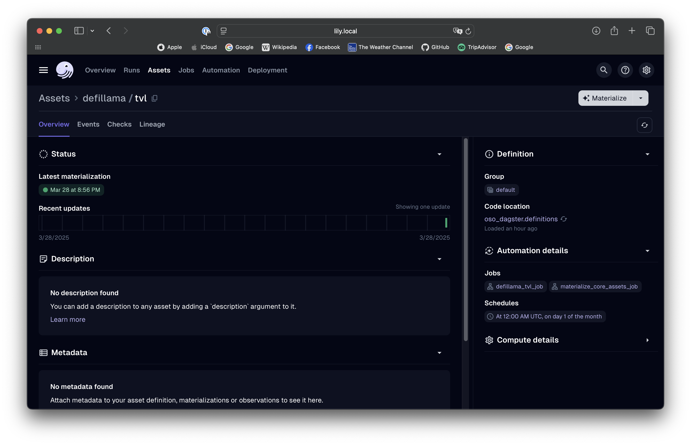

This guide explains how to use the
[`create_rest_factory_asset`](https://github.com/opensource-observer/oso/blob/main/warehouse/oso_dagster/factories/rest.py)
factory function to automatically build queries and scrape REST APIs.

When working with APIs, you often need to write boilerplate code to fetch data,
parse it, and load it into your data warehouse. This process can be
time-consuming and error-prone.

To simplify this process, we've created tools that allow you to ingest data from
APIs with minimal effort:

- **Minimal boilerplate**: Define your endpoints once and let the factory handle
  the rest
- **Efficient asset creation**: Create a single unified asset for your API
  data
- **Seamless OSO integration**: Built to fit our data ingestion approach

## Defining Your API Crawler

Below is an example showing how to ingest data from the
[DefiLlama](https://defillama.com/) API, which retrieves data on various DeFi
protocols.

### 1. Create a Configuration Object

The configuration object defines how to interact with the API. Here's a simple
example:

```python
from dlt.sources.rest_api.typing import RESTAPIConfig


def mk_defillama_config() -> RESTAPIConfig:
    """
    Create a simple REST API config for fetching DefiLlama data.
    """
    # Define protocols we want to fetch
    protocols = ["aave-v3", "uniswap", "velodrome"]

    return {
        "client": {
            "base_url": "https://api.llama.fi/",
        },
        "resource_defaults": {
            "primary_key": "id",
            "write_disposition": "replace",
        },
        "resources": [
            {
                "name": f"{protocol}_data",
                "endpoint": {
                    "path": f"protocol/{protocol}",
                    "data_selector": "$",
                },
            }
            for protocol in protocols
        ],
    }
```

:::tip
For the full `config` spec, see the
[`dlt`](https://dlthub.com/docs/dlt-ecosystem/verified-sources/rest_api/basic)
documentation. Not all fields are covered here, but you can add more as needed.
:::

The configuration has three main parts:

- A `client` object with the base URL and client-level settings
- A `resource_defaults` object containing default settings for all resources
- A list of `resources`, each describing a single endpoint or data source

### 2. Use the Factory Function

The
[`create_rest_factory_asset`](https://github.com/opensource-observer/oso/blob/main/warehouse/oso_dagster/factories/rest.py)
factory function takes your configuration and returns a callable factory that
creates a Dagster asset with all the specified API resources.

```python
from ..factories.rest import create_rest_factory_asset

# Create the factory with your config
dlt_assets = create_rest_factory_asset(config=mk_defillama_config())

# Create the asset
defillama_assets = dlt_assets(
    key_prefix="defillama",  # Asset key prefix (required)
    name="tvl",  # Asset name (required)
    op_tags={
        "dagster/concurrency_key": "defillama_tvl",
    },
)
```

The factory function requires both:

- A `key_prefix` (string or list of strings) to define the asset path
- A `name` to identify the asset

:::tip
Under the hood, this creates a Dagster asset with all your
infrastructure-specific details configured. For the full reference of available
parameters, check the
[`dagster`](https://docs.dagster.io/_apidocs/assets#dagster.asset)
documentation.
:::

That's it! These few lines produce a Dagster asset that pulls data from all the
specified DefiLlama endpoints. When you run your Dagster job, the data will be
ingested into your OSO warehouse.

## Advanced Features

The REST API Crawler supports several advanced features that make it powerful
for complex data ingestion scenarios.

### Resource Dependencies and Data Transformations

One of the most powerful features is the ability to create dependencies between
resources and transform data during ingestion. Here's an advanced example:

```python
from typing import Dict, Generator, List

import dlt
import requests
from dlt.sources.helpers.requests import Session
from dlt.sources.rest_api.typing import RESTAPIConfig

from ..factories.rest import create_rest_factory_asset


# Custom function to fetch protocols dynamically
@dlt.resource(name="protocols")
def fetch_defillama_protocols() -> Generator[List[Dict[str, str]], None, None]:
    """Fetch all valid defillama protocols."""
    # Get protocols from an external source or database
    try:
        r = requests.get("https://api.llama.fi/protocols", timeout=5)
        r.raise_for_status()
        valid_protocols = [{"name": x["slug"]} for x in r.json() if x["slug"]]
        yield valid_protocols
    except requests.exceptions.RequestException:
        # Fallback to hardcoded list if API fails
        yield [{"name": slug} for slug in ["aave-v3", "uniswap", "velodrome"]]


# Data transformation function
def add_original_slug(record):
    """Add the original slug to the record for reference."""
    record["slug"] = record.get("_protocols_name", "")
    del record["_protocols_name"]  # Remove the original field
    return record


# Create a config with resource dependencies
def mk_defillama_config() -> RESTAPIConfig:
    return {
        "client": {
            "base_url": "https://api.llama.fi/",
            "session": Session(timeout=300),
        },
        "resource_defaults": {
            "primary_key": "id",
            "write_disposition": "replace",
            "parallelized": True,
        },
        "resources": [
            # This resource depends on the "protocols" resource
            {
                "name": "slugs",
                "endpoint": {
                    "path": "protocol/{protocol}",
                    "data_selector": "$",
                    "params": {
                        "protocol": {
                            "type": "resolve",  # Create a dependency
                            "resource": "protocols",  # Reference another resource
                            "field": "name",  # Use the 'name' field from protocols
                        },
                    },
                },
                "include_from_parent": ["name"],  # Include parent fields
                "processing_steps": [
                    {"map": add_original_slug},  # Transform each record
                ], # type: ignore
            },
            # The base resource that provides protocol names
            fetch_defillama_protocols(),
        ],
    }


# Create and register the asset
def build_defillama_assets():
    dlt_assets = create_rest_factory_asset(config=mk_defillama_config())

    assets = dlt_assets(
        key_prefix="defillama",
        name="tvl",
        op_tags={
            "dagster/concurrency_key": "defillama_tvl",
        },
    )

    return assets


defillama_assets = build_defillama_assets()
```

## How to Run and View Results

:::tip
If you haven't set up your local Dagster environment yet, please follow
our [quickstart guide](./setup/index.md).
:::

After having your Dagster instance running, follow the
[Dagster Asset Guide](./setup/index.md) to materialize the assets. Our example
asset is located under the key path `defillama/tvl`.



## Advanced Features

The REST API Crawler supports several advanced features:

### Dynamic Data Sources

You can create a dynamic list of endpoints by using a custom resource function
like `fetch_defillama_protocols()` in our example. This lets you:

- Pull from a database or external source to determine which endpoints to query
- Filter or transform the list of endpoints before querying them
- Implement custom logic for endpoint selection

### Understanding Resource Dependencies

In the advanced example above, we use several important concepts:

1. **Resource Dependencies**: The `"type": "resolve"` parameter creates a
   dependency between resources. In this case, the `slugs` resource depends on
   the `protocols` resource:

   ```python
   "protocol": {
       "type": "resolve",  # Create a dependency
       "resource": "protocols",  # The resource to depend on
       "field": "name",  # The field to use from that resource
   }
   ```

   This means that for each protocol name returned by the `protocols` resource,
   the factory will make a separate API call to fetch that protocol's data.

2. **Data Transformations**: The `processing_steps` parameter allows you to
   transform data before it's loaded:

   ```python
   "processing_steps": [
       {"map": add_original_slug},  # Apply a function to each record
       {"filter": lambda r: r.get("tvl") > 1000000},  # Filter records based on a condition
   ]
   ```

3. **Dynamic Resource Generation**: The `fetch_defillama_protocols()` function
   is a custom resource that dynamically generates the list of protocols to
   fetch, rather than hardcoding them in the configuration.

## Current Limitations

While the factory approach is flexible, there are some limitations:

- **Single Asset**: Unlike the previous version, this factory creates a single
  asset for all resources rather than one asset per resource. This speeds up
  greatly the asset creation process, but requires all resources to be
  materialized together.

## Conclusion

With this REST API Crawler, you can connect OSO to virtually any API with
minimal code. The approach eliminates repetitive tasks and maintains a
consistent approach to data ingestion. When you need to modify your data
sources, simply update your configuration object.

Does this factory not fit your needs? Check the
[GraphQL API Crawler](./graphql-api.md) as an alternative.
