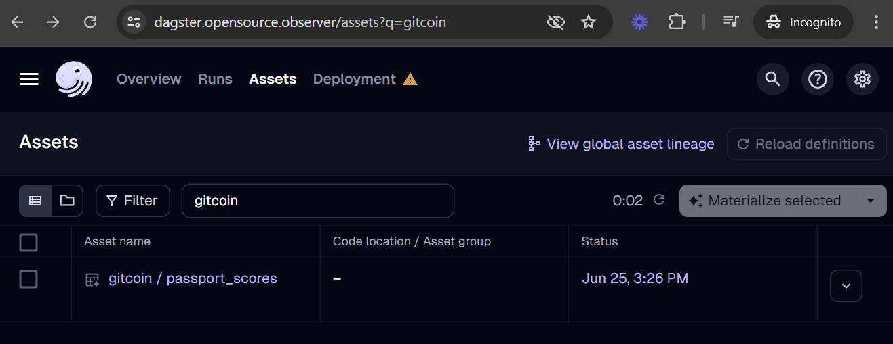
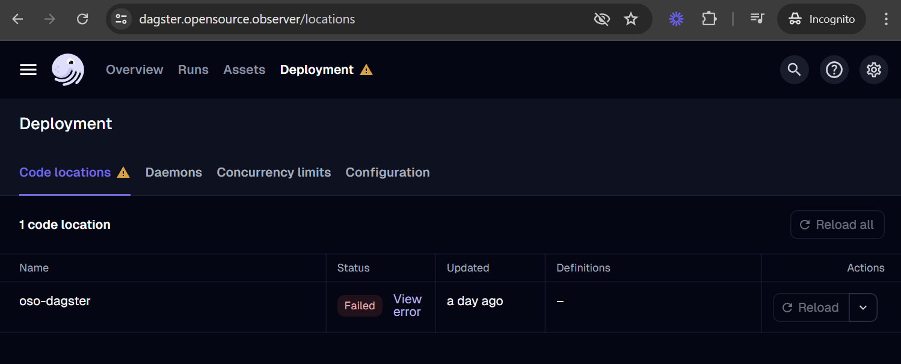
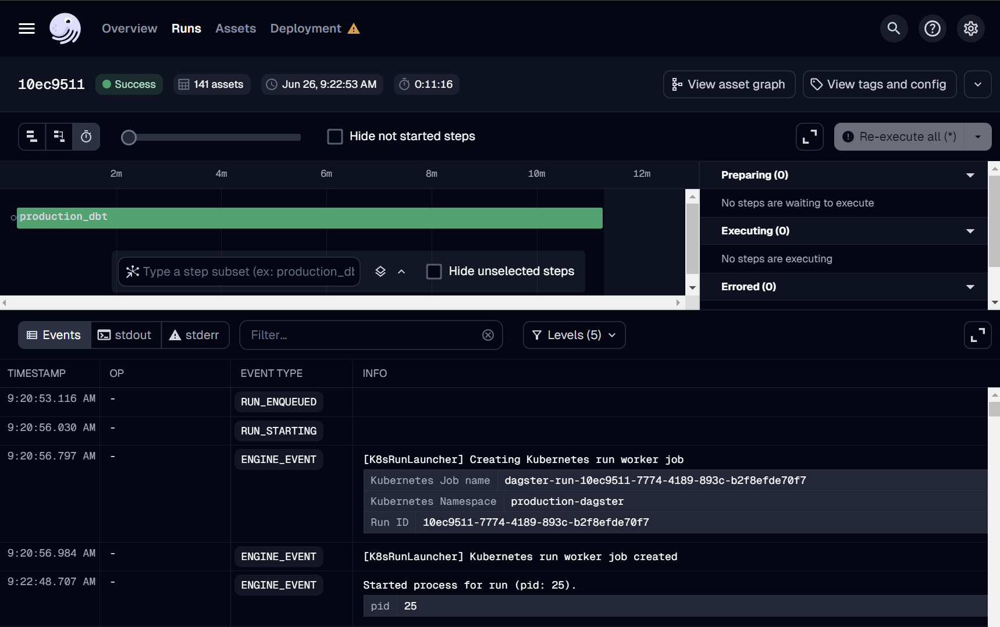

[Dagster](https://dagster.io) is a modern data orchestrator that we use to declare
all data assets in software. OSO uses it to schedule all data jobs,
from data collectors to our transformation pipeline.
This quickstart guide will help you set
up a development Dagster instance locally, with a [`duckdb`](http://duckdb.org/) backend,
in order to follow along with our tutorials in the next sections.

If you want to check out what Dagster looks like in production, check out  
[https://dagster.opensource.observer](https://dagster.opensource.observer)  
Admins can trigger runs
[here](https://admin-dagster.opensource.observer/)

## Setting up Dagster

First, we need to clone the
[OSO monorepo](http://github.com/opensource-observer/oso) and install
the required dependencies using
[uv](https://docs.astral.sh/uv/):

```sh
git clone git@github.com:opensource-observer/oso.git
cd oso/
uv sync
```

Create a directory to store Dagster state. It is safe to delete this directory,
so we typically store this in `/tmp`.

```sh
mkdir /tmp/dagster-home
```

Copy `.env.example` to `.env`, and fill it in with the required environment variables:

```sh
DAGSTER_HOME=/tmp/dagster-home
```

Lastly, we need to configure `dagster.yaml` to disable concurrency. Our example
is located at `/tmp/dagster-home/dagster.yaml`:

```yaml
run_queue:
  max_concurrent_runs: 1
```

This is currently a limitation with our `duckdb` integration. Please check out
[this issue](https://github.com/opensource-observer/oso/issues/2040#issue-2503231601)
for more information.

## Running Dagster

Now that we have everything set up, we can run the Dagster instance:

```sh
uv run dagster dev
```

:::tip
You may need to run the development server in legacy mode on resource-constrained machines.
See this [issue](https://github.com/opensource-observer/oso/issues/3366) for more details.

```bash
uv run dagster dev --use-legacy-code-server-behavior
```

:::

After a little bit of time, you should see the following message:

```sh
2024-09-10 22:35:31 +0200 - dagster.daemon - INFO - Instance is configured with the following daemons: ['AssetDaemon', 'BackfillDaemon', 'QueuedRunCoordinatorDaemon', 'SchedulerDaemon', 'SensorDaemon']
2024-09-10 22:35:31 +0200 - dagster-webserver - INFO - Serving dagster-webserver on http://127.0.0.1:3000 in process 1095
```

Head over to [http://localhost:3000](http://localhost:3000) to access Dagster's
UI. _Et voilà_! You have successfully set up Dagster locally.

## Define a new Dagster asset

Now you're ready to create a new Dagster software-defined asset.
You can use one of the following guides and come back to this guide to test it.

- 🗂️ [BigQuery Public Datasets](../bigquery.md) - Preferred and easiest route for sharing a dataset
- 🗄️ [Database Replication](../database.md) - Provide access to your database for replication as an OSO dataset
- 📈 [GraphQL API Crawler](../graphql-api.md) - Automatically crawl any GraphQL API
- 🌐 [REST API Crawler](../rest-api.md) - Automatically crawl any REST API
- 📁 [Files into Google Cloud Storage (GCS)](../gcs.md) - Drop Parquet/CSV files in our GCS bucket for loading into OSO
- ⚙️ [Custom Dagster Assets](../dagster.md) - Write a custom Dagster asset for unique data sources
- 📜 Static Files - Coordinate hand-off for high-quality data via static files. This path is predominantly used for [grant funding data](../funding-data.md).

## Test your asset locally

Assets in `warehouse/oso_dagster/assets` should automatically show up in
the Dagster assets list at `http://localhost:3000/assets`.



Click on "Materialize" to start the job.
Here you'll be able to monitor the logs to debug any issues with
the data fetching.

:::warning
Unless your Dagster instance is configured with a Google account that
has write access to OSO BigQuery datasets, you
should expect an error message when the asset tries to write.
Focus on debugging any issues with fetching data.
When you're ready, work with a core team member to test
the asset in production.
:::

## Add your asset to production

### Submit a pull request

When you are ready to deploy,
submit a pull request of your changes to
[OSO](https://github.com/opensource-observer/oso).
OSO maintainers will work with you to get the code in shape for merging.
For more details on contributing to OSO, check out
[CONTRIBUTING.md](https://github.com/opensource-observer/oso/blob/main/CONTRIBUTING.md).

### Verify deployment

Our Dagster deployment should automatically recognize the asset
after merging your pull request to the main branch.
You should be able to find your new asset
in the [global asset list](https://dagster.opensource.observer/assets).


If your asset is missing, you can check for loading errors
and the date of last code load in the
[Deployment tab](https://dagster.opensource.observer/locations).
For example, if your code has a bug and leads to a loading error,
it may look like this:



### Run it!

If this is your first time adding an asset,
we suggest reaching out to the OSO team over
[Discord](https://www.opensource.observer/discord)
to run deploys manually.
You can monitor all Dagster runs
[here](https://dagster.opensource.observer/runs).



Dagster also provides
[automation](https://docs.dagster.io/concepts/automation)
to run jobs on a
[schedule](https://docs.dagster.io/concepts/automation/schedules)
(e.g. daily), after detecting a condition using a Python-defined
[sensor](https://docs.dagster.io/concepts/partitions-schedules-sensors/sensors)
(e.g. when a file appears in GCS),
and using
[auto-materialization policies](https://docs.dagster.io/concepts/assets/asset-auto-execution).

We welcome any automation that can reduce the operational burden
in our continuous deployment.
However, before merging any job automation,
please reach out to the OSO devops team
on [Discord](https://www.opensource.observer/discord)
with an estimate of costs, especially if it involves large BigQuery scans.
We will reject or disable any jobs that lead to
increased infrastructure instability or unexpected costs.
