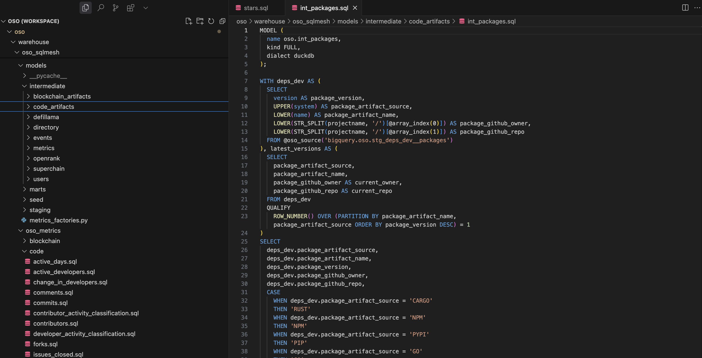

:::info
This guide explains how to create and contribute data models to OSO using SQLMesh. It covers model structure (staging, intermediate, mart), naming conventions, materialization strategies, metrics logic, and testing workflows. Before proceeding, make sure you've completed the [setup process](./setup.md) and have a local SQLMesh environment running.
:::

## TL;DR

The OSO data model is complex, so you should read everything if you want to contribute! But here are the most important points:

- Always refer to entities (projects, users, etc.) using their unique entity IDs
- Raw data flows into staging models, which feed intermediate models, which feed mart models
- Folders don't matter but names do: use prefixes and descriptive names for models
- Event models always have a time component and a to/from entity component
- Event models are massive: it's important to partition, aggregate, and filter them efficiently
- Metrics are generated using the `metrics_tools` so they can be applied consistently across different entity types and time periods
- We like long, skinny tables (many rows, few columns) to keep them performant
- SQL must be written in Trino; we have macros to help with operations that can be tricky in Trino's SQL
- Test locally before submitting a pull request
- **For an in-depth guide on time series metrics, see the [Time Series Metrics Factory Deep Dive](./time-series-factory.md).**

## Core Concepts

OSO unifies data from different sources into consistent data models that can be queried and analyzed at scale. In order to contribute models, it's important to understand the core concepts and structures used in OSO.

### Entities

Entities represent people, organizations, repositories, packages, and much more. Every entity has a unique ID comprised of a source, namespace, and name. These IDs are used to link entities across different data sources and models.

Some examples:

- A GitHub repo, e.g. "https://github.com/opensource-observer/oso", is assigned `@oso_entity_id('GITHUB', 'opensource-observer', 'oso')`
- An address on Base, e.g., "0x1234...", is assigned `@oso_entity_id('BASE', '', '0x1234...')`
- A project in (our version of) [OSS Directory](https://github.com/opensource-observer/oss-directory): `@oso_entity_id('OSS_DIRECTORY', 'oso', 'my-project')`

It's extremely important to use these IDs consistently across models to ensure data integrity and consistency. The `@oso_entity_id` macro is used to generate these IDs deterministically.

### Events

Events represent actions or interactions that occur between entities. These can include things like commits, contract interactions, package imports, funding events, and more. Events are typically brought in from [public databases](../integrate/datasets/index.mdx) via staging models.

We currently do not have a deterministic way to generate event IDs, but we are working on a solution to this problem. In the meantime, events are differentiated by their source, type, timestamp, and the to/from entities involved.

Some examples:

- A GitHub commit from a user to a repository
- A contract interaction from a user to a smart contract
- A dependency from a repo to an NPM package

Given that there are often billions of events associated with many of our sources, we typically aggregate these events into daily or monthly buckets for performance reasons.

### Metrics

Metrics are essentially aggregations of events over time for a specific entity type. These can include things like unique users, forks, funding amounts, and more. Metrics are generated using the `metrics_tools` package in SQLMesh so they can be applied consistently across different entity types and time periods. (Fun fact: this capability was one of the primary reasons we migrated our data pipeline to SQLMesh!)

In the future, we expect there to be many, many metrics. Therefore, we use a similar ID system to entities to ensure consistency and integrity, which is comprised of a source, namespace, and name. Metric names currently concatenate the event source, event type, and time period.

Some examples:

- GITHUB_releases_weekly, GITHUB_releases_daily, GITHUB_releases_over_all_time
- OPTIMISM_active_addresses_aggregation_daily, OPTIMISM_active_addresses_aggregation_over_90_day_period
- OPEN_COLLECTIVE_funding_received_monthly, OPEN_COLLECTIVE_funding_received_over_180_day_period

The power of this approach is that it allows us to easily compare metrics across different entity types and time periods, and to generate consistent cohorts and data visualizations. The (current) disadvantage is that you need to be precise when querying metrics to ensure you're getting the right data.

## Model Structure

### Hierarchy

Data models in OSO are organized in the `warehouse/oso_sqlmesh/models` directory, following these categories:

- **Staging (stg)**: Initial transformations that clean and standardize source data. There should be no joins or complex logic in staging models. A staging model should be able to run independently and feed everything downstream from it that requires the same source data.
- **Intermediate (int)**: Models that join and transform staging models into more complex structures. Intermediate models may contain aggregations or other complex logic. If you in doubt about where to put a model, it should probably be an intermediate model.
- **Mart**: Final models that are exposed to end users, typically containing registries, metrics, or aggregagated event data. We aim to have as few columns as possible in mart models to keep them performant. Marts models have versions postfixed with `_v0`, `_v1`, etc. Anything with a a `v0` is considered a development version and may be unstable.

In summary, staging models feed intermediate models, which feed mart models. When contributing new models, it's important to follow this structure to maintain consistency across the codebase.

### Naming Conventions

Note that SQLMesh ignores folders, so the model name must be uniqe and should be descriptive enough to indicate its category. In addition, when naming your models, try to follow these conventions:

- **Use the Correct Prefix**: Prefix your model name with `stg_` or `int_` to indicate the category. Mart models should not have prefixes but should end with a version number (eg, `_v0`, `_v1`)
- **Use Descriptive Names**: Choose names that clearly indicate the model's purpose and source data.
- **Use Underscores**: Separate words in the model name with underscores for readability. Use two underscores to separate the category from the model name (eg, `stg_github__commits.sql`).

### Materialization Strategies

SQLMesh supports several types of models with different materialization strategies:

- **FULL**: A complete table that is rebuilt from scratch on each run. This is the simplest type but can be inefficient for large datasets.
- **INCREMENTAL_BY_TIME_RANGE**: Models that process data in time-based chunks. These are ideal for event data where you want to process new time periods incrementally.
- **INCREMENTAL_BY_UNIQUE_KEY**: Models that perform upserts based on a unique key. These are useful for dimension tables or slowly changing data.
- **INCREMENTAL_BY_PARTITION**: Models that process data in discrete partitions. These are useful when data must be processed in static groupings like `event_source` or ID ranges.

Most models in OSO use either the `FULL` or `INCREMENTAL_BY_TIME_RANGE` strategy.

### Incrementing and Partitioning

Large event models should be partitioned and processed incrementally in order to keep compute costs manageable. When doing this, it is important to ensure that any upstream models are also partitioned and incremental. If an incremental model depends on a non-incremental model that is changing frequently, then your model may have some data integrity issues (or will need to be rebuilt frequently, which defeats the purpose of making it incremental).

Here's an example of an intermediate model from the OSO codebase:

```sql
MODEL (
  name oso.int_events_daily__github,
  kind INCREMENTAL_BY_TIME_RANGE (
    time_column bucket_day,
    batch_size 365,
    batch_concurrency 1
  ),
  start @github_incremental_start,
  cron '@daily',
  partitioned_by (DAY("bucket_day"), "event_type"),
  grain (bucket_day, event_type, event_source, from_artifact_id, to_artifact_id)
);

SELECT
  DATE_TRUNC('DAY', time::DATE) AS bucket_day,
  from_artifact_id::VARCHAR AS from_artifact_id,
  to_artifact_id::VARCHAR AS to_artifact_id,
  event_source::VARCHAR,
  event_type::VARCHAR,
  SUM(amount::DOUBLE)::DOUBLE AS amount
FROM oso.int_events__github as events
WHERE time BETWEEN @start_dt AND @end_dt
GROUP BY
  DATE_TRUNC('DAY', time::DATE),
  from_artifact_id,
  to_artifact_id,
  event_source,
  event_type
```

#### Incremental Settings

In the above example, there are several key settings to note:

- `kind=INCREMENTAL_BY_TIME_RANGE` specifies that this is an incremental model based on time
- `time_column="bucket_day"` indicates which column contains the timestamp for incremental processing
- `@github_incremental_start` is a global variable that defines the start date for incremental processing for this source
- `@start_date` and `@end_date` are automatically set by SQLMesh to the appropriate time range for each run

#### Partition Settings

The example above also includes a `partitioned_by` tuple:

```sql
partitioned_by (DAY("bucket_day"), "event_type"),
```

The `DAY` in `DAY("bucket_day")` is Trino's date trunc syntax, i.e., ensuring the `bucket_day` column is date truncated.

It's important to be thoughtful about how you partition your tables. In general, you should partition by the columns you most frequently filter on in your queries. If you make your partitions too granular, you may end up with too many small files, which can slow down queries. If you make them too large, you may not get the performance benefits of partition pruning.

#### Grain Settings

The `grain` setting is used by SQLMesh to define the unique key(s) for the model. It is basically a composite key that ensures the model is unique at the grain level. This is important for ensuring data integrity and consistency across models. In the example above, the grain is defined as:

```sql
grain (bucket_day, event_type, event_source, from_artifact_id, to_artifact_id)
```

If you configure your grain right, then SQLMesh can intelligently determine what data needs to be updated in the model. If you get it wrong (e.g., you forget to include a column that is part of the unique key), then you may end up with data integrity issues. If you ignore the grain, then SQLMesh will assume you want to rebuild the entire model each time, which can be very inefficient for large models.

## Metrics Tools

OSO has a framework in the `metrics_tools` directory for defining and calculating metrics across different entity types and time periods.

### Metrics Definitions

These are the `.sql` files that act as the starting point for generating metrics models. The metrics models are generated by taking all permutations of aggregation intervals and entity types for the given metric. At this time this isn't a fully generic semantic model but is a pragmatic approximation for the OSO use case.

Here is an example of a metrics definition from the OSO codebase called `stars.sql`:

```sql
select
    @metrics_sample_date(events.bucket_day) as metrics_sample_date,
    events.event_source,
    events.to_artifact_id,
    '' as from_artifact_id,
    @metric_name() as metric,
    sum(events.amount) as amount
from oso.int_events_daily__github as events
where
    event_type in ('STARRED')
    and events.bucket_day between @metrics_start('DATE') and @metrics_end('DATE')
group by 1, metric, from_artifact_id, to_artifact_id, event_source
```

It basically generates a metric for the sum of stars a project has received over a time period. The `@metrics_sample_date` macro is used to derive the correct sample date for the metric based on the metric type (normal aggregation or rolling window aggregation). The `@metrics_start` and `@metrics_end` macros are used to get the correct time ranges for the metric based on the aggregation type.

### Metrics Factory

Once there exists a metrics definition, it must be registered in the `metrics_factories.py` file. This file is necessary to generate the metrics models for the given metric. The metrics factory is used to define the time aggregations, rolling windows, entity types, and metadata for the metric.

Here is an excerpt from the OSO codebase that registers the `stars` metric:

```python
"stars": MetricQueryDef(
    ref="code/stars.sql",
    time_aggregations=["daily", "weekly", "monthly"],
    rolling=RollingConfig(
        windows=[30, 90, 180],
        unit="day",
        cron="@daily",
    ),
    entity_types=["artifact", "project", "collection"],
    over_all_time=True,
    metadata=MetricMetadata(
        display_name="Stars",
        description="Metrics related to GitHub stars",
    ),
    additional_tags=["data_category=code"],
),
```

Now let's break down the key components of the metrics factory:

- **ref**: The relative path to the metrics definition file
- **time_aggregations**: The time aggregations used for the metric (e.g., daily, weekly, monthly)
- **rolling**: The rolling window configuration for the metric. These are aggregations that look back some user defined number of days at an interval specified by a `cron` parameter in a rolling fashion. So if you have a 30 day rolling window with a daily cron, the final table is generated by iterating through each day and aggregating the previous 30 days of each day.
- **entity_types**: The entity types for the metric (e.g., artifact, project, collection). This allows the metric to be generated for different entity types.
- **over_all_time**: A boolean that indicates whether the metric should also be generated for an "all time" period (e.g., every event in the entity's history).
- **metadata**: Metadata for the metric, including display name and description.
- **additional_tags**: Additional tags for the metric, which can be used for filtering or categorization.

### Special Macros

OSO has a set of special macros that can be used in metrics definitions to simplify the process of generating metrics. Here are some of the most commonly used macros:

#### `@metrics_peer_ref`

Reference a different metrics table that is being generated by the timeseries
metrics factory. This should only be used if the table dependency is also
defined in the same factory.

**Parameters**:

- `name` - The name of the table dependency
- `entity_type` - _optional_ - The entity type for the current peer reference.
  Defaults to the entity type used in the current metric
- `window` - _optional_ - The size of the table dependency's window. If
  `time_aggregation` is not set, this and `unit` must be set.
- `unit` - _optional_ - The unit of the table dependency's window. If
  `time_aggregation` is not set, this and the `window` must be set.
- `time_aggregation` - _optional_ - The time aggregation used (one of `daily`,
  `weekly`, `monthly`). If this is not set then `window` and `unit` must be set.

_NOTE: Optional parameters should use the "kwargs" syntax in sqlmesh dialect.
This looks like `key := 'value'`_

**Usage**:

Select star from a dependent table that matches the current rolling window settings:

```sql
SELECT *
-- As noted in the docs the `entity_type` is inferred from the settings on this metric
FROM @metrics_peer_ref(`dep`, window := @rolling_window, unit := @rolling_unit)
```

Select star from a dependent table that matches the current time aggregation
settings, but only for the `artifact` entity type.

```sql
SELECT *
FROM @metrics_peer_ref(`dep`, entity_type := 'artifact', time_aggregation := @time_aggregation)
```

#### `@metrics_sample_date`

Derives the correct sample date for a metric based on the metric type (normal
aggregation or rolling window aggregation). This is essential to use for first
order metrics.

**Usage**:

```
@metrics_sample_date(event_table_source.event_table_date_column)
```

The passed in date should be the date column of a given time series event
source. In all cases that must use this, this is just
`int_events_daily_to_artifact.bucket_day`.

#### `@metric_start` and `@metric_end`

For rolling windows or time aggregations that have boundaries that correlate to
times, these provide the proper time ranges. So for a rolling window of 30 days
this will give a 30 day time window where the start days is 30 days _before_ the
interval for the current increment of the given model. So for example if the
increment is `2024-01-30` the start will be `2024-01-01` and the end will be
`2024-01-30`. These macros take a single argument which is the data type to use
for the returned value.

**Usage**:

For a date

```
@metrics_start(DATE)
```

For a timestamp (the value you use for type will depend on the dialect you're
using)

```
@metrics_start(TIMESTAMP)
```

#### `@metrics_name`

The metrics name is used to generate a name for a given metric. By default this
can be used without any arguments and the metrics model factory will
automatically assign a metric name. However in cases like the developer
classifications we want to create multiple types of metrics in a given query. We
can accomplish simply using this macro. The first argument is the "prefix" name
of the metric. This macro will then generate the appropriate suffix. For time
aggregations this will simply be something like `daily`, `weekly`, or `monthly`.
For rolling windows this will be something like, `_over_30_days` or
`_over_3_months` (the exact string depends on the rolling window configuration).

#### `@metrics_entity_type_col`

Provides a way to reference the generated column for a given entity type in a
metrics model. This is required because the metrics definition only acts as the
starting point of a metric from the perspective of an artifact. To get metrics
for projects and collections we need this macro while we aren't doing a fully
generic semantic model. be entity column name based on the currently queried
entity type. When queries are being automatically generated, entity types are
changed so the column used to reference the entity column also changes. This
macro allows for the queries to succeed by accepting a format string where the
variable `entity_type` referenced as `{entity_type}` in the format string is
interpreted as the current entity type (`artifact`, `project`, `collection`).

**Usage**:

```
@metrics_entity_type_col("to_{entity_type}_id")
```

If a query uses like so:

```
SELECT
  @metrics_entity_type_col("to_{entity_type}_id", t)
FROM table as t
```

The following SQL would be rendered for different entity types (the joins are
approximated for example only)

Artifact:

```
SELECT
  t.to_artifact_id
FROM table as t
```

Project:

```
SELECT
  artifact_to_project.project_id as to_project_id
FROM table as t
JOIN artifact_to_project as artifact_to_project
  ON artifact_to_project.artifact_id = t.to_artifact_id
```

Collection

```
SELECT
  project_to_collection.collection_id as to_collection_id
FROM table as t
JOIN artifact_to_project as artifact_to_project
  ON artifact_to_project.artifact_id = t.to_artifact_id
JOIN project_to_collection as project_to_collection
  ON project_to_collection.to_project_id = artifact_to_project.to_project_id

```

#### `@metrics_entity_type_alias`

Like, `@metric_entity_type_col` but programmatically aliases any input
expression with one that derives from the entity type.

**Usage**:

```
@metrics_entity_type_alias(some_column, 'some_{entity_type}_column")
```

#### `@relative_window_sample_date`

_WARNING: Interface likely to change_

Gets a rolling window sample date relative to the a passed in base date. This is
intended to allow comparison of multiple rolling intervals to each other. This
doesn't specifically use the rolling window parameters of a table dependency
(that will likely change in the future), but is instead just a convenience
function to calculate the correct dates that would be used to make that rolling
window comparison. We calculate a relative window's sample date using this
formula:

```
$base + INTERVAL $relative_index * $window $unit
```

_Note: The dollar sign `$` is used here to signify that this is a parameter in the above
context_

Inherently, this won't, for now, work on custom unit types as the interval must
be a valid SQL interval type. Also note, the base should almost _always_ be the
`@metrics_end` date.

**Parameters**:

- `base` - The date time to use as the basis for this relative sample date
  calculation
- `window` - The rolling window size of the table we'd like to depend on
- `unit` - The rolling window unit of the table we'd like to depend on
- `relative_index` - The relative index to the current interval. This allows us
  to look forward or back a certain number of rolling intervals in an upstream
  table.

**Usage**:

To get the date for the current, the last, and the second to last sample date of
a 90 day rolling window, you could do the following:

```sql
SELECT
  -- Relative index 0. This just becomes 2024-01-01
  @relative_window_sample_date('2024-01-01', 90, 'day', 0)
  -- Relative index -1. This becomes 2023-10-03
  @relative_window_sample_date('2024-01-01', 90, 'day', -1)
  -- Relative index -2. This becomes 2023-07-05
  @relative_window_sample_date('2024-01-01', 90, 'day', -2)
```

## Workflow for Contributing Models

When contributing new models to OSO, follow this workflow:

1. **Understand the Data**: Familiarize yourself with the existing data sources and models
2. **Design Your Model**: Plan what your model will do and how it fits into the existing structure
3. **Implement the Model**: Write your SQL model using SQLMesh syntax and appropriate macros
4. **Test Locally**: Run your model against local data to ensure it works correctly
5. **Submit a Pull Request**: Contribute your model back to the OSO repository

This section assumes you a local SQLMesh environment running. If you haven't already, follow the [setup guide](./setup.md) to get started.

### Design Your Model

Connect to the database and explore the data using your preferred SQL client. You can also use **pyoso** to simulate the SQL that you want to write in a Notebook or Python script. This will help you understand the structure of the data and how to join tables together.

Once you have tested the SQL you want working in your client, you should determine where to place it and what to name it. See the [model structure](#model-structure) section above for helping in finding the appropriate directory. Most models that implement new logic probably belong in one of the intermediate model (`warehouse/oso_sqlmesh/models/intermediate`) or metrics (`warehouse/oso_sqlmesh/oso_metrics`) subdirectories.

The screenshot below shows the structure of the `warehouse/oso_sqlmesh/models` directory in VSCode:



### Implement the Model

When implementing your model, typically the easiest way to get started is to copy an existing model and modify it to suit your needs. This will ensure you have the correct SQLMesh definitions at the top of the file and syntax for your model.

You can do this by:

1. Copy and pasting an existing model file in the appropriate directory
2. Rename the file to match your new model
3. Update the `name` parameter in the model definition to match your new model name
4. Review the other SQLMesh parameters, particularly the partitionin and grain settings
5. Copy over your SQL logic in the body of the model

The next step is to ensure the SQLMesh macros are used in the appopriate places. This is critical for incremental models, which MUST have a `where` clause that filters the data to the correct time range. This is typically done using the `@start_dt` and `@end_dt` macros, e.g.:

```sql
WHERE block_timestamp BETWEEN @start_dt AND @end_dt
```

If you need to define constants or variables in your model, you can do so using the `@DEF` macro. For example:

```sql
@DEF(transactions_threshold, 1000);
```

You can then use these variables in your SQL queries, e.g.,

```sql
SELECT
  project_id,
  CAST(transaction_count >= @transactions_threshold AS INTEGER) AS meets_criteria
FROM builder_metrics
```

Finally, add comments and descriptive names for CTEs to make your code more readable and maintainable. You can use the standard SQL comment syntax `--` to add comments to your code. Longer comments should use docstring syntax `/* ... */`.

### Testing Your Models

Before submitting your models, it's important to test them thoroughly to ensure they work as expected. Here are some testing strategies:

1. **Run with Limited Data**: Test your models with a limited date range to speed up development:

```bash
uv run oso local sqlmesh-test --duckdb plan dev --start '1 week' --end now
```

SQLMesh will build your model and intelligently determine anything downstream that also needs to be rebuilt. This is a great way to test your model without waiting for the entire pipeline to run.

2. **Validate Output**: Check the output of your models to ensure they're producing the expected results:

```bash
duckdb /tmp/oso.duckdb
```

Then query your model:

```sql
SELECT * FROM oso__dev.{your_model_name} LIMIT 10;
```

Note that you will be querying the `oso__dev` schema, which is where the SQLMesh models are stored locally.

3. **Consider Adding Tests or Audits**: If your model is complex or critical, consider adding tests or audits to validate the output. You can use SQLMesh to run these tests automatically. Tests are configured as YAML files and get tested at run time. Audits are built into SQLMesh parameters, for example:

```sql
MODEL (
  name oso.int_artifacts_by_project_in_op_atlas,
  kind FULL,
  dialect trino,
  description "Unifies all artifacts from OP Atlas, including handling cases where contracts come in via OSO",
  audits (
    not_null(columns := (artifact_id, project_id))
  )
);
```

### Submitting Your Models

Once you've tested your models and are confident they work correctly, you can submit them to the OSO repository:

1. **Create a Branch**: Create a new branch for your changes:

```bash
git checkout -b add-new-metric
```

2. **Add Your Files**: Add your new model files:

```bash
git add warehouse/oso_sqlmesh/models/your_model_file.sql
```

or simply to add all files:

```bash
git add .
```

3. **Commit Your Changes**: Commit with a descriptive message:

```bash
git commit -m "feat(sqlmesh): Add new metric for valuing software dependencies"
```

4. **Push Your Changes**: Push your branch to GitHub:

```bash
git push origin add-new-metric
```

5. **Create a Pull Request**: Go to the OSO GitHub repository and create a pull request for your branch.

In your pull request description, include:

- A brief explanation of what your model does
- Any dependencies it has
- How to test it
- Any other relevant information

The OSO team will review your submission and provide feedback if needed.

### Example Workflow (WIP)

:::warning
Currently this is a placeholder
:::

Here's an example of creating a new metric for GitHub stars:

1. Create a staging model to clean the raw data:

```sql
model(
    name="stg_github_stars",
    owner="data_team",
    cron="@daily",
    start="2024-01-01",
    materialization="table"
)
SELECT
    repository_id,
    user_id,
    starred_at
FROM @oso_source('opensource-observer.github.stars')
WHERE starred_at IS NOT NULL
```

2. Create an intermediate model to aggregate the data:

```sql
model(
    name="int_github_stars_daily",
    owner="data_team",
    cron="@daily",
    start="2024-01-01",
    materialization="table"
)
SELECT
    repository_id as to_artifact_id,
    DATE_TRUNC('day', starred_at) as bucket_day,
    COUNT(*) as star_count
FROM ${stg_github_stars}
GROUP BY 1, 2
```

3. Create a metric model using the metrics factory:

In OSO, metrics are defined in the `oso_metrics` directory and then registered in the `metrics_factories.py` file. Here's a real example of a stars metric from the OSO codebase:

```sql
select
    @metrics_sample_date(events.bucket_day) as metrics_sample_date,
    events.event_source,
    events.to_artifact_id,
    '' as from_artifact_id,
    @metric_name() as metric,
    sum(events.amount) as amount
from oso.int_events_daily__github as events
where
    event_type in ('STARRED')
    and events.bucket_day between @metrics_start('DATE') and @metrics_end('DATE')
group by 1, metric, from_artifact_id, to_artifact_id, event_source
```

This metric is then registered in the metrics factory:

```python
timeseries_metrics(
    start="2015-01-01",
    schema="oso",
    model_prefix="timeseries",
    timeseries_sources=[
        "int_events_daily__github",
        # other sources...
    ],
    metric_queries={
        "stars": MetricQueryDef(
            ref="code/stars.sql",
            time_aggregations=["daily", "weekly", "monthly"],
            rolling=RollingConfig(
                windows=[30, 90, 180],
                unit="day",
                cron="@daily",
            ),
            entity_types=["artifact", "project", "collection"],
            over_all_time=True,
            metadata=MetricMetadata(
                display_name="Stars",
                description="Metrics related to GitHub stars",
            ),
            additional_tags=["data_category=code"],
        ),
        # other metrics...
    }
)
```

4. Check the rendering of the metrics model's sql

It is often useful to check what the generated sql for a given metrics model. To do this we have created a tool that can be used to render the sql and display that on the cli. To do this for `stars` as is defined in the previous step you'd simply do the following:

```bash
uv run oso metrics render stars
```

It may take a second because the models themselves are being rendered in the
underlying process, but it will present a UI for you to choose which version of
the generated model you'd like to see (e.g. `stars_to_artifact_weekly`,
`stars_to_project_over_all_time`).

By default, only the "intermediate" form of the metrics model is rendered on the
CLI. This includes some of the metrics specific macros. If you'd like to see the
raw sql that you could use you can set `--full-render` and an output dialect via
`--dialect DIALECT`. For duckdb you'd do this as so:

```bash
uv run oso metrics render stars --full-render --dialect duckdb
```

### Conclusion

Contributing data models to OSO using SQLMesh is a powerful way to enhance the platform's capabilities. By following the guidelines in this document, you can create high-quality models that integrate seamlessly with the existing codebase.

Remember to:

- Follow the model structure and naming conventions
- Use the appropriate macros for your metrics
- Test your models thoroughly before submitting
- Document your code clearly

Happy modeling!

## Advanced Topics

:::warning
This section is a placeholder for advanced topics.
:::

### OSO ID System

OSO uses a consistent ID system across all entities in the data model. This system ensures that entities can be uniquely identified and related to each other across different data sources and models. Two key macros are used for generating IDs:

#### `@oso_id`

The `@oso_id` macro is used for generating IDs for other types of entities, particularly metrics and events. It typically takes two or three parameters:

```sql
@oso_id(source, namespace, name)
```

Examples from the OSO codebase:

````sql
-- For metrics
@oso_id('OSO', 'oso', metric) AS metric_id

-- For events
@oso_id(chain, '', transaction_hash) AS event_source_id

-- For issues
@oso_id(event_source, to_artifact_id, issue_number) AS issue_id

#### `@oso_entity_id`

The `@oso_entity_id` macro is used to generate a unique identifier for entities like artifacts, projects, collections, and users. It typically takes three parameters:

```sql
@oso_entity_id(source, namespace, name)
````

- **source**: The source system or platform (e.g., 'GITHUB', 'FARCASTER', 'OP_ATLAS')
- **namespace**: The namespace within the source (e.g., organization name for GitHub repositories)
- **name**: The specific name or identifier of the entity (e.g., repository name)

Examples from the OSO codebase:

```sql
-- For GitHub repositories
@oso_entity_id(event_source, to_artifact_namespace, to_artifact_name) AS to_artifact_id

-- For blockchain addresses
@oso_entity_id(chain, '', address) AS artifact_id

-- For users
@oso_entity_id('FARCASTER', '', fid) AS user_id

-- For projects
@oso_entity_id('OP_ATLAS', '', project_id) AS project_id

-- For collections
@oso_entity_id('OSS_DIRECTORY', 'oso', name) AS collection_id
```

Note that for some entity types like blockchain addresses, the namespace parameter is often left empty ('').

````

### Common Entity Types and ID Patterns

Different entity types follow specific patterns for ID generation:

1. **Artifacts**:
   ```sql
   @oso_entity_id(artifact_source, artifact_namespace, artifact_name) AS artifact_id
````

- GitHub repositories: source='GITHUB', namespace=org name, name=repo name
- Blockchain contracts: source=chain name, namespace='', name=address

2. **Projects**:

   ```sql
   @oso_entity_id(project_source, project_namespace, project_name) AS project_id
   ```

   - OSS Directory projects: source='OSS_DIRECTORY', namespace='oso', name=project name
   - OP Atlas projects: source='OP_ATLAS', namespace='', name=project ID

3. **Collections**:

   ```sql
   @oso_entity_id(collection_source, collection_namespace, collection_name) AS collection_id
   ```

   - OSS Directory collections: source='OSS_DIRECTORY', namespace='oso', name=collection name

4. **Users**:

   ```sql
   @oso_entity_id(user_source, user_namespace, user_name) AS user_id
   ```

   - Farcaster users: source='FARCASTER', namespace='', name=fid
   - Lens users: source='LENS', namespace='', name=profile_id

5. **Metrics**:

   ```sql
   @oso_id('OSO', 'oso', metric_name) AS metric_id
   ```

6. **Events**:
   ```sql
   @oso_id(event_source, '', event_identifier) AS event_source_id
   ```

Using these consistent ID patterns ensures that entities can be properly joined and related across different models in the OSO data pipeline.

### Built-in SQLMesh Macros

SQLMesh provides a powerful macro system that goes beyond simple text substitution. Unlike traditional SQL templating, SQLMesh macros operate on the SQL abstract syntax tree, giving them a semantic understanding of the query.

SQLMesh includes several built-in macros that are particularly useful for incremental models:

- **@start_date, @end_date**: Automatically set by SQLMesh for incremental models to define the time range for processing
- **@execution_date**: The current execution date
- **@this_model**: References the current model's table name

These macros help ensure data consistency and make incremental processing more reliable. For example, in an INCREMENTAL_BY_TIME_RANGE model, the @start_date and @end_date macros automatically filter the source data to only include the relevant time period.

### Batch Processing and Chunk Sizing

For large backfills or incremental loads, SQLMesh provides batch processing capabilities through the `batch_size` and `batch_concurrency` parameters:

- **batch_size**: Controls how many intervals (e.g., days) are processed in a single batch
- **batch_concurrency**: Controls how many batches can run in parallel

This is particularly useful when working with large datasets in Trino, as it prevents queries from timing out or consuming too many resources.
