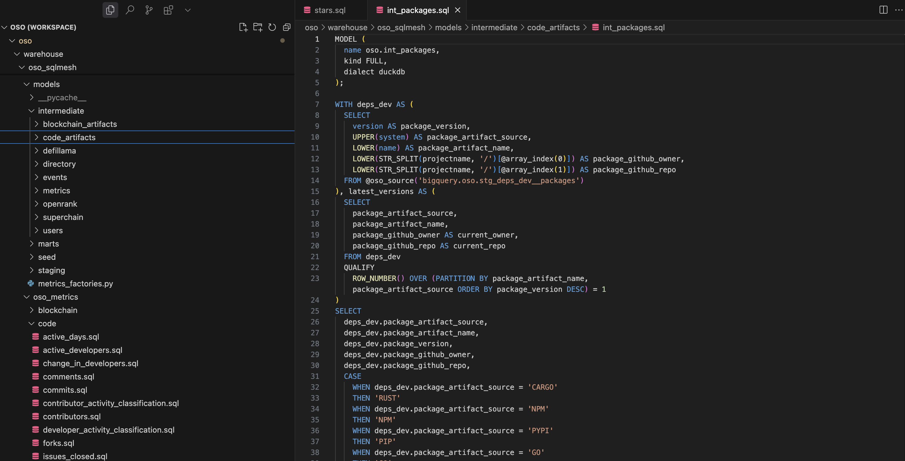

:::info
This guide provides a detailed workflow for contributing a new data model to OSO. It assumes you have already completed the [Quickstart guide](../quickstart.md) and have a local development environment set up.
:::

## Workflow for Contributing Models

When contributing new models to OSO, follow this workflow:

1.  **Understand the Data**: Familiarize yourself with the existing data sources and models.
2.  **Design Your Model**: Plan what your model will do and how it fits into the existing structure.
3.  **Implement the Model**: Write your SQL model using SQLMesh syntax and appropriate macros.
4.  **Test Locally**: Run your model against local data to ensure it works correctly.
5.  **Submit a Pull Request**: Contribute your model back to the OSO repository.

### 1. Design Your Model

Connect to the database and explore the data using your preferred SQL client. You can also use **pyoso** to simulate the SQL that you want to write in a Notebook or Python script. This will help you understand the structure of the data and how to join tables together.

Once you have tested the SQL you want working in your client, you should determine where to place it and what to name it. See the [Core Concepts guide](../core-concepts.md#model-structure) for help in finding the appropriate directory. Most models that implement new logic probably belong in one of the intermediate model (`warehouse/oso_sqlmesh/models/intermediate`) or metrics (`warehouse/oso_sqlmesh/oso_metrics`) subdirectories.

The screenshot below shows the structure of the `warehouse/oso_sqlmesh/models` directory in VSCode:



### 2. Implement the Model

When implementing your model, typically the easiest way to get started is to copy an existing model and modify it to suit your needs. This will ensure you have the correct SQLMesh definitions at the top of the file and syntax for your model.

You can do this by:

1.  Copy and pasting an existing model file in the appropriate directory.
2.  Rename the file to match your new model.
3.  Update the `name` parameter in the model definition to match your new model name.
4.  Review the other SQLMesh parameters, particularly the partitioning and grain settings.
5.  Copy over your SQL logic in the body of the model.

The next step is to ensure the SQLMesh macros are used in the appopriate places. This is critical for incremental models, which MUST have a `where` clause that filters the data to the correct time range. This is typically done using the `@start_dt` and `@end_dt` macros, e.g.:

```sql
WHERE block_timestamp BETWEEN @start_dt AND @end_dt
```

If you need to define constants or variables in your model, you can do so using the `@DEF` macro. For example:

```sql
@DEF(transactions_threshold, 1000);
```

You can then use these variables in your SQL queries, e.g.,

```sql
SELECT
  project_id,
  CAST(transaction_count >= @transactions_threshold AS INTEGER) AS meets_criteria
FROM builder_metrics
```

Finally, add comments and descriptive names for CTEs to make your code more readable and maintainable. You can use the standard SQL comment syntax `--` to add comments to your code. Longer comments should use docstring syntax `/* ... */`.

### 3. Test Your Model

Before submitting your models, it's important to test them thoroughly to ensure they work as expected. For a comprehensive guide on testing, see [Test and Validate Models](./test-and-validate-models.md).

### 4. Submit Your Model

Once you've tested your models and are confident they work correctly, you can submit them to the OSO repository:

1.  **Create a Branch**: Create a new branch for your changes:

    ```bash
    git checkout -b add-new-metric
    ```

2.  **Add Your Files**: Add your new model files:

    ```bash
    git add warehouse/oso_sqlmesh/models/your_model_file.sql
    ```

    or simply to add all files:

    ```bash
    git add .
    ```

3.  **Commit Your Changes**: Commit with a descriptive message:

    ```bash
    git commit -m "feat(sqlmesh): Add new metric for valuing software dependencies"
    ```

4.  **Push Your Changes**: Push your branch to GitHub:

    ```bash
    git push origin add-new-metric
    ```

5.  **Create a Pull Request**: Go to the OSO GitHub repository and create a pull request for your branch.

In your pull request description, include:

- A brief explanation of what your model does
- Any dependencies it has
- How to test it
- Any other relevant information

The OSO team will review your submission and provide feedback if needed.
