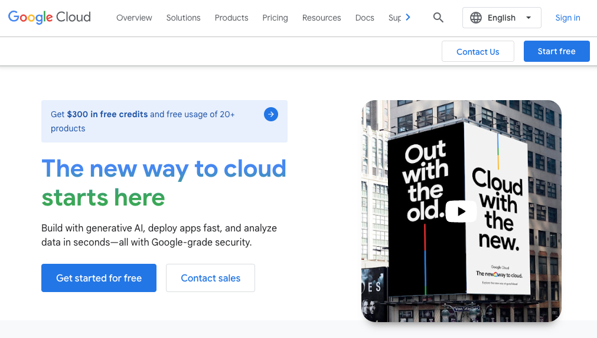
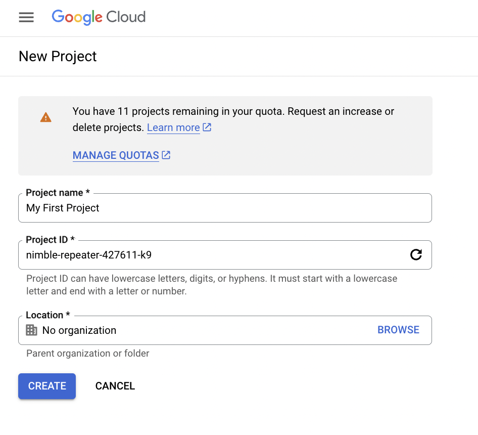
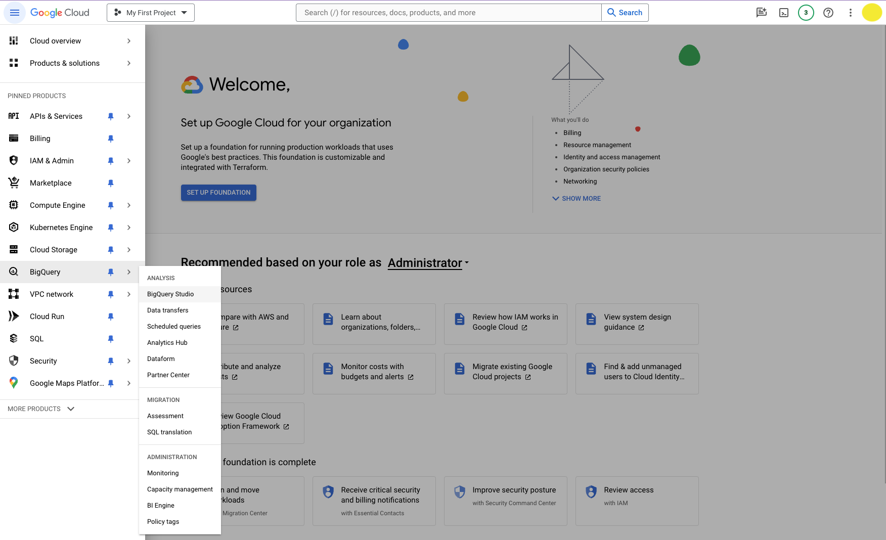
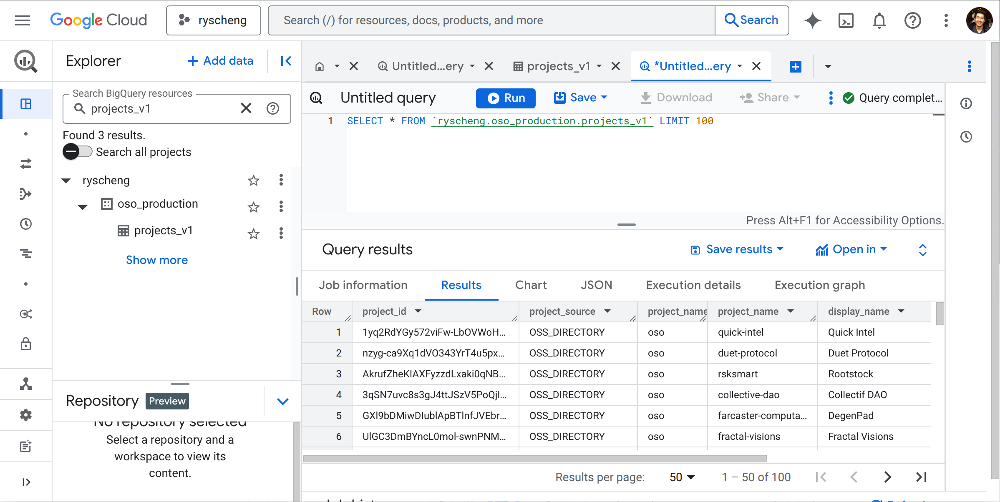

import Link from "@docusaurus/Link";
import Button from "../../src/components/plasmic/Button";


OSO's data lake is currently located in BigQuery on Google Cloud (GCP).
Every data model is made publicly available by a BigQuery dataset.

This page will guide you through the process of subscribing to the OSO production dataset and making your first query.

## Sign up for Google Cloud

Navigate to [Google Cloud](https://cloud.google.com/) and log in.
If this is your first time here, you can sign up for a free cloud account
using your existing Google account.
If you already have a GCP account,
[skip to the dataset](#subscribe-to-the-oso-production-dataset).



First, select a country and agree to the terms of service.
Then, you need to enter your payment information for verification
and answer a few marketing questions.


:::tip
GCP offers a free tier that includes $300 in credits. After that, it is easy to stay in the free tier provided you remain under the
1TB per month limit for BigQuery data processed.
:::

Finally, you will be brought to the admin console where you can create a new project.
Feel free to name this GCP project anything you'd like.
(Or you can simply leave the default project name 'My First Project'.)

_Note: you won't be able to create a new project if you're not an administrator of your Google organization_



## Subscribe to the OSO production dataset

Go to the [BigQuery Console](https://console.cloud.google.com/bigquery).
Navigate to **BigQuery** from the left-hand menu and
then click on **BigQuery Studio** from the hover menu.



The console features an **Explorer** frame on the left-hand side,
which lists all the datasets available to you,
and a **Studio Console** which has tabs for organizing your work.
This will be your workspace for querying the OSO dataset.


Click on the following link to subscribe to the OSO production dataset:

<Button
  size={"compact"}
  color={"blue"}
  target={"_blank"}
  link={
    "https://console.cloud.google.com/bigquery/analytics-hub/exchanges/projects/87806073973/locations/us/dataExchanges/open_source_observer_190181416ae/listings/oso_data_pipeline_190187c6517"
  }
  children={"Subscribe on BigQuery"}
/>

Create a linked dataset in your own GCP project.


## Make your first query

Open a new tab by clicking on the `+` icon
on the top right of the console to `Create SQL Query`.

From here you will be able to write any SQL you'd like any OSO dataset.
For example, you can query the `oso_production` dataset for
all available collections like this:

```sql
SELECT *
FROM `YOUR_PROJECT_NAME.oso_production.collections_v1`
```

**Remember to update the project name in the query.**

Click **Run** to execute your query.
The results will appear in a table at the bottom of the console.



The console will help you complete your query as you type, and will also provide you with a preview of the results and computation time. You can save your queries, download the results, and even make simple visualizations directly from the console.

:::tip
To explore all the OSO datasets available, see the 
[Data Overview](../integrate/datasets/index.mdx).

- **oso_production** contains all production data. This can be quite large depending on the dataset.
- **oso_playground** contains only the last 2 weeks for every dataset. We recommend using this for development and testing.
  :::

## Next steps

Now that you're set up, there are many ways to contribute to OSO and integrate the data with your application:

- [SQL Query Guide](../integrate/query-data.mdx) for more details on running effective queries
- [Write Python notebooks](../guides/notebooks/index.mdx) for advanced analysis and visualizations
- [Propose an impact model](../contribute-models/data-models.md) to run in the OSO data pipeline
- [Query the OSO API](../integrate/api.md) for impact metrics and project info to integrate into your application
