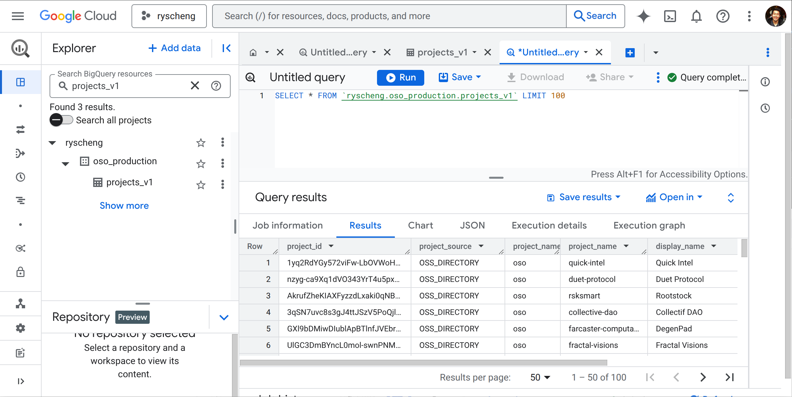

import Link from "@docusaurus/Link";

:::info
There are two easy ways of accessing OSO datasets: through our GraphQL API and through our data warehouse on BigQuery. For integrations, you'll need API access. For exploratory analysis and impact data science, it's best to go direct to the data warehouse. 
:::

## Generate an API key

---

The OSO GraphQL API serves impact metrics for OSS projects, collections, and artifacts. Access to the OSO GraphQL API is necessary for any integration with OSO datasets. 

First, navigate to [www.opensource.observer](https://www.opensource.observer) and create a new account.

If you already have an account, log in. Then create a new personal API key:

1. Go to [Account settings](https://www.opensource.observer/app/settings)
2. In the "API Keys" section, click "+ New"
3. Give your key a label - this is just for you, usually to describe a key's purpose.
4. You should see your brand new key. **Immediately** save this value, as you'll **never** see it again after refreshing the page.
5. Click "Create" to save the key.

You can create as many keys as you like.


## Login to BigQuery

---

OSO's data warehouse is currently located on BigQuery and is available publicly by
referencing it as `opensource-observer.oso`. If you're looking to explore the
data, or to contribute to our public set of models, you will need to have an
account with GCP (Google Cloud Platform).


### Sign up free


If this is your first time getting into GCP, you can do so by going
[here](https://cloud.google.com/).

From there you'll want to click on "Start free" or "Get started for free". You will then be prompted to login with your Google account.


Once you're logged in, you can then proceed to setting up your account. First, select a country and agree to the terms of service. Then, you need to enter your payment information for verification.


:::tip
GCP offers a free tier that includes $300 in credits. After that, it is easy to stay in the free tier provided you remain under the
1TB per month limit for BigQuery data processed (more on that later).
:::


After you've created your account, you will then be asked a few marketing questions from Google. Fill these out as appropriate.

Finally, you will be brought to the admin console where you can create a new project. Feel free to name this GCP project anything you'd like. (Or you can simply leave the default project name 'My First Project'.)

Navigate to **BigQuery** from the left-hand menu and then click on **BigQuery Studio** from the hover menu. This will take you to the BigQuery Console.


The console features an **Explorer** frame on the left-hand side, which lists all the datasets available to you, and a **Studio Console** which has tabs for organizing your work. This will be your workspace for querying the OSO dataset. If this is your first time, you will likely see a welcome message on the first tab in the Studio Console. Now you're ready to start exploring OSO datasets!


### Query the `oso_playground` dataset

If you just created your GCP account by following the steps above, then you'll already be in the BigQuery Console. However, if you're just joining us because you already have an account, then go directly to the BigQuery Console by clicking [here](https://console.cloud.google.com/bigquery).

Close the first tab on the console or simply navigate to the second tab, which should display a blank query editor. Alternatively, you can open a new tab by clicking on the `+` icon on the top right of the console to `Create SQL Query`.

From here you will be able to write any SQL you'd like against the OSO dataset. For example, you can query the `oso_playground` dataset for all the collections in that dataset like this:

```sql
SELECT *
FROM `opensource-observer.oso_playground.collections`
```

Click **Run** to execute your query. The results will appear in a table at the bottom of the console.




The console will help you complete your query as you type, and will also provide you with a preview of the results and computation time. You can save your queries, download the results, and even make simple visualizations directly from the console.

:::tip
To explore all the OSO datasets available, see [here](https://console.cloud.google.com/bigquery?project=opensource-observer).

- **oso** contains all production data. This can be quite large depending on the dataset.
- **oso\_playground** contains only the last 2 weeks for every datast. We recommend using this for development and testing.
:::

## Setting up for Contributing

At some point, you will probably want to start doing more deep data science,
contributing models, or even contributing data. Normally, there are quite a few
steps to complete this task - setting up gcp service accounts, bigquery
datasets, etc. This is usually a long process so we decided to automate much of
that with our useful wizard. Let's get started!

### System Prequisites

Before you begin you'll need the following:

- Python 3.11 or higher
- Python Poetry
- git
- A GitHub account
- A basic understanding of dbt and SQL
- gcloud
  - See the next section.

### Install `gcloud`

If you don't have `gcloud`, we need this to manage GCP from the command line.
The instructions are [here](https://cloud.google.com/sdk/docs/install).

_For macOS users_: Instructions can be a bit clunky if you're on macOS, so we
suggest using homebrew like this:

```bash
$ brew install --cask google-cloud-sdk
```

### Fork and/or clone the repo

Once you've got everything you need to begin, you'll need to get the [oso
repository](https://github.com/opensource-observer/oso) and clone it to your
local system (replace this url if you've forked the repository):

```bash
$ git clone https://github.com/opensource-observer/oso.git
```

After that process, has completed. `cd` into the oso repository:

```bash
$ cd oso
```

### Running the Wizard

The next step is to install the python dependencies and run the wizard which
will ask you to run `dbt` at the end (Say yes if you'd like to copy the
oso_playground dataset). Simply run:

```bash
$ poetry install && poetry run oso_lets_go
```

Once this is completed, you'll have a full "playground" of your own. If you make
any changes and would like to rerun dbt simply do:

```bash
$ poetry run dbt run
```

:::info
If you would like to remove the need to type `$ poetry run` all the time, you
can do:

```bash
$ poetry shell
```

## Join the Kariba Data Collective

---

Now that you're set up, there are many ways to contribute to OSO and integrate the data with your application:

- [Do Data Science](../integrate/data-science) over OSO data sets
- [Propose an impact model](../contribute/impact-models) to run in our data pipeline
- [Query the OSO API](../integrate/api) for metrics and impact vectors from your web app

If you think you'll be an ongoing contributor to OSO, please apply to join the [Kariba Data Collective](https://kariba.network). 

Membership is free but we want to keep the community close-knit and mission-aligned. As the community grows, we want to reward the most useful contributions and in so doing create a new job category for impact data science.

<Link to="https://kariba.network" className="button button--secondary button--lg">Join the Data Collective</Link>