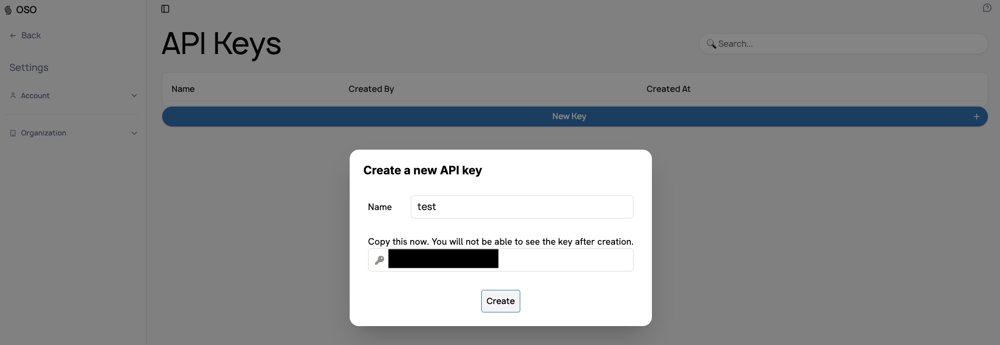

The [OSO](https://www.opensource.observer/settings/api) API serves
queries on metrics and metadata about open source projects.
You can access the full data lake via our `pyoso` Python library.

Let's make your first query in under five minutes.

## Generate an API key

First, go to [www.opensource.observer](https://www.opensource.observer/login) and create a new account.

If you already have an account, [log in](https://www.opensource.observer/login). Then create a new personal API key:

1. Go to [Account settings](https://www.opensource.observer/settings/api)
2. In the "API Keys" section, click "+ New"
3. Give your key a label - this is just for you, usually to describe a key's purpose.
4. You should see your brand new key. **Immediately** save this value, as you'll **never** see it again after refreshing the page.
5. Click "Create" to save the key.



## Install pyoso

You can install pyoso using pip:

```bash
pip install pyoso
```

## Issue your first query

Here is a basic example of how to use pyoso:

```python
from pyoso import Client

# Initialize the client
os.environ["OSO_API_KEY"] = 'your_api_key'
client = Client()

# Fetch artifacts
query = "SELECT * FROM artifacts_v1 LIMIT 5"
artifacts = client.to_pandas(query)

print(artifacts)
```
