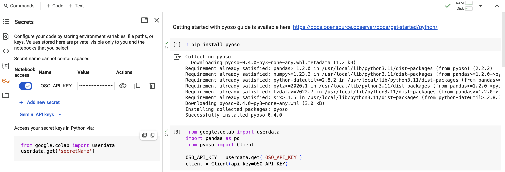

Google Colab is a cloud-based Python notebook that allows you to run your analysis without having to install anything on your local machine.

## Get Started

The fastest way to get started with data science on OSO is to copy one of our notebooks on [Google Colab](https://drive.google.com/drive/folders/1mzqrSToxPaWhsoGOR-UVldIsaX1gqP0F?usp=drive_link).

You can also create a new notebook from scratch and run it in the cloud. Here's how to get started:

1. Create a new Colab notebook [here](https://colab.research.google.com/#create=true).

2. Install pyoso:

   ```python
   !pip install pyoso
   ```

3. Set up your API key:

   Add your API key to your environment variables. You can do this by clicking the key icon, naming your variable `OSO_API_KEY`, and pasting your API key in the value field.

   Then you can access the API key and authenticate with pyoso:

   ```python
   from google.colab import userdata
   import pandas as pd
   from pyoso import Client

   OSO_API_KEY = userdata.get('OSO_API_KEY')
   client = Client(api_key=OSO_API_KEY)
   ```

   

4. Run a test query:

   ```python
   query = """
   SELECT
     project_id,
     project_name,
     display_name
   FROM projects_v1
   WHERE lower(display_name) LIKE lower('%merkle%')
   """
   df = client.to_pandas(query)
   df.head()
   ```

That's it! You're ready to start analyzing the OSO dataset in a Google Colab notebook. Check out our [Tutorials](../../tutorials) for examples of how to analyze the data.

:::tip
You can also download your Colab notebooks to your local machine and run them in Jupyter.
:::
