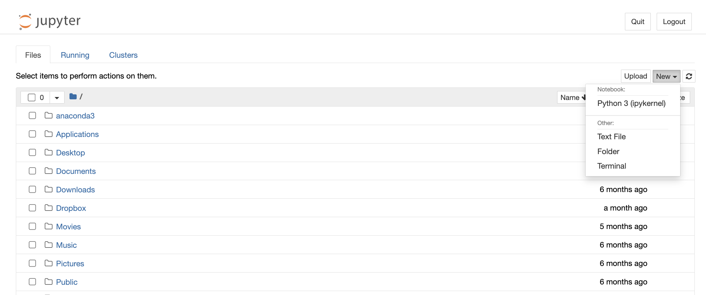
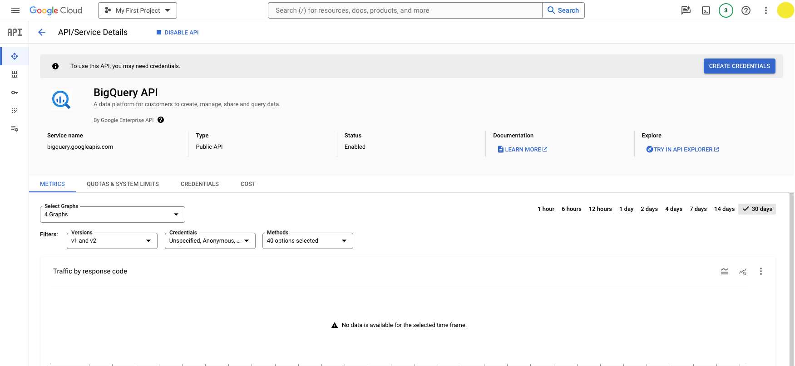
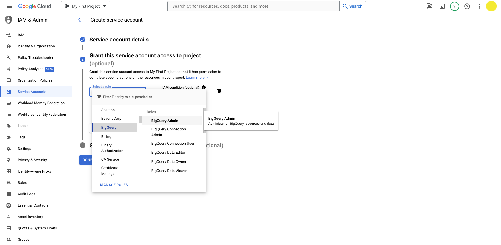
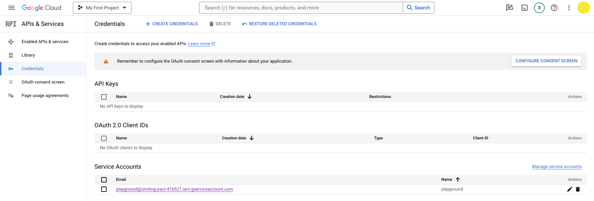
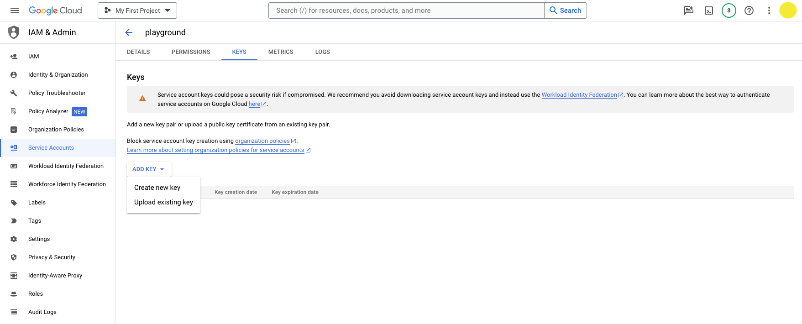

Jupyter is a Python notebook that you can run on your local machine. This section will walk you through setting up a local Jupyter notebook environment, storing your GCP service account key on your machine, and connecting to the OSO data warehouse.

**If you already have Jupyter installed, you can skip the first section.**

## Installation (via Anaconda)

For new users, we recommend [installing Anaconda](https://www.anaconda.com/download). Anaconda conveniently installs Python, the Jupyter Notebook, and other commonly used packages for working with data.

1. Download [Anaconda](https://www.anaconda.com/download). We recommend downloading Anaconda’s latest Python 3 version.

2. Install the version of Anaconda which you downloaded, following the instructions on the download page.

3. After the installation is completed, you are ready to run the notebook server. Open the terminal and execute:

```bash
jupyter notebook
```

4. This will print some information about the notebook server in your terminal, including the URL of the web application (by default, `http://localhost:8888)`). Then, your default web browser should open with a list of files in your current directory. Navigate to **new** and select the option to create a **Python 3 (ipykernel)** Notebook.



Congratulations! You're in. You should have an empty Jupyter notebook on your computer, ready for data sciencing.

:::tip
If you run into issues getting set up with Jupyter, check out the [Jupyter docs](https://docs.jupyter.org/en/latest/install.html).
:::

## Authentication

### Install the BigQuery Python Client Library

We recommend using the [Google Cloud BigQuery Python Client Library](https://cloud.google.com/python/docs/reference/bigquery/latest/index.html) to connect to the OSO data warehouse. This library provides a convenient way to interact with BigQuery from your Jupyter notebook.

From the command line, install **google-cloud-bigquery** either directly on your machine or in a new virtual environment:

```
pip install google-cloud-bigquery
```

If you're using Poetry, you can add the dependency to your `pyproject.toml` file:

```
poetry add google-cloud-bigquery
```

### Obtain a GCP Service Account Key

This section will walk you through the process of obtaining a GCP service account key and connecting to BigQuery from a Jupyter notebook. If you don't have a GCP account, you will need to create one (see [here](../../get-started/index.md) for instructions).

From the [GCP Console](https://console.cloud.google.com/), navigate to the BigQuery API page by clicking **API & Services** > **Enabled APIs & services** > **BigQuery API**.

You can also go there directly by following [this link](https://console.cloud.google.com/apis/api/bigquery.googleapis.com/).


Click the **Create Credentials** button.



You will prompted to configure your credentials:

- **Select an API**: BigQuery API
- **What data will you be accessing**: Application data (Note: this will create a service account)

Click **Next**.

You will be prompted to create a service account:

- **Service account name**: Add whatever name you want (eg, playground-service-account)
- **Service account ID**: This will autopopulate based on the name you entered and give you a service account email
- **Service account description**: Optional: describe the purpose of this service account

Click **Create and continue**.

You will be prompted to grant your service account access to your project.

- **Select a role**: BigQuery > BigQuery Admin



Click **Continue**.

You can skip the final step by clicking **Done**. Or, you may grant additional users access to your service account by adding their emails (this is not required).

You should now see the new service account under the **Credentials** screen.



Click the pencil icon under **Actions** in the **Service Accounts** table.

Then navigate to the **Keys** tab and click **Add Key** > **Create new key**.



Choose **JSON** and click **Create**.

It will download the JSON file with your private key info. You should be able to find the file in your downloads folder.

Now you're ready to authenticate with BigQuery using your service account key.

### Connect to BigQuery from Jupyter

From the command line, open a Jupyter notebook:

```bash
jupyter notebook
```

A Jupyter directory will open in your browser. Navigate to the directory where you want to store your notebook.

Click **New** > **Python 3** to open a new notebook. (Use your virtual environment if you have one.)

You should have a blank notebook open.

Import the BigQuery client library and authenticate with your service account key.

```python

from google.cloud import bigquery
import os

os.environ['GOOGLE_APPLICATION_CREDENTIALS'] = '' # path to your service account key in your downloads folder
client = bigquery.Client()
```

Try a sample query to test your connection:

```python
query = """
    SELECT *
    FROM `{YOUR_PROJECT_ID}.oso_playground.code_metrics_by_project_v1`
    ORDER BY last_commit_date DESC
"""
results = client.query(query)
results.to_dataframe()
```

:::important
Remember to replace `YOUR_PROJECT_ID` with your project id. This will attach the query to your billing account.
:::

If everything is working, you should see a dataframe with the results of your query.

### Keep Your Service Account Key Safe

You should never commit your service account key to a public repository. Instead, you can store it in a secure location on your local machine and reference it in your code using an environment variable.

If you plan on sharing your notebook with others, you can use a package like [python-dotenv](https://pypi.org/project/python-dotenv/) to load your environment variables from a `.env` file.

Always remember to add your `.env` or `credentials.json` file to your `.gitignore` file to prevent it from being committed to your repository.

## Explore the Production Data

Now it's time to move from the "playground" to the "production" dataset. Once you have a working query, you can replace `oso_playground` with `oso_production` to fetch all data available from the production dataset.

Here's a complete code block you can execute to fetch the latest code metrics for all projects in the OSO data warehouse:

```python
from google.cloud import bigquery
import os
import pandas as pd

os.environ['GOOGLE_APPLICATION_CREDENTIALS'] = '' # path to your service account key in your downloads folder
client = bigquery.Client()

query = """
    SELECT *
    FROM `{YOUR_PROJECT_ID}.oso_production.code_metrics_by_project_v1`
    ORDER BY last_commit_date DESC
"""
results = client.query(query)

df = results.to_dataframe()
df.head()
```

## Exporting CSV / JSON files from BigQuery

If you prefer to work with static data, you can export your data from BigQuery to a CSV or JSON file and then import it into your notebook, spreadsheet, or other tool.

1. Navigate to the BigQuery console [here](https://console.cloud.google.com/bigquery).
2. Try a sample query and click **Run** to execute it. For example, you can fetch the latest code metrics for all projects in the OSO data warehouse:
   ```sql
   SELECT *
   FROM `{YOUR_PROJECT_ID}.oso_production.code_metrics_by_project_v1`
   ORDER BY last_commit_date DESC
   ```
3. Click the **Save Results** button to export your data in your preferred format. Note that there are limits to the amount of data you can download locally vs the amount you can save on Google Drive. If you have a large dataset (above 10MB), you may need to save it to Google Drive and then download it from there.


4. Finally, you can import your data into your analysis tool of choice. For example, you can import a CSV file into a Pandas dataframe in a Jupyter notebook:

   ```python
   import pandas as pd

   df = pd.read_csv('path/to/your/file.csv')
   ```

That's it! You're ready to start analyzing the OSO dataset in a Jupyter notebook. Check out our [Tutorials](../../tutorials) for examples of how to analyze the data.
