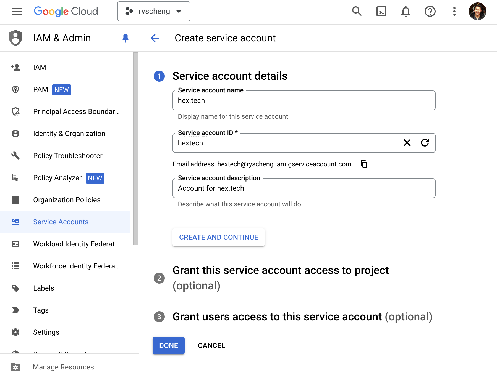
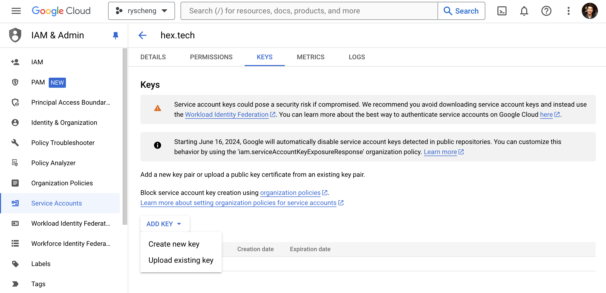
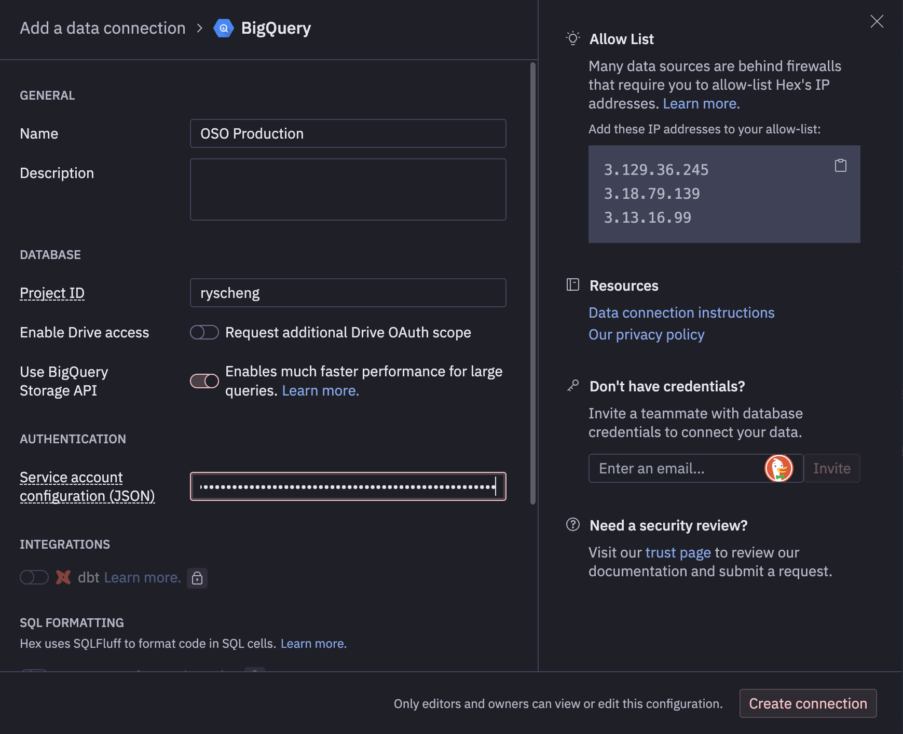
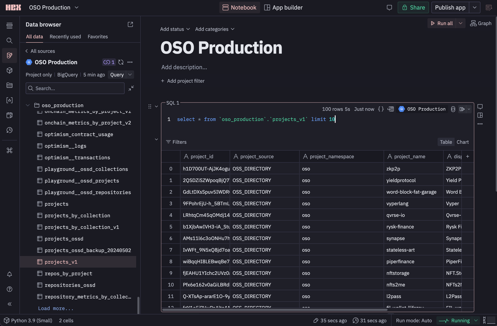

import Button from "../../../src/components/plasmic/Button";

OSO datasets and models are public and can be accessed on BigQuery. This allows you to connect and explore the data using various tools.

## Subscribe to an OSO dataset

First, we need to subscribe to an OSO dataset in your own
Google Cloud account.
You can see all of our available datasets in the
[Data Overview](../../integrate/datasets/index.mdx).

We recommend starting with the OSO production data pipeline here:

<Button
  size={"compact"}
  color={"blue"}
  target={"_blank"}
  link={
    "https://console.cloud.google.com/bigquery/analytics-hub/exchanges/projects/87806073973/locations/us/dataExchanges/open_source_observer_190181416ae/listings/oso_data_pipeline_190187c6517"
  }
  children={"Subscribe on BigQuery"}
/>

## Connect your third party tool

BigQuery has built-in support in many BI, notebook, and
data analysis tools. These tools typically offer many visualization
and exploration tools well-beyond what you can query in the BigQuery Studio.

To see how to connect to a specific tool,
check out a specific guide:

- [Tableau](https://cloud.google.com/bigquery/docs/analyze-data-tableau)
- [Metabase](https://www.metabase.com/docs/latest/databases/connections/bigquery)
- [Hex](https://learn.hex.tech/docs/connect-to-data/data-connections/data-connections-introduction)
- [Looker](https://cloud.google.com/bigquery/docs/visualize-looker-studio)
- [Observable](https://observablehq.com/documentation/data/databases/overview)
- [Databricks](https://docs.databricks.com/en/connect/external-systems/bigquery.html)

## Hex example

For the rest of this guide, we'll use Hex as a running example.

First, you'll need to
[create a service account](https://cloud.google.com/iam/docs/creating-managing-service-account-keys#creating)
in GCP and download the JSON key file.
Click [here](https://console.cloud.google.com/iam-admin/serviceaccounts?walkthrough_id=iam--create-service-account-keys&start_index=1#step_index=1)
to navigate to the credentials page on Google Cloud.

Click "+ Create Service Account":

Grant this new service account the "BigQuery User"
and "BigQuery Data Viewer" roles:

With the newly created service account,
navigate to the "Keys" tab, and
click "Create New Key".
Create a new JSON key and download the file.

In your Hex project, navigate to the "Data browser" pane
and click "BigQuery" under "Add a data connection".

Fill in the connection details.
Use the GCP project that you previously
subscribed the OSO dataset into.
You also need to copy and paste the entire contents of
the JSON key file you downloaded earlier.

Give hex a minute to refresh the available datasets.
Once that is done, you should be able to browse
the OSO datasets in the "Data browser" pane.
Now try running a query on the OSO dataset!

## Share your work!

Open Source Observer is a public good for lifting
the collective intelligence of networks.
Please share your insights and tag us!
We love to amplify great insights.
