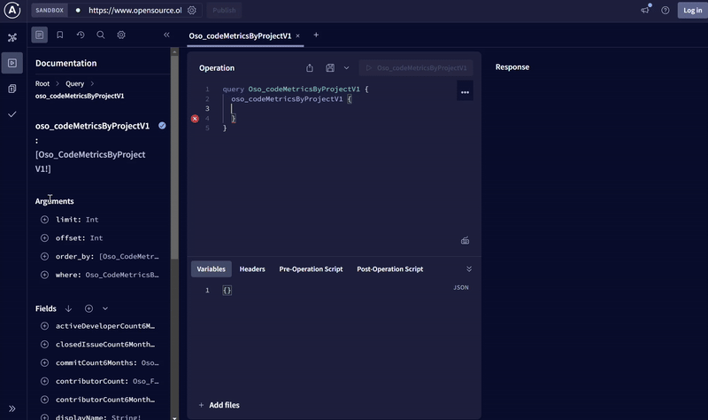

The OSO API currently only allows read-only GraphQL queries against a subset
of OSO data (i.e. only mart models like impact metrics, project info).
This API should only be used to fetch data to integrate into a live application in production.
If you want access to the full dataset for data exploration, check out the guides on
[performing queries](./query-data.mdx)
and [Python notebooks](../guides/notebooks/index.mdx).

## GraphQL Endpoint

All API requests are sent to the following URL:

```
https://www.opensource.observer/api/v1/graphql
```

### GraphQL Explorer

You can navigate to our
[public GraphQL explorer](https://www.opensource.observer/graphql)
to explore the schema and execute test queries.



The GraphQL schema is automatically generated from [`warehouse/oso_sqlmesh/models/marts`](https://github.com/opensource-observer/oso/tree/main/warehouse/oso_sqlmesh/models/marts). Any sqlmesh model defined there will automatically be exported to our GraphQL API. See the guide on [adding models](../contribute-models/data-models.md) for more information on contributing to our marts models.

:::warning
Our data pipeline is under heavy development and all table schemas are subject to change.
The most stable models will be versioned mart models.
We will monitor usage of mart models, both to ensure quality of service
and to deprecate models that are no longer used.

Please join us on [Discord](https://www.opensource.observer/discord) to stay up to date on updates.
:::

### Example queries

This query will fetch the first 10 projects in
[oss-directory](https://github.com/opensource-observer/oss-directory).

```graphql
query GetProjects {
  oso_projectsV1(limit: 10) {
    projectId
    projectSource
    projectNamespace
    projectName
    displayName
    description
  }
}
```

This query will fetch the first 10 metrics available in OSO

```graphql
query GetMetrics {
  oso_metricsV0(limit: 10) {
    metricId
    metricSource
    metricNamespace
    metricName
    displayName
    description
    definitionRef
  }
}
```

This query will fetch **key metrics** for the Open Source Observer project,
whose `projectId` is `UuWbpo5bpL5QsYvlukUWNm2uE8HFjxQxzCM0e+HMZfk=`.

```graphql
query GetKeyMetricsForProject {
  oso_keyMetricsByProjectV0(
    where: {
      projectId: { _eq: "UuWbpo5bpL5QsYvlukUWNm2uE8HFjxQxzCM0e+HMZfk=" }
    }
  ) {
    amount
    metricId
    projectId
    sampleDate
    unit
  }
}
```

## Authentication

All requests to the OSO API must be authenticated.

### Generate an API key

First, go to [www.opensource.observer](https://www.opensource.observer) and create a new account.

If you already have an account, log in. Then create a new personal API key:

1. Go to [Account settings](https://www.opensource.observer/app/settings)
2. In the "API Keys" section, click "+ New"
3. Give your key a label - this is just for you, usually to describe a key's purpose.
4. You should see your brand new key. **Immediately** save this value, as you'll **never** see it again after refreshing the page.
5. Click "Create" to save the key.

**You can create as many keys as you like.**


### How to Authenticate

In order to authenticate with the API service, you have to use the `Authorization` HTTP header and `Bearer` authentication on all HTTP requests, like so:

```js
const headers = {
  Authorization: `Bearer ${DEVELOPER_API_KEY}`,
};
```

## Rate Limits

All requests are rate limited. There are currently 2 separate rate limit tiers:

- Anyone can make a query, subject to a standard rate limit.
- Developers who have been accepted into the [Kariba Data Collective](https://www.kariba.network) will be subject to a higher rate limit.

:::warning
We are still currently adjusting our rate limits based on capacity and demand. If you feel like your rate limit is too low, please reach out to us on our [Discord](https://www.opensource.observer/discord).
:::
