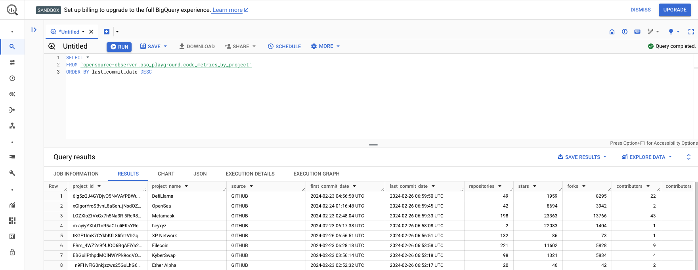

:::info
Notebooks are a great way for data scientists to explore data, organize ad-hoc analysis, and share insights. We've included several template notebooks to help you get started working with OSO data. You can find these in the [community directory](https://github.com/opensource-observer/insights/tree/main/community/notebook_templates) of our insights repo. We encourage you to share your analysis and visualizations with the OSO community.
:::

## Setting Up Your Environment

---

We will assume you have some familiarity with setting up a local Python environment and running [Jupyter notebooks](https://jupyter.org/). We strongly recommend using Python >= 3.11. However, this guide should work for Python >= 3.7.

:::tip
If this is your first time setting up a data science workstation, we recommend [downloading Anaconda](https://www.anaconda.com/download) and following their instructions for installation. Then, check out the [Jupyter docs](https://jupyter-notebook-beginner-guide.readthedocs.io/en/latest/) to learn how to write your first notebooks.
:::

### Install Standard Dependencies

You should have the following standard dependencies installed in your local environment. It is a best practice to use a Python virtual environment tool such as [virtualenv](https://virtualenv.pypa.io/en/latest/) to manage dependencies.

#### For working with dataframes and vector operations

- [pandas](https://pandas.pydata.org/)
- [numpy](https://numpy.org/)

#### For graph and statistical analysis

- [networkx](https://networkx.org/)
- [scikit-learn](https://scikit-learn.org/stable/)
- [scipy](https://www.scipy.org/)

#### For charting and data visualization

- [matplotlib](https://matplotlib.org/)
- [seaborn](https://seaborn.pydata.org/)
- [plotly](https://plotly.com/python/)

### Install the BigQuery Python Client Library

From the command line, install **google-cloud-bigquery** either directly on your machine or in a new virtual environment:

```bash
$ pip install google-cloud-bigquery
```

## Connecting to GCP

---

This section will walk you through the process of obtaining a GCP service account key and connecting to BigQuery from a Jupyter notebook. If you don't have a GCP account, you will need to create one (see [here](../getting-started/first-queries) for instructions).

### Obtain a GCP Service Account Key

From the [GCP Console](https://console.cloud.google.com/), navigate to the BigQuery API page by clicking **API & Services** > **Enabled APIs & services** > **BigQuery API**.

You can also go there directly by following [this link](https://console.cloud.google.com/apis/api/bigquery.googleapis.com/).


---

Click the **Create Credentials** button.


---

You will prompted to configure your credentials:

- **Select an API**: BigQuery API
- **What data will you be accessing**: Application data (Note: this will create a service account)

Click **Next**.

---

You will be prompted to create a service account:

- **Service account name**: Add whatever name you want (eg, playground-service-account)
- **Service account ID**: This will autopopulate based on the name you entered and give you a service account email
- **Service account description**: Optional: describe the purpose of this service account

Click **Create and continue**.

---

You will be prompted to grant your service account access to your project.

- **Select a role**: BigQuery > BigQuery Admin


Click **Continue**.

---

You can skip the final step by clicking **Done**. Or, you may grant additional users access to your service account by adding their emails (this is not required).

You should now see the new service account under the **Credentials** screen.


---

Click the pencil icon under **Actions** in the **Service Accounts** table.

Then navigate to the **Keys** tab and click **Add Key** > **Create new key**.


---

Choose **JSON** and click **Create**.

It will download the JSON file with your private key info. You should be able to find the file in your downloads folder.

Now you're ready to authenticate with BigQuery using your service account key.

### Connect to BigQuery from a Jupyter Notebook

From the command line, open a Jupyter notebook:

```bash
$ jupyter notebook
```

A Jupyter directory will open in your browser. Navigate to the directory where you want to store your notebook.

Click **New** > **Python 3** to open a new notebook. (Use your virtual environment if you have one.)

---

You should have a blank notebook open.

Import the BigQuery client library and authenticate with your service account key.

```python

from google.cloud import bigquery
import os

os.environ['GOOGLE_APPLICATION_CREDENTIALS'] = '' # path to your service account key in your downloads folder
client = bigquery.Client()
```

Try a sample query to test your connection:

```python
query = """
    SELECT *
    FROM `opensource-observer.oso_playground.collections`
"""
results = client.query(query)
results.to_dataframe()
```

If everything is working, you should see a dataframe with the results of your query.

### Safekeeping Your Service Account Key

You should never commit your service account key to a public repository. Instead, you can store it in a secure location on your local machine and reference it in your code using an environment variable.

If you plan on sharing your notebook with others, you can use a package like [python-dotenv](https://pypi.org/project/python-dotenv/) to load your environment variables from a `.env` file.

Always remember to add your `.env` or `credentials.json` file to your `.gitignore` file to prevent it from being committed to your repository.

## Running Your Own Analysis

---

Once you have your local environment set up, you can fork any of the notebooks in the [community directory](https://github.com/opensource-observer/insights/tree/main/community/notebooks).

These notebooks typically have the following structure:

- **Setup**: Import dependencies and set up environment variables.
- **Query**: Fetch data from the OSO data warehouse.
- **Transform**: Clean and transform the data into a format that is ready for analysis.
- **Analyze**: Perform analysis and generate visualizations.
- **Export**: Export the results to a CSV or JSON file.

This next section will help you create a notebook from scratch, performing each of these steps using the OSO playground dataset.

The example below fetches the latest code metrics for all projects in the OSO data warehouse and generates a scatter plot of the number of forks vs the number of stars for each project.

You can find the full notebook [here](https://github.com/opensource-observer/insights/blob/main/community/notebooks/oso_starter_tutorial.ipynb).

### Setup

From the command line, create a new Jupyter notebook:

```bash
$ jupyter notebook
```

A Jupyter directory will open in your browser. Navigate to the directory where you want to store your notebook. Create a new notebook.

Import the following dependencies:

```python
from google.cloud import bigquery
import os
import pandas as pd
import matplotlib.pyplot as plt
import seaborn as sns
```

Authenticate with your service account key:

```python
os.environ['GOOGLE_APPLICATION_CREDENTIALS'] = '' # path to your service account key in your downloads folder
client = bigquery.Client()
```

### Query

In this example, we will fetch the latest code metrics for all projects in the OSO data warehouse.

```python
query = """
    SELECT *
    FROM `opensource-observer.oso_playground.code_metrics_by_project`
    ORDER BY last_commit_date DESC
"""
results = client.query(query)
```

We recommend exploring the data in [the BigQuery console](https://console.cloud.google.com/bigquery) before running your query in your notebook. This will help you understand the structure of the data and the fields you want to fetch.

[](https://console.cloud.google.com/bigquery)

---

### Transform

Once you have fetched your data, you can transform it into a format that is ready for analysis.

Store the results of your query in a dataframe and preview the first few rows:

```python
df = results.to_dataframe()
df.head()
```

Next, we will apply some basic cleaning and transformation to the data:

- Remove any rows where the number of forks or stars is 0; copy to a new dataframe
- Create a new column to indicate whether the project has had recent activity (commits in the last 6 months)

```python
dff = df[(df['forks']>0) & (df['stars']>0)].copy()
dff['recent_activity'] = dff['commits_6_months'] > 0
```

### Analyze

Now that we have our data in a format that is ready for analysis, we can perform some basic analysis and generate visualizations.

We'll start by creating a logscale scatter plot of the number of forks vs the number of stars for each project.

```python
fig, ax = plt.subplots(figsize=(10,10))
sns.scatterplot(
    data=dff,
    x='stars',
    y='forks',
    hue='recent_activity',
    alpha=.5,
    ax=ax
)
ax.set(
    xscale='log',
    yscale='log',
    xlim=(.9,10_000),
    ylim=(.9,10_000)
)
ax.set_title("Ratio of stars to forks by project", loc='left')
```

Here's a preview of the scatter plot:


We can continue the analysis by differentiating between projects that have a high ratio of stars to forks and those that have a low ratio. We'll borrow [Nadia Asparouhova](https://nadia.xyz/oss/)'s term "stadium" and simplistically apply it to any project that has a higher than average ratio of stars to forks.

```python
dff['stars_to_forks_ratio'] = dff['stars'] / dff['forks']
avg = dff['stars_to_forks_ratio'].mean()
dff['stadium_projects'] = dff['stars_to_forks_ratio'] >= avg
print(avg)
```

We can now perform further analysis to see how the distribution of stars to forks ratios is spread across the dataset, with a vertical line indicating the average ratio.

```python
fig, ax = plt.subplots(figsize=(15,5))
sns.histplot(dff['stars_to_forks_ratio'], ax=ax)
ax.axvline(avg, color='red')
```

Here's a preview of the histogram:


Finally, we'll make a crosstab to see how many projects are classified as "stadium" and how many are not.

```python
pd.crosstab(dff['recent_activity'], dff['stadium_projects'])
```

At the time of writing, the crosstab shows 110 "stadium" projects with recent activity versus 829 non-stadium projects.

Some of the top projects in the OSO dataset by this categorization include [IPFS](https://github.com/ipfs), [Trail of Bits](https://github.com/trailofbits), and [Solidity](https://github.com/ethereum/solidity).

### Export

When working with smaller datasets like this one, it's helpful to export the results of your analysis to a CSV or JSON file. This preserves a snapshot of the data for further analysis or sharing with others.

```python
dff.to_csv('code_metrics.csv', index=False)
```

## Creating Impact Vectors

---

An **impact vector** is a direction of positive impact that a collection of similar projects in an open source ecosystem should work towards. It compares relative performance across a distribution of projects.

Consider a simple impact metrica about a project: 50 forks. It would be difficult to interpret whether an absolute number like 50 forks is "good" or "bad" without context about the other projects in the ecosystem. However, if we know that the average number of forks for all projects in the ecosystem is 10, we might be able to say that a project with 50 forks is "exceptional".

There are a variety of statistical techniques for normalizing data and setting performance benchmarks. This section provides a basic example of how to create an impact vector and run a distribution analysis. The complete specification for an impact vector is available [here](../how-oso-works/resources/impact-vector-spec).

You can find the notebook shown in this tutorial [here](https://github.com/opensource-observer/insights/blob/main/community/notebooks/oso_impact_vector_starter.ipynb).

### Define the Impact Vector

Choose a metric that is relevant to the vector and can be calculated via a [dbt transform](../how-oso-works/resources/metrics).

In this example, we will use `forks` as our impact metric.

We will apply a very liberal filter: any project with at least 1 fork in any of its repos will be included in the analysis.

As we saw in [the first tutorial above](#analyze), forks have a wide range of values. Therefore, we will use a log scale to transform the distribution. We will also normalize to range of 0 to 1.

### Fetching the Data

We will fetch the latest fork counts for all projects in the OSO data warehouse and store them in a dataframe. We also need to import `numpy` and `sklearn` for some of our processing.

```python
from google.cloud import bigquery
import os
import pandas as pd
import numpy as np
import matplotlib.pyplot as plt
import seaborn as sns
from sklearn.preprocessing import MinMaxScaler

os.environ['GOOGLE_APPLICATION_CREDENTIALS'] = '' # path to your service account key in your downloads folder
client = bigquery.Client()

query = """
    SELECT
        project_name,
        forks
    FROM `opensource-observer.oso_playground.code_metrics_by_project`
    WHERE forks > 0
"""
results = client.query(query)

df = results.to_dataframe()
df.set_index('project_name', inplace=True)
```

---

### Normalizing the Data

Now we have a dataframe with the latest fork counts for all projects in the OSO data warehouse. Next, we will normalize the fork column into an impact vector. We will use the [z-score](https://en.wikipedia.org/wiki/Standard_score) to measure how many standard deviations a project's forks are from the mean, and the normalize the z-scores to a 0-1 scale.

```python
# take the log of a project's forks
df['log_forks'] = np.log(df['forks'])

# get the zscore for each project
logmean = df['log_forks'].mean()
logstd  = df['log_forks'].std()
df['zscore_forks'] = (df['log_forks'] - logmean) / logstd

# normalize to a 0-1 scale
minmax_scaler = MinMaxScaler(feature_range=(0, 1))
df['vector_forks'] = minmax_scaler.fit_transform(np.array(df['zscore_forks']).reshape(-1, 1)).flatten()

df.sort_values('vector_forks', inplace=True)
```

We can take a look at the distribution of the impact vector using a KDE plot. Fortunately, it looks like the distribution is fairly normal, so our model is working well.


We can also take a look at the relationship between absolute forks and the impact vector. Given the exponential nature of the fork count, we should expect to see a logarithmic relationship.


:::warning
Not all impact vectors will have a log normal distribution. It's important to understand the distribution of the impact vector and experiment with different models before setting performance targets.
:::

---

### Comparing Projects

Now that we have our impact vector, we can compare projects to see how they perform relative to the distribution. We can also set performance targets based on the normalized distribution. For example, an "exceptional" project might be in the top 5% of the distribution and an "excellent" project might be in the top 20%.

Here's one way of visualizing the impact vector for `forks`. The chart shows a random sample of 50 projects and plots the impact scores on the X axis. The absoluate number of forks is shown next to each point. The color of the points represents the zscore of the project's forks.


The script for rendering this chart is shown below:

```python
fig, ax = plt.subplots(figsize=(10,10), dpi=144)

# take a sample of 50 projects (including the top 2)
dff = (
    pd.concat([
        df.iloc[:-2,:].sample(48, weights='vector_forks'),
        df.iloc[-2:,:]
    ], axis=0)
    .sort_values(by='vector_forks')
)

# create a scatter plot showing relative performance
ax.scatter(
    x=dff['vector_forks'],
    y=[name[:25] for name in dff.index],
    c=dff['zscore_forks'],
    vmin=df['zscore_forks'].min(),
    vmax=df['zscore_forks'].max(),
    cmap='coolwarm',
    lw=1,
    edgecolor='black',
    zorder=2
)

# add annotations that show the actual impact metric values
for y,(_,row) in enumerate(dff.iterrows()):
    ax.text(
        s=f"{row['forks']:,.0f}",
        x=row['vector_forks']+.0125,
        y=y-.0875,
        va='center',
        fontsize=8,
        zorder=2,
        bbox=dict(facecolor='white', lw=0, pad=0.01)
    )

# provide gridlines for different performance levels
ax.set_xlim(-0.025,1.1)
ax.set_xticks([
    df['vector_forks'].median(),
    df['vector_forks'].quantile(.8),
    df['vector_forks'].quantile(.95),
    1
], labels=['Average', 'Excellent', 'Exceptional', 'The Best'])
ax.grid(which='major', axis='x', color='black', lw=.5)
```

## Sharing Analysis

---

Once you have completed your analysis, you can share it with the community by submitting a PR to the [insights repo](https://github.com/opensource-observer/insights).

If you have ideas for analysis that you would like to see or receive help on, please [open an issue](https://github.com/opensource-observer/insights/issues) and tag one of the maintainers.
