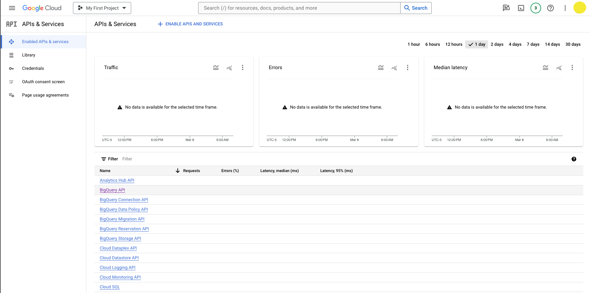
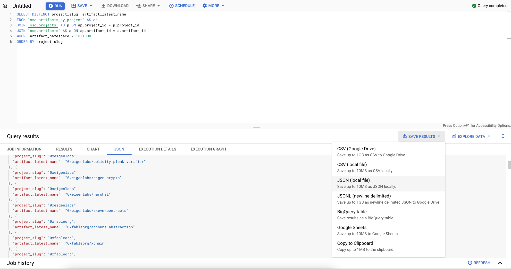
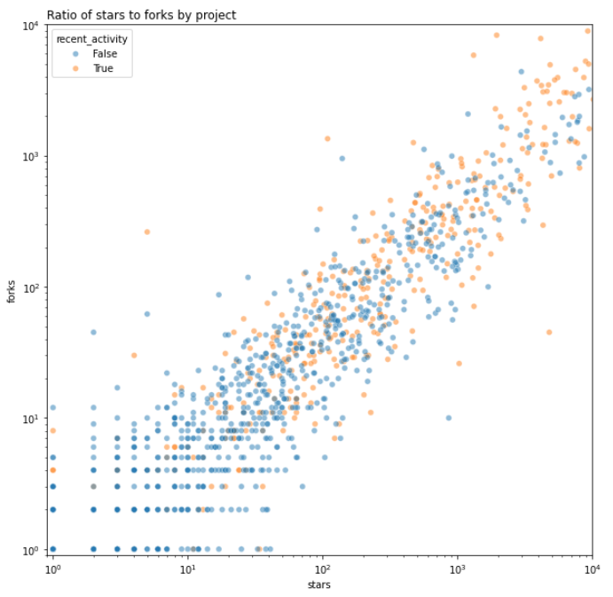
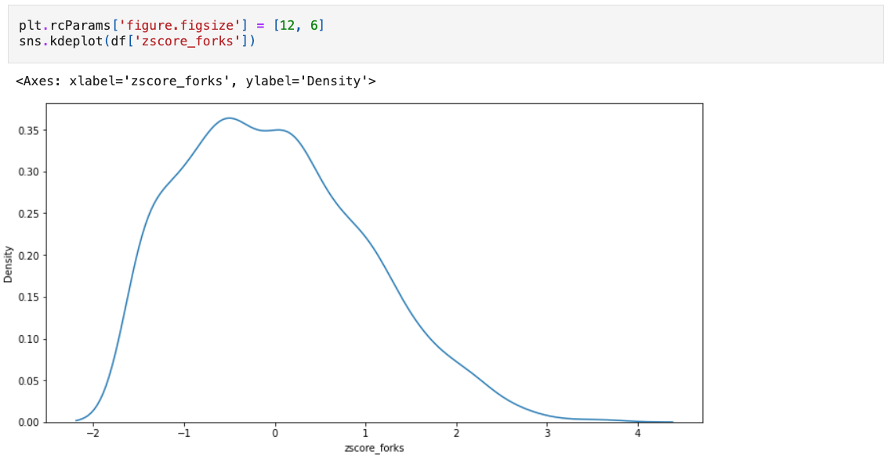
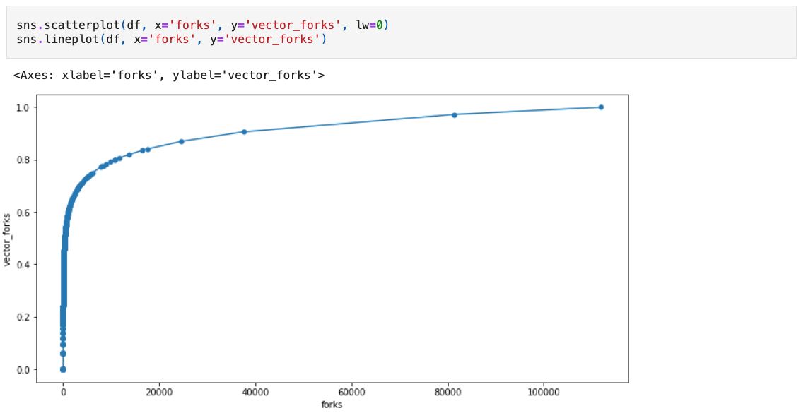
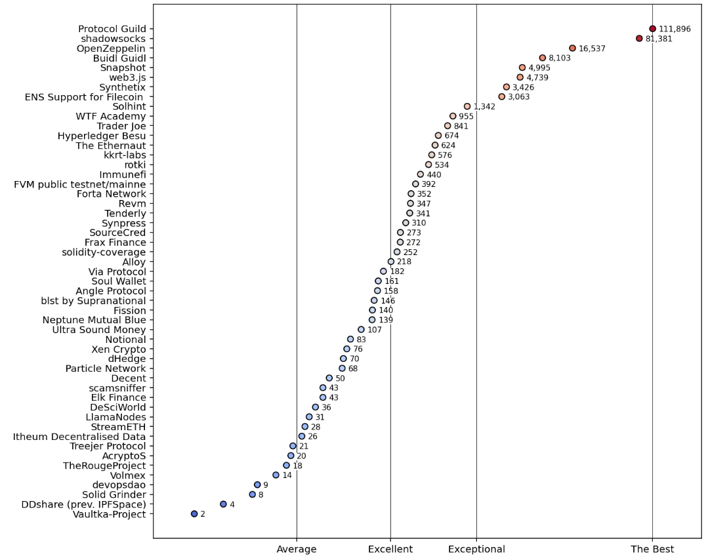

:::info
Notebooks are a great way for data scientists to explore data, organize ad-hoc analysis, and share insights. We've included several template notebooks to help you get started working with OSO data. You can find these on [Google Colab](https://drive.google.com/drive/folders/1mzqrSToxPaWhsoGOR-UVldIsaX1gqP0F?usp=drive_link) and in the [community directory](https://github.com/opensource-observer/insights/tree/main/community/notebooks) of our insights repo. We encourage you to share your analysis and visualizations with the OSO community.
:::

:::warning
You will need access to the OSO data warehouse to do data science. See our getting started guide [here](../get-started/#login-to-bigquery).
:::

## Fetching Data

There are three common ways to fetch data from the OSO data warehouse so you can run analysis on it:

1. **Google Colab**: Run your analysis in the cloud using Google Colab.
2. **Jupyter on Your Machine**: Run your analysis locally using Jupyter.
3. **Export to CSV / JSON**: Export your data from BigQuery to a CSV or JSON file and then import it into your preferred tool.

The next section will walk you through each of these methods.

### With Google Colab

---

The fastest way to get started with data science on OSO is to copy one of our notebooks on [Google Colab](https://drive.google.com/drive/folders/1mzqrSToxPaWhsoGOR-UVldIsaX1gqP0F?usp=drive_link).

You can also create a new notebook from scratch and run it in the cloud. Here's how to get started:

1. Create a new Collab notebook [here](https://colab.research.google.com/#create=true).

2. Authenticate with BigQuery. In the first block at the top of the Colab notebook, copy and execute the following code:

   ```python
   # @title Setup
   from google.colab import auth
   from google.cloud import bigquery

   auth.authenticate_user()
   ```

   You will be prompted to give this notebook access to your Google account. Once you have authenticated, you can start querying the OSO data warehouse.

3. Create a new code block for your query. In this block, we will use the `%%bigquery` magic command to run a SQL query and store the results in a Pandas dataframe (named `df` in my example).

   Here's an example of how to fetch the latest code metrics for all projects in the OSO data warehouse.

   ```python
   # replace 'my-oso-playground' with your project id
   %%bigquery df --project my-oso-playground

   SELECT *
   FROM `opensource-observer.oso_playground.code_metrics_by_project_v1`
   ORDER BY last_commit_date DESC
   ```

   **Remember to replace `my-oso-playground` with your project id.**:
   This will attach the query to your billing account.

   Execute the code block. The query will run in a few seconds and the results will be stored in the `df` dataframe.

4. Create a new code block to preview the first few rows of your dataframe:

   ```python
   df.head()
   ```

   This will show you the first few rows of your dataframe so you can get a sense of the data you're working with.

5. Move from the "playground" to the "production" dataset. Once you have a working query, you can replace `oso_playground` with `oso` to fetch data from the production dataset.

   ```python
   # replace 'my-oso-playground' with your project id
   %%bigquery df --project my-oso-playground

   SELECT *
   FROM `opensource-observer.oso.code_metrics_by_project_v1`
   ORDER BY last_commit_date DESC
   ```

6. Import other common data science libraries like `pandas`, `numpy`, `matplotlib`, and `seaborn` to help you analyze and visualize your data.

   ```python
   import pandas as pd
   import numpy as np
   import matplotlib.pyplot as plt
   import seaborn as sns
   ```

You can execute these imports in a new code block after you've grabbed your data or back at the top of your notebook with the other imports.

That's it! You're ready to start analyzing the OSO dataset in a Google Colab notebook. You can [skip ahead to the tutorial](./data-science#tutorial-github-stars--forks-analysis) to see an example of how to analyze the data.

:::tip
You can also download your Colab notebooks to your local machine and run them in Jupyter.
:::

### Using Jupyter on your machine

---

This section will walk you through setting up a local Jupyter notebook environment, storing your GCP service account key on your machine, and connecting to the OSO data warehouse.

#### Install Anaconda

For new users, we highly recommend [installing Anaconda](https://www.anaconda.com/download). Anaconda conveniently installs Python, the Jupyter Notebook, and other commonly used packages for working with data.

If you already have Jupyter installed, you can skip steps 1 and 2 below:

1. Download [Anaconda](https://www.anaconda.com/download). We recommend downloading Anaconda’s latest Python 3 version.

2. Install the version of Anaconda which you downloaded, following the instructions on the download page.

3. After the installation is completed, you are ready to run the notebook server. Open the terminal and execute:

```bash
jupyter notebook
```

4. This will print some information about the notebook server in your terminal, including the URL of the web application (by default, `http://localhost:8888)`). Then, your default web browser should open with a list of files in your current directory. Navigate to **new** and select the option to create a **Python 3 (ipykernel)** Notebook.


Congratulations! You're in. You should have an empty Jupyter notebook on your computer, ready for data sciencing.

:::tip
If you run into issues getting set up with Jupyter, check out the [Jupyter docs](https://docs.jupyter.org/en/latest/install.html).
:::

#### Install standard dependencies

If you just installed Anaconda, you should have all the standard data science packages installed. Skip ahead to [the next section](#install-the-bigquery-python-client-library).

If you're using a different Python environment, you may need to install the following packages:

If you're here, we will assume you have some familiarity with setting up a local Python environment and installing packages. We strongly recommend using Python >= 3.11. However, this guide should work for Python >= 3.7. The next section will ensure you have all the standard data science packages installed in your local environment.

Remember, it is a best practice to use a Python virtual environment tool such as [virtualenv](https://virtualenv.pypa.io/en/latest/) to manage dependencies.

##### Install pip and jupyter

First, ensure that you have the latest pip; older versions may have trouble with some dependencies:

```
pip install --upgrade pip
```

Then install the Jupyter Notebook using:

```
pip install jupyter
```

##### For working with dataframes and vector operations

The following packages are used in almost every Python data science application:

- [pandas](https://pandas.pydata.org/)
- [numpy](https://numpy.org/)

Install them:

```
pip install pandas numpy
```

##### For statistical analysis and vector operations

The following packages are used for statistical analysis and vector operations:

- [scikit-learn](https://scikit-learn.org/stable/)
- [scipy](https://www.scipy.org/)

Install them:

```
pip install scikit-learn scipy
```

##### For working with graph data

If you plan on doing graph-based analysis, you may want to install [networkx](https://networkx.org/).

```
pip install networkx
```

##### For charting and data visualization

These are the most popular packages for static data visualization:

- [matplotlib](https://matplotlib.org/)
- [seaborn](https://seaborn.pydata.org/)

```
pip install matplotlib seaborn
```

For interactive data visualization, you may want to install [plotly](https://plotly.com/python/).

```
pip install plotly
```

#### Install the BigQuery Python Client Library

We recommend using the [Google Cloud BigQuery Python Client Library](https://cloud.google.com/python/docs/reference/bigquery/latest/index.html) to connect to the OSO data warehouse. This library provides a convenient way to interact with BigQuery from your Jupyter notebook.

From the command line, install **google-cloud-bigquery** either directly on your machine or in a new virtual environment:

```
pip install google-cloud-bigquery
```

Alternatively, you can stick to static analysis and export your data from BigQuery to a CSV or JSON file and then import it into your notebook.

#### Obtain a GCP Service Account Key

This section will walk you through the process of obtaining a GCP service account key and connecting to BigQuery from a Jupyter notebook. If you don't have a GCP account, you will need to create one (see [here](../get-started) for instructions).

From the [GCP Console](https://console.cloud.google.com/), navigate to the BigQuery API page by clicking **API & Services** > **Enabled APIs & services** > **BigQuery API**.

You can also go there directly by following [this link](https://console.cloud.google.com/apis/api/bigquery.googleapis.com/).



---

Click the **Create Credentials** button.


---

You will prompted to configure your credentials:

- **Select an API**: BigQuery API
- **What data will you be accessing**: Application data (Note: this will create a service account)

Click **Next**.

---

You will be prompted to create a service account:

- **Service account name**: Add whatever name you want (eg, playground-service-account)
- **Service account ID**: This will autopopulate based on the name you entered and give you a service account email
- **Service account description**: Optional: describe the purpose of this service account

Click **Create and continue**.

---

You will be prompted to grant your service account access to your project.

- **Select a role**: BigQuery > BigQuery Admin


Click **Continue**.

---

You can skip the final step by clicking **Done**. Or, you may grant additional users access to your service account by adding their emails (this is not required).

You should now see the new service account under the **Credentials** screen.


---

Click the pencil icon under **Actions** in the **Service Accounts** table.

Then navigate to the **Keys** tab and click **Add Key** > **Create new key**.


---

Choose **JSON** and click **Create**.

It will download the JSON file with your private key info. You should be able to find the file in your downloads folder.

Now you're ready to authenticate with BigQuery using your service account key.

#### Connect to BigQuery from Jupyter

From the command line, open a Jupyter notebook:

```bash
$ jupyter notebook
```

A Jupyter directory will open in your browser. Navigate to the directory where you want to store your notebook.

Click **New** > **Python 3** to open a new notebook. (Use your virtual environment if you have one.)

---

You should have a blank notebook open.

Import the BigQuery client library and authenticate with your service account key.

```python

from google.cloud import bigquery
import os

os.environ['GOOGLE_APPLICATION_CREDENTIALS'] = '' # path to your service account key in your downloads folder
client = bigquery.Client()
```

Try a sample query to test your connection:

```python
query = """
    SELECT *
    FROM `opensource-observer.oso_playground.code_metrics_by_project_v1`
    ORDER BY last_commit_date DESC
"""
results = client.query(query)
results.to_dataframe()
```

If everything is working, you should see a dataframe with the results of your query.

#### Keep your service account key safe

You should never commit your service account key to a public repository. Instead, you can store it in a secure location on your local machine and reference it in your code using an environment variable.

If you plan on sharing your notebook with others, you can use a package like [python-dotenv](https://pypi.org/project/python-dotenv/) to load your environment variables from a `.env` file.

Always remember to add your `.env` or `credentials.json` file to your `.gitignore` file to prevent it from being committed to your repository.

### Exporting CSV / JSON files from BigQuery

If you prefer to work with static data, you can export your data from BigQuery to a CSV or JSON file and then import it into your notebook, spreadsheet, or other tool.

1. Navigate to the BigQuery console [here](https://console.cloud.google.com/bigquery).
2. Try a sample query and click **Run** to execute it. For example, you can fetch the latest code metrics for all projects in the OSO data warehouse:
   ```sql
   SELECT *
   FROM `opensource-observer.oso_playground.code_metrics_by_project_v1`
   ORDER BY last_commit_date DESC
   ```
3. Click the **Save Results** button to export your data in your preferred format. Note that there are limits to the amount of data you can download locally vs the amount you can save on Google Drive. If you have a large dataset (above 10MB), you may need to save it to Google Drive and then download it from there.



4. Finally, you can import your data into your analysis tool of choice. For example, you can import a CSV file into a Pandas dataframe in a Jupyter notebook:

   ```python
   import pandas as pd

   df = pd.read_csv('path/to/your/file.csv')
   ```

If this is your preferred workflow, you can [skip the first part](./data-science#transform) of the next section.

## Running Your Own Analysis

---

Once you have your local environment set up, you can fork any of the notebooks in the [community GitHub directory](https://github.com/opensource-observer/insights/tree/main/community/notebooks).

Or you can run them directly in the cloud through our [Community Colab directory](https://drive.google.com/drive/folders/1mzqrSToxPaWhsoGOR-UVldIsaX1gqP0F?usp=drive_link).

These notebooks typically have the following structure:

- **Setup**: Import dependencies and set up environment variables.
- **Query**: Fetch data from the OSO data warehouse.
- **Transform**: Clean and transform the data into a format that is ready for analysis.
- **Analyze**: Perform analysis and generate visualizations.
- **Export**: Export the results to a CSV or JSON file.

This next section will help you create a notebook from scratch, performing each of these steps using the OSO playground dataset.

### Prepare your notebook

From the command line, create a new Jupyter notebook:

```bash
jupyter notebook
```

A Jupyter directory will open in your browser. Navigate to the directory where you want to store your notebook. Create a new notebook.

Import the following dependencies:

```python
from google.cloud import bigquery
import os
import pandas as pd
import matplotlib.pyplot as plt
import seaborn as sns
```

Authenticate with your service account key:

```python
os.environ['GOOGLE_APPLICATION_CREDENTIALS'] = '' # path to your service account key in your downloads folder
client = bigquery.Client()
```

Now you can fetch the data you want.

In this example, we will fetch the latest code metrics for all projects on OSO.

```python
query = """
    SELECT *
    FROM `opensource-observer.oso_playground.code_metrics_by_project_v1`
    ORDER BY last_commit_date DESC
"""
results = client.query(query)
```

Store the results of your query in a dataframe and preview the first few rows:

```python
df = results.to_dataframe()
df.head()
```

### Tutorial: GitHub Stars & Forks Analysis

The example below analyzes the latest code metrics for all projects in the OSO data warehouse and generates a scatter plot of the number of forks vs the number of stars for each project.

If you're running locally, follow the earlier steps to authenticate with BigQuery and fetch your data. You can find the full notebook [here](https://github.com/opensource-observer/insights/blob/main/community/notebooks/oso_starter_tutorial.ipynb).

If you're using Colab, you can copy and execute our [tutorial notebook](https://colab.research.google.com/drive/1v318jtHyuU55JMx2vR9QEXENwFCITBrh?usp=drive_link). Just remember to replace `opensource-observer` with the name of your project in the `%%bigquery` magic command.

#### Transform

Once you have fetched your data, you can transform it into a format that is ready for analysis.

Let's apply some basic cleaning and transformation to the data. This block will:

- Remove any rows where the number of forks or stars is 0; copy to a new dataframe
- Create a new column to indicate whether the project has had recent activity (commits in the last 6 months)

```python
dff = df[(df['forks']>0) & (df['stars']>0)].copy()
dff['recent_activity'] = dff['commits_6_months'] > 0
```

#### Analyze

Now that we have our data in a format that is ready for analysis, we can perform some basic analysis and generate visualizations.

We'll start by creating a logscale scatter plot of the number of forks vs the number of stars for each project.

```python
fig, ax = plt.subplots(figsize=(10,10))
sns.scatterplot(
    data=dff,
    x='stars',
    y='forks',
    hue='recent_activity',
    alpha=.5,
    ax=ax
)
ax.set(
    xscale='log',
    yscale='log',
    xlim=(.9,10_000),
    ylim=(.9,10_000)
)
ax.set_title("Ratio of stars to forks by project", loc='left')
```

Here's a preview of the scatter plot:



We can continue the analysis by differentiating between projects that have a high ratio of stars to forks and those that have a low ratio. We'll borrow [Nadia Asparouhova](https://nadia.xyz/oss/)'s term "stadium" and simplistically apply it to any project that has a higher than average ratio of stars to forks.

```python
dff['stars_to_forks_ratio'] = dff['stars'] / dff['forks']
avg = dff['stars_to_forks_ratio'].mean()
dff['stadium_projects'] = dff['stars_to_forks_ratio'] >= avg
print(avg)
```

We can now perform further analysis to see how the distribution of stars to forks ratios is spread across the dataset, with a vertical line indicating the average ratio.

```python
fig, ax = plt.subplots(figsize=(15,5))
sns.histplot(dff['stars_to_forks_ratio'], ax=ax)
ax.axvline(avg, color='red')
```

Here's a preview of the histogram:


Finally, we'll make a crosstab to see how many projects are classified as "stadium" and how many are not.

```python
pd.crosstab(dff['recent_activity'], dff['stadium_projects'])
```

At the time of writing, the crosstab shows 110 "stadium" projects with recent activity versus 829 non-stadium projects.

Some of the top projects in the OSO dataset by this categorization include [IPFS](https://github.com/ipfs), [Trail of Bits](https://github.com/trailofbits), and [Solidity](https://github.com/ethereum/solidity).

#### Export

When working with smaller datasets like this one, it's helpful to export the results of your analysis to a CSV or JSON file. This preserves a snapshot of the data for further analysis or sharing with others.

```python
dff.to_csv('code_metrics.csv', index=False)
```

## Creating Impact Metrics

---

An **impact metric** is essentially a SQL query made against the OSO dataset that enables a user to make objective comparisons of impact among projects.

There are a variety of statistical techniques for analyzing data about impact metrics and identifying trends. This section provides a basic example of how to create an impact metric and run a distribution analysis.

:::tip
The complete specification for an impact metric is available [here](../how-oso-works/impact-metrics/).
:::

### General guide for creating an impact metric

#### 1. Name and Tag the Metric

- **Name**: Give the metric a descriptive name. The name should be concise and easy to associate with the underlying impact metric. Examples: "Grow Full-Time Developers," "Increase Demand for Layer 2 Blockspace", "Bring New Users to the Ecosystem", "Improve the Developer Experience for Consumer Apps".
- **Tagging**: Assign keyword tags to the metric. Tags should represent the types of projects working towards impact in that area. Examples: "Onchain", "DeFi", "Consumer", "Developer Libraries", "Security".

#### 2. Define the Metric and Selection Criteria

- **Metric**: Get inspiration from some of our [impact metrics](../how-oso-works/impact-metrics) or [propose a new metric](../contribute/impact-models). Examples: "Number of Full-Time Developer Months", "Number of Dependent Onchain Apps", "Layer 2 Gas Fees", "Number of New Contributors".
- **Time Period**: Specify a time interval for applying the metric. Examples: "Last 6 months", "Since the project's inception".
- **Selection Filter**: Make explicit the criteria to identify which projects are eligible (or ineligible) to be included in the analysis. Examples: "Projects with developer activity in the last 90 days", "Projects with NPM packages used by at least 5 onchain projects", "Projects with a permissive open source license (e.g., MIT, Apache 2.0) and a codebase that is at least 6 months old".

#### 3. Normalize the Data

- **Query Logic**: Provide the code that fetches the metrics for each project in the selection set. The query may only make use of datasets that are public and in the OSO data warehouse. (Contribute new pubic datasets [here](../contribute/connect-data).)
- **Normalization Method**: Choose an appropriate method for normalizing the metric data (e.g., Gaussian distribution, log scale) that fits the metric characteristics. The script in the tutorial (see next section) includes an example of a normalization method you can start with.

#### 4. Optional: Share Your Analysis

If you'd like to share your impact metric analysis with the OSO community, you can do so by opening an issue or pull request in the [Insights repository](https://github.com/opensource-observer/insights) with the script and visualization of the normalized data distribution. A maintainer will review and help gather feedback from the community. If the script is approved, it will be replicated in production and available on OSO and through the API. See [here](https://github.com/opensource-observer/insights/blob/main/community/notebooks/oso_impact_vector_starter.ipynb) for an example.

### Tutorial: analyze fork count distributions

---

This example will walk you through the process of normalizing the distribution for the number of forks a project has.

You can find the notebook shown in this tutorial [here](https://github.com/opensource-observer/insights/blob/main/community/notebooks/oso_impact_vector_starter.ipynb).

The Colab version is available [here](https://colab.research.google.com/drive/1D6VFWZxS8PDv8sbwu9eqNmlXedg7bcz1?usp=sharing).

#### Define the Impact Metric

In this example, we will use `forks` as our impact metric.

We will apply a very liberal filter: any project with at least 1 fork in any of its repos will be included in the analysis.

As we saw in [the first tutorial above](#analyze), forks have a wide range of values. Therefore, we will use a log scale to transform the distribution. We will also normalize to range of 0 to 1.

#### Setup

From the command line, create a new Jupyter notebook:

```bash
$ jupyter notebook
```

Import standard dependencies as well as `numpy` and `sklearn` for some of our processing. Authenticate with your service account key.

```python
from google.cloud import bigquery
import os
import pandas as pd
import numpy as np
import matplotlib.pyplot as plt
import seaborn as sns
from sklearn.preprocessing import MinMaxScaler

os.environ['GOOGLE_APPLICATION_CREDENTIALS'] = '' # path to your service account key in your downloads folder
client = bigquery.Client()
```

#### Fetching the Data

We will fetch the latest fork counts for all projects in the OSO data warehouse and store them in a dataframe:

```python
query = """
    SELECT
        project_name,
        fork_count
    FROM `opensource-observer.oso_playground.code_metrics_by_project_v1`
    WHERE fork_count > 0
"""
results = client.query(query)

df = results.to_dataframe()
df.set_index('project_name', inplace=True)
```

---

#### Normalizing the Data

Now we have a dataframe with the latest fork counts for all projects in the OSO data warehouse. Next, we will normalize the fork column through some vector math. We will use the [z-score](https://en.wikipedia.org/wiki/Standard_score) to measure how many standard deviations a project's forks are from the mean, and the normalize the z-scores to a 0-1 scale.

```python
# take the log of a project's forks
df['log_forks'] = np.log(df['forks'])

# get the zscore for each project
logmean = df['log_forks'].mean()
logstd  = df['log_forks'].std()
df['zscore_forks'] = (df['log_forks'] - logmean) / logstd

# normalize to a 0-1 scale
minmax_scaler = MinMaxScaler(feature_range=(0, 1))
df['vector_forks'] = minmax_scaler.fit_transform(np.array(df['zscore_forks']).reshape(-1, 1)).flatten()

df.sort_values('vector_forks', inplace=True)
```

We can take a look at the distribution of the data using a KDE plot. Fortunately, it looks like the distribution is fairly normal, so our model is working well.



We can also take a look at the relationship between absolute forks and the normalized version. Given the exponential nature of the fork count, we should expect to see a logarithmic relationship.



:::warning
Not all datasets will have a log normal distribution. It's important to understand the distribution of the underlying impact metric and experiment with different models before setting performance targets.
:::

---

#### Comparing Projects

Now that we have our distribution, we can compare projects to see how they perform relative to others in our collection. We can also set performance targets based on the normalized distribution. For example, an "exceptional" project might be in the top 5% of the distribution and an "excellent" project might be in the top 20%.

Here's one way of visualizing the normalized values for `forks`. The chart shows a random sample of 50 projects and plots the impact scores on the X axis. The absoluate number of forks is shown next to each point. The color of the points represents the zscore of the project's forks.



The script for rendering this chart is shown below:

```python
fig, ax = plt.subplots(figsize=(10,10), dpi=144)

# take a sample of 50 projects (including the top 2)
dff = (
    pd.concat([
        df.iloc[:-2,:].sample(48, weights='vector_forks'),
        df.iloc[-2:,:]
    ], axis=0)
    .sort_values(by='vector_forks')
)

# create a scatter plot showing relative performance
ax.scatter(
    x=dff['vector_forks'],
    y=[name[:25] for name in dff.index],
    c=dff['zscore_forks'],
    vmin=df['zscore_forks'].min(),
    vmax=df['zscore_forks'].max(),
    cmap='coolwarm',
    lw=1,
    edgecolor='black',
    zorder=2
)

# add annotations that show the actual impact metric values
for y,(_,row) in enumerate(dff.iterrows()):
    ax.text(
        s=f"{row['forks']:,.0f}",
        x=row['vector_forks']+.0125,
        y=y-.0875,
        va='center',
        fontsize=8,
        zorder=2,
        bbox=dict(facecolor='white', lw=0, pad=0.01)
    )

# provide gridlines for different performance levels
ax.set_xlim(-0.025,1.1)
ax.set_xticks([
    df['vector_forks'].median(),
    df['vector_forks'].quantile(.8),
    df['vector_forks'].quantile(.95),
    1
], labels=['Average', 'Excellent', 'Exceptional', 'The Best'])
ax.grid(which='major', axis='x', color='black', lw=.5)
```

## Sharing Analysis

---

Once you have completed your analysis, you can share it with the community by submitting a PR to the [insights repo](https://github.com/opensource-observer/insights).

If you have ideas for analysis that you would like to see or receive help on, please [open an issue](https://github.com/opensource-observer/insights/issues) and tag one of the maintainers.
