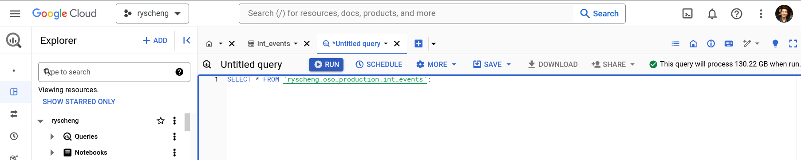

import Button from "../../../src/components/plasmic/Button";
import OsoLogo from "./oso-primary.png";
import GithubLogo from "./github.png";
import OpenSourceInsights from "./open-source-insights.png";
import OptimismLogo from "./op.png";
import EthereumLogo from "./ethereum.png";
import FilecoinLogo from "./filecoin.png";
import FarcasterLogo from "./farcaster.jpg";
import LensLogo from "./lens-protocol.png";
import GitcoinLogo from "./gitcoin.png";
import ArbitrumLogo from "./arbitrum.png";
import EasLogo from "./eas.png";
import OcLogo from "./open-collective.png";
import OpAtlasLogo from "./op-atlas.png";
import OliLogo from "./oli.png";
import ElectricCapitalLogo from "./crypto-ecosystems-logo.jpeg";

OSO curates a variety of public datasets from the open source ecosystem.
Check out our [BigQuery data exchange](https://console.cloud.google.com/bigquery/analytics-hub/exchanges/projects/87806073973/locations/us/dataExchanges/open_source_observer_190181416ae)
to explore available data.
If you don't have a BigQuery account, [start here](../../get-started/bigquery.mdx).

*Note: If you want to explore data and metrics computed in the OSO data pipeline,
we recommend that you use [pyoso](../query-data.mdx) instead.*

Here are our featured public datasets, organized by category:

<div className="datalinks-container">
  <a href="#oso-production-pipeline" className="datalink-card">
    <div className="datalink-header">
      
      <span className="tag">Updated weekly</span>
    </div>
    <h3>OSO Production Pipeline</h3>
  </a>
  <a href="#github-archive" className="datalink-card">
    <div className="datalink-header">
      
      <span className="tag">Updated hourly</span>
    </div>
    <h3>GitHub Archive</h3>
  </a>
  <a href="#open-source-insights" className="datalink-card">
    <div className="datalink-header">
      
      <span className="tag">Updated daily</span>
    </div>
    <h3>Open Source Insights</h3>
  </a>
  <a href="#crypto-ecosystems" className="datalink-card">
    <div className="datalink-header">
      
      <span className="tag">Updated weekly</span>
    </div>
    <h3>Crypto Ecosystems</h3>
  </a>
  <a href="#ethereum" className="datalink-card">
    <div className="datalink-header">
      
      <span className="tag">Updated daily</span>
    </div>
    <h3>Ethereum ETL</h3>
  </a>
  <a href="#superchain" className="datalink-card">
    <div className="datalink-header">
      
      <span className="tag">Updated daily</span>
    </div>
    <h3>Superchain</h3>
  </a>
  <a href="#superchain-4337" className="datalink-card">
    <div className="datalink-header">
      
      <span className="tag">Updated daily</span>
    </div>
    <h3>Superchain 4337</h3>
  </a>
  <a href="#arbitrum-one" className="datalink-card">
    <div className="datalink-header">
      
      <span className="tag">Updated weekly</span>
    </div>
    <h3>Arbitrum One</h3>
  </a>
  <a href="#open-labels-initiative" className="datalink-card">
    <div className="datalink-header">
      
      <span className="tag">Updated weekly</span>
    </div>
    <h3>Open Labels Initiative</h3>
  </a>
  <a href="#filecoin-lily" className="datalink-card">
    <div className="datalink-header">
      
      <span className="tag">Updated weekly</span>
    </div>
    <h3>Filecoin Lily</h3>
  </a>
  <a href="#eas" className="datalink-card">
    <div className="datalink-header">
      
      <span className="tag">Updated weekly</span>
    </div>
    <h3>Ethereum Attestation Service</h3>
  </a>
  <a href="#farcaster" className="datalink-card">
    <div className="datalink-header">
      
      <span className="tag">Updated weekly</span>
    </div>
    <h3>Farcaster</h3>
  </a>
  <a href="#lens" className="datalink-card">
    <div className="datalink-header">
      
      <span className="tag">Updated weekly</span>
    </div>
    <h3>Lens</h3>
  </a>
  <a href="#op-atlas" className="datalink-card">
    <div className="datalink-header">
      
      <span className="tag">Updated daily</span>
    </div>
    <h3>OP Atlas</h3>
  </a>
  <a href="#gitcoin" className="datalink-card">
    <div className="datalink-header">
      
      <span className="tag">Updated daily</span>
    </div>
    <h3>Gitcoin</h3>
  </a>
  <a href="#open-collective" className="datalink-card">
    <div className="datalink-header">
      
      <span className="tag">Updated weekly</span>
    </div>
    <h3>Open Collective</h3>
  </a>
</div>

<style>
{`
  .datalinks-container {
    display: grid;
    grid-template-columns: 1fr;
    gap: 1rem;
    margin: 1rem 0;
  }

  @media (min-width: 800px) {
    .datalinks-container {
      grid-template-columns: repeat(3, 1fr);
    }
  }

  .datalink-card {
    padding: 1rem 1rem 0.5rem;
    border: 1px solid #e5e7eb;
    border-radius: 0.5rem;
    display: block;
    text-decoration: none;
    color: inherit;
    transition: transform 0.2s ease-in-out;
    position: relative;
  }

  .datalink-card:hover {
    transform: translateY(-2px);
    text-decoration: none;
  }

  .datalink-header {
    display: flex;
    justify-content: space-between;
    align-items: center;
    margin-bottom: 0.5rem;
  }

  .datalink-card h3 {
    margin-top: 0;
    font-size: 1.25rem;
    font-weight: 600;
  }

  .datalink-logo {
    max-width: 50%;
    height: 20px;
    object-fit: contain;
  }

  .tag {
    background-color: #f3f4f6;
    padding: 0.25rem 0.5rem;
    border-radius: 0.25rem;
    font-size: 0.875rem;
  }
`}
</style>

<br />

## OSO Production Pipeline


<Button
  size={"compact"}
  color={"blue"}
  target={"_blank"}
  link={
    "https://console.cloud.google.com/bigquery/analytics-hub/exchanges/projects/87806073973/locations/us/dataExchanges/open_source_observer_190181416ae/listings/oso_data_pipeline_190187c6517"
  }
  children={"Subscribe on BigQuery"}
/>{" "}


- [License: CC BY-SA 4.0](https://creativecommons.org/licenses/by-sa/4.0/)

These are the final product from the data pipeline,
which is served from our [API](../api.md).

For example, you can get a list of oss-directory projects

```sql
SELECT
  project_id,
  project_name,
  display_name,
  description
FROM `YOUR_PROJECT_NAME.oso_production.projects_v1` LIMIT 10
```

or all contracts on Base deployed on 2025-01-01.

```sql
SELECT count(*) as cnt
FROM `YOUR_PROJECT_NAME.oso_production.contracts_v0`
WHERE contract_namespace = 'BASE' AND deployment_date = '2025-01-01'
```

_Note: Unless the model name is versioned with a `v1` or higher, expect that the model is unstable and should not be depended on
in a live production application._

Some of our most popular v1 models include:

- `projects_v1`: a list of all projects in the OSO data pipeline
- `artifacts_by_project_v1`: a list of all artifacts owned by a given project
- `projects_by_collection_v1`: a list of all projects in a given collection

Some of the v0 (WIP) models that we include in analysis but may be a bit unstable:

- `contracts_v0`: a list of all discovered contracts, downstream from their deployers and/or factories
- `metrics_v0`: a list of all metrics available in OSO
- `timeseries_metrics_by_project_v0`: a list of all metrics for a given project

## Open Source Software

### GitHub Archive


<Button
  size={"compact"}
  color={"blue"}
  target={"_blank"}
  link={
    "https://console.cloud.google.com/bigquery?project=githubarchive&page=project"
  }
  children={"View on BigQuery"}
/>{" "}


- Code License: [MIT](https://github.com/igrigorik/gharchive.org/blob/master/LICENSE.md).
- Data governed by the GitHub
[terms of service](https://docs.github.com/en/site-policy/github-terms/github-terms-of-service).
- [Updated hourly](https://github.com/igrigorik/gharchive.org/blob/master/bigquery/README.md)

GitHub data is predominantly provided by the incredible
[GH Archive](https://www.gharchive.org/) project, which publishes a public
archive of historical events to GitHub.

For example, to count the number of issues opened, closed, and reopened on 2020/01/01:

```sql
SELECT event as issue_status, COUNT(*) as cnt FROM (
  SELECT type, repo.name, actor.login,
    JSON_EXTRACT(payload, '$.action') as event,
  FROM `githubarchive.day.20200101`
  WHERE type = 'IssuesEvent'
)
GROUP by issue_status
```

### Open Source Insights


<Button
  size={"compact"}
  color={"blue"}
  target={"_blank"}
  link={
    "https://console.cloud.google.com/marketplace/product/bigquery-public-data/deps-dev?hl=en"
  }
  children={"View on BigQuery"}
/>{" "}

- [Reference documentation](https://docs.deps.dev/bigquery/v1/)
- Data License: [CC-BY 4.0](https://docs.deps.dev/bigquery/v1/)

Open Source Insights (aka [deps.dev](https://deps.dev/)) is a 
service developed and hosted by Google to help developers
better understand the structure, construction, and security
of open source software packages.
The service examines each package, constructs a full, detailed graph
of its dependencies and their properties, and makes the results available
to anyone who could benefit from them.
The goal is to provide developers with a picture of how their software is put together,
how that changes as dependencies change, and what the consequences might be.

For example, to determine which packages have the most dependents:

```sql
DECLARE
  Sys STRING DEFAULT 'CARGO';

SELECT
  Name,
  Version,
FROM (
  SELECT
    Name,
    Version,
    ROW_NUMBER()
      OVER (PARTITION BY
              Name
            ORDER BY
              VersionInfo.Ordinal DESC) AS RowNumber
    FROM
      `bigquery-public-data.deps_dev_v1.PackageVersionsLatest`
    WHERE
      System = Sys
      AND VersionInfo.IsRelease)
WHERE RowNumber = 1
```

### Crypto Ecosystems


<Button
  size={"compact"}
  color={"blue"}
  target={"_blank"}
  link={
    "https://console.cloud.google.com/bigquery/analytics-hub/discovery/projects/opensource-observer/locations/us/dataExchanges/open_source_observer_190181416ae/listings/crypto_ecosystems_1989ddf0dcd"
  }
  children={"Subscribe on BigQuery"}
/>{" "}

Crypto Ecosystems is a taxonomy of open source blockchain, web3, cryptocurrency, and decentralized ecosystems and their code repositories. If you're working in open source crypto, submit your repository [here](https://github.com/electric-capital/crypto-ecosystems) to be counted!

OSO maintains a fork of the [Crypto Ecosystems repo](https://github.com/electric-capital/crypto-ecosystems) and regularly pushes a copy of the full taxonomy to BigQuery. For example, you can get a list of all ecosystems and the number of repositories in each:

```sql
SELECT
  eco_name,
  COUNT(repo_url) as repo_count
FROM `YOUR_PROJECT_NAME.crypto_ecosystems.taxonomy`
GROUP BY 1
ORDER BY 2 DESC
```

The [original repository](https://github.com/electric-capital/crypto-ecosystems) is licensed under MIT license with attribution. To use the Electric Capital Crypto Ecosystems Map in your project, you will need an attribution.

Attribution needs to have 3 components:

- Source: "Electric Capital Crypto Ecosystems"
- Link: https://github.com/electric-capital/crypto-ecosystems
- Logo: https://github.com/electric-capital/crypto-ecosystems/blob/master/static/electric_capital_logo_transparent.png

## Blockchain datasets

### Ethereum


<Button
  size={"compact"}
  color={"blue"}
  target={"_blank"}
  link={
    "https://console.cloud.google.com/marketplace/product/bigquery-public-data/blockchain-analytics-ethereum-mainnet-us?project=opensource-observer"
  }
  children={"View on BigQuery"}
/>{" "}


- Code License: [MIT](https://github.com/blockchain-etl/ethereum-etl/blob/develop/LICENSE).

The Google Cloud team maintains a public
[Ethereum dataset](https://cloud.google.com/blog/products/data-analytics/ethereum-bigquery-public-dataset-smart-contract-analytics).
This is backed by the [ethereum-etl](https://github.com/blockchain-etl/ethereum-etl) project.

For example, to get 10 transactions from the latest block

```sql
SELECT
  `hash`,
  block_number,
  from_address,
  to_address,
  value,
  gas,
  gas_price
FROM `bigquery-public-data.crypto_ethereum.transactions` AS transactions
ORDER BY block_number DESC
LIMIT 10
```

### Superchain


<Button
  size={"compact"}
  color={"blue"}
  target={"_blank"}
  link={
    "https://bit.ly/superchain-public-data"
  }
  children={"Subscribe on BigQuery"}
/>{" "}

- Data on every OP Stack chain, maintained by [OP Labs PBC](https://www.oplabs.co/)
[code of conduct](https://github.com/ethereum-optimism/op-analytics?tab=coc-ov-file#readme)
- For more details on the ETL process please visit the [op-analytics](https://static.optimism.io/op-analytics) documentation site.
- Visit the Optimism docs to learn more about the [Superchain](https://docs.optimism.io/stack/explainer).

All tables are partitioned by date (`dt`) and clustered by chain name (`chain`). Data is updated daily with an approximate latency of 24 hrs.
Data is sourced from [Goldsky](https://docs.goldsky.com/introduction) using the [Mirror platform](https://docs.goldsky.com/mirror/introduction), which fetches and delivers onchain data from RPC nodes to ClickHouse.
From there, the OP Labs team runs an incremental ingestion process based on block number.

For example, to get all transactions to the 4337 EntryPoint contracts for all OP Stack chains:

```sql
  SELECT
    dt,
    chain,
    COUNT(*) AS txns
  FROM `optimism_superchain_raw_onchain_data.transactions`
  WHERE
    dt >= '2024-10-01'
    AND to_address IN (
      "0x5ff137d4b0fdcd49dca30c7cf57e578a026d2789",
      "0x0000000071727de22e5e9d8baf0edac6f37da032"
    )
  GROUP BY dt, chain
  ORDER BY dt, chain
```

### Superchain 4337


<Button
  size={"compact"}
  color={"blue"}
  target={"_blank"}
  link={
    "https://bit.ly/superchain-4337"
  }
  children={"Subscribe on BigQuery"}
/>{" "}

The Superchain 4337 dataset provides comprehensive data about ERC-4337 (Account Abstraction) activity across all OP Stack chains. This dataset is crucial for understanding the adoption and usage patterns of smart contract wallets, bundlers, and paymasters in the Superchain ecosystem. The data helps track which applications are leading the way in improving onchain UX through account abstraction.

All tables are partitioned by date (`dt`) and clustered by chain name (`chain`). The dataset includes decoded UserOps and Paymaster IDs to trace events from unique user smart contract wallet addresses to their wallet providers, paymasters, bundlers, and the applications they interact with.

For example, to see which paymasters are handling the most UserOperations across all chains:

```sql
SELECT
  chain,
  paymaster,
  APPROX_COUNT_DISTINCT(userophash) AS user_ops
FROM `YOUR_PROJECT_NAME.optimism_superchain_4337_account_abstraction_data.useroperationevent_logs_v2`
WHERE dt > '2025-02-01'
GROUP BY 1,2
ORDER BY 3 DESC
```

### Arbitrum One


<Button
  size={"compact"}
  color={"blue"}
  target={"_blank"}
  link={
    "https://console.cloud.google.com/bigquery/analytics-hub/exchanges/projects/87806073973/locations/us/dataExchanges/open_source_observer_190181416ae/listings/arbitrum_one_192256411b6"
  }
  children={"Subscribe on BigQuery"}
/>{" "}

[Arbitrum](https://arbitrum.foundation/) is a Layer 2 scaling solution for Ethereum. We currently provide blocks, transactions, and traces for Arbitrum's flagship network, Arbitrum One. This public dataset is maintained by our partners at [Goldsky](https://goldsky.com/).

For example, to get the average gas per transaction for each block on Arbitrum One on September 1st, 2024:

```sql
SELECT
  block_number,
  receipt_gas_used / 1 AS gas_per_txn
FROM `YOUR_PROJECT_NAME.arbitrum_one.arbitrum_transactions`
WHERE block_timestamp BETWEEN 1693526400 AND 1693612800
ORDER BY block_number
```

### Open Labels Initiative


<Button
  size={"compact"}
  color={"blue"}
  target={"_blank"}
  link={
    "https://console.cloud.google.com/bigquery/analytics-hub/discovery/projects/opensource-observer/locations/us/dataExchanges/open_source_observer_190181416ae/listings/openlabelsinitiative_196179b761d"
  }
  children={"Subscribe on BigQuery"}
/>{" "}

A standardized framework and data model for EVM address labeling, maintained by [growthepie.xyz](https://growthepie.xyz/).

For example, you can get project ownership labels for addresses:

```sql
SELECT
  address,
  chain_id,
  tag_value AS project_name
FROM `YOUR_PROJECT_NAME.openlabelsinitiative.labels_decoded`
WHERE tag_id = 'owner_project'
```

### Filecoin Lily


<Button
  size={"compact"}
  color={"blue"}
  target={"_blank"}
  link={
    "https://console.cloud.google.com/bigquery/analytics-hub/exchanges/projects/87806073973/locations/us/dataExchanges/open_source_observer_190181416ae/listings/filecoin_191c7f4bd01"
  }
  children={"Subscribe on BigQuery"}
/>{" "}

[Filecoin](https://filecoin.io/) is a decentralized storage network designed to
store humanity's most important information.
This dataset mirrors the dataset offered by [Lily](https://lilium.sh/data/)
for use in the OSO data pipeline.
It includes storage deals, miners, FVM transactions, and much more.

For example, this is how to get how many messages were sent to the network in the last month:

```sql
SELECT
  COUNT(*) AS total_messages
FROM `YOUR_PROJECT_NAME.filecoin_lily.parsed_messages`
WHERE
  CAST(timestamp_seconds((height * 30) + 1598306400) AS DATE) > CURRENT_DATE() - INTERVAL 1 MONTH
```

### Ethereum Attestation Service


<Button
  size={"compact"}
  color={"blue"}
  target={"_blank"}
  link={
    "https://console.cloud.google.com/bigquery/analytics-hub/exchanges/projects/87806073973/locations/us/dataExchanges/open_source_observer_190181416ae/listings/ethereum_attestation_service_197a68ef9e8"
  }
  children={"Subscribe on BigQuery"}
/>{" "}

[Ethereum Attestation Service (EAS)](https://attest.org/) is an infrastructure public good for making attestations onchain or offchain about anything.

This dataset mirrors the dataset offered by [EAS](https://attest.org/) for use in the OSO data pipeline, currenty showing all attestations on the Optimism network.

For example, you can get a list of all * official * RetroPGF badgeholders:

```sql
SELECT
  recipient AS badgeholder,
  JSON_VALUE(decoded_data_json, "$[0].value.value") AS rpgfRound
FROM `YOUR_PROJECT_NAME.ethereum_attestation_service_optimism.attestations`
WHERE
  revoked = False
  AND schema_id = '0xfdcfdad2dbe7489e0ce56b260348b7f14e8365a8a325aef9834818c00d46b31b'
  AND attester = '0x621477dBA416E12df7FF0d48E14c4D20DC85D7D9'
```

## Social

### Farcaster


<Button
  size={"compact"}
  color={"blue"}
  target={"_blank"}
  link={
    "https://console.cloud.google.com/bigquery/analytics-hub/exchanges/projects/87806073973/locations/us/dataExchanges/open_source_observer_190181416ae/listings/farcaster_19076cb8a53"
  }
  children={"Subscribe on BigQuery"}
/>{" "}

[Farcaster](https://www.farcaster.xyz/) is a decentralized social network built on Ethereum.
This dataset mirrors the dataset offered by [Indexing](https://blog.indexing.co/posts/IaPkkuevwwfgBWtZ3F7eg5oQUqyV_o6sLDo28oEV8Tg)
for use in the OSO data pipeline.
It includes casts, links, reactions, verifications, and profiles.

For example, to get the users with the most lifetime reactions:

```sql
SELECT
  r.target_cast_fid as fid,
  json_value(p.data, "$.display") as display_name,
  COUNT(*) as reaction_count
FROM `YOUR_PROJECT_NAME.farcaster.reactions` as r
LEFT JOIN `YOUR_PROJECT_NAME.farcaster.profiles` as p ON r.target_cast_fid = p.fid
GROUP BY fid, display_name
ORDER BY reaction_count DESC
```

Here's another use case, showing how to derive all the verified Ethereum addresses owned by a Farcaster user:

```sql
WITH
  profiles AS (
    SELECT
      v.fid,
      v.address,
      p.custody_address,
      JSON_VALUE(p.data, "$.username") AS username
    FROM `YOUR_PROJECT_NAME.farcaster.verifications` v
    JOIN `YOUR_PROJECT_NAME.farcaster.profiles` p ON v.fid = p.fid
    WHERE v.deleted_at IS NULL
  ),
  eth_addresses AS (
    SELECT
      fid,
      username,
      address
    FROM profiles
    WHERE LENGTH(address) = 42
    UNION ALL
    SELECT
      fid,
      username,
      custody_address AS address
    FROM profiles
  )
SELECT DISTINCT
  fid,
  username,
  address
FROM eth_addresses
```

### Lens


<Button
  size={"compact"}
  color={"blue"}
  target={"_blank"}
  link={
    "https://console.cloud.google.com/bigquery?project=lens-chain-mainnet"
  }
  children={"View on BigQuery"}
/>{" "}

[Lens Protocol](https://www.lens.xyz/) is an open social network.
This dataset is well-documented by [Lens](https://lens.xyz/docs/chain/tools/bigquery/introduction).
It includes data from Lens Chain Mainnet.

```sql
SELECT 
    address
FROM `lens-chain-mainnet.public.addresses`
LIMIT 5
```

Note: the Lens Polygon dataset that was previously available on BigQuery has been deprecated.

## Projects and funding

### OP Atlas


<Button
  size={"compact"}
  color={"blue"}
  target={"_blank"}
  link={
    "https://console.cloud.google.com/bigquery/analytics-hub/exchanges/projects/87806073973/locations/us/dataExchanges/open_source_observer_190181416ae/listings/op_atlas_1959149f871"
  }
  children={"Subscribe on BigQuery"}
/>{" "}

OP Atlas contains data about projects contributing to the Optimism Collective and applying for Retro Funding, shepherded by the fine folks of [Agora](https://github.com/voteagora).

For example, you can get a list of all projects and their associated repository URLs:

```sql
SELECT
  p.name,
  p.description,
  r.url AS repo_url
FROM `YOUR_PROJECT_NAME.op_atlas.project` AS p
JOIN `YOUR_PROJECT_NAME.op_atlas.project_repository` AS r
  ON p.id = r.project_id
```

For more information, go to https://atlas.optimism.io/ or check out the [OP Atlas GitHub](https://github.com/voteagora/op-atlas).

### Gitcoin


<Button
  size={"compact"}
  color={"blue"}
  target={"_blank"}
  link={
    "https://console.cloud.google.com/bigquery/analytics-hub/exchanges/projects/87806073973/locations/us/dataExchanges/open_source_observer_190181416ae/listings/gitcoin_passport_19077b6ad59"
  }
  children={"Subscribe on BigQuery"}
/>{" "}

[Gitcoin](https://gitcoin.co/) is the hub of grantmaking in the Ethereum ecosystem. All project, round, and donation data from [regendata.xyz](https://regendata.xyz) is available in this dataset and updated daily.

You can also access the raw Gitcoin data directly on BigQuery:

```sql
SELECT 
  round_num,
  round_name,
  donor_address,
  amount_in_usd,
  recipient_address,
  project_name,
  project_id
FROM `YOUR_PROJECT_NAME.gitcoin.all_donations`
```

and:

```sql
SELECT 
  round_num,
  round_name,
  donor_address,
  amount_in_usd,
  recipient_address,
  project_name,
  project_id
FROM `YOUR_PROJECT_NAME.gitcoin.all_matching`
```

### Open Collective


<Button
  size={"compact"}
  color={"blue"}
  target={"_blank"}
  link={
    "https://console.cloud.google.com/bigquery/analytics-hub/exchanges/projects/87806073973/locations/us/dataExchanges/open_source_observer_190181416ae/listings/open_collective_1926d37f24d" 
  }
  children={"Subscribe on BigQuery"}
/>{" "}

[Open Collective](https://opencollective.com/) is a platform for transparent finances and governance for open source projects.

The Open Collective datasets contains all transactions realized on the platform since its inception. Separate datasets are available for **expenses** and **deposits**.

For example, you can get the total amount of donations in `USD` made to the [**pandas**](https://pandas.pydata.org) project:

```sql
SELECT
  SUM(CAST(JSON_VALUE(amount, "$.value") AS FLOAT64)) AS total_amount
FROM
  `YOUR_PROJECT_NAME.open_collective.deposits`
WHERE
  JSON_VALUE(amount, "$.currency") = "USD"
  AND JSON_VALUE(to_account, "$.id") = "ov349mrw-gz75lpy9-975qa08d-jeybknox"
```

## Subscribe to a dataset

### 1. Data exchange listings

For datasets listed on the OSO public data exchange,
click on the "Subscribe on BigQuery" button to create a new
dataset that is linked to OSO.


This has a few benefits:

- Data is automatically kept live and real-time with OSO
- You keep a reference to the data in your own GCP project
- This gives OSO the ability to track public usage of models

### 2. Direct access to datasets

For datasets without a listing on the OSO public data exchange,
we make the dataset open to public queries for direct queries.
Click on the "View on BigQuery" button to go straight
to the dataset.

You can star the dataset to keep it in your project.


## Cost Estimation

BigQuery [on-demand pricing](https://cloud.google.com/bigquery/pricing)
charges based on the number of bytes scanned,
with the first 1 TB free every month.

To keep track of your usage, check the bytes scanned in the top right corner before running your query.



BigQuery costs can rack up quickly if you are not careful optimizing your queries.
For more on how you can optimize your queries, check out these guide:

- [BigQuery: Optimize query computation](https://cloud.google.com/bigquery/docs/best-practices-performance-compute)
- [Avoiding eight common BigQuery query mistakes](https://www.doit.com/avoiding-eight-common-bigquery-query-mistakes/)


## Next steps

Once you've subscribed our datasets to your own Google project,
you can start to run queries and analyses with a variety of tools.