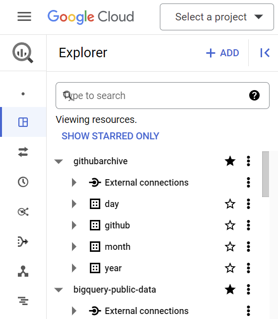

import Button from "../../../src/components/plasmic/Button";
import OsoLogo from "./oso-primary.png";
import GithubLogo from "./github.png";
import OpenSourceInsights from "./open-source-insights.png";
import OptimismLogo from "./op.png";
import EthereumLogo from "./ethereum.png";
import FilecoinLogo from "./filecoin.png";
import FarcasterLogo from "./farcaster.jpg";
import LensLogo from "./lens-protocol.png";
import GitcoinLogo from "./gitcoin.png";
import OpenrankLogo from "./openrank.png";
import ArbitrumLogo from "./arbitrum.png";
import EasLogo from "./eas.png";
import OcLogo from "./open-collective.png";
import OpAtlasLogo from "./op-atlas.png";

Check out our [BigQuery data exchange](https://console.cloud.google.com/bigquery/analytics-hub/exchanges/projects/87806073973/locations/us/dataExchanges/open_source_observer_190181416ae) to explore all the OSO datasets available.
If you don't have a BigQuery account, [start here](../../get-started/bigquery.mdx).

Here are some of our featured public datasets:

<div className="datalinks-container">
  <a href="#oso-production-pipeline" className="datalink-card">
    <div className="datalink-header">
      
      <span className="tag">Updated daily</span>
    </div>
    <h3>OSO Production Pipeline</h3>
  </a>
  <a href="#oso-playground-dataset" className="datalink-card">
    <div className="datalink-header">
      
      <span className="tag">Updated daily</span>
    </div>
    <h3>OSO Playground Dataset</h3>
  </a>
  <a href="#github-archive" className="datalink-card">
    <div className="datalink-header">
      
      <span className="tag">Updated hourly</span>
    </div>
    <h3>GitHub Archive</h3>
  </a>
  <a href="#open-source-insights" className="datalink-card">
    <div className="datalink-header">
      
      <span className="tag">Updated daily</span>
    </div>
    <h3>Open Source Insights</h3>
  </a>
  <a href="#ethereum-etl" className="datalink-card">
    <div className="datalink-header">
      
      <span className="tag">Updated daily</span>
    </div>
    <h3>Ethereum ETL</h3>
  </a>
  <a href="#superchain" className="datalink-card">
    <div className="datalink-header">
      
      <span className="tag">Updated daily</span>
    </div>
    <h3>Superchain</h3>
  </a>
  <a href="#arbitrum-one" className="datalink-card">
    <div className="datalink-header">
      
      <span className="tag">Updated weekly</span>
    </div>
    <h3>Arbitrum One</h3>
  </a>
  <a href="#filecoin-lily" className="datalink-card">
    <div className="datalink-header">
      
      <span className="tag">Updated weekly</span>
    </div>
    <h3>Filecoin Lily</h3>
  </a>
  <a href="#farcaster" className="datalink-card">
    <div className="datalink-header">
      
      <span className="tag">Updated weekly</span>
    </div>
    <h3>Farcaster</h3>
  </a>
  <a href="#lens" className="datalink-card">
    <div className="datalink-header">
      
      <span className="tag">Updated weekly</span>
    </div>
    <h3>Lens</h3>
  </a>
  <a href="#gitcoin" className="datalink-card">
    <div className="datalink-header">
      
      <span className="tag">Updated daily</span>
    </div>
    <h3>Gitcoin</h3>
  </a>
  <a href="#open-collective" className="datalink-card">
    <div className="datalink-header">
      
      <span className="tag">Updated weekly</span>
    </div>
    <h3>Open Collective</h3>
  </a>
  <a href="#op-atlas" className="datalink-card">
    <div className="datalink-header">
      
      <span className="tag">Updated daily</span>
    </div>
    <h3>OP Atlas</h3>
  </a>
  <a href="#openrank" className="datalink-card">
    <div className="datalink-header">
      
      <span className="tag">Updated daily</span>
    </div>
    <h3>OpenRank</h3>
  </a>
  <a href="#eas" className="datalink-card">
    <div className="datalink-header">
      
      <span className="tag">Updated weekly</span>
    </div>
    <h3>EAS</h3>
  </a>
</div>

<style>
{`
  .datalinks-container {
    display: grid;
    grid-template-columns: 1fr;
    gap: 1rem;
    margin: 1rem 0;
  }

  @media (min-width: 800px) {
    .datalinks-container {
      grid-template-columns: repeat(3, 1fr);
    }
  }

  .datalink-card {
    padding: 1rem 1rem 0.5rem;
    border: 1px solid #e5e7eb;
    border-radius: 0.5rem;
    display: block;
    text-decoration: none;
    color: inherit;
    transition: transform 0.2s ease-in-out;
    position: relative;
  }

  .datalink-card:hover {
    transform: translateY(-2px);
    text-decoration: none;
  }

  .datalink-header {
    display: flex;
    justify-content: space-between;
    align-items: center;
    margin-bottom: 0.5rem;
  }

  .datalink-card h3 {
    margin-top: 0;
    font-size: 1.25rem;
    font-weight: 600;
  }

  .datalink-logo {
    max-width: 50%;
    height: 20px;
    object-fit: contain;
  }

  .tag {
    background-color: #f3f4f6;
    padding: 0.25rem 0.5rem;
    border-radius: 0.25rem;
    font-size: 0.875rem;
  }
`}
</style>

<br />

## OSO Production Pipeline


<Button
  size={"compact"}
  color={"blue"}
  target={"_blank"}
  link={
    "https://console.cloud.google.com/bigquery/analytics-hub/exchanges/projects/87806073973/locations/us/dataExchanges/open_source_observer_190181416ae/listings/oso_data_pipeline_190187c6517"
  }
  children={"Subscribe on BigQuery"}
/>{" "}

- [Reference documentation](https://models.opensource.observer/#!/model/model.opensource_observer.code_metrics_by_project_v1)
- [License: CC BY-SA 4.0](https://creativecommons.org/licenses/by-sa/4.0/)
- [Updated daily](https://dagster.opensource.observer/assets/dbt/production)

Every stage of the OSO data pipeline is queryable and downloadable.
Like most dbt-based pipelines, we split the pipeline stages into
[staging, intermediate, and mart models](https://docs.getdbt.com/best-practices/how-we-structure/1-guide-overview).

You can find the reference documentation on every data model on
[https://models.opensource.observer/](https://models.opensource.observer/)

### OSO Mart Models

These are the final product from the data pipeline,
which is served from our [API](../api.md).

For example, you can get a list of
[oss-directory projects](https://models.opensource.observer/#!/model/model.opensource_observer.projects_v1)

```sql
select
  project_id,
  project_name,
  display_name,
  description
from `YOUR_PROJECT_NAME.oso_production.projects_v1` LIMIT 10
```

or [code metrics by project](https://models.opensource.observer/#!/model/model.opensource_observer.code_metrics_by_project_v1).

```sql
select *
from `YOUR_PROJECT_NAME.oso_production.code_metrics_by_project_v1`
where project_name = 'uniswap'
```

**Remember to replace 'YOUR_PROJECT_NAME' with the name of your project in the query.**

_Note: Unless the model name is versioned with a `v1` or higher, expect that the model is unstable and should not be depended on
in a live production application._

Some of our most popular v1 models include:

- `projects_v1`: a list of all projects in the OSO data pipeline
- `artifacts_by_project_v1`: a list of all artifacts owned by a given project
- `projects_by_collection_v1`: a list of all projects in a given collection
- `code_metrics_by_project_v1`: a list of all code metrics for a given project
- `onchain_metrics_by_project_v1`: a list of all onchain metrics for a given project (by chain)

Some of the v0 (WIP) models that we include in analysis but do not recommend for production use:

- `timeseries_events_by_artifact_v0`: a list of all events for a given artifact (our unified event table)
- `oss_funding_v0`: a list of all funding grants to projects, indexed by project and funder
- `repositories_v0`: a list of all GitHub repositories, indexed by project
- `sboms_v0`: a list of package dependencies (software bill of materials), indexed by project
- `package_owners_v0`: a mapping of packages to GitHub repositories, indexed by project
- `contracts_v0`: a list of all discovered contracts, downstream from their deployers and/or factories

### OSO Staging / Intermediate Models

From source data, we produce a "universal event table", currently stored at
[`int_events`](https://models.opensource.observer/#!/model/model.opensource_observer.int_events).
Each event consists of an [event_type](../../references/event.md)
(e.g. a git commit or contract invocation),
[to/from artifacts](../../guides/oss-directory/artifact.md),
a timestamp, and an amount.

From this event table, we aggregate events in downstream models to produce our metrics.
For example, you may find it cheaper to run queries against
[`int_events_daily_to_project`](https://models.opensource.observer/#!/model/model.opensource_observer.int_events_daily_to_project).

```sql
SELECT event_source, SUM(amount)
FROM `YOUR_PROJECT_NAME.oso_production.int_events_daily_to_project`
WHERE project_id = 'XSDgPwFuQVcj57ARcKTGrm2w80KKlqJxaBWF6jZqe7w=' AND event_type = 'CONTRACT_INVOCATION_DAILY_COUNT'
GROUP BY project_id, event_source
```

## OSO Playground Dataset

<Button
  size={"compact"}
  color={"blue"}
  target={"_blank"}
  link={
    "https://console.cloud.google.com/bigquery/analytics-hub/exchanges/projects/87806073973/locations/us/dataExchanges/open_source_observer_190181416ae/listings/oso_playground_1901889910d"
  }
  children={"Subscribe on BigQuery"}
/>{" "}

- [Reference documentation](https://models.opensource.observer/#!/model/model.opensource_observer.code_metrics_by_project_v1)
- [License: CC BY-SA 4.0](https://creativecommons.org/licenses/by-sa/4.0/)
- [Updated daily](https://dagster.opensource.observer/assets/dbt/playground)

We maintain a subset of projects and events in a playground dataset for testing and development.
All of the production models are mirrored in this environment.

## External Datasets

### GitHub Archive


<Button
  size={"compact"}
  color={"blue"}
  target={"_blank"}
  link={
    "https://console.cloud.google.com/bigquery?project=githubarchive&page=project"
  }
  children={"View on BigQuery"}
/>{" "}

- [Reference documentation](https://models.opensource.observer/#!/source_list/github_archive)
- Code License: [MIT](https://github.com/igrigorik/gharchive.org/blob/master/LICENSE.md).
- Data governed by the GitHub
[terms of service](https://docs.github.com/en/site-policy/github-terms/github-terms-of-service).
- [Updated hourly](https://github.com/igrigorik/gharchive.org/blob/master/bigquery/README.md)

GitHub data is predominantly provided by the incredible
[GH Archive](https://www.gharchive.org/) project, which publishes a public
archive of historical events to GitHub.

For example, to count the number of issues opened, closed, and reopened on 2020/01/01:

```sql
SELECT event as issue_status, COUNT(*) as cnt FROM (
  SELECT type, repo.name, actor.login,
    JSON_EXTRACT(payload, '$.action') as event,
  FROM `githubarchive.day.20200101`
  WHERE type = 'IssuesEvent'
)
GROUP by issue_status;
```

### Open Source Insights


<Button
  size={"compact"}
  color={"blue"}
  target={"_blank"}
  link={
    "https://console.cloud.google.com/marketplace/product/bigquery-public-data/deps-dev?hl=en"
  }
  children={"View on BigQuery"}
/>{" "}

- [Reference documentation](https://docs.deps.dev/bigquery/v1/)
- Data License: [CC-BY 4.0](https://docs.deps.dev/bigquery/v1/)

Open Source Insights (aka [deps.dev](https://deps.dev/)) is a 
service developed and hosted by Google to help developers
better understand the structure, construction, and security
of open source software packages.
The service examines each package, constructs a full, detailed graph
of its dependencies and their properties, and makes the results available
to anyone who could benefit from them.
The goal is to provide developers with a picture of how their software is put together,
how that changes as dependencies change, and what the consequences might be.

For example, to determine which packages have the most dependents:

```sql
DECLARE
  Sys STRING DEFAULT 'CARGO';

SELECT
  Name,
  Version,
FROM (
  SELECT
    Name,
    Version,
    ROW_NUMBER()
      OVER (PARTITION BY
              Name
            ORDER BY
              VersionInfo.Ordinal DESC) AS RowNumber
    FROM
      `bigquery-public-data.deps_dev_v1.PackageVersionsLatest`
    WHERE
      System = Sys
      AND VersionInfo.IsRelease)
WHERE RowNumber = 1;
```


### Ethereum ETL


<Button
  size={"compact"}
  color={"blue"}
  target={"_blank"}
  link={
    "https://console.cloud.google.com/marketplace/product/bigquery-public-data/blockchain-analytics-ethereum-mainnet-us?project=opensource-observer"
  }
  children={"View on BigQuery"}
/>{" "}

- [Reference documentation](https://models.opensource.observer/#!/source_list/ethereum)
- Code License: [MIT](https://github.com/blockchain-etl/ethereum-etl/blob/develop/LICENSE).

The Google Cloud team maintains a public
[Ethereum dataset](https://cloud.google.com/blog/products/data-analytics/ethereum-bigquery-public-dataset-smart-contract-analytics).
This is backed by the [ethereum-etl](https://github.com/blockchain-etl/ethereum-etl) project.

For example, to get 10 transactions from the latest block

```sql
select
  `hash`,
  block_number,
  from_address,
  to_address,
  value,
  gas,
  gas_price
from `bigquery-public-data.crypto_ethereum.transactions` as transactions
order by block_number desc
limit 10
```


### Superchain


<Button
  size={"compact"}
  color={"blue"}
  target={"_blank"}
  link={
    "https://bit.ly/superchain-public-data"
  }
  children={"Subscribe on BigQuery"}
/>{" "}

- Data on every OP Stack chain, maintained by [OP Labs PBC](https://www.oplabs.co/)
[code of conduct](https://github.com/ethereum-optimism/op-analytics?tab=coc-ov-file#readme)
- For more details on the ETL process please visit the [op-analytics](https://static.optimism.io/op-analytics) documentation site.
- Visit the Optimism docs to learn more about the [Superchain](https://docs.optimism.io/stack/explainer).

All tables are partitioned by date (`dt`) and clustered by chain name (`chain`). Data is updated daily with an approximate latency of 24 hrs.
Data is sourced from [Goldsky](https://docs.goldsky.com/introduction) using the [Mirror platform](https://docs.goldsky.com/mirror/introduction), which fetches and delivers onchain data from RPC nodes to ClickHouse.
From there, the OP Labs team runs an incremental ingestion process based on block number.

For example, to get all transactions to the 4337 EntryPoint contracts for all OP Stack chains:

```sql
  select
    dt,
    chain,
    count(*) as txns
  from `optimism_superchain_raw_onchain_data.transactions`
  where
    dt >= '2024-10-01'
    and to_address in (
      "0x5ff137d4b0fdcd49dca30c7cf57e578a026d2789",
      "0x0000000071727de22e5e9d8baf0edac6f37da032"
    )
  group by dt, chain
  order by dt, chain
```

### Arbitrum One


<Button
  size={"compact"}
  color={"blue"}
  target={"_blank"}
  link={
    "https://console.cloud.google.com/bigquery/analytics-hub/exchanges/projects/87806073973/locations/us/dataExchanges/open_source_observer_190181416ae/listings/arbitrum_one_192256411b6"
  }
  children={"Subscribe on BigQuery"}
/>{" "}

- [Reference documentation](https://models.opensource.observer/#!/source_list/arbitrum_one)
- [Source documentation](https://docs.goldsky.com/introduction)
- [Updated weekly](https://github.com/opensource-observer/oso/blob/main/warehouse/oso_dagster/assets/arbitrum.py)

[Arbitrum](https://arbitrum.foundation/) is a Layer 2 scaling solution for Ethereum. We currently provide blocks, transactions, and traces for Arbitrum's flagship network, Arbitrum One. This public dataset is maintained by our partners at [Goldsky](https://goldsky.com/).

For example, to get the average gas per transaction for each block on Arbitrum One on September 1st, 2024:

```sql
select
  number,
  gas_used / transaction_count as gas_per_txn
from `YOUR_PROJECT_NAME.arbitrum_one.arbitrum_blocks`
where timestamp between '2024-09-01' and '2024-09-02'
order by number
```

**Remember to replace 'YOUR_PROJECT_NAME' with the name of your project in the query.**


### Filecoin Lily


<Button
  size={"compact"}
  color={"blue"}
  target={"_blank"}
  link={
    "https://console.cloud.google.com/bigquery/analytics-hub/exchanges/projects/87806073973/locations/us/dataExchanges/open_source_observer_190181416ae/listings/filecoin_191c7f4bd01"
  }
  children={"Subscribe on BigQuery"}
/>{" "}

- [Reference documentation](https://models.opensource.observer/#!/source_list/filecoin)
- [Source documentation](https://lilium.sh/data/)
- [Updated weekly](https://github.com/opensource-observer/oso/blob/main/warehouse/oso_dagster/assets/filecoin.py)

[Filecoin](https://filecoin.io/) is a decentralized storage network designed to
store humanity's most important information.
This dataset mirrors the dataset offered by [Lily](https://lilium.sh/data/)
for use in the OSO data pipeline.
It includes storage deals, miners, FVM transactions, and much more.

For example, this is how to get how many messages were sent to the network in the last month:

```sql
select
  count(cid) as total_messages
from `YOUR_PROJECT_NAME.filecoin_lily.parsed_messages`
where
  cast(timestamp_seconds((height * 30) + 1598306400) as date) > current_date() - interval 1 month
```


### Farcaster


<Button
  size={"compact"}
  color={"blue"}
  target={"_blank"}
  link={
    "https://console.cloud.google.com/bigquery/analytics-hub/exchanges/projects/87806073973/locations/us/dataExchanges/open_source_observer_190181416ae/listings/farcaster_19076cb8a53"
  }
  children={"Subscribe on BigQuery"}
/>{" "}

- [Reference documentation](https://models.opensource.observer/#!/source_list/farcaster)
- [Updated weekly](https://github.com/opensource-observer/oso/blob/main/warehouse/oso_dagster/assets/farcaster.py)

[Farcaster](https://www.farcaster.xyz/) is a decentralized social network built on Ethereum.
This dataset mirrors the dataset offered by [Indexing](https://blog.indexing.co/posts/IaPkkuevwwfgBWtZ3F7eg5oQUqyV_o6sLDo28oEV8Tg)
for use in the OSO data pipeline.
It includes casts, links, reactions, verifications, and profiles.

For example, to get the users with the most lifetime reactions:

```sql
SELECT
  r.target_cast_fid as fid,
  json_value(p.data, "$.display") as display_name,
  COUNT(*) as reaction_count
FROM `YOUR_PROJECT_NAME.farcaster.reactions` as r
LEFT JOIN `YOUR_PROJECT_NAME.farcaster.profiles` as p ON r.target_cast_fid = p.fid
GROUP BY fid, display_name
ORDER BY reaction_count DESC
```

Here's another use case, showing how to derive all the verified Ethereum addresses owned by a Farcaster user:

```sql
WITH
  profiles AS (
    SELECT
      v.fid,
      v.address,
      p.custody_address,
      JSON_VALUE(p.data, "$.username") AS username,
    FROM `YOUR_PROJECT_NAME.farcaster.verifications` v
    JOIN `YOUR_PROJECT_NAME.farcaster.profiles` p ON v.fid = p.fid
    WHERE v.deleted_at IS NULL
  ),
  eth_addresses AS (
    SELECT
      fid,
      username,
      address
    FROM profiles
    WHERE LENGTH(address) = 42
    UNION ALL
    SELECT
      fid,
      username,
      custody_address AS address
    FROM profiles
  )
SELECT DISTINCT
  fid,
  username,
  address
FROM eth_addresses
```

**Remember to replace 'YOUR_PROJECT_NAME' with the name of your project in the query.**

### Lens


<Button
  size={"compact"}
  color={"blue"}
  target={"_blank"}
  link={
    "https://console.cloud.google.com/bigquery/analytics-hub/exchanges/projects/87806073973/locations/us/dataExchanges/open_source_observer_190181416ae/listings/lens_19077b0822c"
  }
  children={"Subscribe on BigQuery"}
/>{" "}

- [Reference documentation](https://models.opensource.observer/#!/source_list/lens)
- [Updated weekly](https://github.com/opensource-observer/oso/blob/main/warehouse/oso_dagster/assets/lens.py)

[Lens Protocol](https://www.lens.xyz/) is an open social network.
This dataset mirrors the dataset offered by [Lens](https://www.lens.xyz/docs/tools/bigquery)
for use in the OSO data pipeline.
It includes data from the Polygon network.

### Gitcoin and Passport Data


<Button
  size={"compact"}
  color={"blue"}
  target={"_blank"}
  link={
    "https://console.cloud.google.com/bigquery/analytics-hub/exchanges/projects/87806073973/locations/us/dataExchanges/open_source_observer_190181416ae/listings/gitcoin_passport_19077b6ad59"
  }
  children={"Subscribe on BigQuery"}
/>{" "}

- [Reference documentation](https://models.opensource.observer/#!/source_list/gitcoin)
- [Updated daily](https://dagster.opensource.observer/assets/gitcoin)

[Gitcoin](https://gitcoin.co/) is the hub of grantmaking in the Ethereum ecosystem. All project, round, and donation data from [regendata.xyz](https://regendata.xyz) is available in this dataset and updated daily.

You can also access the raw Gitcoin data directly on BigQuery:

```sql
select * from `YOUR_PROJECT_NAME.gitcoin.all_donations`
```

and:

```sql
select * from `YOUR_PROJECT_NAME.gitcoin.all_matching`
```

You can also get the total amount of donations mapped to projects in OSO directly from one of our data marts:

```sql
select
  round_number,
  oso_display_name,
  sum(amount_in_usd) as total_funding_usd
from `YOUR_PROJECT_NAME.oso_production.gitcoin_funding_events_by_project_v0`
where oso_project_name = 'opensource-observer'
group by 1,2
order by round_number
```

[Passport](https://passport.xyz/)
is a web3 identity verification protocol.
OSO and Gitcoin have collaborated to make this dataset
of address scores available for use in understanding user reputations.

For example, you can can **vitalik.eth's** passport score:

```sql
select
  passport_address,
  last_score_timestamp,
  evidence_rawScore,
  evidence_threshold,
from YOUR_PROJECT_NAME.gitcoin.passport_scores
where passport_address = '0xd8da6bf26964af9d7eed9e03e53415d37aa96045'
```

**Remember to replace 'YOUR_PROJECT_NAME' with the name of your project in the query.**

### Open Collective


<Button
  size={"compact"}
  color={"blue"}
  target={"_blank"}
  link={
    "https://console.cloud.google.com/bigquery/analytics-hub/exchanges/projects/87806073973/locations/us/dataExchanges/open_source_observer_190181416ae/listings/open_collective_1926d37f24d" 
  }
  children={"Subscribe on BigQuery"}
/>{" "}

- [Reference documentation](https://models.opensource.observer/#!/source_list/open_collective)
- [Updated weekly](https://dagster.opensource.observer/assets/open_collective)

[Open Collective](https://opencollective.com/) is a platform for transparent finances and governance for open source projects.

The Open Collective datasets contains all transactions realized on the platform since its inception. Separate datasets are available for **expenses** and **deposits**.

For example, you can get the total amount of donations in `USD` made to the [**pandas**](https://pandas.pydata.org) project:

```sql
select
  SUM(CAST(JSON_VALUE(amount, "$.value") as FLOAT64)) as total_amount,
from
  YOUR_PROJECT_NAME.open_collective.deposits
where
  JSON_VALUE(amount, "$.currency") = "USD"
  and JSON_VALUE(to_account, "$.id") = "ov349mrw-gz75lpy9-975qa08d-jeybknox"
```

**Remember to replace 'YOUR_PROJECT_NAME' with the name of your project in the query.**

### OP Atlas


<Button
  size={"compact"}
  color={"blue"}
  target={"_blank"}
  link={
    "https://console.cloud.google.com/bigquery/analytics-hub/exchanges/projects/87806073973/locations/us/dataExchanges/open_source_observer_190181416ae/listings/op_atlas_194d79d36ad"
  }
  children={"Subscribe on BigQuery"}
/>{" "}

OP Atlas contains data about projects contributing to the Optimism Collective and applying for Retro Funding, shepherded by the fine folks of [Agora](https://github.com/voteagora).

For example, you can get a list of all projects and their associated repository URLs:

```sql
select
  p.name,
  p.description,
  r.url as repo_url
from `YOUR_PROJECT_NAME.op_atlas.project` as p
join `YOUR_PROJECT_NAME.op_atlas.project_repository` as r
  on p.id = r.project_id
```

**Remember to replace 'YOUR_PROJECT_NAME' with the name of your project in the query.**

For more information, go to https://atlas.optimism.io/ or check out the [OP Atlas GitHub](https://github.com/voteagora/op-atlas).

### OpenRank


<Button
  size={"compact"}
  color={"blue"}
  target={"_blank"}
  link={
    "https://console.cloud.google.com/bigquery/analytics-hub/exchanges/projects/87806073973/locations/us/dataExchanges/open_source_observer_190181416ae/listings/openrank_19077ba1f3f"
  }
  children={"Subscribe on BigQuery"}
/>{" "}

- [Reference documentation](https://models.opensource.observer/#!/source_list/karma3)
- [Updated daily](https://dagster.opensource.observer/assets/karma3)

[OpenRank](https://openrank.com/) is a reputation protocol that enables
verifiable compute for a large class of reputation algorithms,
in particular those that (a) operate on a graph,
(b) are iterative in nature and (c) have a tendency toward convergence.
Such algorithms include EigenTrust, Collaborative Filtering, Hubs and Authorities,
Latent Semantic Analysis, etc.

In this dataset, Farcaster users reputations are scored in 2 ways:
- With `globaltrust`, we calculate global reputation scores, seeded by the trust of Optimism badgeholders.
- With `localtrust`, you can get reputation scores of other users relative to specified user.

For example, you can get the globaltrust reputation score of **vitalik.eth**

```sql
select
  strategy_id,
  i,
  v,
  date
from YOUR_PROJECT_NAME.karma3.globaltrust
where i = 5650
```

**Remember to replace 'YOUR_PROJECT_NAME' with the name of your project in the query.**

### Ethereum Attestation Service


<Button
  size={"compact"}
  color={"blue"}
  target={"_blank"}
  link={
    "https://console.cloud.google.com/bigquery/analytics-hub/exchanges/projects/87806073973/locations/us/dataExchanges/open_source_observer_190181416ae/listings/eas_attestations_19201a46b82"
  }
  children={"Subscribe on BigQuery"}
/>{" "}

- [Reference documentation](https://models.opensource.observer/#!/source_list/ethereum_attestation_service_optimism)
- [Updated weekly](https://dagster.opensource.observer/assets/ethereum_attestation_service_optimism)

[Ethereum Attestation Service (EAS)](https://attest.org/) is an infrastructure public good for making attestations onchain or offchain about anything.

This dataset mirrors the dataset offered by [EAS](https://attest.org/) for use in the OSO data pipeline, currenty showing all attestations on the Optimism network.

For example, you can get a list of all * official * RetroPGF badgeholders:

```sql
select
  recipient as badgeholder,
  json_value(decoded_data_json, "$[0].value.value") as rpgfRound
from YOUR_PROJECT_NAME.ethereum_attestation_service_optimism.attestations
where
  revoked = False
  and schema_id = '0xfdcfdad2dbe7489e0ce56b260348b7f14e8365a8a325aef9834818c00d46b31b'
  and attester = '0x621477dBA416E12df7FF0d48E14c4D20DC85D7D9'
```

**Remember to replace 'YOUR_PROJECT_NAME' with the name of your project in the query.**

## Subscribe to a dataset

### 1. Data exchange listings

For datasets listed on the OSO public data exchange,
click on the "Subscribe on BigQuery" button to create a new
dataset that is linked to OSO.


This has a few benefits:

- Data is automatically kept live and real-time with OSO
- You keep a reference to the data in your own GCP project
- This gives OSO the ability to track public usage of models

### 2. Direct access to datasets

For datasets without a listing on the OSO public data exchange,
we make the dataset open to public queries for direct queries.
Click on the "View on BigQuery" button to go straight
to the dataset.

You can star the dataset to keep it in your project.



## Next steps

Once you've subscribed our datasets to your own Google project,
you can start to run queries and analyses with a variety of tools.

Here are a few to start:

- [**SQL Query Guide**](../query-data.mdx): to quickly query and download any data
- [**Python notebooks**](../../guides/notebooks/index.mdx): to do more in-depth data science and processing
- [**Connect OSO to 3rd Party tools**](../../guides/visualization-tools/index.mdx): like Hex.tech, Tableau, and Metabase

