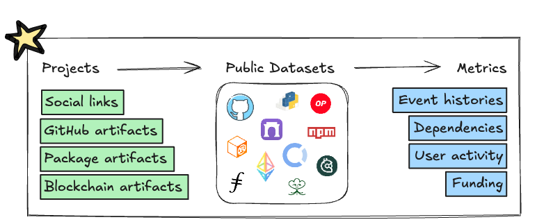

:::info
OSO maintains a large repository of open source projects called
[oss-directory](https://github.com/opensource-observer/oss-directory). It's more than just an awesome list ... it's the starting point of the OSO data pipeline. We run indexers on every artifact linked to projects in the directory to produce metrics for our API and dashboards. Check if your project is already listed. If not, follow the steps below to add it.
:::



## Check If Your Project is Already Listed

:::tip
You can also check if your project is listed from [pyoso](../get-started/python.md) or using our [GraphQL API](../get-started/api.mdx).
:::

Before adding your project, check if it's already listed in [oss-directory](https://github.com/opensource-observer/oss-directory/tree/main/data/projects). Most projects are instantiated with the GitHub organization name as the project `name`. For example, Open Source Observer's project file is located at `./data/projects/o/opensource-observer.yaml`.

Alternatively, you can search for projects directly in our [project explorer](https://www.opensource.observer/projects). If you locate it, then the slug in the URL is the project name. For example, `opensource-observer` is at `https://www.opensource.observer/projects/opensource-observer`.

If you're a developer, you can also lookup a project directly from [our GraphQL API](https://www.opensource.observer/graphql). Here's an example query to find the project that owns the _artifact_ `github.com/opensource-observer/oso`:

```python
query = """
SELECT
  project_name
FROM artifacts_by_project_v1
WHERE artifact_source = 'GITHUB'
  AND artifact_namespace = 'opensource-observer'
  AND artifact_name = 'oso'
"""
df = client.to_pandas(query)
```

If you can't find your project, you can add it by following the steps below.

## Give Your Project a Unique `name` Slug

:::important
The `name` field is the unique identifier for the project and **must** match the name of the YAML project file. For example, if the project file is `./data/projects/m/my-project.yaml`, then the `name` field should be `my-project`.
:::

Most projects are instantiated with the GitHub organization name as the project `name`. For example, the project for https://github.com/opensource-observer is named `opensource-observer` and located at `./data/projects/o/opensource-observer.yaml`.

Here is an example of a project file instantiated with the GitHub organization name as the project `name`:

```yaml
name: my-project
display_name: My Project
github:
  - url: https://github.com/my-project
```

If the project is a monorepo within a larger GitHub organization or personal account, you can use the project name followed by the repo owner as the name, separated by hyphens. For example, the project for https://github.com/my-org/my-repo is named `my-repo-my-org` and located at `./data/projects/m/my-repo-my-org.yaml`. Here is what the YAML file might look like:

```yaml
name: my-repo-my-org
display_name: My Repo
github:
  - url: https://github.com/my-org/my-repo
```

If the project is a collection of repos -- but you don't want to use the GitHub organization name as the project name -- then you can use your discretion to pick an appropriate name. Here is an example of a project file instantiated with a custom project name:

```yaml
name: projectx-my-space
display_name: Project X
github:
  - url: https://github.com/my-space/projectx-frontend
  - url: https://github.com/my-space/projectx-backend
  - url: https://github.com/my-space/projectx-docs
```

This project would be located at `./data/projects/p/projectx-my-space.yaml`.

This construction is useful for projects that are kept in a personal GitHub account or across multiple GitHub organizations.

## Submit a Pull Request to Add Your Project

Add your project by making a pull request to
[oss-directory](https://github.com/opensource-observer/oss-directory). Here are the steps:

1. Fork [oss-directory](https://github.com/opensource-observer/oss-directory/fork).
2. Create a new project `.yaml` file under `./data/projects/`.
3. Link artifacts (ie, GitHub repositories, npm packages, blockchain addresses) in the project `.yaml` file. See below if you need help with the schema.
4. Submit a pull request from your fork back to [oss-directory](https://github.com/opensource-observer/oss-directory).
5. Once your pull request is approved, your project will automatically be added to our indexers. It may take longer for some historical data (e.g. GitHub events) to show up as we run backfill jobs less frequently.

Please enable "Allow edits by maintainers" while putting up the PR.

Here is an example of a generic project file:

```yaml
version: 7
name: my-project
display_name: My Project
github:
  - url: https://github.com/my-project
```

## Check The Status of Your Pull Request

Once you submit your pull request, a maintainer will review it and merge it if it's valid. You can check the status of your pull request by clicking the "Pull requests" tab in your forked repository.

If there are any issues, you will be notified in the pull request thread.

Once your pull request is merged, you will start to see your project data in the OSO API and dashboards, typically within a few days. (Our full indexer runs weekly on Sundays.) It may take longer for some historical data (e.g. GitHub events) to show up as we run backfill jobs less frequently.

## Schema Overview

Make sure to use the latest version of the oss-directory schema. You can see the latest version by opening any project YAML file and getting the version from the top of file. Note: since Version 7, we have replaced the `slug` field with `name` and the previous `name` field with `display_name`.

### Fields

The schema currently contains the following fields:

- `version`: The latest version of the OSS Directory schema. This is a required field. To find the latest version, open any project YAML file and get the version from the top of the file. As of writing (2025-02-06), the latest version is Version 7.
- `name`: The unique identifier for the project. See [Give Your Project a Unique `name` Slug](#give-your-project-a-unique-name-slug) for more information. This is a required field and must match the name of the YAML project file.
- `display_name`: The display name of the project. This is a required field and must also be globally unique.
- `description`: A brief description of the project.
- `websites`: A list of associated websites
- `social`: A list of social channels (e.g. Twitter, Telegram, Discord)
- `github`: A list of GitHub URLs for the project. If you enter a GitHub organization, we'll automatically enumerate all repositories in the organizations. You can also list individual repositories.
- `npm`: A list of npm packages by URL.
- `crates`: A list of Rust crates packages by URL.
- `pypi`: A list of Python packages packages by URL.
- `go`: A list of Go modules by URL.
- `open_collective`: The Open Collective URL of a project.
- `blockchain`: A list of blockchain addresses associated with the project. Each address should include the address itself, the networks it is associated with, and any tags that describe the address. The most important addresses to include are deployers and wallets. We use deployers to trace all contracts deployed by a project, and wallets to trace all transactions made by a project.
- `defillama`: A list of DefiLlama URLs for the project.
- `comments`: Feel free to store any useful comments for maintainers here.

For the latest fields, see the [project schema](https://github.com/opensource-observer/oss-directory/blob/main/src/resources/schema/project.json)

### Supported Blockchain Networks and Tags

:::tip
The simplest way to add all contracts and factories associated with your project is to just add the deployer address in the project file. We will then automatically index all contracts and factories associated with the deployer address. If the deployer is on multiple EVM networks, you can use the `any_evm` tag instead of listing each network individually.
:::

If you prefer to enumerate addresses, you should specify the `networks` and `tags`
for the address.
Some common `networks` include:

- `any_evm`: Any Ethereum Virtual Machine (EVM) network. This is the recommended tag for EOAs that deploy contracts on multiple EVM networks.
- `mainnet`: The Ethereum mainnet.
- `arbitrum_one`: The Arbitrum L2 network.
- `base`: The Base L2 network.
- `optimism`: The Optimism L2 network.
- `zksync_eta`: zkSync Era L2 network.

Note: We do not support testnets for any of these networks and do not intend to.

The following tags can be used to describe blockchain addresses:

- `bridge`: A bridge address
- `deployer`: A deployer address.
- `eoa`: An externally owned account (EOA) address.
- `safe`: A multisig safe contract address.
- `wallet`: A wallet address. This tag is used to classify the address as a wallet that should be monitored for funding events. This tag is only associated with addresses that are also tagged as `eoa` or `safe`.

In previous versions of the schema, we enumerated contracts and factories with the following tags. These tags are still supported but no longer required since we index all contracts and factories associated with a project from its deployer(s).

- `contract`: A smart contract address.
- `factory`: A factory contract address.

For a full list of supported networks and tags, check out the
[schema on oss-directory](https://github.com/opensource-observer/oss-directory/blob/main/src/resources/schema/blockchain-address.json).

Read below for more detailed steps on how to add or update project data or consult the [guide](../guides/oss-directory/) for more information.

## Add or Update Project Data (Detailed Steps)

Here's a more detailed set of instructions for first-time contributors.

### 1. Fork oss-directory

- Navigate to the [oss-directory](https://github.com/opensource-observer/oss-directory) repo.

- Click the "Fork" button in the upper right corner of this page. This will create a copy of the repository in your GitHub account. It's best practice to keep the same repository name, but you can change it if you want.

:::tip
If you run into issues, check out [GitHub's instructions](https://docs.github.com/en/pull-requests/collaborating-with-pull-requests/working-with-forks/fork-a-repo) for forking an open source software repository.
:::

### 2. Locate or create a new project file

- Every project file is a `.yaml` file under `./data/projects/` that looks like this:

  ```yaml
  version:
  name:
  display_name:
  github:
    - url:
  ```

- The directory is organized by the first letter of the project name. For example, if the project name is `my-project`, you can find it under `./data/projects/m/my-project.yaml`.
- Our project names and filenames are derived from a project's GitHub organization or repository name. Therefore, the easiest way to see if a project already exists in our directory is to search for its GitHub organization name. For example, if you wanted to see if we are indexing repos that belong to https://github.com/opensource-observer, then you would search for `opensource-observer` and you would discover a project page at `./data/projects/o/opensource-observer.yaml`.
- If the project doesn't exist, you can create a new `.yaml` file under `./data/projects/` In most cases, you should simply use the GitHub organization name (eg, `my-new-org`) as the name and filename (eg, `./data/projectsm/my-new-org.yaml`).
- If the project is not associated with a GitHub organization, you can use the project name followed by the repo owner as the name, separated by hyphens (eg, `my-repo-my-org`), and the same convention for the filename (eg, `./data/projects/m/my-repo-my-org.yaml`).
- Initialize the new project with the following fields:
  - `version`: The version of the schema you are using. The latest version is Version 7. You can learn more about the schema [here](../guides/oss-directory/schema-updates).
  - `name`: The unique identifier for the project. See [Give Your Project a Unique `name` Slug](#give-your-project-a-unique-name-slug) for more information.
  - `display_name`: The name of the project.
  - `github`: The GitHub URL of the project. This is a list of URLs, as a project can have multiple GitHub URLs. In most cases, the first and only URL will be the main GitHub organization URL. You don't need to include all the repositories that belong to the organization, as we will automatically index all of them.

### 3. Link artifacts to the project

- Add artifacts to the project file. Artifacts are the different types of data that we index for a project. You can find the list of artifacts in the [schema](../guides/oss-directory/artifact). Here's an example of a project file with artifacts:

  ```yaml
  version:
  name:
  display_name:
  github:
    - url:
    - url:
  npm:
    - url:
    - url:
  blockchain:
    - address:
      tags:
        -
      networks:
        -
  ```

- Here's an example of a project `.yaml` file:

  ```yaml
  version: 7 # Ensure this is the latest version
  name: opensource-observer
  display_name: Open Source Observer
  github:
  - url: https://github.com/opensource-observer
  npm:
  - url: https://www.npmjs.com/package/oss-directory
  blockchain:
  - address: "0x87fEEd6162CB7dFe6B62F64366742349bF4D1B05"
      networks:
      - any_evm
      tags:
      - eoa
      - wallet
  - address: "0xc5bfce27e0e7a7d7731bc23b92ebc62b9ed63b83"
      networks:
      - optimism
      tags:
      - safe
      - wallet
  - address: "0x5cBd6362e6F222D2A0Feb89f32566ebd27091B98"
      networks:
      - arbitrum_one
      tags:
      - safe
      - wallet
  ```

:::info
Some projects may own a lot of blockchain addresses. The most important addresses to include in your PR are deployers and wallets. We use deployers to trace all contracts deployed by a project, and wallets to trace all transactions made by a project. If you are unsure about which addresses to include, you can ask in the PR thread.
:::

### 4. Submit a pull request from your fork to our repository

- Save your changes and open a pull request from your fork to [oss-directory](https://github.com/opensource-observer/oss-directory).
- If you are adding multiple new projects, you can include them all in the same pull request, but please provide some comments to help us understand your changes.
- Opening the pull request will trigger automated validation of the artifacts you added. If there are any issues or duplicates found, the pull request will be rejected and you will be notified in the pull request thread.
- Your submission will be reviewed by a maintainer before approving the pull request. If there are any issues, you will be notified in the pull request thread.
- Your submission will be merged once it is approved by a maintainer.
- Once the pull request is merged successfully, your project will be added to the indexing queue for inclusion in all subsequent data updates.

:::tip
If you run into issues, check out [GitHub's instructions](https://docs.github.com/en/pull-requests/collaborating-with-pull-requests/proposing-changes-to-your-work-with-pull-requests/creating-a-pull-request-from-a-fork) for creating a pull request from a fork.
:::

### 5. Monitor indexing status of your project data

Once your pull request is merged, you can check whether your project data has been indexed by querying [our GraphQL API](https://www.opensource.observer/graphql). Here's an example query to see that the _artifact_ `github.com/opensource-observer/oso` has been indexed:

```graphql
query findProject {
  oso_artifactsByProjectV1(
    where: {
      artifactSource: { _eq: "GITHUB" }
      artifactNamespace: { _eq: "opensource-observer" }
      artifactName: { _eq: "oso" }
    }
  ) {
    projectName
  }
}
```

Note that our full indexer currently runs weekly on Sundays. Therefore, it may take up to a week for your project data to be indexed. Backfills are run periodically to ensure that all data is indexed. If you don't see any historic event data for your project, than the most likely reason is that the backfill has not yet been run.

## Bulk Updates

To make bulk updates, we recommend cloning the [oss-directory](https://github.com/opensource-observer/oss-directory) repo and making changes locally. Then, submit a complete set of project updates via one pull request.

Given that the project data may come in all sorts of formats, we have not included a script that will work for all cases. We have included a [few scripts](https://github.com/opensource-observer/oss-directory/tree/main/src/scripts) as examples. These take CSV, TOML, or JSON files that contain a list of projects and associated artifacts.

If you need help making a bulk update, please [open an issue](https://github.com/opensource-observer/oss-directory/issues) and tag one of the maintainers.
