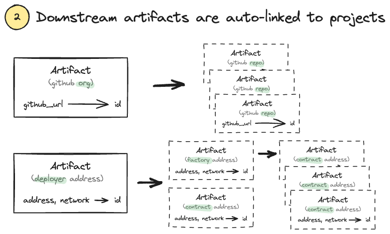
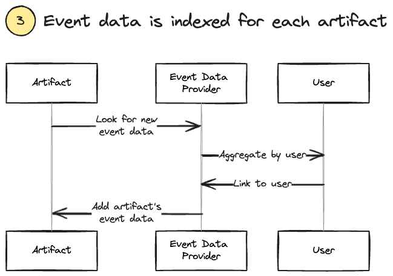
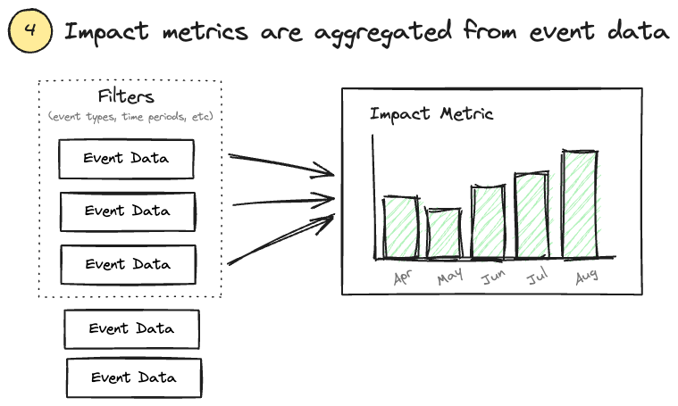

:::info
This section introduces some core concepts for understanding how OSO works and where the data comes from.
:::

OSO datasets are built from three primary registries: **collections**, **projects**, and **artifacts**. A **collection** is a group of projects. A **project** is a group of artifacts. An **artifact** is an open source work contribution that belongs to a project. These registries are completely public and maintained in [OSS Directory](https://github.com/opensource-observer/oss-directory).

Critically, a project can belong to many collections but _an artifact may only belong to one project_. A new project is instantiated from a unique `name` and a GitHub URL that is not owned by any other project. These properties are validated whenever a collection, project, or artifact is added to OSS Directory.

After registering an initial set of artifacts, OSO looks downstream for additional artifacts to associate with a project.

For example, when a project contains a **GitHub organization** artifact, OSO will index all repositories in that organization. When a project contains a blockchain **deployer address** artifact, OSO will index all contracts deployed by that address (including contracts deployed by factories deployed by that address).

Next, OSO indexes **events** that involve these artifacts. We work with event data providers, including [GH Archive](https://www.gharchive.org/), [npm](https://www.npmjs.com/), and blockchain ETL services like Goldsky and Dune. Our indexers are designed to capture a wide range of events, from code contributions to blockchain transactions, and link them to a user. Whenever new event data is retrieved, we associate it with the appropriate artifact and user id.

For example, when a project contains a **GitHub organization** artifact, OSO will index all commits, issues, pull requests, etc in the organization's repositories. When a project contains a blockchain **deployer address** artifact, OSO will index all transactions from all contracts downstream of that deployer address.

Finally, OSO aggregates this data to generate metrics and insights about the projects, collections, and artifacts in the OSS Directory. These metrics are available through the OSO website, API, and BigQuery.
