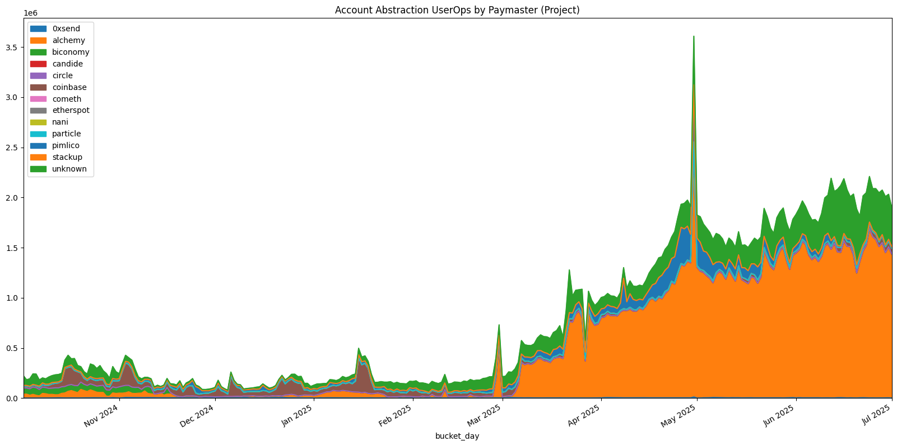
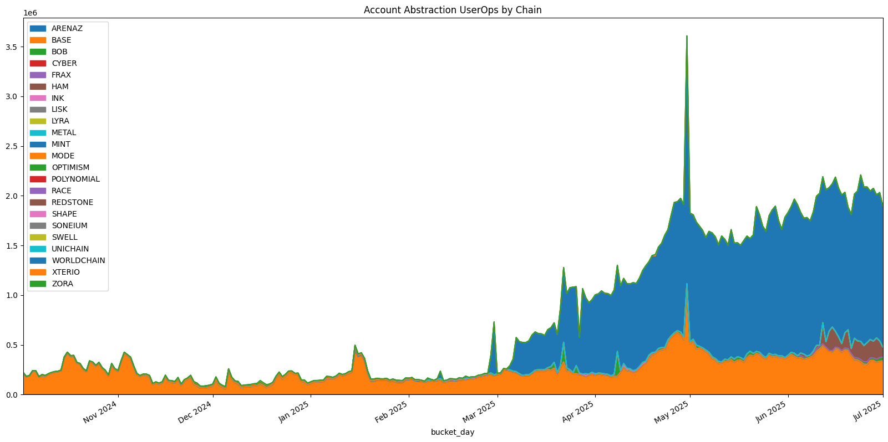
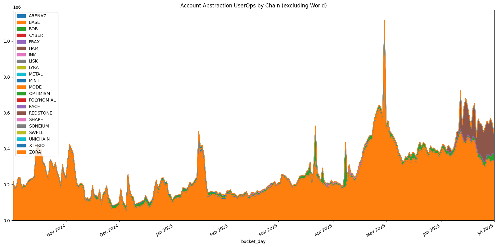

Learn how to analyze [ERC-4337 Account Abstraction](../../integrate/datasets/#superchain-4337) data across Superchain networks using OSO's data platform. This tutorial covers user operations, paymaster analysis, and cross-chain activity patterns.

New to OSO? Check out our [Getting Started guide](../../get-started/index.md) to set up your API access.

:::tip
This tutorial uses the Superchain 4337 data models which track ERC-4337 Account Abstraction activity across all Superchain networks including Base, Optimism, World, and more.
:::

## Getting Started

Before running any analysis, you'll need to set up your environment:

```python
import os
import pandas as pd
import matplotlib.pyplot as plt
import matplotlib.dates as mdates
from pyoso import Client

# Set up the OSO client
OSO_API_KEY = os.environ['OSO_API_KEY']
client = Client(api_key=OSO_API_KEY)
```

For more details on setting up Python notebooks, see our guide on [writing Python notebooks](../../guides/notebooks/index.mdx).

## Step 1: Explore the Data Models

Let's start by examining the available Account Abstraction data models to understand what we're working with.

### 4337 Traces Data

The `stg_superchain__4337_traces` table contains detailed information about each user operation:

```python
# Preview the 4337 trace data
df_traces = client.to_pandas("""
SELECT *
FROM stg_superchain__4337_traces
ORDER BY block_timestamp DESC
LIMIT 5
""")

print("4337 Traces Data Structure:")
print(df_traces.columns.tolist())
print("\nSample Data:")
print(df_traces)
```

This table includes:
- **chain**: The Superchain network (Base, Optimism, Zora, etc.)
- **block_timestamp**: When the operation occurred
- **transaction_hash**: The transaction that included the user operation
- **userop_hash**: Unique identifier for the user operation
- **method_id**: The method being called (0x7bb37428 for handleOps)
- **from_address**: The sender address
- **to_address**: The target contract address
- **bundler_address**: The bundler that included the operation
- **paymaster_address**: The paymaster contract (if used)
- **userop_gas_cost**: Total gas cost for the operation
- **userop_gas_used**: Gas units consumed
- **value**: ETH value transferred (usually 0 for AA operations)

### 4337 User Operation Logs

The `stg_superchain__4337_userop_logs` table contains event logs from user operations:

```python
# Preview the 4337 logs data
df_logs = client.to_pandas("""
SELECT *
FROM stg_superchain__4337_userop_logs
ORDER BY block_timestamp DESC
LIMIT 5
""")

print("4337 Logs Data Structure:")
print(df_logs.columns.tolist())
print("\nSample Data:")
print(df_logs)
```

This table includes:
- **sender_address**: The account that initiated the operation
- **paymaster_address**: The paymaster used (if any)
- **contract_address**: The EntryPoint contract address
- **userop_gas_price**: Gas price for the operation
- **userop_gas_used**: Gas units consumed

### Address Labels

We can also explored labeled addresses from the [Open Labels Initiative](https://www.openlabelsinitiative.org/):

```python
# Preview the address labels data
df_labels = client.to_pandas("""
SELECT * 
FROM stg_openlabelsinitiative__labels_decoded
LIMIT 5
""")

print("Address Labels Data Structure:")
print(df_labels.columns.tolist())
print("\nSample Data:")
print(df_labels)
```

This table contains labels for addresses, including:
- **address**: The address that the label is assigned to
- **tag_id**: The type of label (e.g. "is_paymaster", "owner_project")
- **tag_value**: The value of the label (e.g. "Alchemy", "Pimlico")


## Step 2: Analyze Paymaster Usage

Paymasters are a key component of Account Abstraction that allows an operator to pay for gas on behalf of a user. Let's analyze which paymasters are most popular, using the labels curated by 0xKofi at [BundleBear](https://www.bundlebear.com/)

### Identify Known Paymasters

First, let's identify paymasters that have been labeled:

```python
# Get known paymasters with their project owners
df_known_paymasters = client.to_pandas("""
WITH paymasters AS (
  SELECT address
  FROM stg_openlabelsinitiative__labels_decoded
  WHERE tag_id = 'is_paymaster'
)
SELECT
  address,
  MIN(tag_value) AS owner_project
FROM stg_openlabelsinitiative__labels_decoded
WHERE
  tag_id = 'owner_project'
  AND address IN (SELECT address FROM paymasters)
GROUP BY 1
ORDER BY owner_project
""")

print("Known Paymasters by Project:")
print(df_known_paymasters.groupby('owner_project')['address'].nunique().sort_values(ascending=False))
```

### Analyze Paymaster Usage Over Time

Now let's analyze how paymaster usage has evolved across different chains:

```python
# Get daily paymaster usage by project and chain
df_paymaster_usage = client.to_pandas("""
WITH paymasters AS (
  SELECT address
  FROM stg_openlabelsinitiative__labels_decoded
  WHERE tag_id = 'is_paymaster'
),
labeled_paymasters AS (
  SELECT
    address,
    MIN(tag_value) AS owner_project
  FROM stg_openlabelsinitiative__labels_decoded
  WHERE
    tag_id = 'owner_project'
    AND address IN (SELECT address FROM paymasters)
  GROUP BY 1
)

SELECT
  DATE_TRUNC('DAY', block_timestamp) AS bucket_day,
  COALESCE(p.owner_project, 'unknown') AS owner_project,
  chain,
  COUNT(*) AS userops_count
FROM stg_superchain__4337_userop_logs AS logs
LEFT JOIN labeled_paymasters AS p ON logs.paymaster_address = p.address
GROUP BY 1,2,3
ORDER BY bucket_day DESC, userops_count DESC
""")

# Convert to datetime for plotting
df_paymaster_usage['bucket_day'] = pd.to_datetime(df_paymaster_usage['bucket_day'])
```

### Visualize Paymaster Usage

Let's create visualizations to understand the trends:

```python
# Plot paymaster usage over time
plt.figure(figsize=(20, 10))

# Pivot data for plotting
pivot_data = df_paymaster_usage.pivot_table(
    index='bucket_day',
    columns='owner_project',
    values='userops_count',
    aggfunc='sum',
    fill_value=0
)

# Plot with area chart
ax = pivot_data.plot(
    kind='area',
    stacked=True,
    title='Account Abstraction UserOps by Paymaster Project',
    figsize=(20, 10)
)

# Format x-axis
ax.xaxis.set_major_locator(mdates.MonthLocator(interval=1))
ax.xaxis.set_major_formatter(mdates.DateFormatter('%b %Y'))
ax.set_xlim(pd.to_datetime('2024-10-01'), pd.to_datetime('2025-07-01'))
ax.legend(frameon=True, loc='upper left', bbox_to_anchor=(1, 1))
ax.set_ylabel('Daily User Operations')
ax.set_xlabel('Date')

plt.tight_layout()
plt.show()
```



## Step 3: Chain-by-Chain Analysis

Let's analyze Account Abstraction activity across different Superchain networks.

### Total Activity by Chain

```python
# Get total activity by chain
df_chain_totals = client.to_pandas("""
SELECT
  chain,
  COUNT(*) AS total_userops,
  COUNT(DISTINCT sender_address) AS unique_users,
  COUNT(DISTINCT paymaster_address) AS unique_paymasters,
  AVG(userop_gas_used) AS avg_gas_used,
  SUM(userop_gas_used * userop_gas_price) / 1e18 AS total_gas_cost_eth
FROM stg_superchain__4337_userop_logs
WHERE paymaster_address != '0x0000000000000000000000000000000000000000'
GROUP BY chain
ORDER BY total_userops DESC
""")

print("Account Abstraction Activity by Chain:")
print(df_chain_totals)
```

### Daily Activity Trends by Chain

```python
# Get daily activity by chain
df_daily_by_chain = client.to_pandas("""
SELECT
  DATE_TRUNC('DAY', block_timestamp) AS bucket_day,
  chain,
  COUNT(*) AS userops_count,
  COUNT(DISTINCT sender_address) AS unique_users
FROM stg_superchain__4337_userop_logs
GROUP BY 1, 2
ORDER BY bucket_day DESC, userops_count DESC
""")

df_daily_by_chain['bucket_day'] = pd.to_datetime(df_daily_by_chain['bucket_day'])

# Plot daily activity by chain
plt.figure(figsize=(20, 10))

pivot_chain = df_daily_by_chain.pivot_table(
    index='bucket_day',
    columns='chain',
    values='userops_count',
    aggfunc='sum',
    fill_value=0
)

ax = pivot_chain.plot(
    kind='area',
    title='Account Abstraction UserOps by Chain',
    figsize=(20, 10)
)

ax.xaxis.set_major_locator(mdates.MonthLocator(interval=1))
ax.xaxis.set_major_formatter(mdates.DateFormatter('%b %Y'))
ax.set_xlim(pd.to_datetime('2024-10-01'), pd.to_datetime('2025-07-01'))
ax.legend(frameon=True, loc='upper left', bbox_to_anchor=(1, 1))
ax.set_ylabel('Daily User Operations')
ax.set_xlabel('Date')

plt.tight_layout()
plt.show()
```



We can see that the number of user operations has been increasing over time, with a surge in activity in March 2025 from World. If we remove World from the analysis, we still see steady growth in activity.




## Step 4: User Behavior Analysis

Let's analyze user behavior patterns in Account Abstraction.

### User Activity Distribution

```python
# Analyze user activity distribution
df_user_activity = client.to_pandas("""
SELECT
  sender_address,
  chain,
  COUNT(*) AS userops_count,
  COUNT(DISTINCT DATE_TRUNC('DAY', block_timestamp)) AS active_days,
  MIN(block_timestamp) AS first_activity,
  MAX(block_timestamp) AS last_activity,
  AVG(userop_gas_used) AS avg_gas_used
FROM stg_superchain__4337_userop_logs
GROUP BY 1, 2
ORDER BY userops_count DESC
LIMIT 100
""")

print("Top Users by Activity:")
print(df_user_activity.head(10))
```

### Paymaster Adoption Analysis

```python
# Analyze paymaster adoption patterns
df_paymaster_adoption = client.to_pandas("""
WITH paymasters AS (
  SELECT address
  FROM stg_openlabelsinitiative__labels_decoded
  WHERE tag_id = 'is_paymaster'
),
labeled_paymasters AS (
  SELECT
    address,
    MIN(tag_value) AS owner_project
  FROM stg_openlabelsinitiative__labels_decoded
  WHERE
    tag_id = 'owner_project'
    AND address IN (SELECT address FROM paymasters)
  GROUP BY 1
)

SELECT
  COALESCE(p.owner_project, 'unknown') AS paymaster_project,
  chain,
  COUNT(*) AS total_userops,
  COUNT(DISTINCT sender_address) AS unique_users,
  COUNT(*) * 1.0 / COUNT(DISTINCT sender_address) AS avg_userops_per_user
FROM stg_superchain__4337_userop_logs AS logs
LEFT JOIN labeled_paymasters AS p ON logs.paymaster_address = p.address
WHERE logs.paymaster_address != '0x0000000000000000000000000000000000000000'
GROUP BY 1, 2
HAVING COUNT(*) > 100  -- Filter for significant usage
ORDER BY total_userops DESC
""")

print("Paymaster Adoption by Chain:")
print(df_paymaster_adoption)
```

## Step 5: Gas Analysis

Let's analyze gas usage patterns in Account Abstraction operations.

### Gas Usage Trends

```python
# Analyze gas usage over time
df_gas_analysis = client.to_pandas("""
SELECT
  DATE_TRUNC('DAY', block_timestamp) AS bucket_day,
  chain,
  AVG(userop_gas_used) AS avg_gas_used,
  APPROX_PERCENTILE(userop_gas_used, 0.5) AS median_gas_used,
  APPROX_PERCENTILE(userop_gas_used, 0.95) AS p95_gas_used,
  COUNT(*) AS userops_count
FROM stg_superchain__4337_userop_logs
GROUP BY 1, 2
ORDER BY bucket_day DESC
""")

df_gas_analysis['bucket_day'] = pd.to_datetime(df_gas_analysis['bucket_day'])

# Plot gas usage trends
plt.figure(figsize=(20, 10))

# Focus on major chains
major_chains = ['BASE', 'OPTIMISM', 'WORLDCHAIN']
for chain in major_chains:
    chain_data = df_gas_analysis[df_gas_analysis['chain'] == chain]
    if not chain_data.empty:
        plt.plot(chain_data['bucket_day'], chain_data['avg_gas_used'], 
                label=f'{chain} - Avg Gas', linewidth=2)

plt.title('Average Gas Usage by Chain Over Time')
plt.xlabel('Date')
plt.ylabel('Gas Units')
plt.legend()
plt.grid(True, alpha=0.3)
plt.tight_layout()
plt.show()
```

### Gas Cost Analysis

```python
# Analyze gas costs
df_gas_costs = client.to_pandas("""
SELECT
  chain,
  AVG(userop_gas_price) / 1e9 AS avg_gas_price_gwei,
  AVG(userop_gas_used * userop_gas_price) / 1e18 AS avg_gas_cost_eth,
  MEDIAN(userop_gas_used * userop_gas_price) / 1e18 AS median_gas_cost_eth,
  COUNT(*) AS userops_count
FROM stg_superchain__4337_userop_logs
WHERE userop_gas_price > 0
GROUP BY chain
ORDER BY avg_gas_cost_eth DESC
""")

print("Gas Cost Analysis by Chain:")
print(df_gas_costs)
```


## Summary

This tutorial has covered:

1. **Data Exploration**: Understanding the structure of 4337 traces and logs data
2. **Paymaster Analysis**: Identifying and analyzing paymaster usage patterns
3. **Chain Analysis**: Comparing Account Abstraction activity across Superchain networks
4. **User Behavior**: Understanding how frequently users are performing Account Abstraction operations
5. **Gas Analysis**: Examining gas usage and cost patterns

For more advanced analysis, you can combine this data with other OSO models like transaction data, contract activity, or funding flows to create comprehensive ecosystem analyses.

:::tip
Want to explore more? Check out our [Superchain Activity tutorial](../superchain-activity.md) for broader network analysis or our [Contract Activity tutorial](../contract-activity.mdx) for detailed contract interaction patterns.
::: 