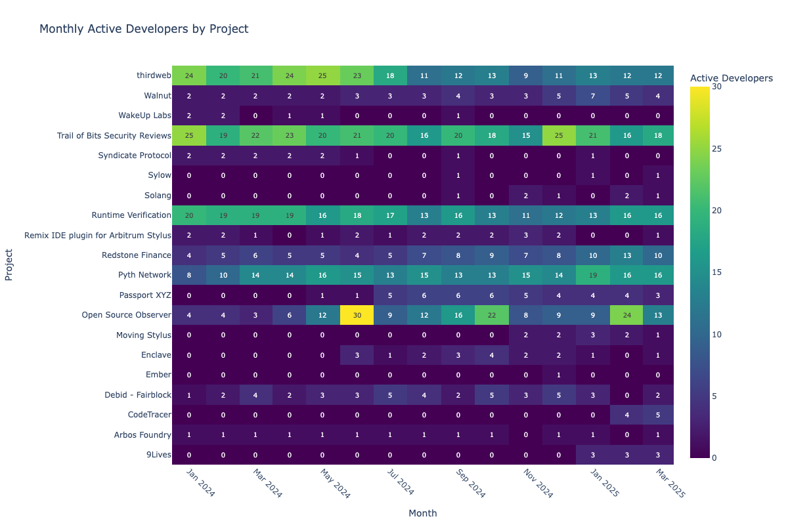

import Tabs from '@theme/Tabs';
import TabItem from '@theme/TabItem';

Track a cohort of projects across a set of metrics over time.
New to OSO? Check out our [Getting Started guide](../get-started/index.md)
to set up your API access.

## Getting Started

Before running any analysis, you'll need to set up your environment:

<Tabs>
<TabItem value="python" label="Python">

Start your Python notebook with the following:

```python
import os
import pandas as pd
from pyoso import Client

OSO_API_KEY = os.environ['OSO_API_KEY']
client = Client(api_key=OSO_API_KEY)
```

For more details on setting up Python notebooks, see our guide on [writing Python notebooks](../guides/notebooks/index.mdx).

</TabItem>
<TabItem value="graphql" label="GraphQL">

The following queries should work if you copy-paste them into our [GraphQL sandbox](https://www.opensource.observer/graphql). For more information on how to use the GraphQL API, check out our [GraphQL guide](../integrate/api.md).

</TabItem>
</Tabs>

## Explore Ecosystem Projects

### Discover Projects Deployed in an Ecosystem from the OSS Directory

The [OSS Directory](https://github.com/opensource-observer/oss-directory) is a curated registry of open-source software projects. The query below filters this directory to highlight projects with verifiable onchain deployments on Arbitrum One. 

<Tabs>
<TabItem value="python" label="Python">

```python
query = """
SELECT 
    project_id, 
    artifact_name, 
    artifact_type
FROM int_artifacts_by_project_in_ossd
WHERE 
    artifact_source = 'ARBITRUM_ONE'
    AND artifact_type IN ('CONTRACT', 'FACTORY', 'DEPLOYER')
LIMIT 10
"""
df = client.to_pandas(query)
```

</TabItem>
<TabItem value="graphql" label="GraphQL">

```graphql
# The GraphQL API currently only allows read-only GraphQL queries against OSO data marts.
# This analysis requires the use of an intermediate table.
# We recommend using pyoso to access the complete dataset.
```

</TabItem>
</Tabs>

### Track Developer Activity for Arbitrum-Deployed Projects

By joining with timeseries metrics, we can observe GitHub activity trends for each project across 2024 and 2025. 

<Tabs>
<TabItem value="python" label="Python">

```python
query = """
WITH arb_projects AS (
    SELECT 
        distinct project_id
    FROM int_artifacts_by_project_in_ossd
    WHERE 
        artifact_source = 'ARBITRUM_ONE'
        AND artifact_type IN ('CONTRACT', 'FACTORY', 'DEPLOYER')
)
SELECT  
    distinct p.display_name as Name,
    m.metric_name as Metric,
    ts.sample_date as Date,
    ts.amount as Value
FROM metrics_v0 m
JOIN timeseries_metrics_by_project_v0 ts
    on m.metric_id = ts.metric_id
JOIN projects_v1 p
    on p.project_id = ts.project_id
JOIN arb_projects a
    on p.project_id = a.project_id
WHERE 
    metric_name = 'GITHUB_active_developers_monthly'
    AND YEAR(ts.sample_date) in (2024, 2025)
"""
df_arb = client.to_pandas(query)
```

</TabItem>
<TabItem value="graphql" label="GraphQL">

```graphql
# The GraphQL API currently only allows read-only GraphQL queries against OSO data marts.
# This analysis requires the use of an intermediate table.
# We recommend using pyoso to access the complete dataset.
```


</TabItem>
</Tabs>

## Explore a Project Cohort

### Analyze GitHub Activity of Arbitrum Stylus Grant Program Projects

In contrast to the previous query which filtered projects based on onchain deployment on Arbitrum One, this query focuses on all Github-related metrics for projects that are part of the ‘arb-stylus’ collection—a set representing participants in the Arbitrum Stylus grant program.

<Tabs>
<TabItem value="python" label="Python">

```python
query = """
SELECT  
    distinct p.display_name as Name,
    m.metric_name as Metric,
    ts.sample_date as Date,
    ts.amount as Value
FROM metrics_v0 m
JOIN timeseries_metrics_by_project_v0 ts
    on m.metric_id = ts.metric_id
JOIN projects_v1 p
    on p.project_id = ts.project_id
JOIN projects_by_collection_v1 pc
    on p.project_id = pc.project_id
WHERE 
    metric_name like 'GITHUB_%'
    AND YEAR(ts.sample_date) in (2024, 2025)
    AND pc.collection_name = 'arb-stylus'
"""
df_stylus = client.to_pandas(query)
```

</TabItem>
<TabItem value="graphql" label="GraphQL">

First get Project IDs in collection 'arb-stylus'
```graphql
query GetProjectIdsInCollection {
  oso_projectsByCollectionV1(where: { collectionName: { _eq: "arb-stylus" } }) {
    projectId
  }
}
```

Now hardcode known metrics to get Metric IDs 
```graphql
query GetGitHubMetricIds {
  oso_metricsV0(where: {metricName: {_in: ["GITHUB_active_developers_monthly", "GITHUB_commits_monthly", "GITHUB_merged_pull_requests_monthly"]}}) {
    metricId
  } 
}
```

Get Time Series Data for Matching Projects + Metrics
```graphql
query GetStylusTimeseries(
  $projectIds: [String!],
  $metricIds: [String!]
) {
  oso_timeseriesMetricsByProjectV0(
    where: {
      projectId: { _in: $projectIds },
      metricId: { _in: $metricIds },
      sampleDate: {
        _gte: "2024-01-01",
        _lt: "2026-01-01"
      }
    },
  ) {
    projectId
    metricId
    sampleDate
    amount
  }
}
```

Using the IDs from the previous query
```graphql
{
  "projectIds": "VW4ai7Oe7BPLYGMIxn2WDhjqFHxkgiEeNqtfal8rsDI=",
  "metricIds": "Qsh+bcW0/h4pXQyKxnO2bY2UAefZIr1vmpcU5/OAhn8="
}
```

Note: Due to the complexity of this analysis, the GraphQL approach would require multiple queries and client-side processing to join all the necessary data.

</TabItem>
</Tabs>

## Visualize Results

### Heatmap of monthly developer activity

This heatmap provides a visual overview of monthly active developer activity for each project in the collection. 

<Tabs>
<TabItem value="python" label="Python">

```python
# Create a heatmap of active developers by project and month
import plotly.express as px
import plotly.graph_objects as go
from datetime import datetime
import numpy as np

# Filter for active developers metric
df_active_devs = df_stylus[df_stylus['Metric'] == 'GITHUB_active_developers_monthly'].copy()

# Convert date to month-year format
df_active_devs['Month'] = pd.to_datetime(df_active_devs['Date']).dt.strftime('%Y-%m')

# Pivot the data for heatmap
heatmap_data = df_active_devs.pivot(index='Name', columns='Month', values='Value')

# Fill NaN values with 0 for visualization
heatmap_data = heatmap_data.fillna(0)

# Create the heatmap
fig = go.Figure(data=go.Heatmap(
    z=heatmap_data.values,
    x=heatmap_data.columns,
    y=heatmap_data.index,
    colorscale='Viridis',
    colorbar=dict(title='Active Developers'),
    hoverongaps=False,
    text=heatmap_data.values,  # Show values on hover
    texttemplate='%{text:.0f}',  # Format as integers
    textfont={"size": 10},
    hovertemplate='Project: %{y}<br>Month: %{x}<br>Active Developers: %{z}<extra></extra>'
))

# Update layout
fig.update_layout(
    title='Monthly Active Developers by Project',
    xaxis_title='Month',
    yaxis_title='Project',
    height=800,  # Adjust height based on number of projects
    width=1200,  # Adjust width based on number of months
    xaxis=dict(tickangle=45),
    margin=dict(l=200)  # Increase left margin for project names
)

# Show the plot
fig.show()
```

</TabItem>
</Tabs>



You can replace the metric with another measure—such as GITHUB_commits_monthly or GITHUB_merged_pull_requests_monthly—to explore different dimensions of developer engagement.
