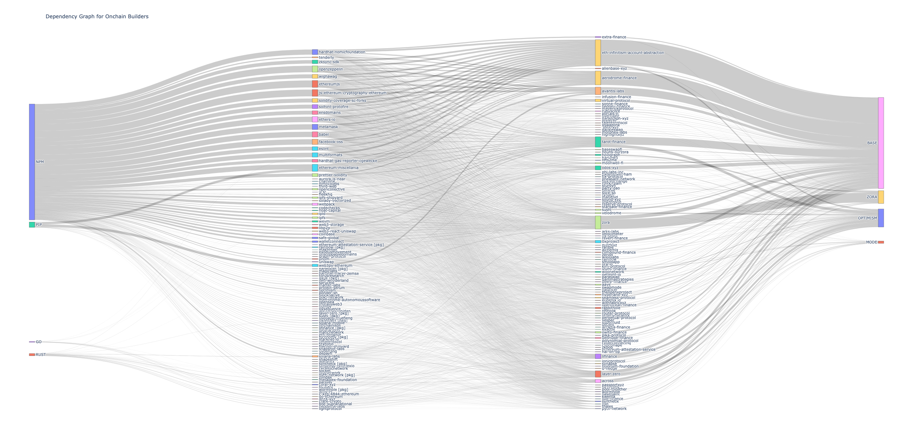

import Tabs from '@theme/Tabs';
import TabItem from '@theme/TabItem';

Trace the dependencies in a software bill of materials (SBOM) for a given repository and assign weights or other metrics to each node.
New to OSO? Check out our [Getting Started guide](../get-started/index.md)
to set up your API access.



## Getting Started

Before running any analysis, you'll need to set up your environment:

<Tabs>
<TabItem value="python" label="Python">

Start your Python notebook with the following:

```python
import os
import pandas as pd
from pyoso import Client

OSO_API_KEY = os.environ['OSO_API_KEY']
client = Client(api_key=OSO_API_KEY)
```

For more details on setting up Python notebooks, see our guide on [writing Python notebooks](../guides/notebooks/index.mdx).

</TabItem>
<TabItem value="graphql" label="GraphQL">

The following queries should work if you copy-paste them into our [GraphQL sandbox](https://www.opensource.observer/graphql). For more information on how to use the GraphQL API, check out our [GraphQL guide](../integrate/api.md).

</TabItem>
</Tabs>

## Identify Repositories and Packages

### Repository Metadata

Get metadata and basic stats about a repository using OSO's indexed data:

<Tabs>
<TabItem value="python" label="Python">

```python
query = """
SELECT *
FROM repositories_v0
WHERE artifact_url = 'https://github.com/ethereum/go-ethereum'
"""
df = client.to_pandas(query)
```

</TabItem>
<TabItem value="graphql" label="GraphQL">

```graphql
query GetRepositoryMetadata {
  oso_repositoriesV0(
    where: {
      artifactUrl: { _eq: "https://github.com/ethereum/go-ethereum" }
    }
  ) {
    artifactId
    artifactName
    artifactNamespace
    artifactUrl
    language
    description
    starCount
    forkCount
  }
}
```

</TabItem>
</Tabs>

### SBOMs (Package Dependencies)

OSO uses GitHub's Software Bill of Materials (SBOMs) dataset to identify package dependencies. Note that this data doesn't differentiate between direct and indirect dependencies, but provides a good starting point for mapping the software supply chain:

<Tabs>
<TabItem value="python" label="Python">

```python
query = """
SELECT *
FROM sboms_v0
WHERE from_artifact_id = '0mjl8VhWsui_6TEZZnbQzyf8h1A9bOioIlK17p0D5hI='
"""
df = client.to_pandas(query)
```

</TabItem>
<TabItem value="graphql" label="GraphQL">

```graphql
query GetSBOMs {
  oso_sbomsV0(
    where: {
      fromArtifactId: { _eq: "0mjl8VhWsui_6TEZZnbQzyf8h1A9bOioIlK17p0D5hI=" }
    }
  ) {
    fromArtifactId
    fromArtifactName
    fromArtifactNamespace
    toPackageArtifactName
    toPackageArtifactSource
    toPackageArtifactVersion
  }
}
```

</TabItem>
</Tabs>

### Package Maintainers

OSO leverages [Open Source Insights (deps.dev)](https://deps.dev) data to identify the repo that maintains a given package. This covers approximately 90% of packages based on our testing:

<Tabs>
<TabItem value="python" label="Python">

```python
query = """
SELECT
  package_artifact_source,
  package_artifact_name,
  package_owner_project_id,
  package_owner_artifact_namespace,
  package_owner_artifact_name
FROM package_owners_v0
WHERE package_artifact_name = '@libp2p/echo'
"""
df = client.to_pandas(query)
```

</TabItem>
<TabItem value="graphql" label="GraphQL">

```graphql
query GetPackageMaintainers {
  oso_packageOwnersV0(
    where: {
      packageArtifactName: { _eq: "@libp2p/echo" }
    }
  ) {
    packageArtifactSource
    packageArtifactName
    packageOwnerProjectId
    packageOwnerArtifactNamespace
    packageOwnerArtifactName
  }
}
```

</TabItem>
</Tabs>

### Package Usage Metrics

The following query uses package ownership data to calculate the number of projects that depend on a given package maintainer:

<Tabs>
<TabItem value="python" label="Python">

```python
query = """
SELECT
  package_owners.package_owner_artifact_namespace as maintainter,
  sboms.to_package_artifact_source as package_source,
  sboms.to_package_artifact_name as package_name,
  count(distinct sboms.from_artifact_id) as count_dependent_repos,
  count(distinct sboms.from_project_id) as count_dependent_projects
FROM sboms_v0 sboms
JOIN package_owners_v0 package_owners
  ON
    sboms.to_package_artifact_name = package_owners.package_artifact_name
    AND sboms.to_package_artifact_source = package_owners.package_artifact_source
WHERE
  package_owners.package_owner_artifact_namespace = 'wevm'
GROUP BY 1,2,3
"""
df = client.to_pandas(query)
```

</TabItem>
<TabItem value="graphql" label="GraphQL">

```graphql
query GetPackageUsageMetrics {
  # First get all packages maintained by wevm
  packages: oso_packageOwnersV0(
    where: {
      packageOwnerArtifactNamespace: { _eq: "wevm" }
    }
  ) {
    packageArtifactName
    packageArtifactSource
  }
  
  # Then for each package, you would need to query the dependent repos
  # This is a simplified example - you would need to run multiple queries
  # or use client-side processing to get the complete metrics
  sboms: oso_sbomsV0(
    where: {
      toPackageArtifactName: { _eq: "viem" },
      toPackageArtifactSource: { _eq: "NPM" }
    }
  ) {
    fromArtifactId
    fromProjectId
  }
}
```

</TabItem>
</Tabs>


### Build a Deep Funding Graph

This example demonstrates how to create a dependency graph for a group of related repositories, such as the one used by [Deep Funding](https://deepfunding.org). The analysis maps relationships between key Ethereum repositories and their package dependencies:

<Tabs>
<TabItem value="python" label="Python">

```python
query = """
SELECT DISTINCT
  sboms.from_artifact_namespace as seed_repo_owner,
  sboms.from_artifact_name as seed_repo_name,
  sboms.to_package_artifact_name as package_name,
  package_owners.package_owner_artifact_namespace as package_repo_owner,
  package_owners.package_owner_artifact_name as package_repo_name,
  sboms.to_package_artifact_source as package_source
FROM sboms_v0 sboms
JOIN package_owners_v0 package_owners
  ON
    sboms.to_package_artifact_name = package_owners.package_artifact_name
    AND sboms.to_package_artifact_source = package_owners.package_artifact_source
WHERE
  sboms.to_package_artifact_source IN ('NPM','CARGO','GOLANG','PYPI')
  AND package_owners.package_owner_artifact_namespace IS NOT NULL
  AND CONCAT(sboms.from_artifact_namespace, '/', sboms.from_artifact_name)
    IN ('prysmaticlabs/prysm','sigp/lighthouse','consensys/teku','status-im/nimbus-eth2',
        'chainsafe/lodestar','grandinetech/grandine','ethereum/go-ethereum',
        'nethermindeth/nethermind','hyperledger/besu','erigontech/erigon',
        'paradigmxyz/reth','ethereum/solidity','ethereum/remix-project',
        'vyperlang/vyper','ethereum/web3.py','ethereum/py-evm',
        'eth-infinitism/account-abstraction','safe-global/safe-smart-account',
        'a16z/helios','web3/web3.js','ethereumjs/ethereumjs-monorepo')
"""
df = client.to_pandas(query)

# We can also go further and create a network graph from the data we've just fetched:
import networkx as nx

# turn each node into a GitHub URL
gh = 'https://github.com/'
df['seed_repo_url'] = df.apply(lambda x: f"{gh}{x['seed_repo_owner']}/{x['seed_repo_name']}", axis=1)
df['package_repo_url'] = df.apply(lambda x: f"{gh}{x['package_repo_owner']}/{x['package_repo_name']}", axis=1)

# Store in a Network Graph
G = nx.DiGraph()

for repo_url in df['seed_repo_url'].unique():
    G.add_node(repo_url, level=1)
    
for repo_url in df['package_repo_url'].unique():
    if repo_url not in G.nodes:
        G.add_node(repo_url, level=2)
        
for _, row in df.iterrows():
    G.add_edge(
        row['seed_repo_url'],
        row['package_repo_url'],
        relation=row['package_source']
    )

# Placeholder for adding weights to the graph
global_weight = 0
for u, v in G.edges:
    G[u][v]['weight'] = global_weight    
```

</TabItem>
<TabItem value="graphql" label="GraphQL">

```graphql
query GetDependencyGraph {
  oso_sbomsV0(
    where: {
      toPackageArtifactSource: { _in: ["NPM", "CARGO", "GOLANG", "PYPI"] },
      fromArtifactNamespace: { _in: ["ethereum", "prysmaticlabs", "sigp", "consensys", "status-im", "chainsafe", "grandinetech", "nethermindeth", "hyperledger", "erigontech", "paradigmxyz", "vyperlang", "eth-infinitism", "safe-global", "a16z", "web3", "ethereumjs"] }
    }
  ) {
    fromArtifactNamespace
    fromArtifactName
    toPackageArtifactName
    toPackageArtifactSource
    packageOwners: oso_packageOwnersV0(
      where: {
        packageArtifactName: { _eq: "toPackageArtifactName" },
        packageArtifactSource: { _eq: "toPackageArtifactSource" }
      }
    ) {
      packageOwnerArtifactNamespace
      packageOwnerArtifactName
    }
  }
}
```

Note: The above GraphQL query is conceptual. In practice, you would need to run multiple queries or use client-side processing to join the data, as nested queries with dynamic values aren't supported in this way.

</TabItem>
</Tabs>

For more examples of dependency analysis, check out the [Deep Funding repo](https://github.com/deepfunding/dependency-graph).

## Weight Nodes and Edges

### Most Used Dependencies

Find the most commonly used dependencies across all projects in OSO. This query joins package ownership data with SBOM data to count how many projects depend on each package:

<Tabs>
<TabItem value="python" label="Python">

```python
query = """
SELECT
  p.project_id,
  pkgs.package_artifact_source,
  pkgs.package_artifact_name,
  COUNT(DISTINCT sboms.from_project_id) as num_dependents
FROM package_owners_v0 pkgs
JOIN sboms_v0 sboms
  ON pkgs.package_artifact_name = sboms.to_package_artifact_name
  AND pkgs.package_artifact_source = sboms.to_package_artifact_source
JOIN projects_v1 p
  ON pkgs.package_owner_project_id = p.project_id
WHERE pkgs.package_owner_project_id IS NOT NULL
GROUP BY 1,2,3
ORDER BY 4 DESC
"""
df = client.to_pandas(query)

# Optional: Display top dependencies
print("Top 10 most used dependencies:")
print(df.head(10))
```

</TabItem>
<TabItem value="graphql" label="GraphQL">

```graphql
query GetMostUsedDependencies {
  # This is a complex query that would require multiple requests
  # and client-side processing in GraphQL
  # Here's a simplified version that gets package owners
  oso_packageOwnersV0(
    where: {
      packageOwnerProjectId: { _is_null: false }
    }
    limit: 100
  ) {
    packageArtifactSource
    packageArtifactName
    packageOwnerProjectId
    project: oso_projectsV1(
      where: { projectId: { _eq: "packageOwnerProjectId" } }
    ) {
      projectName
    }
  }
}
```

Note: To get the complete metrics with dependency counts, you would need to run additional queries and join the data client-side.

</TabItem>
</Tabs>

### Downstream Impact

This is an example of a more advanced analysis that demonstrates how to analyze relationships between onchain projects and their development dependencies:

<Tabs>
<TabItem value="python" label="Python">

```python
query = """
SELECT
  onchain_projects.project_name as onchain_builder,
  onchain_metrics.event_source as network,
  onchain_metrics.address_count_90_days,
  onchain_metrics.gas_fees_sum_6_months,
  onchain_metrics.transaction_count_6_months as transactions_6_months,
  code_metrics.project_name as dev_tool_maintainer,
  package_owners.package_artifact_source as package_source,
  code_metrics.active_developer_count_6_months,
  code_metrics.contributor_count_6_months,
  code_metrics.commit_count_6_months,
  code_metrics.opened_issue_count_6_months,
  code_metrics.opened_pull_request_count_6_months,
  code_metrics.fork_count,
  code_metrics.star_count,
  code_metrics.last_updated_at_date
FROM sboms_v0 sboms
JOIN projects_v1 onchain_projects
  ON sboms.from_project_id = onchain_projects.project_id
JOIN projects_by_collection_v1 projects_by_collection
  ON onchain_projects.project_id = projects_by_collection.project_id
JOIN onchain_metrics_by_project_v1 onchain_metrics
  ON onchain_projects.project_id = onchain_metrics.project_id
JOIN package_owners_v0 package_owners
  ON sboms.to_package_artifact_name = package_owners.package_artifact_name
JOIN code_metrics_by_project_v1 code_metrics
  ON package_owners.package_owner_project_id = code_metrics.project_id
WHERE
  projects_by_collection.collection_name = 'op-retrofunding-4'
  AND transaction_count_6_months >= 1000
  AND address_count_90_days >= 420
"""
df = client.to_pandas(query)

# Optional: Add visualization code
import plotly.express as px

# Example visualization
fig = px.scatter(df, 
    x='address_count_90_days', 
    y='transactions_6_months',
    size='gas_fees_sum_6_months',
    hover_data=['onchain_builder', 'dev_tool_maintainer']
)
fig.show()
```

</TabItem>
<TabItem value="graphql" label="GraphQL">

```graphql
query GetDownstreamImpact {
  # This is a complex query that would require multiple requests
  # and client-side processing in GraphQL
  
  # First get projects in the collection
  projects: oso_projectsByCollectionV1(
    where: { collectionName: { _eq: "op-retrofunding-4" } }
  ) {
    projectId
    projectName
    
    # Get onchain metrics for these projects
    onchainMetrics: oso_onchainMetricsByProjectV1(
      where: { projectId: { _eq: "projectId" } }
    ) {
      eventSource
      addressCount90Days
      gasFeesSum6Months
      transactionCount6Months
    }
  }
  
  # For each project, you would need to query its dependencies
  # and then get metrics for the dependency maintainers
  # This would require client-side processing
}
```

Note: Due to the complexity of this analysis, the GraphQL approach would require multiple queries and client-side processing to join all the necessary data.

</TabItem>
</Tabs>

You can go even further in your analysis by joining on other OSO datasets. For more examples, check out the [Deep Funding repo](https://github.com/deepfunding/dependency-graph).
