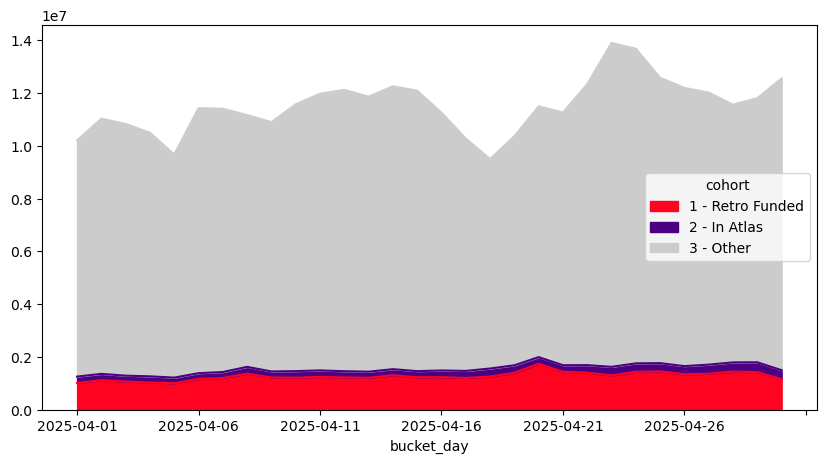

:::info
The goal of this tutorial is to dip your toes into OSO's blockchain event table and see how you can use it to answer questions about different project cohorts' activity on the Superchain.
:::

You can find the code for this tutorial [here](https://github.com/opensource-observer/insights/blob/main/analysis/optimism/pyoso/20250523_AtlasMarketShare.ipynb).

## Getting Started

New to OSO? Check out our [Getting Started guide](../get-started/index.md) to set up your API access.

Before running any analysis, you'll need to set up your environment:

```python
from dotenv import load_dotenv
import os
from pyoso import Client
import pandas as pd

load_dotenv()
OSO_API_KEY = os.getenv("OSO_API_KEY")
client = Client(api_key=OSO_API_KEY)
```

## Step 1 — Tag Contracts in OP Atlas

The CTE below grabs every contract address that has _ever_ been attached to an [OP Atlas](https://atlas.optimism.io/) project and flags the ones that signed up for the April 2025 snapshot of Retro Funding.

:::tip
OP Atlas assigns a unique `round_id` for each round of funding. The one we're interested in is "8" - and specifically the third snapshot. We've bundled this into a [collection](../guides/oss-directory/collection.md) called "8-3".
:::

Here is the query to lookup all contracts in OP Atlas that are relevant to the "8-3" snapshot.

```sql
SELECT
  abp.artifact_id,
  MAX(
    CASE WHEN pbc.collection_name = '8-3' THEN TRUE ELSE FALSE END
  ) AS is_retrofunded
  FROM artifacts_by_project_v1 AS abp
  LEFT JOIN projects_by_collection_v1 AS pbc
    ON abp.project_id = pbc.project_id
  WHERE abp.project_source = 'OP_ATLAS'
  GROUP BY 1
```

The result is that each `artifact_id` (a unique contract address + chain combination) now carries a boolean `is_retrofunded`.

We'll use this query to join the results to the blockchain event table next.

## Step 2 — Pull Daily Contract Invocations

Now we will pull the daily contract invocations for the month of April 2025. It's slow and expensive to query raw blockchain data, so we'll use the `int_events_daily__blockchain` table. This table already aggregates **unique tx-hashes** per contract, per day, so the query stays snappy even for month-long windows. The table includes a couple different event types and metrics, but we'll focus on `CONTRACT_INVOCATION` (top-level transactions).

```python
df_events = client.to_pandas("""
WITH projects AS (
  -- (same CTE as above)
  SELECT
    abp.artifact_id,
    MAX(CASE WHEN pbc.collection_name = '8-3' THEN TRUE ELSE FALSE END)
      AS is_retrofunded
  FROM artifacts_by_project_v1 abp
  LEFT JOIN projects_by_collection_v1 pbc
    ON abp.project_id = pbc.project_id
  WHERE abp.project_source = 'OP_ATLAS'
  GROUP BY 1
)

SELECT
  e.bucket_day,
  CASE
    WHEN p.is_retrofunded = TRUE  THEN '1 - Retro Funded'
    WHEN p.is_retrofunded = FALSE THEN '2 - In Atlas'
    ELSE '3 - Other'
  END AS cohort,
  SUM(e.count) AS txn_count
FROM int_events_daily__blockchain e
LEFT JOIN projects p
  ON e.to_artifact_id = p.artifact_id
WHERE e.bucket_day BETWEEN DATE '2025-04-01' AND DATE '2025-04-30'
  AND e.event_type = 'CONTRACT_INVOCATION'
GROUP BY 1, 2
ORDER BY 1
""")
```

The result is a dataframe with the following columns:

- `bucket_day`: The day of the month.
- `cohort`: The cohort of the contract (Retro Funded, Atlas-only, Other)
- `txn_count`: The number of contract invocations for that day.

We'll use this dataframe to create a chart of the trend in contract invocations by cohort.

## Step 3 — Visualise the Trend

We'll use the `pivot_table` method and then create a very simple chart of the trend.

```python
(
  df_events
    .pivot_table(
        index   = "bucket_day",
        columns = "cohort",
        values  = "txn_count",
        aggfunc = "sum",
        fill_value = 0,
    )
    .plot(
        kind   = "area",
        figsize = (10, 5),
        color   = ['#ff0420', 'indigo', '#ccc'],   # Retro Funded, Atlas-only, Other
    )
)
```

The units in the Y axis are the number of contract invocations. From this, we can see that the majority of contract invocations do not come from OP Atlas projects. However, the majority of contract invocations that are from a known project are indeed being Retro Funded.



## Next Steps

- **Drill into gas fees** — swap `SUM(e.count)` for `SUM(e.gas_fee)` to see cost share.
- **Extend the window** — change the `bucket_day` filter to explore seasonality.
- **Surface unmapped heavy hitters** — export the top “3 - Other” contracts and invite them to OP Atlas.

You can find the code for this tutorial [here](https://github.com/opensource-observer/insights/blob/main/analysis/optimism/pyoso/20250523_AtlasMarketShare.ipynb).

Happy querying! 🎉
