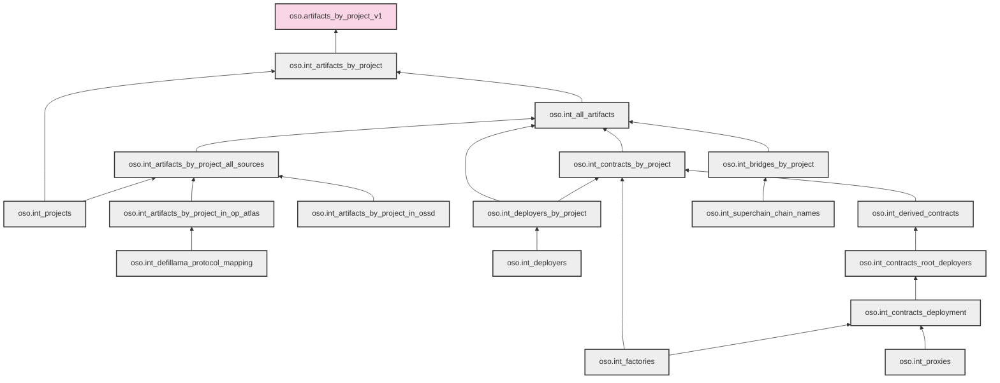

# Lineage of artifacts_by_project_v1

This document shows the lineage of `oso.artifacts_by_project_v1` and all the intermediate models that feed into it. The diagram shows the data flow from source models up to the final model.

> Note: Some circular dependencies exist in the actual model relationships (particularly between `int_artifacts_by_project_all_sources` and the artifact-specific models). These have been simplified in the diagram to show the primary flow direction.

## Mermaid Diagram

## Model Descriptions

### Main Model

- **oso.artifacts_by_project_v1**: Final model that provides artifacts by project information.

### First Level Dependencies

- **oso.int_artifacts_by_project**: Intermediate model that joins artifacts with projects.

### Second Level Dependencies

- **oso.int_all_artifacts**: Combines artifacts from various sources.
- **oso.int_projects**: Contains all projects from different sources.

### Third Level Dependencies

- **oso.int_deployers_by_project**: Links deployers to projects.
- **oso.int_contracts_by_project**: Links contracts to projects.
- **oso.int_bridges_by_project**: Links bridges to projects.
- **oso.int_artifacts_by_project_all_sources**: Combines artifacts from all sources.

### Fourth Level Dependencies

- **oso.int_artifacts_by_project_in_ossd**: Artifacts from OSS Directory.
- **oso.int_artifacts_by_project_in_op_atlas**: Artifacts from OP Atlas.
- **oso.int_deployers**: Contains deployer information.
- **oso.int_derived_contracts**: Contains derived contract information.
- **oso.int_factories**: Contains factory contract information.
- **oso.int_superchain_chain_names**: List of Superchain chain names.

### Fifth Level Dependencies

- **oso.int_defillama_protocol_mapping**: Maps DeFiLlama protocols to parent protocols.
- **oso.int_contracts_root_deployers**: Identifies root deployers of contracts.

### Sixth Level Dependencies

- **oso.int_contracts_deployment**: Contains contract deployment information.

### Seventh Level Dependencies

- **oso.int_proxies**: Contains proxy contract information.
