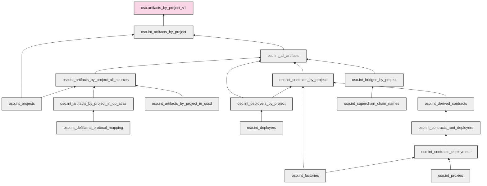
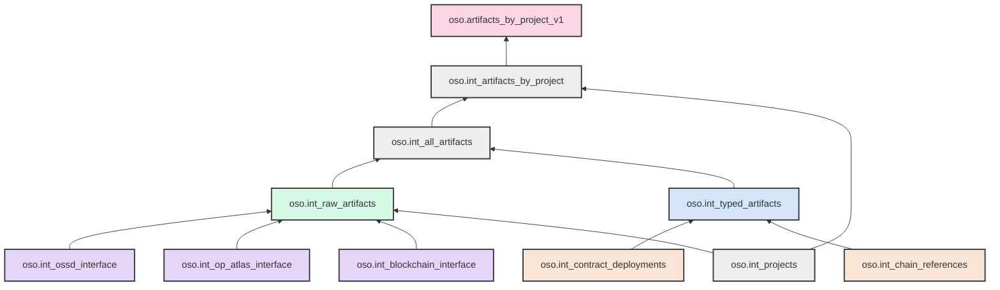

# Artifacts by Project Lineage Analysis and Simplification Proposal

## Overview

This issue analyzes the current lineage of the `artifacts_by_project_v1` model and proposes a simplified structure to improve maintainability and understanding. The current structure has grown complex with 18 models across 7 dependency levels, circular dependencies, and separate models for different artifact types and sources.

The proposed simplified approach would:

- Reduce model count by 50% (18 → 9)
- Reduce dependency levels by 43% (7 → 4)
- Create clearer unidirectional data flow
- Make the structure easier to maintain and extend

## Current Lineage

<details>
<summary>Click to expand current lineage diagram and details</summary>



> Note: Some circular dependencies exist in the actual model relationships (particularly between `int_artifacts_by_project_all_sources` and the artifact-specific models). These have been simplified in the diagram to show the primary flow direction.

### Model Descriptions

#### Main Model

- **oso.artifacts_by_project_v1**: Final model that provides artifacts by project information.

#### First Level Dependencies

- **oso.int_artifacts_by_project**: Intermediate model that joins artifacts with projects.

#### Second Level Dependencies

- **oso.int_all_artifacts**: Combines artifacts from various sources.
- **oso.int_projects**: Contains all projects from different sources.

#### Third Level Dependencies

- **oso.int_deployers_by_project**: Links deployers to projects.
- **oso.int_contracts_by_project**: Links contracts to projects.
- **oso.int_bridges_by_project**: Links bridges to projects.
- **oso.int_artifacts_by_project_all_sources**: Combines artifacts from all sources.

#### Fourth Level Dependencies

- **oso.int_artifacts_by_project_in_ossd**: Artifacts from OSS Directory.
- **oso.int_artifacts_by_project_in_op_atlas**: Artifacts from OP Atlas.
- **oso.int_deployers**: Contains deployer information.
- **oso.int_derived_contracts**: Contains derived contract information.
- **oso.int_factories**: Contains factory contract information.
- **oso.int_superchain_chain_names**: List of Superchain chain names.

#### Fifth Level Dependencies

- **oso.int_defillama_protocol_mapping**: Maps DeFiLlama protocols to parent protocols.
- **oso.int_contracts_root_deployers**: Identifies root deployers of contracts.

#### Sixth Level Dependencies

- **oso.int_contracts_deployment**: Contains contract deployment information.

#### Seventh Level Dependencies

- **oso.int_proxies**: Contains proxy contract information.
</details>

## Simplified Lineage Proposal

<details>
<summary>Click to expand simplified lineage diagram and details</summary>



### Simplified Model Structure

#### Main Models

- **oso.artifacts_by_project_v1**: Final model that provides artifacts by project information.
- **oso.int_artifacts_by_project**: Intermediate model that joins artifacts with projects.
- **oso.int_all_artifacts**: Combines artifacts from various sources.
- **oso.int_projects**: Contains all projects from different sources.

#### Consolidated Source Layer

- **oso.int_raw_artifacts**: Standardized schema for artifacts from all sources.
  - Replaces separate models for different sources
  - Provides consistent schema regardless of source

#### Source-Specific Interfaces

- **oso.int_ossd_interface**: Abstracts OSS Directory staging models.
- **oso.int_op_atlas_interface**: Abstracts OP Atlas staging models.
- **oso.int_blockchain_interface**: Abstracts blockchain data staging models.

#### Consolidated Artifact Types

- **oso.int_typed_artifacts**: Single model for all artifact types with a type column.
  - Replaces separate models for deployers, contracts, bridges, etc.
  - Simplifies adding new artifact types

#### Domain-Specific Modules

- **oso.int_contract_deployments**: Consolidated contract deployment logic.
  - Replaces the chain of `int_contracts_deployment` → `int_contracts_root_deployers` → `int_derived_contracts`
- **oso.int_chain_references**: Chain name references and mappings.
  - Replaces `int_superchain_chain_names` and related models

### Benefits of This Approach

1. **Reduced Model Count**: Fewer models to maintain and understand.
2. **Clearer Data Flow**: Simplified lineage with fewer hops.
3. **Modular Design**: Organized by domain and function.
4. **Easier Extensibility**: Adding new sources or artifact types is simpler.
5. **Reduced Circular Dependencies**: Cleaner architecture with fewer circular references.
</details>

## Comparison: Current vs. Simplified

<details>
<summary>Click to expand comparison details</summary>

### Model Count Comparison

| Metric                  | Current Structure | Simplified Structure | Reduction |
| ----------------------- | ----------------- | -------------------- | --------- |
| Total Models            | 18                | 9                    | 50%       |
| Dependency Levels       | 7                 | 4                    | 43%       |
| Source-specific Models  | 2                 | 3 (interfaces)       | N/A       |
| Artifact Type Models    | 3                 | 1                    | 67%       |
| Deployment Chain Models | 4                 | 1                    | 75%       |

### Structural Improvements

#### 1. Consolidated Source Layer

**Current Structure:**

- Separate models for each source (`int_artifacts_by_project_in_ossd`, `int_artifacts_by_project_in_op_atlas`)
- Different schemas and processing logic for each source
- Complex joins to combine sources

**Simplified Structure:**

- Single `int_raw_artifacts` model with standardized schema
- Source-specific interfaces that handle the transformation to the standard schema
- Cleaner separation between source-specific logic and common processing

#### 2. Unified Artifact Types

**Current Structure:**

- Separate models for each artifact type (`int_deployers_by_project`, `int_contracts_by_project`, `int_bridges_by_project`)
- Duplicated logic across artifact type models
- Complex circular dependencies

**Simplified Structure:**

- Single `int_typed_artifacts` model with a type column
- Common processing logic for all artifact types
- Simpler extension for new artifact types

#### 3. Flattened Deployment Chain

**Current Structure:**

- Long chain of models: `int_contracts_deployment` → `int_contracts_root_deployers` → `int_derived_contracts`
- Complex dependencies between deployment-related models
- Difficult to understand the full deployment logic

**Simplified Structure:**

- Single `int_contract_deployments` model
- Consolidated deployment logic in one place
- Clearer understanding of contract deployment process

### Visual Comparison

**Current Structure:**

```
7 levels deep, 18 models, complex circular dependencies
```

**Simplified Structure:**

```
4 levels deep, 9 models, clear unidirectional flow
```

</details>

## Implementation Strategy

<details>
<summary>Click to expand implementation strategy</summary>

### Core Principles

#### 1. Source Abstraction

Create clear interfaces between staging and intermediate layers:

```
staging models → source interfaces → consolidated models
```

Benefits:

- Isolates source-specific logic
- Makes it easier to handle changes in source data
- Provides a clear contract between layers

#### 2. Type Consolidation

Instead of separate models for each artifact type, use a single model with a type column:

```
int_typed_artifacts (with artifact_type column)
```

Benefits:

- Common processing logic for all types
- Easier to add new types
- Reduced circular dependencies

#### 3. Domain Modularization

Group related models into clear domains:

```
/contracts/
/social/
/identifiers/
```

Benefits:

- Better organization
- Clearer responsibilities
- Easier to understand and maintain

### Phased Implementation

#### Phase 1: Create Interface Models

1. Implement source-specific interfaces without changing existing models
2. Validate that interfaces produce the same output as current models

Example:

```sql
-- Create new interface model
CREATE MODEL oso.int_ossd_interface AS
SELECT ... FROM oso.stg_ossd__current_projects;

-- Validate against existing model
SELECT COUNT(*) FROM oso.int_ossd_interface;
SELECT COUNT(*) FROM oso.int_artifacts_by_project_in_ossd;
```

#### Phase 2: Implement Consolidated Models

1. Create `int_raw_artifacts` and `int_typed_artifacts`
2. Run in parallel with existing models to validate output

Example:

```sql
-- Create consolidated model
CREATE MODEL oso.int_raw_artifacts AS
SELECT ... FROM oso.int_ossd_interface
UNION ALL
SELECT ... FROM oso.int_op_atlas_interface;

-- Validate against existing model
SELECT COUNT(*) FROM oso.int_raw_artifacts;
SELECT COUNT(*) FROM oso.int_artifacts_by_project_all_sources;
```

#### Phase 3: Implement Domain-Specific Modules

1. Create `int_contract_deployments` and other domain modules
2. Validate against existing deployment chain

Example:

```sql
-- Create consolidated deployment model
CREATE MODEL oso.int_contract_deployments AS
SELECT ... FROM oso.stg_superchain__factories;

-- Validate against existing models
SELECT COUNT(*) FROM oso.int_contract_deployments;
SELECT COUNT(*) FROM oso.int_derived_contracts;
```

#### Phase 4: Update Final Models

1. Modify `int_all_artifacts` and `int_artifacts_by_project` to use new models
2. Validate final output matches current output

Example:

```sql
-- Update final model
CREATE MODEL oso.int_all_artifacts_new AS
SELECT ... FROM oso.int_raw_artifacts
UNION ALL
SELECT ... FROM oso.int_typed_artifacts;

-- Validate against existing model
SELECT COUNT(*) FROM oso.int_all_artifacts_new;
SELECT COUNT(*) FROM oso.int_all_artifacts;
```

#### Phase 5: Deprecate Legacy Models

1. Once all validations pass, deprecate and remove old models
2. Update documentation and lineage diagrams

### Considerations

1. **Backward Compatibility**: Ensure existing downstream consumers aren't affected
2. **Performance**: Test query performance with the new structure
3. **Documentation**: Update documentation to reflect the new structure
4. **Testing**: Comprehensive testing to ensure data integrity
</details>

## Sample Implementations

<details>
<summary>Click to expand sample implementation for int_raw_artifacts</summary>

```sql
MODEL (
  name oso.int_raw_artifacts,
  description "Standardized schema for artifacts from all sources",
  kind FULL,
  dialect trino,
  grain (artifact_id),
  tags (
    'entity_category=artifact'
  ),
  audits (
    has_at_least_n_rows(threshold := 0)
  )
);

/*
  This model consolidates artifacts from all sources into a standardized schema.
  It relies on source-specific interface models that handle the transformation
  from source-specific schemas to this standard schema.

  Benefits:
  - Single source of truth for all artifacts
  - Consistent schema regardless of source
  - Easier to add new sources
  - Clearer separation between source-specific logic and common processing
*/

WITH ossd_artifacts AS (
  SELECT
    artifact_id,
    artifact_source_id,
    artifact_source,
    artifact_namespace,
    artifact_name,
    artifact_url,
    artifact_type,
    project_id,
    'OSSD' AS data_source,
    last_updated_at
  FROM oso.int_ossd_interface
),

op_atlas_artifacts AS (
  SELECT
    artifact_id,
    artifact_source_id,
    artifact_source,
    artifact_namespace,
    artifact_name,
    artifact_url,
    artifact_type,
    project_id,
    'OP_ATLAS' AS data_source,
    last_updated_at
  FROM oso.int_op_atlas_interface
),

blockchain_artifacts AS (
  SELECT
    artifact_id,
    artifact_source_id,
    artifact_source,
    artifact_namespace,
    artifact_name,
    artifact_url,
    artifact_type,
    project_id,
    'BLOCKCHAIN' AS data_source,
    last_updated_at
  FROM oso.int_blockchain_interface
),

all_artifacts AS (
  SELECT * FROM ossd_artifacts
  UNION ALL
  SELECT * FROM op_atlas_artifacts
  UNION ALL
  SELECT * FROM blockchain_artifacts
),

-- Handle potential duplicates across sources with a priority-based approach
deduplicated_artifacts AS (
  SELECT
    artifact_id,
    artifact_source_id,
    artifact_source,
    artifact_namespace,
    artifact_name,
    artifact_url,
    artifact_type,
    project_id,
    data_source,
    last_updated_at,
    -- Create a priority field for deduplication
    ROW_NUMBER() OVER (
      PARTITION BY artifact_id
      ORDER BY
        -- Prioritize sources (can be adjusted based on data quality)
        CASE
          WHEN data_source = 'OP_ATLAS' THEN 1
          WHEN data_source = 'OSSD' THEN 2
          WHEN data_source = 'BLOCKCHAIN' THEN 3
          ELSE 99
        END,
        -- For same source, take the most recently updated
        last_updated_at DESC
    ) AS priority
  FROM all_artifacts
)

-- Final output with standardized schema
SELECT
  artifact_id,
  artifact_source_id,
  artifact_source,
  artifact_namespace,
  artifact_name,
  artifact_url,
  artifact_type,
  project_id,
  data_source,
  last_updated_at
FROM deduplicated_artifacts
WHERE priority = 1  -- Take only the highest priority record for each artifact_id
```

</details>

<details>
<summary>Click to expand sample implementation for int_ossd_interface</summary>

```sql
MODEL (
  name oso.int_ossd_interface,
  description "Interface model for OSS Directory data that transforms source-specific schema to standard schema",
  kind FULL,
  dialect trino,
  audits (
    has_at_least_n_rows(threshold := 0)
  )
);

/*
  This interface model abstracts the details of the OSS Directory staging models
  and transforms them into a standardized schema that can be consumed by the
  int_raw_artifacts model.

  Benefits:
  - Isolates source-specific logic
  - Makes it easier to handle changes in source data
  - Provides a clear contract between staging and intermediate layers
*/

WITH projects AS (
  SELECT
    project_id,
    websites,
    social,
    github,
    npm,
    blockchain,
    defillama,
    updated_at
  FROM oso.stg_ossd__current_projects
),

-- Website artifacts
website_artifacts AS (
  SELECT
    projects.project_id,
    unnested_website.url AS artifact_source_id,
    'WWW' AS artifact_source,
    '' AS artifact_namespace,
    unnested_website.url AS artifact_name,
    unnested_website.url AS artifact_url,
    'WEBSITE' AS artifact_type,
    projects.updated_at AS last_updated_at
  FROM projects
  CROSS JOIN UNNEST(projects.websites) AS @unnested_struct_ref(unnested_website)
),

-- Social media artifacts
farcaster_artifacts AS (
  SELECT
    projects.project_id,
    unnested_farcaster.url AS artifact_source_id,
    'FARCASTER' AS artifact_source,
    '' AS artifact_namespace,
    CASE
      WHEN unnested_farcaster.url LIKE 'https://warpcast.com/%'
      THEN SUBSTRING(unnested_farcaster.url, 22)
      ELSE unnested_farcaster.url
    END AS artifact_name,
    unnested_farcaster.url AS artifact_url,
    'SOCIAL_HANDLE' AS artifact_type,
    projects.updated_at AS last_updated_at
  FROM projects
  CROSS JOIN UNNEST(projects.social.farcaster) AS @unnested_struct_ref(unnested_farcaster)
),

twitter_artifacts AS (
  SELECT
    projects.project_id,
    unnested_twitter.url AS artifact_source_id,
    'TWITTER' AS artifact_source,
    '' AS artifact_namespace,
    CASE
      WHEN unnested_twitter.url LIKE 'https://twitter.com/%'
      THEN SUBSTRING(unnested_twitter.url, 21)
      WHEN unnested_twitter.url LIKE 'https://x.com/%'
      THEN SUBSTRING(unnested_twitter.url, 15)
      ELSE unnested_twitter.url
    END AS artifact_name,
    unnested_twitter.url AS artifact_url,
    'SOCIAL_HANDLE' AS artifact_type,
    projects.updated_at AS last_updated_at
  FROM projects
  CROSS JOIN UNNEST(projects.social.twitter) AS @unnested_struct_ref(unnested_twitter)
),

-- GitHub repositories
github_artifacts AS (
  SELECT
    projects.project_id,
    repos.id::VARCHAR AS artifact_source_id,
    'GITHUB' AS artifact_source,
    repos.owner AS artifact_namespace,
    repos.name AS artifact_name,
    LOWER(CONCAT('https://github.com/', repos.owner, '/', repos.name)) AS artifact_url,
    'REPOSITORY' AS artifact_type,
    projects.updated_at AS last_updated_at
  FROM projects
  CROSS JOIN UNNEST(projects.github) AS @unnested_struct_ref(unnested_github)
  INNER JOIN oso.stg_ossd__current_repositories AS repos
    ON LOWER(CONCAT('https://github.com/', repos.owner)) = LOWER(TRIM(TRAILING '/' FROM unnested_github.url))
    OR LOWER(repos.url) = LOWER(TRIM(TRAILING '/' FROM unnested_github.url))
),

-- NPM packages
npm_artifacts AS (
  SELECT
    projects.project_id,
    unnested_npm.url AS artifact_source_id,
    'NPM' AS artifact_source,
    SPLIT(REPLACE(
      CASE
        WHEN unnested_npm.url LIKE 'https://npmjs.com/package/%'
        THEN SUBSTRING(unnested_npm.url, 27)
        WHEN unnested_npm.url LIKE 'https://www.npmjs.com/package/%'
        THEN SUBSTRING(unnested_npm.url, 31)
        ELSE unnested_npm.url
      END,
      '@', ''
    ), '/')[@array_index(0)] AS artifact_namespace,
    CASE
      WHEN unnested_npm.url LIKE 'https://npmjs.com/package/%'
      THEN SUBSTRING(unnested_npm.url, 27)
      WHEN unnested_npm.url LIKE 'https://www.npmjs.com/package/%'
      THEN SUBSTRING(unnested_npm.url, 31)
      ELSE unnested_npm.url
    END AS artifact_name,
    unnested_npm.url AS artifact_url,
    'PACKAGE' AS artifact_type,
    projects.updated_at AS last_updated_at
  FROM projects
  CROSS JOIN UNNEST(projects.npm) AS @unnested_struct_ref(unnested_npm)
),

-- Blockchain artifacts
blockchain_artifacts AS (
  SELECT
    projects.project_id,
    unnested_blockchain.address AS artifact_source_id,
    unnested_network AS artifact_source,
    '' AS artifact_namespace,
    unnested_blockchain.address AS artifact_name,
    unnested_blockchain.address AS artifact_url,
    unnested_tag AS artifact_type,
    projects.updated_at AS last_updated_at
  FROM projects
  CROSS JOIN UNNEST(projects.blockchain) AS @unnested_struct_ref(unnested_blockchain)
  CROSS JOIN UNNEST(unnested_blockchain.networks) AS @unnested_array_ref(unnested_network)
  CROSS JOIN UNNEST(unnested_blockchain.tags) AS @unnested_array_ref(unnested_tag)
),

-- DeFiLlama protocols
defillama_artifacts AS (
  SELECT
    projects.project_id,
    LOWER(unnested_defillama.url) AS artifact_source_id,
    'DEFILLAMA' AS artifact_source,
    '' AS artifact_namespace,
    CASE
      WHEN unnested_defillama.url LIKE 'https://defillama.com/protocol/%'
      THEN SUBSTRING(unnested_defillama.url, 32)
      ELSE unnested_defillama.url
    END AS artifact_name,
    unnested_defillama.url AS artifact_url,
    'DEFILLAMA_PROTOCOL' AS artifact_type,
    projects.updated_at AS last_updated_at
  FROM projects
  CROSS JOIN UNNEST(projects.defillama) AS @unnested_struct_ref(unnested_defillama)
),

-- Combine all artifact types
all_artifacts AS (
  SELECT * FROM website_artifacts
  UNION ALL
  SELECT * FROM farcaster_artifacts
  UNION ALL
  SELECT * FROM twitter_artifacts
  UNION ALL
  SELECT * FROM github_artifacts
  UNION ALL
  SELECT * FROM npm_artifacts
  UNION ALL
  SELECT * FROM blockchain_artifacts
  UNION ALL
  SELECT * FROM defillama_artifacts
)

-- Final output with standardized schema and generated artifact_id
SELECT
  @oso_entity_id(artifact_source, artifact_namespace, artifact_name) AS artifact_id,
  artifact_source_id,
  UPPER(artifact_source) AS artifact_source,
  LOWER(artifact_namespace) AS artifact_namespace,
  LOWER(artifact_name) AS artifact_name,
  LOWER(artifact_url) AS artifact_url,
  UPPER(artifact_type) AS artifact_type,
  project_id,
  last_updated_at
FROM all_artifacts
```

</details>

<details>
<summary>Click to expand sample implementation for int_typed_artifacts</summary>

```sql
MODEL (
  name oso.int_typed_artifacts,
  description "Consolidated model for all artifact types with a type column",
  kind FULL,
  dialect trino,
  grain (artifact_id, artifact_type),
  tags (
    'entity_category=artifact'
  ),
  audits (
    has_at_least_n_rows(threshold := 0)
  )
);

/*
  This model consolidates different artifact types (deployers, contracts, bridges)
  into a single model with a type column. It enriches the raw artifacts with
  type-specific attributes and relationships.

  Benefits:
  - Single model for all artifact types
  - Common processing logic
  - Easier to add new artifact types
  - Reduced circular dependencies
*/

WITH
-- Get base artifacts from raw_artifacts
base_artifacts AS (
  SELECT
    artifact_id,
    artifact_source_id,
    artifact_source,
    artifact_namespace,
    artifact_name,
    artifact_url,
    artifact_type,
    project_id,
    data_source,
    last_updated_at
  FROM oso.int_raw_artifacts
),

-- Enrich contract artifacts with deployment information
contract_artifacts AS (
  SELECT
    base.artifact_id,
    base.artifact_source_id,
    base.artifact_source,
    base.artifact_namespace,
    base.artifact_name,
    base.artifact_url,
    'CONTRACT' AS artifact_type,
    base.project_id,
    base.data_source,
    base.last_updated_at,
    deployments.deployment_timestamp,
    deployments.deployer_address,
    deployments.factory_address,
    deployments.create_type,
    deployments.is_proxy
  FROM base_artifacts AS base
  LEFT JOIN oso.int_contract_deployments AS deployments
    ON base.artifact_source = deployments.chain
    AND base.artifact_name = deployments.contract_address
  WHERE base.artifact_type = 'CONTRACT'
),

-- Enrich deployer artifacts
deployer_artifacts AS (
  SELECT
    base.artifact_id,
    base.artifact_source_id,
    base.artifact_source,
    base.artifact_namespace,
    base.artifact_name,
    base.artifact_url,
    'DEPLOYER' AS artifact_type,
    base.project_id,
    base.data_source,
    base.last_updated_at,
    NULL AS deployment_timestamp,
    NULL AS deployer_address,
    NULL AS factory_address,
    NULL AS create_type,
    FALSE AS is_proxy
  FROM base_artifacts AS base
  WHERE base.artifact_type = 'DEPLOYER'
),

-- Enrich bridge artifacts with chain information
bridge_artifacts AS (
  SELECT
    base.artifact_id,
    base.artifact_source_id,
    base.artifact_source,
    base.artifact_namespace,
    base.artifact_name,
    base.artifact_url,
    'BRIDGE' AS artifact_type,
    base.project_id,
    base.data_source,
    base.last_updated_at,
    NULL AS deployment_timestamp,
    NULL AS deployer_address,
    NULL AS factory_address,
    NULL AS create_type,
    FALSE AS is_proxy,
    chains.is_superchain
  FROM base_artifacts AS base
  LEFT JOIN oso.int_chain_references AS chains
    ON base.artifact_source = chains.chain
  WHERE base.artifact_type = 'BRIDGE'
),

-- Combine all artifact types
all_typed_artifacts AS (
  SELECT
    artifact_id,
    artifact_source_id,
    artifact_source,
    artifact_namespace,
    artifact_name,
    artifact_url,
    artifact_type,
    project_id,
    data_source,
    last_updated_at,
    deployment_timestamp,
    deployer_address,
    factory_address,
    create_type,
    is_proxy,
    NULL AS is_superchain
  FROM contract_artifacts

  UNION ALL

  SELECT
    artifact_id,
    artifact_source_id,
    artifact_source,
    artifact_namespace,
    artifact_name,
    artifact_url,
    artifact_type,
    project_id,
    data_source,
    last_updated_at,
    deployment_timestamp,
    deployer_address,
    factory_address,
    create_type,
    is_proxy,
    NULL AS is_superchain
  FROM deployer_artifacts

  UNION ALL

  SELECT
    artifact_id,
    artifact_source_id,
    artifact_source,
    artifact_namespace,
    artifact_name,
    artifact_url,
    artifact_type,
    project_id,
    data_source,
    last_updated_at,
    deployment_timestamp,
    deployer_address,
    factory_address,
    create_type,
    is_proxy,
    is_superchain
  FROM bridge_artifacts

  UNION ALL

  -- Include other artifact types without type-specific enrichment
  SELECT
    artifact_id,
    artifact_source_id,
    artifact_source,
    artifact_namespace,
    artifact_name,
    artifact_url,
    artifact_type,
    project_id,
    data_source,
    last_updated_at,
    NULL AS deployment_timestamp,
    NULL AS deployer_address,
    NULL AS factory_address,
    NULL AS create_type,
    FALSE AS is_proxy,
    NULL AS is_superchain
  FROM base_artifacts
  WHERE artifact_type NOT IN ('CONTRACT', 'DEPLOYER', 'BRIDGE')
)

-- Final output with standardized schema
SELECT
  artifact_id,
  artifact_source_id,
  artifact_source,
  artifact_namespace,
  artifact_name,
  artifact_url,
  artifact_type,
  project_id,
  data_source,
  last_updated_at,
  deployment_timestamp,
  deployer_address,
  factory_address,
  create_type,
  is_proxy,
  is_superchain
FROM all_typed_artifacts
```
