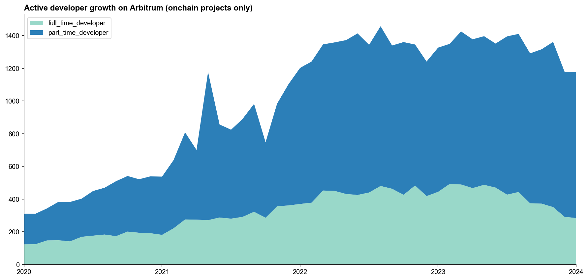
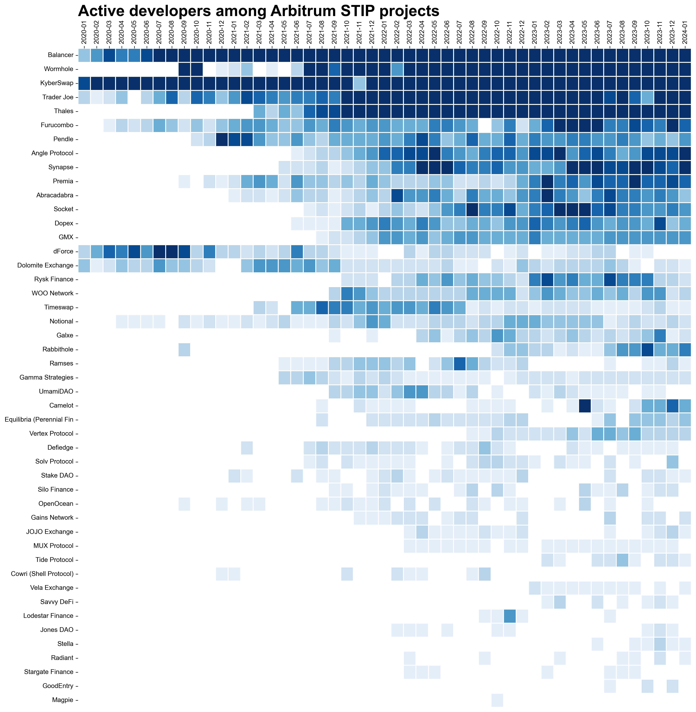

We are excited to share our first report covering the open source software (OSS) projects building on Arbitrum. This report is the first of several we'll be sharing with the community, and focuses on **developer activity**.

Some highlights:

1. We are currently tracking over 300 OSS projects and over 13,000 code artifacts that are making an impact on the Arbitrum ecosystem. 
2. There are currently around 1800 developers working on these projects. Our estimate is similar to the latest Electric Capital developer report, although we've included an additional 94 projects not yet captured in their registry. 
3. Active developers is 18% lower than the peak of around 2200 in March 2023, however, this is driven mostly by reductions in a small number of projects, not a decline across the board. In fact, most projects have been relatively stable in terms of developer numbers over the past 12 months.

This work has been funded by a grant from Plurality Labs. We will be releasing a follow-up report that covers the onchain contributions of ~200 of the 300+ projects included here. We will also leverage the data to propose an initial 4-5 “impact pools” of projects’ contributions that can inform future grantmaking efforts by Plurality Labs and the Arbitrum DAO.

<!-- truncate -->

As always, you can explore the Python notebooks we use for processing and visualization the data in reports like this [here](https://github.com/opensource-observer/insights/). If you find any errors or want to improve our information about a specific project, go [here](https://github.com/opensource-observer/oss-directory) and make a PR to the relevant project entry. And if you’re a data enthusiast who wants to contribute or learn more about what we're building, please sign up to join our [data collective](https://www.opensource.observer/data-collective)!

## Coverage of Arbitrum OSS projects

This report features 345 OSS projects that are critical to the Arbitrum ecosystem. Their impact includes both open source code contributions and smart contracts deployed on Arbitrum One, driving millions of transactions and sequencer fees.

There is no single source of truth of all the projects and contributors in a decentralized network economy like Arbitrum. The next section describes the methodology we used to populate an initial directory. Please [help us](https://docs.opensource.observer/docs/contribute/add-update/intro) add to it!

### How these projects were identified

We first built out an initial collection of more othan 200 projects' GitHub organizations by leveraging [“Electric Capital Crypto Ecosystems Mapping”](https://github.com/electric-capital/crypto-ecosystems) list of Arbitrum sub-ecosystems. These included new projects as well as ones that were already in our OSS Directory through prior research. 

Next, we identified decoded contracts for more than 180 projects on Dune. We then did the tedious but essential work of linking projects' GitHubs, deployer addresses, and smart contracts. There remains a long tail of contracts deployed by smaller projects that have not been matched to a GitHub org yet, although we believe we have excellent coverage of the larger and more active onchain projects. 

Finally, we reviewed the grants data and tracking performed by other Plurality Labs partners including [Karma GAP](https://gap.karmahq.xyz/arbitrum/) and [OpenBlock Labs](https://www.openblocklabs.com/app/arbitrum/grantees) to identify any remaining onchain projects that have an active grant from Arbitrum.

The following Venn diagram shows all 345 projects in our initial dataset and the overlap between the two registries:

- 188 OSS projects with contracts on Arbitrum One *and* a public GitHub org (“arb-onchain”)
- 251 OSS projects with a public GitHub org from the latest Crypto Ecosystems mapping *but* not necessarily contracts on Arbitrum (“arbitrum-crypto-ecosystems”)
- 94 OSS projects in both sets

We also performed our own desk research, project diligencing, and data audits for every project in this Venn diagram. This work makes us confident in two things:

1. This snapshot is a robust cross-section at the time of writing (January 31, 2024); and 
2. By the time you read this it will already be out of date.

### Cataloging onchain vs offchain artifacts

This is a massive corpus of work artifacts, as shown in the alluvial diagram below. We have omitted from this chart some of the contracts produced by Defi and NFT minting platforms, as well as Safe (multsigs), so this is an underestimation of the total number of contracts being indexed by OSO.

## Developer activity trends

Developer activity on Arbitrum is tracking close to all-time highs. We estimate that there are currently around 1800 active developers (non-bot accounts who have committed code in a given month) working on Arbitrum projects. This figure excludes contributions from Offchain Labs as well as any contributions made to private or personal repos.

### Activity among onchain projects

The decline is greatest among projects that are included in the Crypto Ecosystems mapping but that do not have onchain contracts that we are currently tracking. The following area chart only looks at the 188 projects that have contracts on Arbitrum One and a public GitHub org and splits them by "full-time" vs "part-time" developers. Full-time developers are ones who have made commits on at least 10 days in a given month.

### Recent changes in developer numbers

We can zoom in specifically on the question of net change in developer activity over the past four quarters. The chart below shows the vast majority of projects have developer numbers that are comparable to where they were last year during Q4. There are a few outliers that have significantly fewer contributors (eg, [Pyth Network](https://github.com/orgs/pyth-network/repositories) and [MakerDAO](https://github.com/orgs/makerdao/repositories)) but are very much still active, and several with a big surge (eg, Chainlink and DefiLlama).

If anything, the data shows that there has been remarkable consistency of the past year despite unfavorable market conditions.

### Full-time developers in the ecosystem

If all of the onchain projects in the Arbitrum ecosystem were committing to the same GitHub, here’s what it would look like. This heatmap shows "full-time developers" only. The darkest squares are ones that have 10 or more full-time developers. Well-known Ethereum projects like MakerDAO, Metamask, and Lido appear at the top of the list, with lots of dark squares. Most of the Arbitrum-focused defi and gaming projects are farther down the list, as they have smaller teams and fewer full-time developers.

### STIP-related developer activity

We can refine this type of analysis further and just look at the subset of onchain projects that are part of the recent Short Term Incentives Program (STIP) grants round. This heatmap shows all developers (including part-time ones). The darkest squares are ones that have 10 or more full-time developers. It should be noted that not all of these projects have large ongoing software components to their work, so developer activity is not necessarily correlated to liquidity provider activity. We recommend [the analysis from OpenBlock Labs](https://www.openblocklabs.com/app/arbitrum/grantees) for a deeper dive on this cohort of projects.

## What's next?

Again, this was just a small taste of what's possible with the data we’re collecting. In early February, we will release a follow-up report that covers the onchain contributions of ~200 of the 300+ projects included here. At the end of February, we will leverage the data to propose an initial 4-5 “impact pools” that can inform future grantmaking efforts by Plurality Labs and the Arbitrum DAO.

You can explore the Python notebook and some static data dumps [here](https://github.com/opensource-observer/insights/). And if you want to contribute or learn more about what we're building, please sign up to join our [data collective](https://www.opensource.observer/data-collective).