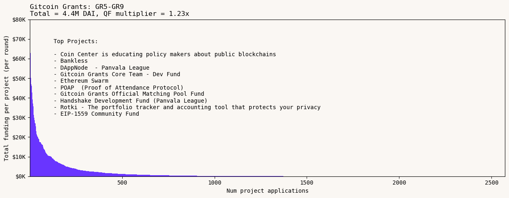
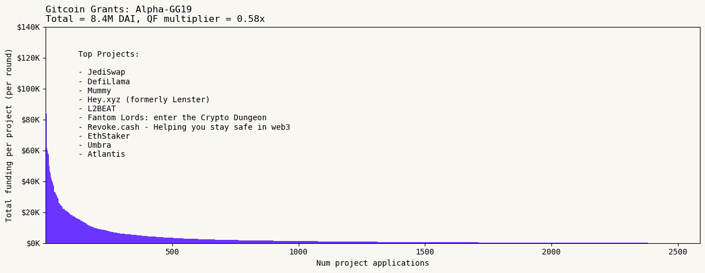
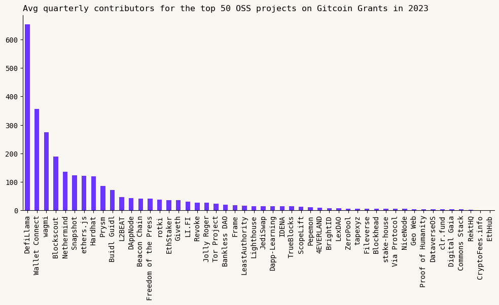

Gitcoin has been providing grants to open source software teams since 2019.

Over the last four years, more than $38M has been distributed via quadratic funding across 3,000+ projects and over 18,000 project applications. This includes both $22M in matching funds and $16M in direct donations from the community. On average, for every $1.00 put up by a matching fund donor, they have raised an additional $0.75 from the community.

(Overall, Gitcoin has allocated [more than $50M](https://impact.gitcoin.co/) towards public goods through a range of mechanisms, including direct donations and bounties, as well as quadratic funding.)

Although there are often anecdotal reports about Gitcoin's impact from projects, there have been few attempts to look longitudinally across a cohort of projects and track their impact over multiple years.

In this piece, we identify a group of 50 open source software projects that have received significant funding across multiple Gitcoin Grants rounds and then we examine the relationship between grants and growth.

Within this cohort, we see that for every $1M that has been paid out in grants since 2019, there are 7 full-time developers who are still around today. If we factor in the crowdfund multiplier, then every $1M put into the matching pool is associated with 13 retained full-time developers. These results have held up even during the bear market.

<!-- truncate -->

_Click the image above to zoom in._</ span>

Although these numbers are likely an upper bound, we can put them in context by comparing them to the broader performance of the crypto sector. According to Electric Capital's 2023 edition of the [Developer Report](https://www.developerreport.com/reports/devs/2023?s=developer-report), the sector has a total of 6,889 full-time open source developers. Meanwhile, more than [$76 billion](https://pitchbook.com/news/reports/q4-2023-crypto-report) has been invested by venture capital firms since 2018 according to Pitchbook. This translates into a return of less than 0.1 full-time developers for every $1M raised in venture capital.

## Some caveats

First, as we all know, correlation is not causation. The 50 OSS projects included in this analysis have all grown and increased their impact while receiving quarterly funding injections from Gitcoin Grants. However, this relationship is not causal. We have neither a counterfactual nor a good way to model what their growth might have been in the absence of Gitcoin Grants.

Second, Gitcoin Grants is not the only funding mechanism that exists. Most if not all of these projects have received other grants and have their own direct fundraising channels. Further work could be done to determine how significant Gitcoin's funding has been to these projects over the years.

Third, there is a built-in survivorship bias in the data. Our cohort was selected by looking for projects that have been involved in multiple rounds. We don't have as much data on the projects that dropped out after several rounds. For every Uniswap and Plasma Group that only participated in a few rounds and now controls a billion dollar treasury, there are dozens if not hundreds of projects that people have forgotten about. That said, it is hard to find examples of projects that did well on Gitcoin Grants initially and then quickly became inactive. So, while survivorship bias is relevant, it probably doesn't have a huge effect on the results.

## Gitcoin's growth and changes over 19 rounds

It's worth setting the stage by giving an overview of how Gitcoin's grants rounds have evolved. For the most part, Gitcoin has run a major round every quarter. The sizes of the rounds has ebbed and flowed with the project's maturity and market cycles, but these rounds have been an important touchstone for the Ethereum open source community for the last four years.

### **The early years: GR1-GR4 [2019-2020]**

The first four Gitcoin rounds distributed less than $1M (combined) across over 300 applicants, but were very focused on projects directly serving the core Ethereum community.

Stalwarts like EthHub, Lighthouse, Prysm, and ethers.js were the first "short tail" public goods to emerge. Plasma Group (now OP Labs) and Uniswap were also near the fat tail of the distribution in these early rounds and have since gone on to become major ecosystem funders in their own right.

In GR1-GR4, for every $1 put up by match funders, they got an additional $0.83 from crowdfunders.

### The start of the bull run: GR5-GR9 [2020-2021]

The next five Gitcoin rounds occurred during Covid lockdowns, DeFi summer, and the beginning of the NFT craze.

Coin Center and Bankless were two of the hottest non-OSS projects during this period. This is also the same period when DAppNode and Rotki started to become fixtures of the OSS rounds.

Over $4M was distributed to projects during this period. The multiplier for matching pool funders peaked at $1.23, as Gitcoin's user base became larger, more diverse, and potentially more airdrop-aware.

### The adolescent years: GR10-GR15 [2021-2022]

These rounds coincided with the peak of the bull market and the subsequent FTX blowup. During this period, Gitcoin launched GTC and turned into a DAO, expanded to serve a much larger community, and attracted a more diverse base of match funders.

Nearly $25M was distributed to projects -- across an extremely long tail of applicants. These large rounds were significant crowdfunding events, though the multiplier for match funders dropped to around $0.65 on the dollar.

Already-popular projects like Coin Center, Rotki, and ether.js were joined at the top of the results page by several new entrants to the Ethereum ecosystem including DefiLlama and Umbra (ScopeLift). In addition, non-crypto native OSS projects like Electronic Frontier Foundation and Tor started participating in Gitcoin rounds and performing well. Cause rounds in domains like DeSci, support for Ukraine, and ReFi sprouted up during this period too.

GR15 was the last round run on "cGrants". Gitcoin skipped a quarter at the end of 2022 and then migrated its grants rounds to Allo protocol in early 2023.

### Grants on Allo: Alpha Round to GG19 [2023]

Gitcoin has now done four main rounds on Allo, distributing $8.4M to around 2500 applicants. These rounds have been deployed on a variety of chains, from Ethereum mainnet, to L2s like Arbitrum and Optimism, to side chains like Phantom and Polygon, and even on the Public Goods Network (PGN).

The top projects during this period all have very strong user bases, eg, JediSwap, DefiLlama, Mummy, and Hey.xyz (Lenster). L2Beat and Revoke.cash are two of the younger projects that quickly moved to the short tail of the distribution.

There has been a lot of experimentation during this most recent phase, not just in terms of the protocol and the multitude of chains, but also around Sybil defense / Gitcoin Passport and encouraging communities to run their own rounds on Grants Stack.

This brings us to the present day.

## So far, so good, so what?

Gitcoin's dynamics seem to reward projects that play the long game - that is, projects who build a following and appear consistently in grants rounds.

A key question this raises is whether these projects were already big and popular (and Gitcoin was a good way for them to capitalize on that), or whether Gitcoin contributed to a virtuous cycle of increased funding, increased work / impact, increased reputation, etc.

We can look at the relationship between Gitcoin grants and projects' growth on at least one dimension of productivity: developer activity. As a large part of Gitcoin's project base comes from the open source community, we can chart their developer activity alongside the various funding rounds.

The following exhibit plots the combined developer activity of 50 OSS projects that have participated in at least 5 Gitcoin rounds over the years. Critically, the analysis starts before the projects start receiving funding from Gitcoin. (Tor, for instance, has been around since before 2010.)

These 50 OSS projects have received a total of $9.4M from Gitcoin Grants (almost a quarter of all grants given out since GR1). Many received over $250K and some as much as $500K cumulatively. Virtually all of the projects applied to every round on cGrants and the majority also continued to apply on Allo.

Over the same period, these projects have grown dramatically in terms of contributor and developer numbers. Applying Electric Capital's definition of a full-time developer (someone who has committed code to a project on more than 10 distinct days in a given month), these projects have 69 full-time contributors and an additional 233 part-time developers. These are up from 3 full-time and 28 part-time developers in 2018 (prior to Gitcoin Grants).

Although there are a few projects with very large contributor numbers (eg, DefiLlama, Wallet Connect, wagmi), virtually all 50 in the cohort had ongoing activity in 2023. Developer growth slowed down during the bear market of 2022/23 but did not retreat back to pre-2022 levels.

The most interesting finding is the correlation between Gitcoin Grants and developer growth. Overall, we see that there has been $135K in grant funding per full-time developer. In other words, for every $1M that has been paid out in grants since 2019, there are 7.4 full-time developers who are still around today.

If we factor in the crowdfund multiplier of 0.75, then every $1M put into the matching pool has resulted in 13 retained full-time developers.

Sure, the average developer who views Gitcoin Grants as a meaningful source of income is likely to be more missionary than mercenary. However, for ecosystems that want to grow their developer numbers, these are still some pretty compelling results.

_Even a [billion dollars](https://twitter.com/owocki/status/1467517849098866695) of capital cannot compete with a project having a soul._

Feel free to pick these numbers apart. You can view the datasets and the notebook I used to prepare the exhibits [here](https://github.com/opensource-observer/insights/blob/main/analysis/gitcoin/2024-02-09%20Gitcoin%20Grants%20%3D%20Growth.ipynb). 

---

## Acknowledgements

This work is a taste of what we’re up to at [RegenLearnings.xyz](https://regenlearnings.xyz/) (come join us in the [groupchat](https://t.me/+QE6Pm1DtfktkYjYx)!) and the [Kariba Data Collective](https://www.kariba.network/). In particular, I want to acknowledge Umar Khan, who poured over the Gitcoin grants data and helped line it up with OSO’s developer data; David Gasquez and Distributed Doge, who are making datasets like Gitcoin's more widely available and easier to work with; and Meg Lister and Owocki, who provided healthy doses of cheerleading and sanity-checking from start to finish.