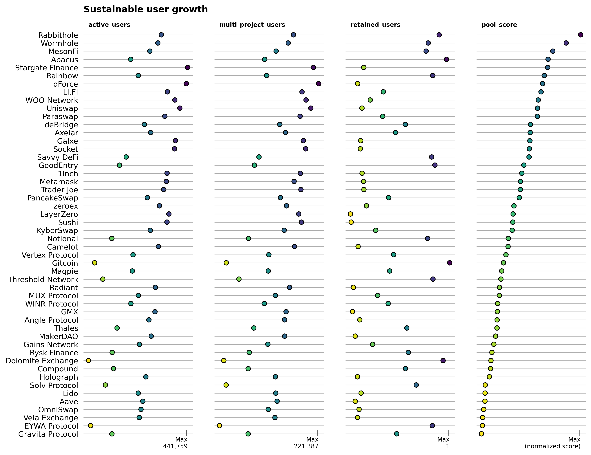
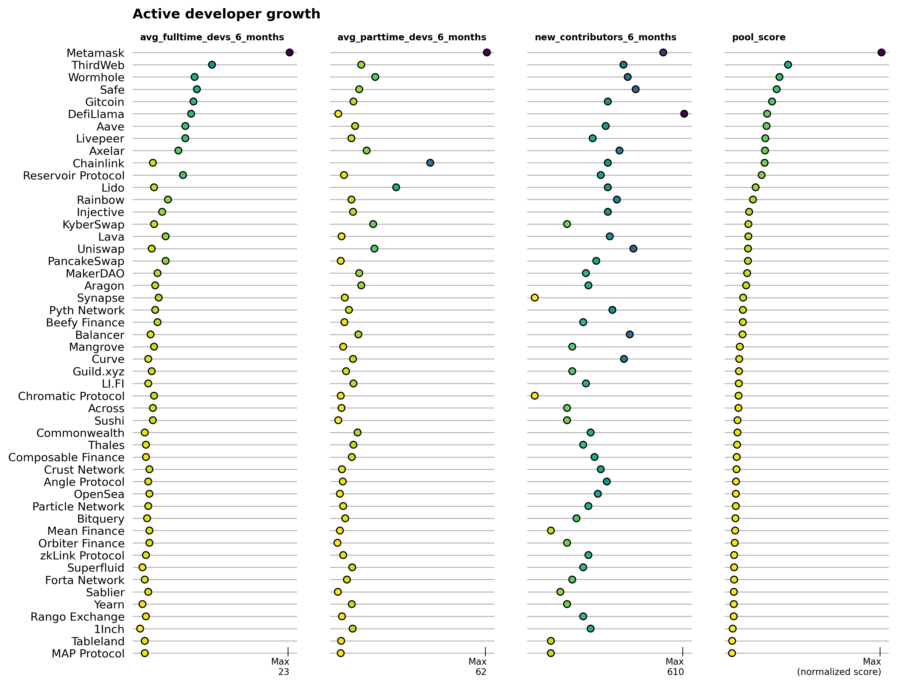
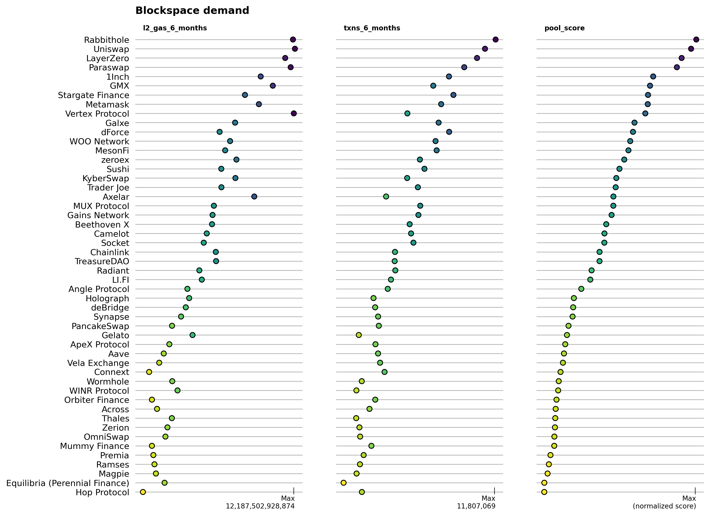
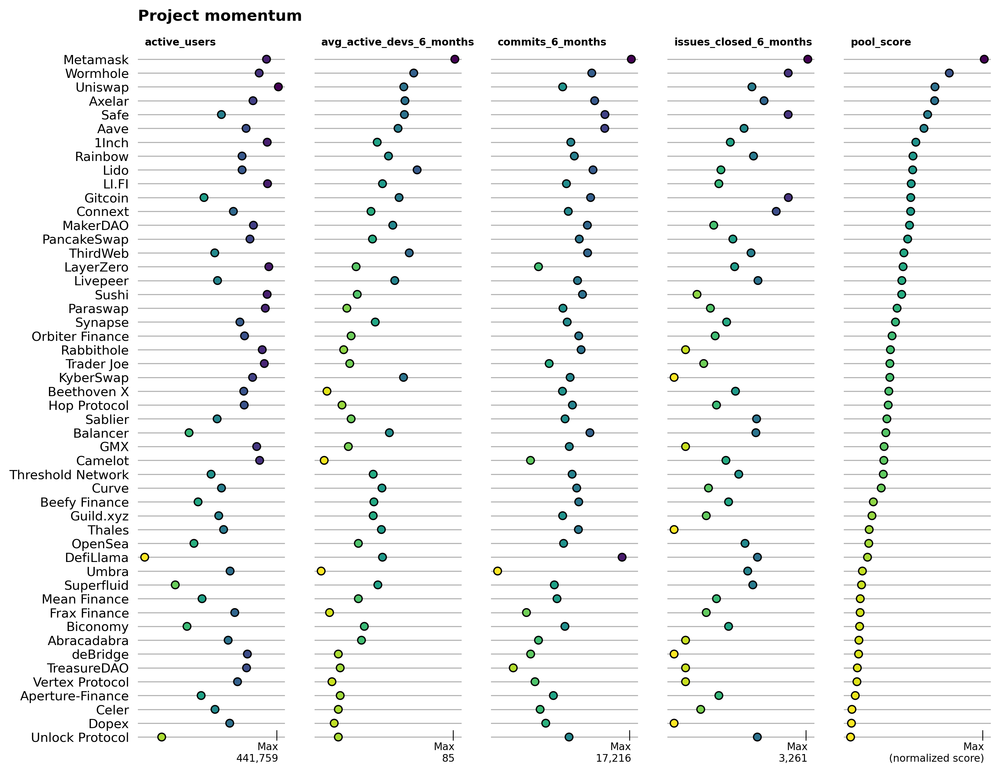

In our last past, we provided a snapshot on the [open source software projects building on Arbitrum](../arb-ecosystem-analysis). In this post, we will apply a series of experimental impact metrics to identify positive growth and network contribution trends across a cohort of more than 300 major projects on Arbitrum.

We believe impact metrics such as these are instrumental in helping the Arbitrum DAO better design incentives and allocate capital across its ecosystem. The metrics we've included are all derived from both onchain and off-chain project data. They include well-established crypto indicators like active users, sequencer fees, and transaction counts as well as common OSS metrics like full-time active developers, issues closed, and new contributors. 

The real value, however, lies in combining simple metrics in novel ways to filter and benchmark projects' contributions. We introduce four "impact pools" that can assist with this type of analysis. The pools are:

- Sustainable user growth: projects that not only bring large numbers of active users to the network but also retain and connect them easily to other dapps
- Developer growth: projects with the most developer activity and new contributors to its GitHub repos in recent months
- Blockspace demand: projects with the most transactions and sequencer fee contributions
- Momentum: projects with a mix of positive developer and onchain user trends

As described in [our previous post](../arb-ecosystem-analysis#methodology-for-project-identification), these projects were sourced from the most recent [“Electric Capital Crypto Ecosystems Mapping”](https://github.com/electric-capital/crypto-ecosystems), from Dune Analytics, and from Plurality Labs partners including [Karma GAP](https://gap.karmahq.xyz/arbitrum/) and [OpenBlock Labs](https://www.openblocklabs.com/app/arbitrum/grantees). We invite your contributions to enhance this directory; please visit [here](https://github.com/opensource-observer/oss-directory) to submit a PR or [here](https://docs.opensource.observer/docs/contribute/intro) to learn more about how to contribute data about projects and their code artifacts.

<!-- truncate -->

## A word of caution

Before getting into the numbers, we want to flag that this work is experimental in at least two ways.

First, our data platform is still in active development. We just recently connected sources of onchain data for projects building on Arbitrum to our existing database of open source software development metrics. There are still some kinks we are ironing out and as result it's likely that some projects, contract addresses, and other types of data slipped through the cracks. Please let us know if you find any gaps or inconsistencies with the data.

Second, we are continuously iterating on our impact metrics. The metrics included here are a starting point and should not be viewed as fully-formed. While our impact pool coefficients may not be ready for deploying funding against (yet), they should be helpful in quickly identifying trends among projects and relative performance levels. 

If you have ideas for how to test and iterate on these types of impact metrics, check out [our docs](../contribute/transform/create-impact-metrics) and send us a note.

## How pools are constructed

An impact pool is essentially a weighted portfolio of projects based on multiple impact metrics. For instance, the blockspace demand pool considers transaction counts and sequencer fee contributions and weights these metrics 50/50. Thus, a project at the top of the impact pool is usually one that performs well on both indicators. 

The general process for constructing an impact pool consists of four steps. First, we select relevant project metrics (eg, `multi_project_users`). Next, we apply a set of eligibility filters to determine which projects should be considered. For this exercise, the only filter we use is a date filter to ignore projects that started less than 6 months ago. Then, we apply a model for normalizing the data into a continuous distribution. We kept things simple here too, keeping every indicator on either a standard normal or a lognormal distribution. Finally, we applied a weighting coefficient to each metric's distribution function to determine how heavily it should be weighted in the pool.

### Available impact metrics

Each pool is constructed from a series of relevant impact metrics that have been aggregated for each project (as of February 28, 2024).

Using Uniswap as an example, these indicators include:

```
project_name                                            Uniswap
first_commit_date                2018-03-07 21:59:23.000000 UTC
last_commit_date                 2024-02-27 04:25:00.000000 UTC
repos                                                      58.0
stars                                                   26540.0
forks                                                   24545.0
contributors                                             1061.0
contributors_6_months                                     123.0
new_contributors_6_months                                  69.0
avg_fulltime_devs_6_months                                  3.0
avg_active_devs_6_months                              19.666667
commits_6_months                                          659.0
issues_opened_6_months                                    468.0
issues_closed_6_months                                    111.0
pull_requests_opened_6_months                             990.0
pull_requests_merged_6_months                             673.0
num_contracts                                             187.0
first_txn_date                                       2021-08-01
total_txns                                           36432885.0
total_l2_gas                                   45079433321289.0
total_users                                           1350355.0
txns_6_months                                         8427926.0
l2_gas_6_months                                12187502928874.0
users_6_months                                         452206.0
new_user_count                                         131403.0
active_users                                           258476.0
high_frequency_users                                      140.0
more_active_users                                       47828.0
less_active_users                                      210508.0
multi_project_users                                    132928.0
retained_users                                         0.191413
```

### Filtering eligible projects

The filters used in this post are pretty basic. We filter any project that had its first (public) contribution after `2023-09-01`, ie, less than 6 months from the time of writing. We also limit our pools to just the top 50 projects, which obviates the need for additional filtering.

In future iterations, more sophisticated filtering is recommendeded to ensure a higher level of quality control. For instance, we may only want to consider GitHub repos that have been starred by a Top 100 developer in the Arbitrum ecosystem. 

### Normalizing the data

The first two steps give us a vector of projects and values for each impact metric. Now, we need to transform the data into a normal distribution that allows us to compare projects' relative performance. 

For this report, we chose to plot most indicators on a lognormal distribution. The only indicators that had a standard normal distribution were related to developer counts and user retention.

### Weighting metrics in the pool

Finally, we applied a weighting coefficient to each metric's distribution function to determine how heavily it should be weighted in the pool. These can be viewed in the Python notebook that accompanies this report as statements like the following:

```python
blockspace_pool = create_impact_pool(
    df[df['first_txn_date'] < DATE_FILTER],
    impact_vectors={
        'l2_gas_6_months': ('log', .5),
        'txns_6_months': ('log', .5)
    }
)
```

The example above has a weighting of 50/50 for two vectors related to blockspace (gas fees and transactions counts).

You can explore the Python notebook and the static data used for this report [here](https://github.com/opensource-observer/insights/).

## Impact pools

Now let's take a look at the four impact pools we generated.

### Sustainable user growth

This pool considers projects that not only bring large numbers of active users to the network but also retain and connect them easily to other dapps. It's configured as:

```python
users_pool = create_impact_pool(
    df[df['first_txn_date'] < DATE_FILTER],
    impact_vectors={
        'active_users': ('log', .5),
        'multi_project_users': ('log', .25),
        'retained_users': ('linear', .25)
    }
)
```




### Developer growth

This pool highlights projects with the most developer activity and new contributors to its GitHub repos in recent months. It's configured as: 

```python
dev_growth_pool = create_impact_pool(
    df[df['first_commit_date'] < DATE_FILTER],
    impact_vectors={
        'avg_fulltime_devs_6_months': ('linear', .6),
        'avg_parttime_devs_6_months': ('linear', .2),        
        'new_contributors_6_months': ('log', .2)
    }
)
```



### Blockspace demand

This pool features the projects with the most transactions and sequencer fee contributions. It's configured as:

```python
blockspace_pool = create_impact_pool(
    df[df['first_txn_date'] < DATE_FILTER],
    impact_vectors={
        'l2_gas_6_months': ('log', .5),
        'txns_6_months': ('log', .5)
    }
)
```



### Momentum

This pool is the most experimental and benchmarks projects against a mix of positive developer and onchain user trends. It's configured as:

```python
momentum_pool = create_impact_pool(
    df[df['first_txn_date'] < DATE_FILTER],
    impact_vectors={
        'active_users': ('log', 1/3),
        'avg_active_devs_6_months': ('linear', 1/3),        
        'commits_6_months': ('log', 1/6),        
        'issues_closed_6_months': ('log', 1/6)
    }   
)
```

