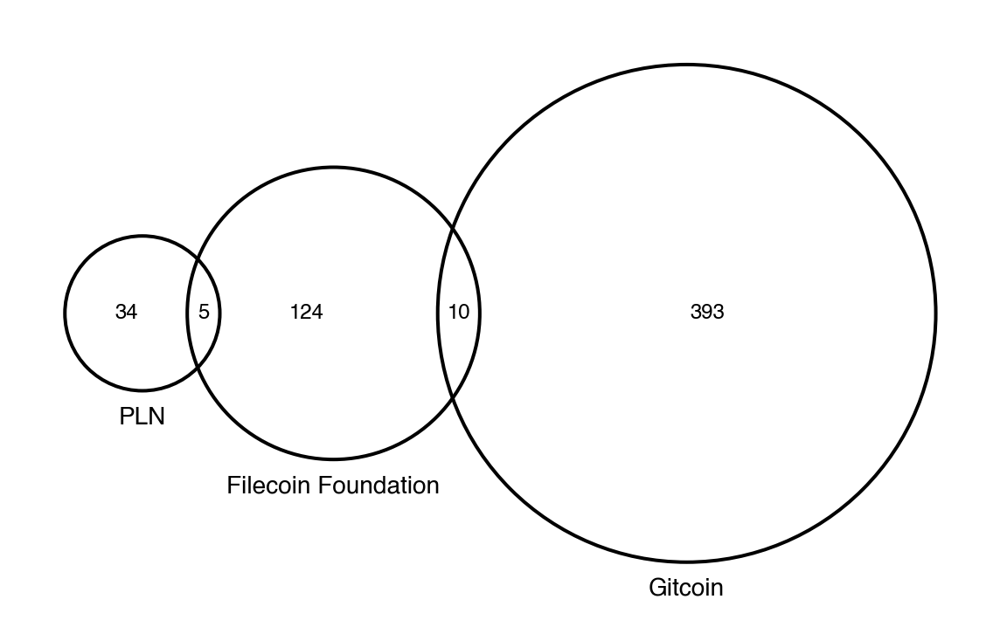

We have some fun Python-based data visualization scripts that you can play with as well.

## Contribution Heatmap

Create a Seaborn heatmap of contributions to a project over time (or other dimensions). The source code is available [here](https://github.com/opensource-observer/insights/blob/main/visualizations/contribution_heatmap.py).

This function can be called as follows:

```python
def contribution_heatmap(
    dataframe,
    index_col,
    column_col,
    value_col,
    apply_groupby=False,
    cmap='Greens',
    vmin=0,
    vmax=10,
    linewidths=1,
    figsize_scaler=.2,
    figsize=None,
    sort_label_method='first',
    dpi=300):
```


## Sankey

Create an interactive Sankey diagram of value chain flows using the Plotly library. The source code is available [here](https://github.com/opensource-observer/insights/blob/main/visualizations/sankey.py).

This function can be called as follows:

```python
def make_sankey_graph(
    df,
    cat_cols,
    value_col,
    title,
    width=1000,
    height=800,
    size=12,
    decimals=True,
    hide_label_cols=[]):
```


## Venn Diagram

Create a Venn diagram of the project overlap among three collections. The source code is available [here](https://github.com/opensource-observer/insights/blob/main/visualizations/venn_diagram.py).

This function can be called as follows:

```python
DEFAULT_COLOR = "white"
DEFAULT_FONT_COLOR = "black"

def venn3_diagram(
    subsets,
    labels,
    colors=[DEFAULT_COLOR,DEFAULT_COLOR,DEFAULT_COLOR],
    facecolor=DEFAULT_COLOR,
    labelcolor=DEFAULT_FONT_COLOR,
    dpi=144,
    fontsize=8,
    figsize=10):
```



## Network Graph

Create a network graph of the projects in an ecosystem using the NetworkX library. The source code is available [here](https://github.com/opensource-observer/insights/blob/main/visualizations/network_graph.py).

This function can be called as follows:

```python
def network_graph(
    nodes,
    edges,
    figsize=(10,10),
    dpi=300,
    scale=1,
    k=.1,
    min_degree=1,
    styling=None):
```


## Stacked Area

Create a stacked area chart of developer activity for a project or ecosystem over time. The source code is available [here](https://github.com/opensource-observer/insights/blob/main/visualizations/stacked_area.py).

This function can be called as follows:

```python
def activity_plot(
    dataframe,
    grouper_col,
    date_col='date',
    value_col=None,
    filter_col='event_type',
    filter_vals=EVENT_TYPES,
    ylabel='Total Contributions',
    start_date=None,
    end_date=None):
```

This chart can also be generated easily in a notebook using the following type of command (assuming you have the data in a Pandas DataFrame):

```python
import matplotlib.pyplot as plt
import pandas as pd

# df_devs = pd.DataFrame(...)

fig, ax = plt.subplots(figsize=(10,5), facecolor='white', dpi=144)
(
    df_devs
    .groupby('month')
    [['Full time developers']]
    .sum()
    .plot(
        kind='area',
        ax=ax
    )
)

months = df_devs['month'].nunique()
ax.set_xlim([0,months-1])
ax.set_xticks([x for x in range(0,months,12)])
xticklabels = [x[:-3] for x in sorted(df_devs['month'].unique())[::12]]
ax.set_xticklabels(xticklabels)
ax.set_xlabel("")
ax.set_ylabel("")
ax.set_title('Monthly active developers', fontweight="bold", loc='left')
```


## Sharing Visualizations

We love to see what others are doing with the data. If you have created a cool visualization, please share it with the community.

If you have ideas for visualization tooling that you would like to see or receive help on, please [open an issue](https://github.com/opensource-observer/insights/issues) and tag one of the maintainers.
