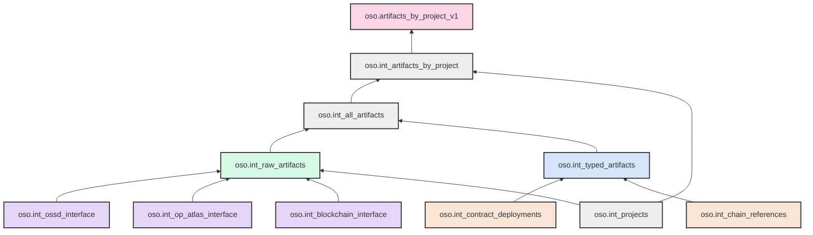

# Simplified Lineage of artifacts_by_project_v1

This document presents a simplified version of the lineage for `oso.artifacts_by_project_v1`, reorganized to be more maintainable and easier to understand.

## Simplified Mermaid Diagram

## Simplified Model Structure

### Main Models

- **oso.artifacts_by_project_v1**: Final model that provides artifacts by project information.
- **oso.int_artifacts_by_project**: Intermediate model that joins artifacts with projects.
- **oso.int_all_artifacts**: Combines artifacts from various sources.
- **oso.int_projects**: Contains all projects from different sources.

### Consolidated Source Layer

- **oso.int_raw_artifacts**: Standardized schema for artifacts from all sources.
  - Replaces separate models for different sources
  - Provides consistent schema regardless of source

### Source-Specific Interfaces

- **oso.int_ossd_interface**: Abstracts OSS Directory staging models.
- **oso.int_op_atlas_interface**: Abstracts OP Atlas staging models.
- **oso.int_blockchain_interface**: Abstracts blockchain data staging models.

### Consolidated Artifact Types

- **oso.int_typed_artifacts**: Single model for all artifact types with a type column.
  - Replaces separate models for deployers, contracts, bridges, etc.
  - Simplifies adding new artifact types

### Domain-Specific Modules

- **oso.int_contract_deployments**: Consolidated contract deployment logic.
  - Replaces the chain of `int_contracts_deployment` → `int_contracts_root_deployers` → `int_derived_contracts`
- **oso.int_chain_references**: Chain name references and mappings.
  - Replaces `int_superchain_chain_names` and related models

## Benefits of This Approach

1. **Reduced Model Count**: Fewer models to maintain and understand.
2. **Clearer Data Flow**: Simplified lineage with fewer hops.
3. **Modular Design**: Organized by domain and function.
4. **Easier Extensibility**: Adding new sources or artifact types is simpler.
5. **Reduced Circular Dependencies**: Cleaner architecture with fewer circular references.

## Implementation Considerations

When implementing this simplified structure:

1. **Schema Standardization**: Define consistent schemas across all artifact sources.
2. **Type System**: Implement a robust type system for artifacts.
3. **Interface Models**: Create clear interfaces between staging and intermediate layers.
4. **Migration Strategy**: Plan a phased migration to minimize disruption.
5. **Documentation**: Document the new structure and its benefits.
