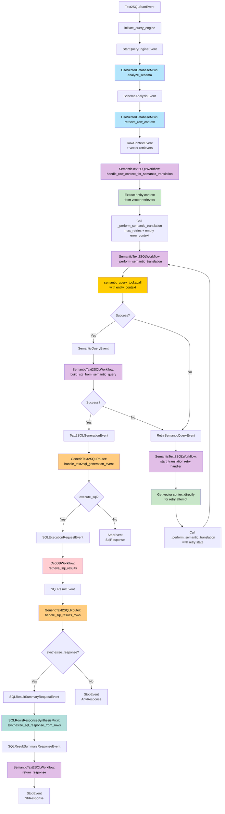

# Aug 18, 2025

## Text2SQL Semantic Workflow Composition

This workflow converts natural language queries into SQL statements through
semantic analysis and vector-based context retrieval.

### Key Components

- **SemanticText2SQLWorkflow**: Orchestrates semantic translation and handles
  retry logic
- **OsoVectorDatabaseMixin**: Performs schema analysis and retrieves row context
  using vector embeddings
- **GenericText2SQLRouter**: Routes events and manages execution/synthesis flags
- **OsoDBWorkflow**: Executes SQL queries against the database
- **SQLRowsResponseSynthesisMixin**: Converts SQL results into natural language
  responses

### Flow Elements

1. **Context Gathering**: Schema analysis and row context retrieval using vector
   retrievers
2. **Entity Context Extraction**: Extracts relevant entities from vector
   retrievers before translation
3. **Semantic Translation**: Uses `semantic_query_tool.acall` with entity
   context to generate SQL
4. **Retry Mechanism**: On failure, retrieves vector context directly and
   retries translation
5. **Optional Execution**: SQL execution controlled by `execute_sql` flag
6. **Optional Synthesis**: Response generation controlled by
   `synthesize_response` flag

### Execution Flow

The workflow begins by analyzing the database schema and gathering relevant row
examples through vector embeddings. It then extracts entity context from these
retrievers and passes this information to the semantic query tool for SQL
translation. If translation fails, the system retrieves vector context directly
and retries the process. Once successful SQL is generated, the workflow
optionally executes the query against the database and synthesizes a natural
language response from the results.

### Flow diagram

