# August 27, 2025

## Semantic Text2SQL Workflow - Enhanced Table Selection & Tool Integration

Introduces intelligent table selection for focused semantic translation,
reducing registry noise through LLM-driven model filtering before query
processing, and adds dedicated table selector tool with optimized prompts.

### Key Components

- **SemanticText2SQLWorkflow**: Core workflow orchestrating semantic translation
  with retry logic, entity context retrieval, and table pre-selection for
  optimized semantic query generation.
- **OsoVectorDatabaseMixin**: Provides schema analysis and vector-based row
  context retrieval using embedding similarity search across filtered table
  subsets.
- **GenericText2SQLRouter**: Event router managing execution flow control
  through execute_sql and synthesize_response flags with conditional branching.
- **OsoDBWorkflow**: Database execution layer interfacing with OsoClient for SQL
  query execution with retry capabilities on failure.
- **SQLRowsResponseSynthesisMixin**: Natural language response synthesis from
  SQL result sets using LLM-based summarization.
- **TableSelectorTool**: New intelligent table selection tool using structured
  LLM output to identify 2-5 most relevant models from full registry
  description.
- **SemanticQueryTool**: Enhanced semantic translation tool supporting custom
  registry descriptions for focused model contexts and improved error feedback.

### Flow Elements

1. **Query Initiation**: Text2SQLStartEvent triggers StartQueryEngineEvent with
   synthesize_response and execute_sql flags for flow control.
2. **Schema Analysis**: Vector database mixin performs complete schema
   introspection identifying all usable tables from OsoSqlDatabase.
3. **Row Context Retrieval**: Vector embeddings create filtered retrievers for
   each relevant table using exact match metadata filters.
4. **Table Selection**: New step using table_selector_tool.acall to identify
   most relevant 2-5 models from full registry based on query analysis.
5. **Registry Filtering**: Creates focused registry description containing only
   selected models to reduce semantic translation noise.
6. **Entity Context Extraction**: Retrieves vector context from projects_v1,
   collections_v1, and metrics_v0 tables using similarity search.
7. **Semantic Translation**: Uses semantic_query_tool.acall with filtered
   registry description and entity context for precise SemanticQuery generation.
8. **SQL Generation**: Builds final SQL from structured SemanticQuery using
   registry query builder with selects, filters, and limits.
9. **Retry Mechanisms**: On semantic translation or SQL generation failure,
   creates RetrySemanticQueryEvent with accumulated error context for improved
   retry attempts.

### Execution Flow

The workflow initiates by analyzing the complete database schema through the
vector database mixin, establishing usable tables and creating filtered vector
retrievers for row context. A new table selection step uses the
table_selector_tool to identify the 2-5 most relevant models from the full
registry, creating a focused registry description that reduces translation
noise. The system then extracts entity context from specific vector-indexed
tables (projects_v1, collections_v1, metrics_v0) using embedding similarity
search. This focused context and registry description are passed to the enhanced
semantic_query_tool for translation to structured SemanticQuery objects. The
registry query builder converts the SemanticQuery to final SQL with proper
selects, filters, and limits. Throughout the process, comprehensive retry
mechanisms handle failures at both semantic translation and SQL generation
steps, accumulating error context for improved subsequent attempts. Optional
execution and response synthesis are controlled by workflow flags, enabling
flexible query processing modes.

### Flow diagram

```mermaid
graph TD
    A[Text2SQLStartEvent] --> B[initiate_query_engine]
    B --> C[StartQueryEngineEvent]

    C --> D[OsoVectorDatabaseMixin:<br/>analyze_schema]
    D --> E[SchemaAnalysisEvent<br/>+ usable tables]

    E --> F[OsoVectorDatabaseMixin:<br/>retrieve_row_context]
    F --> G[RowContextEvent<br/>+ vector retrievers]

    G --> H[select_relevant_tables]
    H --> H1[table_selector_tool.acall<br/>identify relevant models]
    H1 --> H2[Create filtered registry<br/>description from selected models]
    H2 --> I[TableSelectionEvent<br/>+ selected models + filtered registry]

    I --> J[handle_row_context_for_semantic_translation]
    J --> J1[Extract entity context from<br/>vector retrievers: projects_v1, collections_v1, metrics_v0]
    J1 --> J2[Call _perform_semantic_translation<br/>with filtered registry + entity context]

    J2 --> K[_perform_semantic_translation]
    K --> K1[semantic_query_tool.acall<br/>with custom_registry_description + entity_context]
    K1 --> L{Translation Success?}

    L -->|Yes| M[SemanticQueryEvent<br/>+ structured query]
    L -->|No| N[RetrySemanticQueryEvent<br/>+ error context]

    N --> O[start_translation retry handler]
    O --> O1[Check remaining_tries > 0]
    O1 -->|Yes| O2[Get vector context directly<br/>for retry attempt]
    O2 --> O3[Call _perform_semantic_translation<br/>with accumulated error feedback]
    O3 --> K
    O1 -->|No| P[StopEvent<br/>ErrorResponse: max retries exceeded]

    M --> Q[build_sql_from_semantic_query]
    Q --> Q1[Registry query builder:<br/>selects, filters, limits]
    Q1 --> R{SQL Build Success?}

    R -->|Yes| S[Text2SQLGenerationEvent<br/>+ final SQL]
    R -->|No| T[RetrySemanticQueryEvent<br/>+ SQL generation error]
    T --> O

    S --> U[GenericText2SQLRouter:<br/>handle_text2sql_generation_event]
    U --> V{execute_sql flag?}

    V -->|Yes| W[SQLExecutionRequestEvent]
    V -->|No| X[StopEvent<br/>SqlResponse with SQL only]

    W --> Y[OsoDBWorkflow:<br/>retrieve_sql_results]
    Y --> Y1[OsoClient.query_oso<br/>execute SQL]
    Y1 --> Z{Execution Success?}

    Z -->|Yes| AA[SQLResultEvent<br/>+ results DataFrame]
    Z -->|No| BB[SQLResultEvent<br/>+ execution error]

    AA --> CC[GenericText2SQLRouter:<br/>handle_sql_results_rows]
    BB --> CC
    CC --> DD{synthesize_response flag?}

    DD -->|Yes| EE[SQLResultSummaryRequestEvent]
    DD -->|No| FF[StopEvent<br/>AnyResponse with raw results]

    EE --> GG[SQLRowsResponseSynthesisMixin:<br/>synthesize_sql_response_from_rows]
    GG --> GG1[LLM.predict with<br/>response_synthesis_prompt]
    GG1 --> HH[SQLResultSummaryResponseEvent<br/>+ natural language summary]

    HH --> II[return_response]
    II --> JJ[StopEvent<br/>StrResponse with summary]

    %% Color coding by component responsibility
    %% OsoVectorDatabaseMixin - Light Blue
    style D fill:#b3e5fc,color:#000,stroke:#01579b,stroke-width:2px
    style F fill:#b3e5fc,color:#000,stroke:#01579b,stroke-width:2px

    %% SemanticText2SQLWorkflow - Light Purple
    style B fill:#e1bee7,color:#000,stroke:#4a148c,stroke-width:2px
    style H fill:#e1bee7,color:#000,stroke:#4a148c,stroke-width:2px
    style J fill:#e1bee7,color:#000,stroke:#4a148c,stroke-width:2px
    style K fill:#e1bee7,color:#000,stroke:#4a148c,stroke-width:2px
    style O fill:#e1bee7,color:#000,stroke:#4a148c,stroke-width:2px
    style Q fill:#e1bee7,color:#000,stroke:#4a148c,stroke-width:2px
    style II fill:#e1bee7,color:#000,stroke:#4a148c,stroke-width:2px

    %% New Table Selection Logic - Light Green
    style H1 fill:#c8e6c9,color:#000,stroke:#1b5e20,stroke-width:2px
    style H2 fill:#c8e6c9,color:#000,stroke:#1b5e20,stroke-width:2px

    %% Enhanced Tool Calls - Light Orange
    style K1 fill:#ffcc80,color:#000,stroke:#e65100,stroke-width:2px
    style J1 fill:#ffcc80,color:#000,stroke:#e65100,stroke-width:2px

    %% GenericText2SQLRouter - Light Red
    style U fill:#ffcdd2,color:#000,stroke:#b71c1c,stroke-width:2px
    style CC fill:#ffcdd2,color:#000,stroke:#b71c1c,stroke-width:2px

    %% OsoDBWorkflow - Light Teal
    style Y fill:#b2dfdb,color:#000,stroke:#00695c,stroke-width:2px
    style Y1 fill:#b2dfdb,color:#000,stroke:#00695c,stroke-width:2px

    %% Response Synthesis - Light Yellow
    style GG fill:#fff3e0,color:#000,stroke:#ff6f00,stroke-width:2px
    style GG1 fill:#fff3e0,color:#000,stroke:#ff6f00,stroke-width:2px
```

